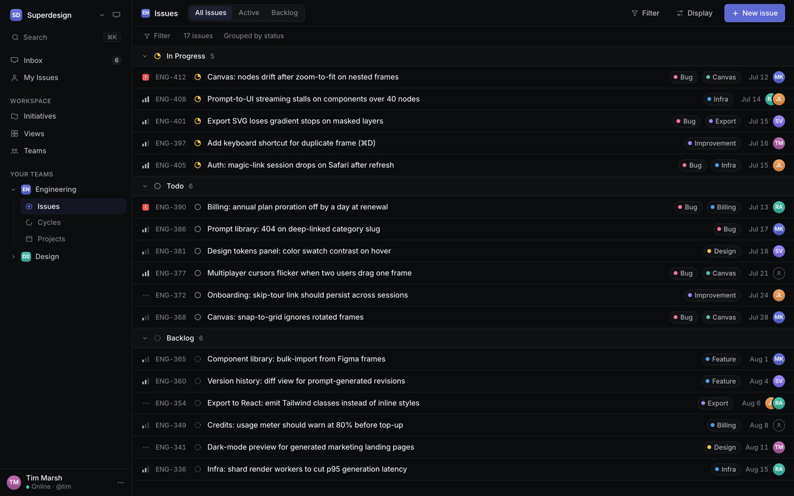

# Dashboard UI: Dark Linear-Style Developer Issue Tracker

A dark, cool-indigo "Linear-style" developer/product DASHBOARD built as a two-pane app shell around a grouped ISSUE TRACKER list. A fixed ~240px sidebar (workspace switcher, ⌘K search, Inbox/My Issues, WORKSPACE + YOUR TEAMS nav with an active team, a pinned user card) sits beside a main column: a header bar with an "All Issues/Active/Backlog" segmented control, ghost Filter/Display buttons, and a single solid indigo "+ New issue" button, then a dense grouped issue list (In Progress / Todo / Backlog) where each ~40px row shows a priority glyph, a muted mono ENG-### id, a status ring, the issue title, colored label pills, a due date, and a tinted assignee avatar. Near-black canvas, cool near-white text, ONE indigo accent, one Inter typeface, flat and border-only with hairline dividers. Reusable for any issue tracker, project/task app, internal tool, or dense dark B2B product UI.

Source: https://linear.app (dark product-UI visual language)



## Prompt

```text
{
  "summary": "A DARK, cool-indigo LINEAR-STYLE developer/product DASHBOARD (generic 'Superdesign' workspace) built as a TWO-PANE APP SHELL around a grouped ISSUE TRACKER list — a working project tool, NOT an analytics/KPI dashboard. Near-black canvases: app #08090a, sidebar #0c0d0f, main #0b0c0e. ONE typeface, Inter, does all the work with hierarchy from SIZE and WEIGHT: issue titles ~13.5px/weight 450-500 in cool near-white #f4f5f8, nav and group headers 13px/weight 500, muted ids/dates/meta 12px/#7d828c. Hairline borders and dividers are rgba(255,255,255,0.07); color is rationed to a SINGLE indigo/violet accent #5e6ad2 (the one filled button + active-item tint) plus small semantic status/priority/label hues. LEFT: a fixed ~240px SIDEBAR (1px hairline right border) — a workspace switcher (rounded 'SD' glyph + 'Superdesign' + chevron + a small inbox icon), a search field row (magnifier + 'Search' + a '⌘K' kbd hint), primary nav Inbox (count badge) / My Issues, an uppercase muted GROUP LABEL 'WORKSPACE' over Initiatives / Views / Teams, an uppercase 'YOUR TEAMS' over an expanded team 'Engineering' (indigo team glyph) with sub-items Issues (ACTIVE — subtle indigo-tint fill + weight 500), Cycles, Projects and a collapsed team 'Design', and a pinned USER CARD at the bottom (round initials avatar + 'Tim Marsh' over a muted 'Online · @tim' + overflow dots). RIGHT MAIN COLUMN: a HEADER BAR (~48px, 1px bottom hairline) with an 'Issues' breadcrumb (small team glyph) + an 'All Issues' (active) / 'Active' / 'Backlog' SEGMENTED CONTROL on the left, and on the right compact ghost buttons 'Filter' (funnel) and 'Display' (sliders) plus a single SOLID INDIGO '+ New issue' button (the only filled accent, 13px/500, ~6px radius); a thin muted strip 'Filter · 17 issues · Grouped by status'; then the GROUPED ISSUE LIST — three collapsible status groups each led by a GROUP HEADER (a collapse chevron + a colored status icon + a label + a muted count, e.g. 'In Progress 5', 'Todo 6', 'Backlog 6'). Under each header sit dense ISSUE ROWS (~40px, separated by faint hairlines, hover = rgba(255,255,255,0.035)): left-to-right a PRIORITY ICON (urgent = a small rounded red #eb5757 square with a bold '!'; high/medium/low = a 3-bar bar-graph glyph; none = three dashes), a muted mono ISSUE ID (ENG-412), a STATUS RING matching the group (In Progress = amber #f2c94c half-filled ring, Todo = gray empty ring, Backlog = dashed ring), the ISSUE TITLE (#f4f5f8), then pushed right 0-2 small LABEL PILLS (a colored dot + text in a faint rounded chip — Bug / Infra / Design / Feature / Export / Billing / Improvement / Canvas), a muted DUE DATE (e.g. 'Jul 12'), and a round tinted ASSIGNEE AVATAR (initials; some rows a stacked pair, some a dashed unassigned circle). Realistic dev content for an AI design-tool company (e.g. 'Canvas: nodes drift after zoom-to-fit on nested frames', 'Export SVG loses gradient stops on masked layers', 'Prompt library: 404 on deep-linked category slug', 'Billing: annual plan proration off by a day at renewal'). FLAT everywhere: no drop shadows on the list, no second typeface, no color beyond the indigo accent and the small semantic status/priority/label hues; structure comes from hairlines, tight spacing, and the two-pane grid.",
  "style": {
    "description": "Dark, dense, cool-indigo product-UI minimalism in the Linear register — a real working issue tracker, not a marketing page. Near-black canvases (#08090a app / #0c0d0f sidebar / #0b0c0e main) with ONE typeface (Inter) in cool near-white #f4f5f8, hierarchy from SIZE and WEIGHT (450-500 titles / 500 nav-and-headers / muted 12px ids and dates in #7d828c), never from color. Color is rationed to a SINGLE indigo/violet accent #5e6ad2 (the one filled 'New issue' button + the active-item tint), plus small semantic hues confined to status rings, priority glyphs, and label-pill dots. The shape language is FLAT and BORDER-ONLY: the sidebar and rows are separated by hairline rgba(255,255,255,0.07) dividers, never by drop shadows; radii are tight (5-8px). The register is quiet, keyboard-first, information-dense, and engineered — space and hairlines do the organizing, and the whole thing is unmistakably a dark product app.",
    "prompt": "Design a dark, cool-indigo 'Linear-style' developer issue tracker as a two-pane app shell. Use near-black canvases (app #08090a, sidebar #0c0d0f, main #0b0c0e) and ONE typeface only (Inter); build hierarchy from SIZE and WEIGHT, never from color: issue titles ~13.5px/weight 450-500 in cool near-white #f4f5f8, nav items and group headers 13px/weight 500, muted ids/dates/meta 12px in #7d828c. Ration color to a SINGLE indigo/violet accent #5e6ad2 — use it ONLY for the one filled 'New issue' button and the active-item tint — and confine all other hue to small semantic status rings, priority glyphs, and label-pill dots. Make everything FLAT and BORDER-ONLY: separate the sidebar and every row with 1px rgba(255,255,255,0.07) hairlines, NOT drop shadows; use tight radii (5-8px). Keep the type high-contrast on the dark canvas and never drop below 12px. Do NOT introduce a second typeface, drop shadows, a purple background gradient, or any accent beyond the single indigo and the small semantic status/priority/label hues."
  },
  "layout_and_structure": {
    "description": "A two-pane app shell: (1) a fixed ~240px left sidebar on #0c0d0f with a hairline right border — a workspace switcher (glyph + name + chevron), a ⌘K search field, primary nav (Inbox with a count badge, My Issues), a 'WORKSPACE' nav group (Initiatives / Views / Teams), a 'YOUR TEAMS' group with an expanded 'Engineering' team (Issues active, Cycles, Projects) and a collapsed 'Design' team, and a pinned user card; (2) a main column stacking a header bar ('Issues' breadcrumb + an All/Active/Backlog segmented control + ghost Filter/Display buttons + a single indigo 'New issue' button), a thin 'N issues · Grouped by status' strip, and a grouped issue list of three collapsible status groups (In Progress / Todo / Backlog) of dense issue rows. On a narrow viewport the sidebar collapses to an icon rail or drawer, the right-side label pills and dates hide first, and the list stays full-width and vertically scrollable with sticky group headers.",
    "prompts": [
      {
        "part": "Sidebar",
        "prompt": "A FIXED ~240px left SIDEBAR on #0c0d0f with a 1px rgba(255,255,255,0.07) right border. Top: a WORKSPACE SWITCHER — a small rounded-square indigo-tinted glyph ('SD') + 'Superdesign' (Inter, weight 550) + a chevron-down, with a tiny inbox icon on the right. Below: a SEARCH field row (a magnifier icon + 'Search' placeholder in #7d828c + a small '⌘K' kbd-hint pill on the right). Primary nav: Inbox (icon + label + a small count badge '6') and My Issues. A muted uppercase GROUP LABEL 'WORKSPACE' (11px/weight 600/letter-spacing) over icon+label rows Initiatives / Views / Teams. A group label 'YOUR TEAMS' over an EXPANDED team 'Engineering' (an indigo 'EN' team glyph + a caret) with indented sub-items Issues (ACTIVE — a subtle indigo-tint rounded fill + weight 500), Cycles, Projects, and a COLLAPSED team 'Design' ('DS' glyph + a right caret). Pinned to the bottom: a USER CARD — a round initials avatar + 'Tim Marsh' (weight 500) over a muted 'Online · @tim', with an overflow-dots button. No shadows; hairlines and spacing only."
      },
      {
        "part": "Header bar + view tabs + New issue",
        "prompt": "A main-column HEADER BAR (~48px, 1px bottom hairline). Left: a small team glyph + an 'Issues' breadcrumb/title (Inter ~15px/weight 550, #f4f5f8), then a SEGMENTED CONTROL of three joined pills 'All Issues' (active — subtle lifted fill) / 'Active' / 'Backlog'. Right: two compact GHOST buttons 'Filter' (a funnel icon + label, #b9bdc6) and 'Display' (a sliders icon + label), then a single SOLID INDIGO '+ New issue' button (#5e6ad2 bg, white text, 13px/weight 500, ~6px radius) — the ONLY filled control on the screen. Below the bar, a thin muted strip: a small 'Filter' pill, 'N issues', and 'Grouped by status'."
      },
      {
        "part": "Grouped issue list",
        "prompt": "The hero: three COLLAPSIBLE STATUS GROUPS. Each GROUP HEADER is a slightly lifted row: a collapse chevron + a colored STATUS ICON + a label + a muted count — 'In Progress 5' (amber half-filled ring), 'Todo 6' (gray empty ring), 'Backlog 6' (dashed ring) — with a hover '+' to add. Under each header, dense ISSUE ROWS (~40px each, faint hairline dividers, hover fill rgba(255,255,255,0.035)) laid left-to-right: a PRIORITY ICON, a muted mono ISSUE ID (e.g. ENG-412), a STATUS RING matching the group, and the ISSUE TITLE in #f4f5f8; then pushed to the right edge, 0-2 small LABEL PILLS, a muted DUE DATE, and a round ASSIGNEE AVATAR. Ship realistic, coherent dev issues for an AI design-tool company and vary priority, labels, assignee, and date across rows."
      },
      {
        "part": "Priority + status + assignee glyphs",
        "prompt": "PRIORITY ICON set: Urgent = a small rounded red #eb5757 square with a bold white '!'; High/Medium/Low = a 3-bar bar-graph glyph with 3/2/1 bars filled in #b9bdc6 (rest faint); None = three short horizontal dashes in #7d828c. STATUS RING set: In Progress = an amber #f2c94c ring with a ~half-filled arc; Todo = a gray #7d828c empty ring; Backlog = a dashed #626871 ring; (Done = a filled indigo #5e6ad2 check circle; Canceled = a muted filled x). ASSIGNEE AVATAR = a round initials chip on a muted color tint (~22px); support a stacked pair (two overlapping avatars) and a dashed unassigned circle. All glyphs are inline SVG, visually distinct, and legible at ~16-20px on the dark canvas."
      }
    ]
  },
  "special_ui_components": [
    {
      "component": "Grouped app-shell sidebar with teams + user card",
      "description": "A fixed ~240px dark sidebar: workspace switcher, ⌘K search, primary nav, labeled WORKSPACE + YOUR TEAMS groups with an expanded team and an active sub-item, and a pinned user card.",
      "prompt": "Build a fixed ~240px left sidebar on #0c0d0f with a 1px rgba(255,255,255,0.07) right border: a workspace switcher (a rounded-square initials glyph + a workspace name in weight 550 + a chevron) at top, then a search field row with a magnifier, a muted 'Search' placeholder, and a small '⌘K' kbd-hint pill. Add primary nav rows (Inbox with a count badge, My Issues), then muted uppercase GROUP LABELS ('WORKSPACE', 'YOUR TEAMS') each over icon+label items; under YOUR TEAMS show one EXPANDED team (team glyph + caret) with indented sub-items where the active one gets a subtle indigo-tint rounded fill + weight 500, plus one collapsed team. Pin a USER CARD to the bottom: a round initials avatar + a name (weight 500) over a muted status/handle line, with an overflow-dots button. No shadows; hairlines and spacing only."
    },
    {
      "component": "Dense grouped issue list",
      "description": "Collapsible status groups (with a colored status icon + label + count) over dense ~40px issue rows separated by hairlines, each row a priority icon, mono id, status ring, title, label pills, date, and assignee avatar.",
      "prompt": "Build a grouped issue list: each GROUP HEADER is a slightly lifted row with a collapse chevron, a colored status icon, a label, and a muted count (e.g. 'In Progress 5'), plus a hover '+' to add. Under it, dense ISSUE ROWS (~40px, faint hairline dividers, hover fill rgba(255,255,255,0.035)) laid left-to-right: a priority icon, a muted mono issue id (ENG-###), a status ring matching the group, the issue title in near-white; then right-aligned 0-2 small label pills, a muted due date, and a round assignee avatar. Keep it flat and border-only — no card shadows — and let hairlines and spacing organize the density."
    },
    {
      "component": "Priority + status icon system",
      "description": "A compact set of inline-SVG glyphs — urgent red square-!, high/med/low bar-graph bars, no-priority dashes; status rings for In Progress / Todo / Backlog / Done / Canceled — all legible on a dark canvas.",
      "prompt": "Render a compact inline-SVG icon system for a dark issue tracker. PRIORITY: Urgent = a rounded red #eb5757 square with a bold white '!'; High/Medium/Low = a 3-bar bar-graph with 3/2/1 bars filled (rest faint); None = three short horizontal dashes. STATUS: In Progress = an amber #f2c94c ring with a half-filled arc; Todo = a gray empty ring; Backlog = a dashed ring; Done = a filled indigo #5e6ad2 check circle; Canceled = a muted filled x. Keep every glyph ~16-20px, visually distinct from the others, and legible against a near-black background."
    },
    {
      "component": "Header bar with segmented view tabs + single indigo action",
      "description": "A ~48px header with a breadcrumb, an All/Active/Backlog segmented control, ghost Filter/Display buttons, and exactly one filled indigo 'New issue' button.",
      "prompt": "Build a ~48px main-column header bar with a 1px bottom hairline: on the left a small team glyph + a breadcrumb title (~15px/weight 550) and a SEGMENTED CONTROL of three joined pills (first one active with a subtle lifted fill); on the right two compact ghost icon+label buttons ('Filter' funnel, 'Display' sliders) and a single SOLID INDIGO '+ New issue' button (#5e6ad2 bg, white text, 13px/weight 500, ~6px radius) as the ONLY filled control. Optionally add a thin muted strip below with a filter pill, an issue count, and a 'Grouped by status' label."
    },
    {
      "component": "Single-typeface dark type + flat border-only surfaces",
      "description": "One Inter family in a cool near-white on near-black; every surface separated by hairlines, not shadows, with a single indigo accent.",
      "prompt": "Set ALL type in ONE Inter typeface: cool near-white #f4f5f8 for titles, #b9bdc6 secondary, muted #7d828c for ids/dates/labels; build hierarchy only from size and weight (450-500 titles, 500 nav/headers, 12px muted meta). Keep canvases near-black (#08090a / #0c0d0f / #0b0c0e) and separate every surface — sidebar, header, rows — with 1px rgba(255,255,255,0.07) HAIRLINES, never drop shadows; use tight radii (5-8px). Allow exactly one filled control (a solid indigo #5e6ad2 button) and one active-item indigo tint; confine every other hue to small semantic status rings, priority glyphs, and label-pill dots. Never drop text below 12px."
    }
  ]
}
```
