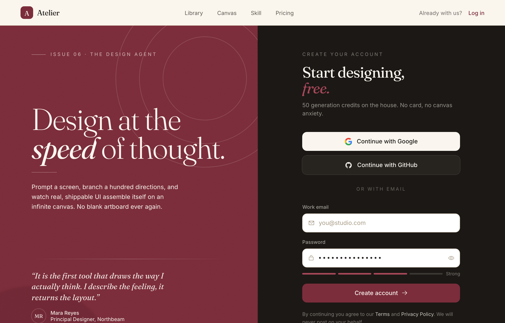

# Design at the Speed of Thought — Editorial Split Sign-Up

An editorial, magazine-style sign-up screen built as a full split-screen landing: a sticky translucent cream nav over a two-pane main. The LEFT is an oversized Fraunces-serif brand panel on a textured deep-burgundy ground (film grain, faint concentric arcs, a soft bloom) with an 'Issue 06 . The Design Agent' eyebrow, a 'Design at the speed of thought.' display headline (italic 'speed'), a value paragraph and a pull-quote testimonial with an initials avatar plus a three-icon feature row. The RIGHT is a near-black ink account-creation column: a 'Start designing, free.' heading, Google + GitHub OAuth buttons above an 'or with email' divider, white burgundy-focus-ring email + password fields (an eye toggle + a four-segment strength meter) and a burgundy 'Create account' CTA. Below the split: a full-bleed cream 'Trusted in the studios shipping fastest' proof strip and a dark ink FAQ/footer accordion. Cream + burgundy + ink palette, Fraunces serif + Inter.



## Prompt

```text
{"summary": "An editorial, magazine-style sign-up screen built as a full split-screen landing on a warm cream + deep burgundy palette. A translucent sticky cream nav sits over a two-pane main: the LEFT is an oversized serif brand panel on a burgundy ground (a film-grain texture, faint concentric SVG arcs and a soft radial bloom) carrying an uppercase 'Issue 06 . The Design Agent' eyebrow, a clamped Fraunces display headline 'Design at the speed of thought.' (the word 'speed' italic), a value paragraph, and a pull-quote testimonial with an initials avatar plus a three-icon feature row; the RIGHT is a near-black ink account-creation column with a 'Create your account' eyebrow, a Fraunces 'Start designing, free.' heading (the word 'free.' italic burgundy-light), Google + GitHub OAuth buttons above an 'or with email' divider, white email + password fields (icon-leading, with an eye toggle) on the dark ground, a four-segment password-strength meter, a burgundy 'Create account' CTA, a Terms/Privacy footnote, and an enterprise/log-in row. Below the split: a full-bleed cream 'Trusted in the studios shipping fastest' proof strip (serif logo lockups + a stacked-avatar count) and a dark ink FAQ/footer (an accordion of three open/closed questions + a brand column + a legal bar). Warm editorial aesthetic: cream #faf6ef on burgundy #7b2d3b and ink #1c1815, Fraunces serif display + Inter body.", "style": {"description": "A warm, editorial / magazine aesthetic that treats a sign-up like the cover spread of a design journal. Three grounds carry the page: a cream paper #faf6ef, a deep wine burgundy #7b2d3b (the brand pane), and a near-black ink #1c1815 (the form column + footer), with a lighter burgundy #a9485a as the secondary accent and a darker burgundy #5e202b for shadows/blooms. Typography pairs Fraunces (an optical-size serif) for oversized display headlines, the brand wordmark, the pull-quote and the section labels with Inter for body/UI. The burgundy pane is textured: a fine SVG fractal-noise film grain at 5% overlay, faint concentric stroke arcs top-right and a soft blurred burgundy-dark radial bloom bottom-left. Color discipline is tight: cream type on burgundy, cream type on ink, burgundy as the single action color (the CTA, links, the brand tile, focus rings). Inputs are white cards on the dark column that get a burgundy focus ring; links use an animated underline-grow; the CTA and OAuth buttons lift on hover. Calm, high-craft, print-like; warm and human copy with zero em-dashes.", "prompt": "Editorial / magazine-style sign-up landing on a warm cream + deep burgundy + near-black ink palette. Tailwind CDN with a custom theme.extend.colors: cream #faf6ef, creamlo #f3ecdf, ink #1c1815, inksoft #2a241f, burg #7b2d3b, burgdk #5e202b, burglt #a9485a; theme.extend.fontFamily serif ['Fraunces','Georgia','serif'] and sans ['Inter','system-ui','sans-serif']. Load Fraunces (ital, optical-size opsz 9..144, weights 300..700) + Inter (400;500;600) from Google Fonts; body font-family Inter, antialiased + optimizeLegibility, html scroll-behavior smooth. Display class = letter-spacing -0.02em, line-height 0.95; .font-serif uses font-optical-sizing auto. The burgundy brand pane is textured: a .grain::before overlay (a tiled SVG feTurbulence fractalNoise data-URI, opacity 0.05, mix-blend-mode overlay), faint concentric circle SVG arcs (stroke cream at ~0.16 opacity) bleeding off the top-right, and a soft blurred burgdk radial bloom bottom-left. The form column is near-black ink #1c1815 with a left edge-light (a vertical gradient hairline transparent->burglt/40->transparent). Inputs (.field) = white #ffffff fill, 1px #d8cdbb border; on focus-within the border turns burgundy #7b2d3b with a 0 0 0 3px rgba(123,45,59,0.12) ring and a #fffdfa fill; placeholder #a89a85; leading icons #9a8c77. OAuth buttons (.oauth) lift on hover (translate-y -1px + a soft shadow + a #b9ab95 border). The primary CTA (.cta) is a solid burg #7b2d3b button that on hover lifts and casts a 0 12px 30px -8px rgba(123,45,59,0.45) burgundy shadow. Links (.ulink) use an animated background-size underline-grow from 0% to 100% on hover. A .rule class = a horizontal cream gradient hairline. The nav uses .nav-blur = backdrop-filter saturate(140%) blur(10px) over a cream/80 fill. FAQ uses native <details>/<summary> with the marker hidden and a .chev caret that rotates 180deg when open. Icons via Iconify (Phosphor 'ph:*' set + logos:google-icon + mdi:github). Burgundy is the single action/accent color; cream is the type-on-dark color; warm human copy, zero em-dashes ('Design at the speed of thought.', 'No blank artboard ever again.', '50 generation credits on the house. No card, no canvas anxiety.')."}, "layout_and_structure": {"description": "A sticky translucent cream nav, then a full-height two-pane split main (LEFT a burgundy editorial brand panel, RIGHT a near-black ink sign-up form column), then a full-bleed cream 'Trusted in the studios shipping fastest' proof strip, then a dark ink FAQ/footer (an accordion + a brand column + a legal bar). The split main is a grid lg:grid-cols-[1.04fr_1fr] at min-h-[calc(100vh-4rem)]; below lg it stacks and the order flips so the form column comes first. Most containers center in mx-auto max-w-[1240px] px-6 sm:px-8.", "prompts": [{"part": "Sticky translucent nav", "prompt": "A sticky top-0 z-50 header. Its nav uses .nav-blur (backdrop-filter saturate(140%) blur(10px)) over a bg-cream/80 fill with a 1px border-b border-[#e7dcc9]. Inner = mx-auto max-w-[1240px] px-6 (sm:px-8), 64px tall (h-16), flex items-center justify-between. LEFT: a brand lockup = a 32px (h-8 w-8) rounded-[9px] bg-burg tile holding a cream Fraunces 17px 'A' glyph, beside a Fraunces 19px tracking-tight 'Atelier' wordmark. CENTER (hidden below md, md:flex, gap-9): four 14px inksoft/75 .ulink nav links 'Library' / 'Canvas' / 'Skill' / 'Pricing' (hover ink). RIGHT: a hidden-below-sm 'Already with us?' inksoft/65 label + a font-medium burgundy 'Log in' .ulink link."}, {"part": "Split main shell", "prompt": "A main that is a grid lg:grid-cols-[1.04fr_1fr] at min-h-[calc(100vh-4rem)]. It holds two <section> panes. On lg the LEFT brand pane is order-1 and the RIGHT form pane is order-2; below lg the form pane is order-1 (shown first) and the brand pane is order-2, so each pane is full-width and stacks. The RIGHT (ink) pane carries a lg-only left edge-light via a before pseudo-element: lg:before:absolute lg:before:inset-y-0 lg:before:left-0 lg:before:w-px with a vertical gradient bg-gradient-to-b from-transparent via-burglt/40 to-transparent."}, {"part": "LEFT — burgundy editorial brand panel", "prompt": "A relative .grain overflow-hidden bg-burg text-cream section. Decoration: an absolute -right-24 -top-24 w-[460px] h-[460px] opacity-[0.16] SVG of three concentric circles (stroke #faf6ef, stroke-width 0.6) bleeding off the top-right corner, and an absolute -left-32 bottom-[-20%] w-[420px] h-[420px] rounded-full bg-burgdk/60 blur-[2px] opacity-50 bloom bottom-left. Content sits relative z-10 in an h-full flex flex-col justify-between, padded px-8 sm:px-12 lg:px-14 xl:px-20 py-12 lg:py-16, in three vertical clusters: (1) TOP eyebrow = a flex items-center gap-3, 12px uppercase tracking-[0.28em] cream/70 row with a 36px cream/45 leading hairline + the text 'Issue 06 . The Design Agent'. (2) MIDDLE statement = a Fraunces display font-light headline at text-[clamp(2.7rem,6vw,5.25rem)] max-w-[11ch] reading 'Design at the' + an italic font-normal 'speed' + 'of thought.', then a 64px cream/35 hairline, then a max-w-[38ch] 15.5px leading-relaxed cream/78 paragraph ('Prompt a screen, branch a hundred directions, and watch real, shippable UI assemble itself on an infinite canvas. No blank artboard ever again.'). (3) BOTTOM cluster = a .rule hairline, then a max-w-[40ch] <figure> testimonial = a Fraunces italic 18px (sm:20px) leading-snug cream/95 <blockquote> ('It is the first tool that draws the way I actually think. I describe the feeling, it returns the layout.') over a figcaption row = a 36px rounded-full cream/12 ring-1 ring-cream/25 'MR' initials avatar beside a name block (cream/95 font-medium 'Mara Reyes' over cream/72 'Principal Designer, Northbeam'); below it an mt-9 flex flex-wrap gap-x-7 gap-y-2, 12.5px cream/62 feature row of three icon+label items (ph:infinity-bold 'Infinite canvas', ph:terminal-window-bold 'Works in your coding agent', ph:books-bold '4,000+ prompt library')."}, {"part": "RIGHT — ink sign-up form column", "prompt": "A relative bg-ink text-cream section. Inner = mx-auto w-full max-w-[480px] px-7 sm:px-10 py-12 sm:py-14 lg:py-16. Top to bottom: (1) a mb-9 form head = a 12px uppercase tracking-[0.26em] cream/45 'Create your account' eyebrow, a Fraunces text-[clamp(1.9rem,3vw,2.5rem)] leading-[1.05] tracking-tight heading 'Start designing,' + a line break + an italic text-burglt 'free.', and a mt-3 14.5px cream/55 subline ('50 generation credits on the house. No card, no canvas anxiety.'). (2) An OAuth block = a grid grid-cols-1 gap-3 of two .oauth h-12 rounded-xl buttons: a solid bg-cream text-ink 'Continue with Google' (logos:google-icon) and a bg-cream/5 ring-1 ring-cream/15 text-cream 'Continue with GitHub' (mdi:github), both font-medium 15px and lifting on hover. (3) A my-7 'or with email' divider = a flex items-center gap-4 with a flex-1 cream/12 rule on each side and a 12px uppercase tracking-[0.22em] cream/35 'or with email' label. (4) An email form (space-y-4): a 'Work email' label (12.5px font-medium cream/60) over a .field h-12 rounded-xl px-3.5 white card holding a ph:envelope-simple #9a8c77 leading icon + a 15px text-ink email input (placeholder 'you@studio.com'); and a 'Password' label over a .field card holding a ph:lock-simple icon + a 15px tracking-[0.16em] text-ink password input + a ph:eye toggle icon (hover burgundy), with an mt-2 four-segment strength meter beneath = a flex-1 grid grid-cols-4 gap-1.5 of four 4px-tall rounded meter-seg bars (the first three bg-burglt filled, the last bg-cream/15 empty) beside an 11.5px cream/45 'Strong' label. (5) The CTA = a .cta w-full h-12 rounded-xl bg-burg text-cream font-medium 15px button 'Create account' + a trailing ph:arrow-right icon (the icon nudges right on group-hover). (6) A mt-5 12.5px cream/45 legal footnote 'By continuing you agree to our Terms and Privacy Policy. We will never post on your behalf.' (Terms + Privacy as cream/80 .ulink links). (7) A mt-7 pt-6 border-t border-cream/10 row = a flex items-center justify-between, 13.5px: a cream/55 'Already designing with us?' + a font-medium text-burglt .ulink 'Log in', and a cream/55 hover-cream 'Enterprise' link with a ph:buildings icon."}, {"part": "Trust / proof strip (full-bleed cream)", "prompt": "A bg-cream border-t border-[#e7dcc9] section. Inner = mx-auto max-w-[1240px] px-6 sm:px-8 py-10, a flex flex-col lg:flex-row lg:items-center gap-7 lg:gap-12 with three parts: (1) a shrink-0 Fraunces italic 17px inksoft/80 lead 'Trusted in the studios shipping fastest'; (2) a flex-1 flex flex-wrap items-center gap-x-9 gap-y-4 at 70% opacity of five serif logo lockups, each a flex items-center gap-2, 16px Fraunces tracking-tight text-ink = a bold Phosphor glyph + a name (ph:diamond-bold Northbeam, ph:hexagon-bold Lumen Labs, ph:planet-bold Orbital, ph:triangle-bold Fieldnote, ph:asterisk-bold 'Mercer & Co'); (3) a shrink-0 social-proof cluster = a flex -space-x-2.5 stack of three 36px rounded-full ring-2 ring-cream Fraunces initials avatars (burg/90 'JK', inksoft 'AL', burglt 'TS') beside a 13px inksoft/70 '12,400 designers shipped this week' two-line label."}, {"part": "FAQ / footer (dark ink)", "prompt": "A bg-ink text-cream footer. Inner = mx-auto max-w-[1240px] px-6 sm:px-8 py-12. A grid lg:grid-cols-[1fr_1.2fr] gap-10 lg:gap-16: LEFT a brand column = the 'A' tile + Fraunces 'Atelier' lockup, a max-w-[34ch] 13.5px cream/50 blurb ('The AI product-design agent. From a sentence to a shippable interface, on an infinite canvas.'), and a mt-6 social row of three cream/55 hover-cream icon links (ph:x-logo, ph:github-logo, ph:youtube-logo); RIGHT a mini-FAQ = a divide-y divide-cream/10 border-y border-cream/10 stack of three native <details> accordions (the first open) using <summary> rows (15px font-medium question + a ph:caret-down .chev that rotates 180deg when open) over a 13.5px cream/55 max-w-[58ch] answer ('Is the free plan really free?', 'Do I need to know design?', 'Can I drive it from Claude Code or Cursor?'). Below the grid: a mt-10 pt-6 border-t border-cream/10 legal bar = a flex flex-col sm:flex-row items-center justify-between, 12.5px cream/45 '(c) 2026 Atelier Design, Inc.' + a gap-6 Terms / Privacy / Status .ulink row."}, {"part": "Responsive reflow", "prompt": "The split main is a grid lg:grid-cols-[1.04fr_1fr] at min-h-[calc(100vh-4rem)] above lg (the burgundy brand pane order-1 left, the ink form pane order-2 right, with a lg-only edge-light hairline between them); below lg it collapses to a single column and the order flips (the ink form pane order-1 first, the burgundy brand pane order-2 below), each full-width. The nav center links (Library/Canvas/Skill/Pricing) hide below md; the 'Already with us?' label hides below sm (the 'Log in' link stays). The display headline scales via clamp (2.7rem->5.25rem). The trust strip switches from flex-col to lg:flex-row and the logos flex-wrap; the FAQ grid collapses to one column below lg and the legal bars switch from flex-col to sm:flex-row. No horizontal overflow at 390px (paddings step down to px-6/px-7)."}]}, "special_ui_components": ["Two-pane editorial split: a burgundy serif brand panel beside a near-black ink sign-up form column, a grid lg:grid-cols-[1.04fr_1fr] that flips order and stacks below lg", "Oversized Fraunces serif display headline 'Design at the speed of thought.' (an italic 'speed' word, clamp 2.7rem->5.25rem, line-height 0.95) as the brand pane's hero", "Textured burgundy brand pane: an SVG fractal-noise film-grain overlay (5% opacity, mix-blend overlay) plus faint concentric stroke-arc SVGs bleeding off the top-right and a soft blurred burgundy-dark radial bloom bottom-left", "Pull-quote testimonial block: a Fraunces italic blockquote with an initials-avatar figcaption, plus a three-icon feature row (Infinite canvas / Works in your coding agent / 4,000+ prompt library)", "OAuth-first form on a dark column: Google + GitHub buttons (.oauth, lift on hover) above an 'or with email' divider, then white .field cards on the ink ground", "Burgundy focus-ring inputs: white .field cards that on focus-within turn the border burgundy with a 0 0 0 3px rgba(123,45,59,0.12) ring and a leading Phosphor icon, the password field carrying an eye toggle", "Four-segment password-strength meter (three filled burglt bars + one empty cream/15 bar + a 'Strong' label)", "Solid burgundy 'Create account' CTA (.cta) that on hover lifts and casts a burgundy 0 12px 30px -8px rgba(123,45,59,0.45) glow shadow, with a trailing arrow that nudges on hover", "Sticky translucent cream nav (.nav-blur: backdrop-blur 10px saturate 140% over cream/80) with a burgundy 'A' brand tile + Fraunces wordmark and animated underline-grow .ulink links", "Full-bleed cream 'Trusted in the studios shipping fastest' proof strip: serif Phosphor-glyph logo lockups + a stacked-initials-avatar '12,400 designers shipped this week' count", "Native <details>/<summary> FAQ accordion (the first open) with a hidden marker and a .chev caret that rotates 180deg when open, in a dark ink footer"], "special_notes": "Built on the Tailwind CDN with a custom theme.extend: colors cream #faf6ef, creamlo #f3ecdf, ink #1c1815, inksoft #2a241f, burg #7b2d3b, burgdk #5e202b, burglt #a9485a; fontFamily.serif = ['Fraunces','Georgia','serif'] and fontFamily.sans = ['Inter','system-ui','sans-serif']. Google Fonts: Fraunces (ital, opsz 9..144, weights 300..700 roman + 300..600 italic) + Inter (weights 400;500;600). CSS keys: html scroll-behavior smooth; body font-family Inter, antialiased, optimizeLegibility; .display = letter-spacing -0.02em + line-height 0.95; .font-serif font-optical-sizing auto. .grain::before = content '', absolute inset-0, pointer-events none, opacity 0.05, mix-blend-mode overlay, background a tiled SVG feTurbulence fractalNoise data-URI (baseFrequency 0.85, numOctaves 2). .field = background #ffffff + 1px #d8cdbb border, transition border-color/box-shadow/background .18s; .field:focus-within = border-color #7b2d3b + box-shadow 0 0 0 3px rgba(123,45,59,0.12) + background #fffdfa; .field input background transparent, outline none; placeholder #a89a85; leading icons #9a8c77. .oauth:hover = border-color #b9ab95 + box-shadow 0 2px 14px rgba(28,24,21,0.06) + translate-y -1px. .cta:hover = translate-y -1px + box-shadow 0 12px 30px -8px rgba(123,45,59,0.45); .cta:active translate-y 0. .ulink = an underline-grow via background-image linear-gradient(currentColor,currentColor) + background-size 0% 1px -> 100% 1px on hover (background-position 0 100%). .rule = linear-gradient(90deg, transparent, rgba(250,246,239,0.32), transparent) hairline. .nav-blur = backdrop-filter saturate(140%) blur(10px). .meter-seg = height 4px + border-radius 99px. FAQ uses native <details>/<summary> with list-style none + ::-webkit-details-marker hidden and a .chev that rotates 180deg in details[open] (transition .25s). The RIGHT ink form pane carries a lg-only left edge-light (a before pseudo-element vertical gradient hairline from-transparent via-burglt/40 to-transparent). Icons via Iconify (Phosphor 'ph:*' set, logos:google-icon, mdi:github). Burgundy #7b2d3b is the single action/accent color (the CTA, the brand tile, links, the focus ring, the strength bars use burglt #a9485a); cream #faf6ef is the type-on-dark color; the form column is near-black ink #1c1815. The reusable prompt-library value is the EDITORIAL SPLIT sign-up: an oversized Fraunces serif brand panel on a textured burgundy ground (film grain + concentric arcs + a pull-quote testimonial) beside a near-black ink OAuth-first form column (white burgundy-focus-ring fields + a password-strength meter + a burgundy CTA), wrapped in a complete one-screen sign-up landing (sticky translucent nav + a full-bleed cream trust strip + a dark FAQ/footer accordion). Original prompt-library product for the placeholder brand 'Atelier'. Responsive: the split flips order and stacks below lg, nav center links hide below md, the 'Already with us?' label hides below sm, the display headline clamps, the trust strip and FAQ collapse to one column, no overflow at 390px."}
```

**▶ Try it live → [https://superdesign.dev/library/design-at-the-speed-of-thought-editorial-split-sign-up](https://p.superdesign.dev/draft/3d366ad0-f8d3-462a-ad94-ac621f32b3bb)**

**Use it in your coding agent:** install the [Superdesign skill](https://github.com/superdesigndev/superdesign-skill), then:

```bash
superdesign get-prompts --slugs "design-at-the-speed-of-thought-editorial-split-sign-up" --json
```

*1 copies · 2,378 tries · Auth & Login · SaaS · signup, auth, sign-up, create-account*
