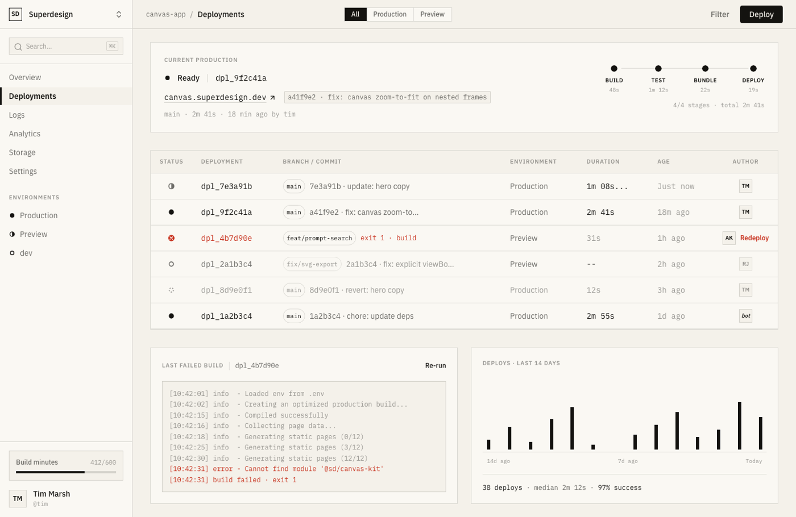

# Developer Dashboard (E-Ink Paper CI/CD Deployments Console)

A light "e-ink paper" developer dashboard: a CI/CD deployments console drawn entirely in near-black ink on warm paper with hairline borders, IBM Plex Mono data, ink status glyphs (filled dot ready, half ring building, empty ring queued, dashed canceled), and one signal-red failed deployment with its build log. Two-pane app shell: sidebar with environments + build-minutes meter, current-production hero card with a 4-stage pipeline strip, a dense deployments table, a failed-build log excerpt, and a 14-day deploy-frequency bar chart.



## Prompt

```text
{
  "summary": "A LIGHT 'e-ink paper' DEVELOPER DASHBOARD: a CI/CD DEPLOYMENTS CONSOLE (project 'canvas-app' in a 'Superdesign' workspace) that reads like it was printed in black ink on warm paper. Two-pane app shell: a fixed ~240px paper sidebar (workspace switcher, Cmd-K search, nav with Deployments active, an ENVIRONMENTS group with ink status glyphs, a pinned Build-minutes usage meter and user row) beside a main column stacking a header bar (breadcrumb, an All/Production/Preview segmented control, a ghost Filter button and ONE solid-ink Deploy button), a CURRENT PRODUCTION hero card with a dot-grain texture and a 4-stage pipeline strip (Build, Test, Bundle, Deploy as filled ink nodes on a hairline rail with mono durations that sum exactly to the deploy total), a dense hairline-divided DEPLOYMENTS TABLE, then a split row: a LAST FAILED BUILD mono log excerpt and a DEPLOYS LAST 14 DAYS stepped ink bar chart. The entire page is monochrome: warm paper grounds #f4f1ea (app) and #faf8f3 (raised cards), near-black ink #141310, secondary ink at 62% and muted at 42% opacity, 1px hairline borders rgba(20,19,16,0.14), ZERO drop shadows, ZERO gradients (only a radial dot-grain texture at 4px). Semantic deployment states are drawn as INK GLYPHS, never color: Ready = a solid filled ink circle, Building = a half-filled ring (with a counting mono elapsed time), Queued = an empty hairline ring, Canceled = a dashed ring. The ONLY chroma on the page is signal red #c8321e, reserved for the single FAILED deployment row (red circle-x glyph, red mono 'exit 1 - build', a red Redeploy link), the last two lines of its build log, and nothing else. Type: IBM Plex Sans (400/500/600) for UI labels and headings, IBM Plex Mono with tabular-nums for ALL data (deploy ids dpl_9f2c41a, commit hashes, branch chips, durations, timestamps, URLs, log lines, chart stats). Micro-headers are uppercase 10.5-11px weight 600 with 0.08em letter-spacing. Hierarchy comes from size and weight only. Fully responsive: the sidebar stacks above content under lg, the table scrolls horizontally on small screens, the hero card stacks; natural page height with no viewport clipping.",
  "style": {
    "description": "E-ink print-console minimalism: the whole dashboard rendered as near-black ink on warm paper, like a monochrome e-reader or a printed spec sheet. Flat and border-only: 1px hairline dividers at ~14% ink opacity do ALL the separating, with zero drop shadows and zero gradients; the only texture is a faint radial dot-grain on the hero card. Data density IS the aesthetic: IBM Plex Mono tabular figures everywhere numbers appear, uppercase letter-spaced micro-labels, tight 5-8px radii. Semantic states are part of the ink language (filled/half/empty/dashed circles) so the page stays monochrome, and exactly one signal red is rationed to the failed state, which makes failures impossible to miss precisely because nothing else has color.",
    "prompt": "Use a strict e-ink paper palette: app canvas #f4f1ea (warm paper), raised cards and sidebar #faf8f3, primary ink #141310, secondary text rgba(20,19,16,0.62), muted meta rgba(20,19,16,0.42), hairline borders rgba(20,19,16,0.14) at 1px. The ONLY accent is signal red #c8321e, used exclusively for the failed deployment row (glyph, id, error text, Redeploy link) and the error lines of the build log. NO drop shadows anywhere, NO gradients, NO blue/green/amber/violet: success is a FILLED INK dot, never green. Texture: a faint dot-grain via radial-gradient(rgba(20,19,16,0.05) 0.5px, transparent 0.5px) on a 4px grid, applied to the hero card only. Fonts: 'IBM Plex Sans' (400/500/600) for UI labels, nav, and headings; 'IBM Plex Mono' (400/500/600) with font-variant-numeric: tabular-nums for every piece of data: deploy ids, commit hashes, branches, durations, ages, timestamps, URLs, log lines, and chart stats. Micro-section-labels are uppercase, 10.5-11px, weight 600, letter-spacing 0.08em, muted ink. Radii are tight (2-8px); buttons are rectangles with tight corners, and the single primary action is a solid #141310 fill with paper-colored text. Build hierarchy from size and weight only, never from color."
  },
  "layout_and_structure": {
    "description": "A two-pane app shell at natural page height. LEFT: a fixed ~240px sidebar on raised paper with a hairline right border: workspace switcher, Cmd-K search field, main nav (Overview, Deployments ACTIVE with a 3px solid-ink left rule + semibold, Logs, Analytics, Storage, Settings), an uppercase ENVIRONMENTS group whose items carry ink status glyphs (Production = filled dot, Preview = half ring, dev = empty ring), and a pinned bottom block: a Build-minutes usage card (412/600 with a thin solid-ink progress bar) and a user row. RIGHT main column: (1) a ~52px header bar with breadcrumb 'canvas-app / Deployments', a joined-pill segmented control All/Production/Preview (active = solid ink fill, paper text), a ghost Filter button and ONE solid-ink Deploy button; (2) a CURRENT PRODUCTION hero card (raised paper, hairline, dot-grain) with status line, mono deploy id, underlined mono domain link, a commit chip, a muted meta line, and on the right a 4-stage PIPELINE STRIP; (3) a dense DEPLOYMENTS TABLE in a hairline container: columns Status / Deployment / Branch-Commit / Environment / Duration / Age / Author, ~44px rows in reverse-chronological order; (4) a bottom split row with a LAST FAILED BUILD log card and a DEPLOYS LAST 14 DAYS bar-chart card. Responsive: sidebar stacks above the main column under lg, the table wraps in an overflow-x-auto container so it scrolls horizontally on mobile, the hero card stacks its two blocks, and the bottom split collapses to one column.",
    "prompts": [
      {
        "part": "Sidebar",
        "prompt": "A fixed ~240px left sidebar on #faf8f3 with a 1px rgba(20,19,16,0.14) right border. Top: a workspace switcher row (a 24px square ink-outline glyph 'SD' + 'Superdesign' medium + a chevrons-up-down icon). Below: a search field row (magnifier icon + 'Search...' muted + a mono Cmd-K kbd chip). Main nav as plain text rows: Overview, DEPLOYMENTS ACTIVE (semibold, faint paper-ground fill, and a 3px solid #141310 rule pinned to the left edge), Logs, Analytics, Storage, Settings. Then an uppercase muted micro-label 'ENVIRONMENTS' over three rows each led by a 12px inline-SVG ink glyph: Production (solid filled circle), Preview (half-filled ring), dev (empty stroked ring). Pinned to the bottom: a 'Build minutes' usage card on paper-ground with a hairline border, '412/600' in mono tabular, and a 4px-tall solid-ink progress bar at ~69%; under it a user row (square 'TM' initials chip with hairline border + 'Tim Marsh' + muted mono '@tim')."
      },
      {
        "part": "Header bar",
        "prompt": "A ~52px header bar with a 1px bottom hairline: left, a breadcrumb 'canvas-app' in muted mono, a '/' separator, and 'Deployments' semibold; center, a joined SEGMENTED CONTROL of three hairline pills 'All' / 'Production' / 'Preview' where the active pill inverts to solid #141310 with paper text; right, a ghost 'Filter' text button and the page's ONLY filled button 'Deploy' (solid #141310, paper text, IBM Plex Sans 500, tight radius)."
      },
      {
        "part": "Current-production hero card with pipeline strip",
        "prompt": "A raised-paper hero card (hairline border, dot-grain texture) in two blocks. LEFT: an uppercase micro-label 'CURRENT PRODUCTION'; a status line with a solid filled ink dot + 'Ready' semibold + a hairline divider + the mono deploy id 'dpl_9f2c41a'; the domain 'canvas.superdesign.dev' in underlined mono with a small arrow-up-right icon; a commit chip in a hairline rounded rectangle, mono: 'a41f9e2 - fix: canvas zoom-to-fit on nested frames'; and a muted mono meta line 'main - 2m 41s - 18 min ago by tim'. RIGHT: a PIPELINE STRIP of four stages BUILD / TEST / BUNDLE / DEPLOY drawn as 12px filled ink dots sitting ON a 1px hairline rail that runs through the dot centerline (give each dot a 4px paper-colored outline so the rail visibly passes behind it), each stage with an uppercase 10px semibold label and a mono muted duration under it (48s / 1m 12s / 22s / 19s), and below the strip a mono caption '4/4 stages - total 2m 41s'. Make the stage durations SUM EXACTLY to the total."
      },
      {
        "part": "Deployments table",
        "prompt": "A dense deployments table in a raised-paper hairline container with an overflow-x-auto wrapper (min-width ~900px). Uppercase muted micro-header row: STATUS / DEPLOYMENT / BRANCH-COMMIT / ENVIRONMENT / DURATION / AGE / AUTHOR. Six to ten ~44px rows separated by 1px hairlines (no zebra striping), in reverse-chronological order: a BUILDING row (half-filled ring glyph, mono elapsed '1m 08s...' and age 'Just now'), READY rows (solid filled ink dots), ONE FAILED row as the only chroma on the page (red #c8321e circle-x glyph, the deploy id in red mono, a red mono 'exit 1 - build' note, and a red 'Redeploy' text link at the row end), a QUEUED row (empty ring, duration '--'), and a CANCELED row (dashed ring, muted text). Each row: the mono deploy id 'dpl_xxxxxxx', a hairline rounded branch chip in mono ('main', 'feat/prompt-search', 'fix/svg-export'), a truncating commit message in sans, the environment name, mono tabular duration and age, and a 24px square initials chip for the author (one row authored by 'bot' in mono italics). Keep commit messages realistic for an AI design-tool app."
      },
      {
        "part": "Failed-build log card + deploy-frequency chart card",
        "prompt": "A bottom split row of two raised-paper hairline cards. CARD 1 'LAST FAILED BUILD': a header row with the uppercase micro-label + a hairline divider + the mono id 'dpl_4b7d90e' + a right-aligned ghost 'Re-run' button; inside, a paper-ground log block (hairline border) of ~9 mono 12px log lines with bracketed timestamps, info lines in secondary/muted ink, and the LAST TWO lines in signal red: an error line 'Cannot find module ...' and 'build failed - exit 1'. Make the log's timestamp span match the failed row's duration. CARD 2 'DEPLOYS - LAST 14 DAYS': the micro-label, then a stepped ink BAR CHART of 14 thin vertical solid-ink bars of varying heights on a hairline baseline (pure divs or inline SVG with an explicit viewBox), muted mono axis labels '14d ago' / '7d ago' / 'Today', and a mono stat line '38 deploys - median 2m 12s - 97% success' with the 97% in plain ink, NOT green."
      }
    ]
  },
  "special_ui_components": [
    {
      "component": "Ink status-glyph system",
      "description": "A monochrome deployment-state vocabulary drawn purely in ink: filled circle = Ready, half-filled ring = Building, empty ring = Queued, dashed ring = Canceled, and a red circle-x reserved as the page's only chroma for Failed.",
      "prompt": "Render deployment states as a compact inline-SVG ink glyph set (~12-14px, explicit viewBox on every svg): Ready = a solid filled #141310 circle; Building = a circle stroked in ink with its right half filled (optionally a subtle pulse animation); Queued = an empty 1.5px-stroked ring; Canceled = a dashed-stroke ring; Failed = the ONLY colored glyph, a filled #c8321e circle with a white x. Reuse the same vocabulary in the sidebar ENVIRONMENTS list so the whole app speaks one ink language. Never use green, amber, or blue for states."
    },
    {
      "component": "Pipeline stage strip",
      "description": "A horizontal 4-stage CI pipeline (Build, Test, Bundle, Deploy) drawn as filled ink dots on a hairline rail with per-stage mono durations that sum exactly to the deploy total.",
      "prompt": "Build a pipeline strip: a relative container with a 1px rgba(20,19,16,0.14) rail positioned at the stage-dot centerline (top offset = half the dot height, NOT vertically centered on the whole row), and four evenly-spaced stage columns each stacking a 12px solid-ink dot with a 4px paper-colored outline (so the rail reads as passing behind it), an uppercase 10px semibold letter-spaced stage name, and a muted mono duration. Below, a right-aligned mono caption 'N/N stages - total X'. The per-stage durations must sum exactly to the total shown in the caption and the hero meta line."
    },
    {
      "component": "Mono build-log excerpt with red error tail",
      "description": "A paper-ground terminal-style log block: bracketed mono timestamps, info lines in graded ink opacities, and the final error lines in the page's single signal red.",
      "prompt": "Create a build-log excerpt block on #f4f1ea with a 1px hairline border and ~16px padding: about 9 lines of 12px IBM Plex Mono at 1.6 line-height, each starting with a bracketed timestamp '[10:42:01]', a level word, and a message; info lines sit at 42-62% ink opacity, and ONLY the final two lines switch to #c8321e (an 'error - Cannot find module ...' line and a 'build failed - exit 1' line). No syntax-highlight rainbow: ink plus one red only. Let the block scroll horizontally on narrow screens rather than wrapping mid-token."
    },
    {
      "component": "Solid-ink usage meter",
      "description": "A quiet quota card (Build minutes 412/600) with a thin solid-ink progress bar on a hairline track, no color coding.",
      "prompt": "Build a usage-meter card on the paper-ground surface with a 1px hairline border and 12px padding: a label row with 'Build minutes' in 12px sans medium and '412/600' in 11px mono tabular muted ink, then a 4px-tall full-width track in rgba(20,19,16,0.14) with a solid #141310 fill at the used percentage. No green/amber/red thresholds: the meter stays pure ink at any level."
    },
    {
      "component": "Stepped ink bar chart",
      "description": "A 14-day deploy-frequency chart of thin solid-ink bars on a hairline baseline with mono axis labels and a mono stat line, no gridlines and no color.",
      "prompt": "Render a minimal bar chart: 14 thin (4-6px) vertical solid #141310 bars of varying heights, evenly spaced with flex align-items:flex-end inside a fixed-height (~140px) container, a 1px hairline baseline under them, and three muted mono labels '14d ago' / '7d ago' / 'Today' aligned left/center/right beneath. Below, one mono stat line combining count, median duration, and success rate ('38 deploys - median 2m 12s - 97% success') in plain ink with muted separators. If built as SVG, include an explicit viewBox; no gradients, no hover rainbow, no gridlines."
    }
  ]
}
```

## Try it live

[Open in Superdesign](https://superdesign.dev/library/developer-dashboard-e-ink-paper-cicd-deployments-console?utm_source=github&utm_medium=prompt-repo&utm_campaign=prompt-library) - generate this design on the infinite canvas, then iterate with plain language.
