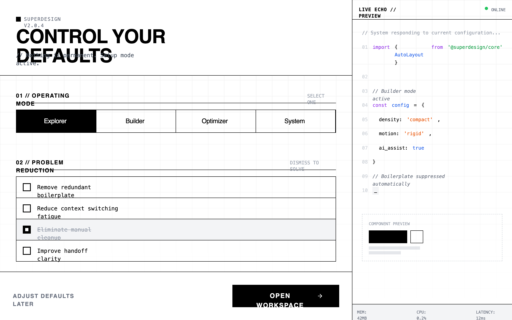

# Developer tool dashboard/onboarding

A high-density, terminal-inspired dark mode design system optimized for developer tools, SaaS configuration panels, and technical dashboards. It features a matte #111111 background with a subtle 40px grid pattern, utilitarian typography pairing Space Grotesk with JetBrains Mono, and a high-contrast #FFFFFF accent color. The aesthetic is brutalist and tool-like, utilizing zero border-radius, instant transitions (<100ms), and a dual-pane layout with a live code terminal echo. Ideal for power-user interfaces where information density and technical focus are prioritized over visual decoration.



## Prompt

```text
{
  "summary": "A stark, utilitarian configuration interface designed with a developer-first terminal aesthetic, emphasizing speed, density, and professional focus through a matte black palette and monospace typography.",
  "style": {
    "description": "The style is defined by its 'Late-night focus' theme: no rounded corners, no gradients, and a matte dark color palette. It uses Space Grotesk for bold, uppercase headers and JetBrains Mono for all technical and descriptive text. The color scheme is monochrome (#111111 background, #FFFFFF accents, #333333 borders) with subtle syntax highlighting for terminal output. Motion is clinical and near-instant (100ms) with no easing.",
    "prompt": "### Color Palette - Background: #111111 (Primary), #050505 (Terminal), #1A1A1A (Surface/Hover) - Border: #333333 - Text: #FFFFFF (Titles), #E5E5E5 (Body), #555555 (Muted) - Accent: #FFFFFF (Primary Action), #4ADE80 (Success/Active Pulse) ### Typography - Display: 'Space Grotesk', Sans-Serif; Weights: 500, 700. Used for section headers and primary buttons. - Monospace: 'JetBrains Mono', Monospace; Weights: 400. Used for all labels, versioning, data, and terminal output. - Sizes: 10px (labels), 12px (body), 24px (h1). ### Effects & Grid - Grid: 40px x 40px background grid using 1px lines at 3% white opacity, masked with a bottom fade. - Border Radius: 0px everywhere. - Cursor: crosshair. - Animation: Instant state changes (<100ms), no cubic-bezier easing; transitions should feel mechanical."
  },
  "layout_and_structure": {
    "description": "A two-pane responsive layout: a main scrollable configuration area (left) and a fixed-width live terminal echo panel (right/sidebar). The main area uses a vertical section-by-section flow with high density and minimal padding.",
    "prompts": [
      {
        "part": "Global Navigation & Header",
        "prompt": "Compressed header with a #333333 bottom border. Top-left features a 2x2px pulsing white square next to version metadata (e.g., v2.0.4 [Build 8921]) in 10px mono. H1 heading in 24px uppercase Space Grotesk. Subtext prefixed with '//' in 10px mono gray."
      },
      {
        "part": "Mode Calibration Grid",
        "prompt": "A segmented radio-button control grid with 1px #333333 internal borders. Each segment is a block with 10px uppercase mono text centered. Selected state: #FFFFFF background with black text. Hover state: #222222 background."
      },
      {
        "part": "List Reduction Section",
        "prompt": "A vertical stack of items with #333333 border-bottom. Each item is 12px mono text with a square 16px checkbox. Hovering an item reveals a red '[Kill]' tag on the far right. Checking an item triggers an immediate height-collapse to 0px."
      },
      {
        "part": "Automation & DNA Controls",
        "prompt": "Dual column grid. Column 1: Vertical timeline-style automation selector with 10px square nodes connected by a #333333 vertical line; active nodes are solid white. Column 2: Minimalist range sliders with 12px white square thumbs and 2px dark gray tracks. No descriptive text, only 10px uppercase mono labels and percentage values."
      },
      {
        "part": "Live Echo Sidebar",
        "prompt": "400px fixed width, #050505 background, #333333 left border. Header bar shows 'Terminal // :8080' with a green pulsing 'LISTENING' indicator. Content displays syntax-highlighted code (Purple #C084FC for keywords, Green #4ADE80 for strings, Blue #60A5FA for variables) with gray line numbers. Footer shows real-time system metrics (RAM/CPU) in 10px mono."
      },
      {
        "part": "Action Footer",
        "prompt": "Sticky footer with #333333 top border. Left: 'Configure Later' text-only button in 10px bold gray mono. Right: 'Initialize Workspace' primary button: solid #FFFFFF background, black 12px Space Grotesk text, uppercase, square corners, leading with a terminal icon that nudges right on hover."
      }
    ]
  },
  "special_ui_components": [
    {
      "component": "The Dismiss Item",
      "description": "A checkable list item that visually 'kills' its content.",
      "prompt": "Container: flex layout, p-3, border-b #333. Checkbox: custom 16px square, appearance-none, border #666, checked state solid white with a black center-dot. Action: On check, the container height animate-out to 0px with opacity 0."
    },
    {
      "component": "Vertical Node Dial",
      "description": "A node-based selection list mimicking a vertical step indicator.",
      "prompt": "A single #333 vertical line on the left. Interaction points are 10px square nodes. Inactive: gray border, black fill. Active: solid white fill. Text labels sit to the right with 10px mono sub-labels."
    },
    {
      "component": "Terminal Code Block",
      "description": "A syntax-highlighted code preview simulating real-time environment changes.",
      "prompt": "Background #050505. Line numbers in #333. Keywords in #C084FC. Strings in #BBF7D0. Cursor: a solid white block '#' or '_' with 1s pulse interval."
    }
  ],
  "special_notes": "- MUST NOT use any border-radius; all corners must be 90-degree sharp. - MUST NOT use drop shadows or gradients; depth is achieved solely through border layers and hex color shifts. - MUST maintain high density: vertical padding between major sections should not exceed 40px. - MUST use terminal-adjacent symbols like '//', '>', and '[]' for UI adornment."
}
```

**▶ Try it live → [https://superdesign.dev/library/developer-tool-dashboardonboarding](https://superdesign.dev/library/developer-tool-dashboardonboarding?utm_source=github&utm_medium=prompt-repo&utm_campaign=prompt-library)**

**Use it in your coding agent:** install the [Superdesign skill](https://github.com/superdesigndev/superdesign-skill), then:

```bash
superdesign get-prompts --slugs "developer-tool-dashboardonboarding" --json
```

*14 copies · 2,148 tries · Dashboards · Dev Tools · monochromatic, dark mode, high contrast, brutalist*
