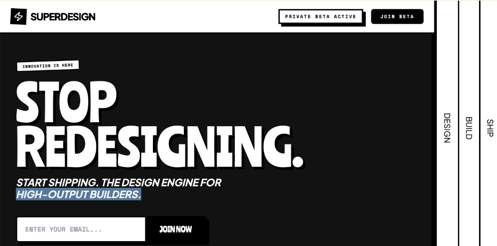

# Disruptor Beta Launch

A high-impact Neo-Brutalist design system designed for product launches and disruptive SaaS platforms. Characterized by stark color contrasts, industrial typography, and heavy geometric borders. The aesthetic utilizes a dark mode base (#121212) punctuated by vibrant 'Volt' accents (#CCFF00) and crisp white containers. Key features include 'sticker-style' rotated elements, massive display type, solid 8px offsets (Neo-shadows), and vertical navigation elements. Ideal for high-growth tech, developer tools, fintech, and creative agencies looking for an aggressive, authoritative, and innovative brand presence.



## Prompt

```text
{
  "summary": "The 'Disruptor' style guide is a bold, industrial-themed framework that merges brutalist architecture with modern UI components, emphasizing speed, technical precision, and high-output shipping.",
  "style": {
    "description": "The style is built on a foundation of 'Ranchers' for massive, attention-grabbing headlines, 'Space Mono' for technical labels and industrial data, and 'Plus Jakarta Sans' for legible body copy. The color palette is strictly limited to Black (#000000), Dark Grey (#121212), White (#FFFFFF), and a signature Volt green (#CCFF00). It avoids gradients and soft shadows in favor of hard 4px/8px borders and solid offset shadows (neo-shadows). Layouts are structured using thick black lines and high-contrast section transitions.",
    "prompt": "Create a design with a Neo-Brutalist aesthetic. Backgrounds: Primarily #121212 with high-contrast #FFFFFF and #CCFF00 sections. Typography: Headlines in 'Ranchers' (all caps, tight leading 0.85, massive sizing up to 180px); Technical labels/utility text in 'Space Mono' (uppercase, 0.1em tracking, bold); Body text in 'Plus Jakarta Sans'. Borders: Solid 4px or 8px black (#000000). Shadows: Use 'Neo-shadows' which are solid offsets (no blur) of 8px x 8px in either #000000 or #FFFFFF. Buttons: Brutalist style with 4px borders, mono-spaced text, and hover states that translate 4px/4px to 'fill' the shadow gap. Decorative elements: Use tilted 'sticker' containers (rotate 2-5 degrees) and vertical text bars (writing-mode: vertical-rl)."
  },
  "layout_and_structure": {
    "description": "The layout features a main content area with a fixed, multi-layered vertical sidebar on large screens, creating a 'blueprint' or 'industrial' feeling. Sections are separated by heavy 8px black horizontal borders.",
    "prompts": [
      {
        "part": "Header Navigation",
        "prompt": "A sticky top navigation bar with a white background (#FFFFFF) and a heavy 4px bottom border (#000000). On the left, a logo composed of a black square rotated 3 degrees containing a white icon, followed by brand text in 'Plus Jakarta Sans' (ExtraBold, 30px). On the right, include a technical badge using 'Space Mono' with a neo-shadow and a 'Join Beta' button with an 8px border-radius and mono-spaced text."
      },
      {
        "part": "Hero Section",
        "prompt": "A massive layout featuring a centered or left-aligned headline in 'Ranchers' font (size 150px-180px) with a 6px-8px black drop shadow. Include a 'sticker' badge above the headline (white background, rotated -2 degrees, black border). Below the headline, place a 2xl italic subheadline. Feature a 'Brutalist Form': a white input field and black button fused together with a 4px black border and a solid 8px black offset shadow."
      },
      {
        "part": "Social Proof Sticker Bar",
        "prompt": "A full-width white section bound by 4px black borders. Inside, distribute 'sticker' cards that are slightly rotated (between -2 and 2 degrees). Each card features a 4px border, a square avatar, and mono-spaced testimonial text in all caps."
      },
      {
        "part": "High-Impact Comparison Section",
        "prompt": "A grid of horizontal rows. Each row is split into two halves: The left side is black (#000000) with muted grey text (#475569) representing 'The Old Way'; the right side is Volt Green (#CCFF00) with black text (#000000) representing 'The Better Way'. Use 'Ranchers' font at 80px for the row titles and include technical labels in 'Space Mono' above each title."
      },
      {
        "part": "Process Blueprint",
        "prompt": "A 3-column grid on a dark background (#121212). Each card is white with a heavy 8px black border and a white neo-shadow (#FFFFFF). Place a Volt Green (#CCFF00) 'Step' tag at the top-left of each card, slightly rotated. Behind the card content, include a giant, low-opacity (3%) watermark of the step number in 'Ranchers' font."
      },
      {
        "part": "Structural Sidebar",
        "prompt": "A unique fixed sidebar (200px width) on the far right. It consists of multiple 64px vertical strips of white background separated by 4px black borders. Each strip contains 'vertical-rl' text (e.g., 'DESIGN', 'BUILD', 'SHIP') in 'Archivo' or 'Space Mono' font, creating a blueprint tab effect."
      }
    ]
  },
  "special_ui_components": [
    {
      "component": "Brutalist Countdown Timer",
      "description": "A series of high-contrast boxes displaying time units.",
      "prompt": "Create boxes with white or slate backgrounds and 4px black borders. Each box has a solid 8px black neo-shadow. Use a bold sans-serif (Archivo) for the numbers (size 40px) and 'Space Mono' for labels. Align them horizontally with 16px gaps."
    },
    {
      "component": "Integrated Waitlist Form",
      "description": "A high-precision input and button combination.",
      "prompt": "A container with a 4px black border and 8px solid shadow. The input field has no internal borders and uses 'Space Mono' for placeholder text. The submit button is separated by a 4px vertical black line, uses 'Ranchers' font, and has a hover state that flips background/text colors (Black to White)."
    }
  ],
  "special_notes": "MUST: Use only solid shadows (no blur/spread). MUST: Use all-caps for technical labels and headlines. MUST: Use heavy borders (minimum 4px). MUST: Maintain high contrast between black/white and black/volt. DO NOT: Use rounded corners larger than 8px. DO NOT: Use gradients or transparency except for the background watermarks. DO NOT: Use 'soft' UI elements like pastels or blurred glass effects."
}
```

**▶ Try it live → [https://superdesign.dev/library/disruptor-beta-launch](https://superdesign.dev/library/disruptor-beta-launch)**

*456 copies · 2,318 tries · tags: product launch, waitlist, high conversion page, landing page, style*
