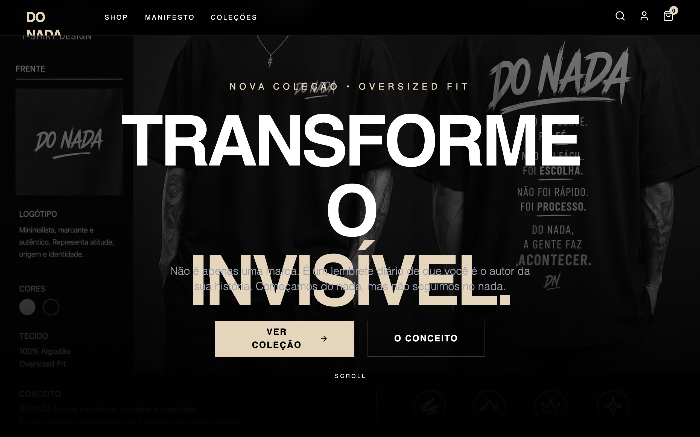

# DO NADA - Premium Apparel Store

Premium apparel e-commerce style guide featuring a high-contrast black and gold palette. Utilizes a mix of editorial Cabinet Grotesk typography and clean Satoshi body text. Suitable for luxury streetwear, high-end fashion, and boutique lifestyle brands. Features cinematic grayscale-to-color image transitions, bold brutalist typography backgrounds, and a focus on minimalist layouts with dramatic letter spacing.



## Prompt

```text
{
  "summary": "A minimalist, premium apparel store design with a 'dark luxury' aesthetic, defined by deep black surfaces, soft gold accents (#E5D5BC), and bold, uppercase display typography. The design emphasizes storytelling through a manifesto-driven layout and high-quality photography with cinematic hover effects.",
  "style": {
    "description": "The style blends high-fashion editorial aesthetics with modern brutalism. Typography uses 'Cabinet Grotesk' for heavy, impactful headlines and 'Satoshi' for refined readability. Colors are restricted to #0A0A0A (Black) and #E5D5BC (Gold). Micro-interactions include smooth opacity fades, grayscale-to-color hover states, and slide-up button transitions in product cards.",
    "prompt": "### Visual Identity System\n- **Color Palette:** Primary Black (#0A0A0A), Brand Gold (#E5D5BC) for accents and CTAs, secondary dark charcoal (#0F0F0F) for section separation, and Light Gray (#9CA3AF) for body copy.\n- **Typography:** \n  - Headlines: Cabinet Grotesk (Weights 800/900), tracking: -0.05em (tighter) for massive titles, or +0.4em (wide) for subtitles.\n  - Body: Satoshi (Weights 300, 400, 700), tracking: 0.05em.\n  - Labels/Links: Satoshi Bold, uppercase, tracking: 0.2em to 0.3em.\n- **Imagery Style:** Grayscale by default, transitioning to full color on hover. High-contrast, moody fashion photography.\n- **UI Elements:** \n  - Borders: 1px width, color white/10 or gold/20.\n  - Buttons: Sharp corners (0px radius). Primary buttons use #E5D5BC background with #0A0A0A text. Secondary buttons are transparent with 1px white/20 borders.\n  - Animations: Fade-in on scroll (1s ease-out), Pulse effects on highlights, and smooth image scaling (1.1x) on hover."
  },
  "layout_and_structure": {
    "description": "A vertical-scrolling landing page structure with fixed navigation, wide hero imagery, grid-based philosophy and shop sections, and high-impact manifesto sections with oversized background text.",
    "prompts": [
      {
        "part": "Navigation",
        "prompt": "Sticky top bar with 95% black opacity and backdrop-blur-md. Height approx 80px. Left-aligned logo in Cabinet Grotesk (Gold), centered or left-offset links in 12px uppercase Satoshi (tracking 0.2em). Right-aligned utility icons (search, user, cart) with a gold notification badge for the cart."
      },
      {
        "part": "Hero Section",
        "prompt": "Full viewport height (100vh). Background image at 60% opacity with a grayscale filter that removes on hover. Center-aligned content: a gold subtitle with 0.4em tracking, followed by a massive 2-line title (text-6xl to text-9xl). Bottom of section features a minimalist scroll indicator: a 1px vertical line fading to transparent."
      },
      {
        "part": "Brand Philosophy",
        "prompt": "Horizontal 5-column grid on dark gray (#0F0F0F) background. Each item features a 64x64px circular icon container with a 1px border that changes to gold on hover. Icons are minimalist (Lucide style). Text below icons uses 12px bold uppercase titles and 10px gray descriptions."
      },
      {
        "part": "Product Grid",
        "prompt": "Grid layout (1-3 columns). Product cards have a 3:4 aspect ratio. On hover, the image scales slightly and a gold 'Add to Cart' bar slides up from the bottom (translate-y-0). Price text in gold bold. 'Best Seller' or 'New' badges are small rectangular overlays with backdrop-blur."
      },
      {
        "part": "Manifesto Section",
        "prompt": "A high-impact section featuring a large decorative background title (e.g., 'CHOICE') set at 30vw font-size, 10% opacity white. Foreground features a centered blockquote in 3xl to 5xl Cabinet Grotesk, emphasizing specific words in gold. Long-form philosophy text below in 18px gray font-light."
      },
      {
        "part": "Newsletter CTA",
        "prompt": "Full-width section with #E5D5BC (Gold) background and #0A0A0A (Black) text. Features a minimalist form: transparent input field with a 2px black bottom or full border, and a solid black 'Join' button. Typography remains uppercase and high-tracking."
      },
      {
        "part": "Footer",
        "prompt": "Deep black background with top border (white/5). 4-column layout. Column 1: Large Gold brand logo and social icons. Columns 2-3: Vertical link lists with 1px gold bottom-border hovers. Column 4: Contact info with gold icons. Bottom bar: Tiny 10px legal text and grayscale payment logos."
      }
    ]
  },
  "special_ui_components": [
    {
      "component": "Interactive Product Card",
      "description": "Cinematic card with hidden actions.",
      "prompt": "Structure: 3:4 aspect ratio container. Implementation: Image grayscale (filter: grayscale(100%)) transitions to color (0%) on container hover. An absolute-positioned button at the bottom (bg-gold, h-16) must be hidden (transform: translateY(100%)) and slide up smoothly (transition: transform 0.3s) while opacity fades in."
    },
    {
      "component": "Brutalist Background Typography",
      "description": "Decorative oversized text layer.",
      "prompt": "Use an absolute-positioned <h1> or <div> with `pointer-events-none` and `user-select-none`. Font-size: 30vw. Color: white at 0.05 or 0.1 opacity. Position: absolute top-0 right-0 for a 'cut-off' editorial effect."
    }
  ]
}
```

**▶ Try it live → [https://superdesign.dev/library/do-nada-premium-apparel-store](https://superdesign.dev/library/do-nada-premium-apparel-store?utm_source=github&utm_medium=prompt-repo&utm_campaign=prompt-library)**

**Use it in your coding agent:** install the [Superdesign skill](https://github.com/superdesigndev/superdesign-skill), then:

```bash
superdesign get-prompts --slugs "do-nada-premium-apparel-store" --json
```

*70 copies · 2,465 tries · *
