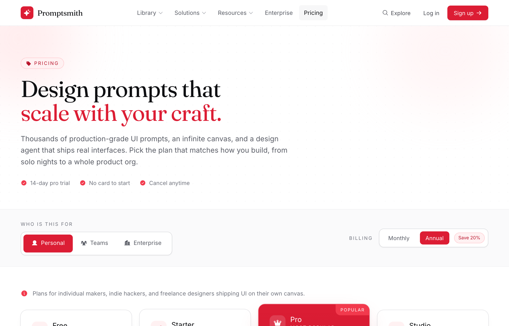

# Editorial Crimson Dev-Tool Pricing

A light, serif-accented SaaS pricing page on white with a single crimson accent, audience segmented tabs, a monthly/annual toggle, and a 4-tier grid with one elevated 'most popular' card.



## Prompt

```text
{"summary": "A light, editorial SaaS dev-tool pricing page for an AI design-agent product. White canvas with a crimson/scarlet accent, a Fraunces serif display face paired with Inter, and a soft grain texture + crimson blur blobs in the hero. The signature move is a dual control row: an audience segmented-tab switcher (Personal / Teams / Enterprise) that swaps the entire plan set, plus a Monthly/Annual billing toggle with a 'Save 20%' pill that live-updates every price. Below sits a 4-up tier grid with one elevated, crimson-filled 'most popular' card that pops above its neighbors, a 4-column 'everything included' feature band, a two-column FAQ accordion, and a dark CTA band.", "style": {"description": "Warm editorial-tech aesthetic: near-white background, a single saturated crimson accent used for the logo mark, featured tier, pills, check icons and links, and a near-black 'ink' for text and the dark CTA band. Serif display headings (Fraunces) over a clean Inter body create a confident, designerly-but-technical feel. Generous whitespace, 1px hairline ink borders, rounded-2xl cards, soft layered shadows, subtle dotted grain texture, and blurred crimson glow blobs behind the hero. Uppercase, wide-tracked micro-labels.", "prompt": "Use a light editorial dev-tool style. Background pure white #ffffff; section bands alternate with a faint tint of ink-50 #f7f7f8 (e.g. bg-ink-50/60). Text in near-black ink-900 #0e0f12 for headings, ink-600 #5a5d66 for body, ink-500 #71747e / ink-400 #90939c for muted captions. Single accent is crimson, scaled as: crimson-50 #fff1f2, crimson-100 #ffe1e3, crimson-200 #ffc8cd, crimson-500 #f23a4d, crimson-600 #dc1d34 (primary), crimson-700 #b8132a, crimson-800 #991327, crimson-900 #7e1526. Borders are 1px ink-100 #eeeef0 / ink-200 #d9dadd hairlines. Typography: display serif 'Fraunces' (opsz, weights 400-900) for the logo, h1/h2/h3 and the big price numerals (tight tracking ~ -0.02em, line-height ~1.04-1.1); body + UI in 'Inter' (weights 400-800). Micro-labels are 11-12px, font-700, uppercase, letter-spacing ~0.16em, in ink-500. Rounded corners: lg/xl on buttons and pills, 2xl (rounded-2xl) on cards and panels. Shadows: a soft card shadow (0 1px 2px rgba(14,15,18,.04), 0 8px 24px -12px rgba(14,15,18,.12)) and a crimson 'pop' shadow for the featured card / primary CTA (0 24px 60px -24px rgba(220,29,52,.45)). Add a subtle dotted grain overlay (radial-gradient dot pattern at ~22px) and a couple of large blurred crimson radial blobs behind the hero. Buttons: primary = solid crimson-600 white text rounded-lg; ghost = white with a 1px ink-200 ring that turns crimson on hover; dark = ink-900. Antialiased, optimizeLegibility."}, "layout_and_structure": {"description": "A frameless, responsive single-column web page (max content width 1240px, generous side padding) stacked as: sticky translucent nav, a serif hero with eyebrow pill and trust row, a controls band holding the audience segmented tabs + billing toggle, the 4-up pricing grid with a raised featured tier, a 4-column 'all plans include' feature band, a two-column FAQ accordion, a dark CTA band, and a slim footer. The whole thing is fluid: the pricing cards reflow 4 -> 2 -> 1 columns, the controls row stacks vertically on mobile, and the nav collapses its link list on small screens. Not a fixed-size frame, a full responsive page.", "prompts": [{"part": "Sticky top nav", "prompt": "Sticky top header (sticky top-0, z-50) with a translucent white background and backdrop blur (bg-white/85 backdrop-blur-md) and a 1px ink-100 bottom border. Inside a max-w-1240px centered row, 64px tall, space-between: left = brand (an 8x8 rounded-lg crimson-600 tile holding a white sparkle icon + the serif wordmark 'Promptsmith'); center = nav links (Library, Solutions, Resources with small caret icons, Enterprise, and Pricing shown active with an ink-50 chip) hidden below lg; right = a 'Explore' search link, a 'Log in' text link, and a solid crimson-600 'Sign up' button with an arrow icon. Links are 14.5px, font-500/600, ink-600 going ink-900 on hover with an ink-50 hover chip."}, {"part": "Hero / headline", "prompt": "Hero section with a relative overflow-hidden container holding the dotted grain overlay (opacity ~60%) and two large blurred crimson radial blobs (crimson-100 and crimson-50, blur-3xl) bleeding off the top corners. Left-aligned content in a max-w-3xl block: a small pill eyebrow (rounded-full, crimson-50 fill, crimson-200 border, crimson-700 uppercase tracked text with a tag icon, reading 'Pricing'); a serif h1 ~40px mobile / 58px desktop, font-600, tight tracking, two lines with the second line ('scale with your craft.') in crimson-600; a 16-18px ink-600 supporting paragraph; and a wrap-flex trust row of three crimson check-circle items ('14-day pro trial', 'No card to start', 'Cancel anytime')."}, {"part": "Controls band (audience tabs + billing toggle)", "prompt": "A controls band on a faint ink-50 tint with hairline top/bottom borders. A flex row that is column on mobile and space-between on large screens. Left group = an audience segmented switcher: a tiny uppercase label 'Who is this for' above an inline pill container (white, 1px ink-200, rounded-xl, p-1.5) holding three buttons Personal / Teams / Enterprise, each with a leading phosphor icon; the active button fills crimson-600 with white text and a small shadow, inactive are ink-600 with an ink-50 hover. Right group = a billing toggle: a white rounded-xl pill with Monthly / Annual buttons (active one fills crimson-600 white) plus a crimson-50 'Save 20%' pill that dims when Monthly is selected. Switching the audience tab swaps the entire plan set and the context line; the billing toggle live-recomputes every price (annual prices are lower)."}, {"part": "Pricing grid (4 tiers, featured center, swappable per audience)", "prompt": "The core pricing layout: a context line above the grid (info icon + a sentence describing who the current audience set is for), then a grid that is 1 col on mobile, 2 cols on md, and 4 cols on xl (items aligned center on xl so the featured card can overflow vertically). Each tier is a rounded-2xl card, p-6/7, flex column: a header row with a 10x10 rounded-xl crimson-50 icon tile + the plan name (18px font-700) and a tiny uppercase tagline ('Forever free' / 'Starting from' / 'Most popular' / 'Custom'); then the price block: a small superscript '$', a big serif numeral (~48px, tabular-nums) and a '/mo' or '/seat/mo' suffix, with a 'billed annually / monthly' sub-line; contact tiers show the word 'Custom' instead of a number. Then a short note line, a full-width CTA button (ghost white-with-ring by default), and a hairline-divided feature list titled 'Everything in X, plus' with crimson check-bold bullets. Exactly one tier is featured: it fills a crimson-600 to crimson-700 gradient with white text, a 'Popular' ribbon notched into the top-right corner, the crimson 'pop' shadow, and lifts above its neighbours on xl (negative vertical margin + higher z-index); its CTA inverts to white with crimson text. Render 4 tiers for Personal (Free $0, Starter $12/$10, Pro $29/$24 featured, Studio $59/$49), 4 for Teams (Team Starter, Team featured, Team Plus, Enterprise contact), and 3 for Enterprise (Scale, Enterprise featured contact, Platform contact), each tier listing 4-5 features. Small centered footnote under the grid: 'All plans include the prompt library, infinite canvas, and component export. Prices in USD.'"}, {"part": "All-plans-include feature band", "prompt": "A reassurance band on a faint ink-50 tint: one wide rounded-2xl white card with a 1px ink-200 border, split into 4 columns (1 col mobile, 4 cols lg). The first column is a filled crimson-600 to crimson-800 gradient panel with a serif heading 'Every plan ships with the essentials' and a crimson-100 sub-line. The remaining three columns each carry an uppercase micro-label ('The library', 'The canvas', 'Ship it') over a 3-item checklist with crimson check-bold icons (e.g. '4,000+ UI prompts', 'Infinite design canvas', 'React / HTML export'). Hairline ink-100 dividers between columns."}, {"part": "FAQ accordion", "prompt": "A two-column FAQ section on white: left column (narrower, ~0.8fr) has an 'FAQ' pill eyebrow, a serif h2 'Questions, answered', and a line inviting people to 'Talk to the team' (crimson link with a dotted crimson underline). Right column (~1.2fr) is a stack of native <details> accordion items separated by ink-100 dividers; each summary is a 16px font-600 question in a space-between row with a crimson plus icon that rotates 45deg to an x when open (first item open by default). Answers are 14.5px ink-600. Cover credits, switching plans/audiences, credit rollover, and the annual discount."}, {"part": "Dark CTA band + footer", "prompt": "A dark closing CTA band: ink-900 background with two blurred crimson glow blobs in the corners; inside, a flex row (column on mobile) with a serif h2 'Start designing in the next minute.' and an ink-300 sub-line on the left, and two buttons on the right, a primary crimson-600 'Get started free' with the crimson pop shadow and an arrow, plus a translucent white/10 ring 'Talk to sales' secondary. Then a slim footer on white with a top ink-100 border: brand lockup left, a row of muted text links (Library, Docs, Changelog, Privacy, Terms) center, and a copyright on the right."}]}, "special_ui_components": [{"component": "Audience segmented-tab switcher", "description": "A 3-way pill switcher (Personal / Teams / Enterprise) that doesn't just style itself, it swaps the entire pricing data set and the context sentence below the controls. The active segment fills crimson-600 with white text.", "prompt": "Build a segmented control as an inline white rounded-xl container (1px ink-200, p-1.5) of three buttons, each with a leading phosphor icon (user / users-three / buildings) and a 14.5px font-600 label. The selected button gets a crimson-600 fill, white text, and a subtle shadow; the others are ink-600 with an ink-50 hover. On click, set the active audience and re-render the whole pricing grid + the context line from a per-audience data object (each audience defines its own array of tiers, prices, features, and which tier is featured). On mobile the buttons stretch full width."}, {"component": "Monthly / Annual billing toggle with Save pill", "description": "A two-button billing toggle plus a 'Save 20%' badge that recomputes every visible price between monthly and annual amounts and dims the badge when monthly is active.", "prompt": "Create a white rounded-xl pill (1px ink-200) holding Monthly and Annual buttons; the active one fills crimson-600 with white text, the inactive is ink-600. Beside it, a crimson-50 / crimson-200 rounded-full 'Save 20%' pill that drops to ~45% opacity when Monthly is selected. Each tier stores both a monthly and an annual price; toggling re-renders the grid so the big numeral and the 'billed annually/monthly' sub-line update everywhere at once. Default the page to Annual."}, {"component": "Featured (most-popular) pricing tier", "description": "One tier visually elevated above the rest: a solid crimson gradient card with white text, a notched 'Popular' corner ribbon, the crimson glow shadow, and a slight vertical lift over its neighbours on wide screens.", "prompt": "Mark exactly one tier as featured. Render it as a rounded-2xl card filled with a crimson-600 to crimson-700 vertical gradient, all text in white / crimson-50, an inverted CTA (white background, crimson-700 text), and crimson-100 check icons. Pin a small 'Popular' ribbon into the top-right corner (notched with rounded-bl + rounded-tr). Give it the crimson 'pop' shadow and a 1px crimson ring; on xl screens lift it with a small negative vertical margin and higher z-index so it rises above the adjacent white cards."}, {"component": "Plus-to-x FAQ accordion", "description": "Native disclosure rows where a crimson plus icon rotates into an x when the item opens.", "prompt": "Use native <details>/<summary> rows divided by ink-100 hairlines. Each summary is a space-between flex of a 16px font-600 question and a crimson-500 plus-bold icon; on open, rotate the icon 45deg (group-open:rotate-45) so it reads as an x, and reveal a 14.5px ink-600 answer. Remove the default marker (list-none) and open the first item by default."}], "special_notes": "Frameless, fully responsive web page, not a fixed canvas: content is capped at max-w-1240px with fluid side padding, the pricing cards reflow 4 -> 2 -> 1 columns, the controls row stacks on mobile, and the nav link list hides on small screens. The two controls (audience tabs + billing toggle) are the heart of the pattern: copying this design means copying the interaction where one switcher swaps the whole plan set and the other recomputes all prices. Built with Tailwind (CDN) config extending custom 'crimson' and 'ink' palettes plus 'card'/'pop'/'navy' shadows, Fraunces + Inter from Google Fonts, and Phosphor icons via Iconify; tiers are rendered from a JS data object so add/remove/reorder tiers by editing data, not markup. Keep the single-accent discipline (everything that isn't ink is crimson) and the serif-display / sans-body pairing, that contrast is what gives this page its character."}
```

**▶ Try it live → [https://superdesign.dev/library/editorial-crimson-dev-tool-pricing](https://superdesign.dev/library/editorial-crimson-dev-tool-pricing?utm_source=github&utm_medium=prompt-repo&utm_campaign=prompt-library)**

**Use it in your coding agent:** install the [Superdesign skill](https://github.com/superdesigndev/superdesign-skill), then:

```bash
superdesign get-prompts --slugs "editorial-crimson-dev-tool-pricing" --json
```

*0 copies · 2,413 tries · Pricing Pages · Dev Tools · pricing page, saas, light, white*
