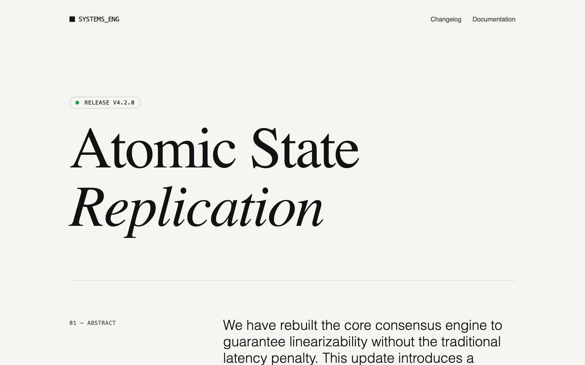

# Editorial Feature Announcement

A high-end technical editorial design system tailored for feature announcements, changelogs, and whitepapers. It features a sophisticated 'paper and ink' color palette (#F7F5F0 background), high-contrast typography pairing (Fraunces serif and Inter sans), and an asymmetric 12-column grid layout. Suitable for developer tools, fintech, research institutions, and SaaS companies that prioritize credibility and deep readability. The style emphasizes content hierarchy through vertical reading rhythms, monospace technical markers, and minimal visual noise.



## Prompt

```text
{
  "summary": "An editorial-style technical announcement page that uses typography as the primary design element. It uses a 4-to-8 column layout ratio to separate metadata from long-form content, creating a vertical reading experience akin to a high-end technical journal.",
  "style": {
    "description": "The style is 'Technical Editorial,' combining the warmth of a paper-like background with the precision of a geometric sans-serif and the character of a variable serif. It employs a light theme with charcoal text, relying on border-based dividers and monospace utility text rather than icons or imagery.",
    "prompt": "Create a design system using a 'Paper and Ink' palette: Background #F7F5F0 (Paper), Primary Text #111111 (Ink), Secondary Text #444444 (Graphite), and subtle Dividers #111111 at 10% opacity. Typography: Primary Sans is 'Inter' (300, 400, 600) for UI and body; Primary Serif is 'Fraunces' (9-144pt optical size, 300-600 weight) for headlines and blockquotes; Technical Mono is 'JetBrains Mono' for metadata and code. Use a 12-column grid. Links should have a 1px border-bottom instead of underline. Focus on generous line-heights (1.6 to 1.8) and 'chapter-marker' labels in 12px uppercase Mono for section indexing. Include subtle transition effects on hover (0.2s ease-in-out) for all interactive links and buttons."
  },
  "layout_and_structure": {
    "description": "A structured, vertical reading experience based on an asymmetric 12-column grid. Most sections utilize a 4-column sidebar (for chapter markers/titles) and an 8-column main content area.",
    "prompts": [
      {
        "part": "Navigation",
        "prompt": "A minimalist top-bar with a max-width of 1280px. Left side: Brand mark (a 12px black square next to monospace text). Right side: Text links in 14px 'Inter' Graphite, switching to Ink on hover. Spacing: 32px vertical padding."
      },
      {
        "part": "Editorial Hero",
        "prompt": "Large header section with 80px top padding and 64px bottom padding. Features a pill-shaped status badge with a green dot and monospace version tag. Headline: 'Fraunces' serif at 96px+ size, tracking-tight, leading-[0.9], utilizing italics for emphasis. 1px divider at the bottom."
      },
      {
        "part": "Abstract Section",
        "prompt": "12-column grid. Columns 1-4: Monospace chapter marker '01 — ABSTRACT'. Columns 5-12: Large-scale introductory text (30px size, light weight, leading-snug)."
      },
      {
        "part": "The 4/8 Split Content Block",
        "prompt": "Standard content section with 1px top border. Columns 1-4: Sticky sidebar containing chapter marker and 'Fraunces' h3 title. Columns 5-12: Multi-paragraph 'Inter' body text (18px) with 1.7 line height. Include blockquotes with 2px solid left-border and serif italics."
      },
      {
        "part": "Technical Comparison (Before vs After)",
        "prompt": "Two-column grid for 'Architecture Shift'. Left column (Legacy): Monospace code-like flow with red-tinted latency labels. Right column (Modern): Monospace flow with green-tinted success labels. Separated by a vertical divider. Header for each column uses 'Fraunces' size 20px and a mono tag (e.g., 'BLOCKING I/O' vs 'NON-BLOCKING')."
      },
      {
        "part": "Numeric Deep Dive",
        "prompt": "Section with large oversized numbers (01, 02) in 10% opacity 'Fraunces'. The content is paired with an 'Inter' h3 and a light smoke-colored (#E5E2D9 at 30%) use-case box with monospace labels."
      },
      {
        "part": "Step-Based Mechanics",
        "prompt": "A vertical timeline layout. A 1px vertical line (#111111, 10% opacity) with 16px circular nodes. Content is indented with bold titles and graphite descriptions, creating a visual rhythm of process flow."
      },
      {
        "part": "Technical Constraints Panel",
        "prompt": "Full-width background of #E5E2D9 at 30% opacity. 12-column split. Sidebar has an alert icon and chapter marker. Content area uses a list of technical tags (LIMITATION, EDGE CASE, SECURITY) in monospace followed by small-text descriptions."
      }
    ]
  },
  "special_ui_components": [
    {
      "component": "Chapter Marker",
      "description": "Monospace section index labels used globally.",
      "prompt": "Font: JetBrains Mono; Size: 12px; Text-Transform: uppercase; Letter-spacing: 0.05em; Color: #444444; Format: '[Number] — [Title]'."
    },
    {
      "component": "Editorial Link",
      "description": "High-visibility document links for navigation.",
      "prompt": "Flex container with arrow-right icon. Text: Black Ink. Border-bottom: 1px solid Ink. Animation: On hover, text opacity drops to 70% and icon translates +4px on the X-axis."
    },
    {
      "component": "Code Comparison Flow",
      "description": "Text-only representation of data flow or architecture changes.",
      "prompt": "Font: Monospace; Size: 14px; Line-height: 2.0; Spacing: 16px indents for nested steps; Colors: Use muted reds (#B91C1C at 60%) for legacy delays and muted greens (#057A55 at 60%) for modern improvements."
    }
  ]
}
```

**▶ [Try it live →](https://superdesign.dev/library/editorial-feature-announcement?utm_source=github&utm_medium=prompt-repo&utm_campaign=prompt-library)**

**Use it in your coding agent:** install the [Superdesign skill](https://github.com/superdesigndev/superdesign-skill), then:

```bash
superdesign get-prompts --slugs "editorial-feature-announcement" --json
```

*16 copies · 2,332 tries · Other · AI & Tech · feature announcement, sass, ai product, cream*
