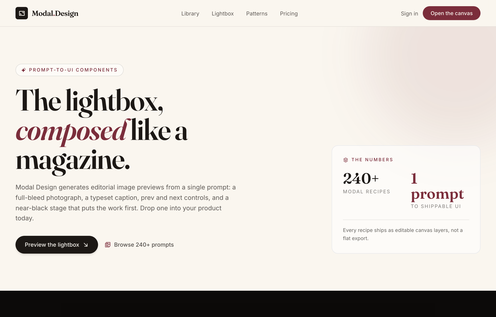

# Editorial Image Lightbox

An editorial image lightbox modal as the live hero of a product page: a near-black coal (#0c0a09) figure with a top rail (serif 04/28 plate counter + 'Aperture Series' label, scrollable category filter pills, a circular close), a full-bleed photograph with circular glass prev/next carets and a bottom legibility gradient, and a cream (#faf6ef) caption panel (burgundy location eyebrow, a Fraunces headline, a description, Save / Copy-prompt actions), floated over a vignetted grain stage with a faded 3-up gallery echo behind and an 'Esc / arrows / 28 plates' keyboard ticker beneath. Around it: a frosted sticky cream nav, a hero with a stats card, a 3-up library grid, a four-cell anatomy band, a dark CTA band and a coal footer. Ink-on-cream editorial with a single reserved burgundy #7b2d3b accent; Fraunces + Inter, Phosphor icons.



## Prompt

```text
{"summary": "An editorial image lightbox modal presented as the live hero of a product page for the placeholder brand 'Modal.Design' (a prompt-to-UI modal-recipe kit). The page opens on a warm cream editorial system, then drops into a full-bleed near-black 'stage' band where THE lightbox modal is the centerpiece: a max-w-5xl rounded-2xl coal (#0c0a09) figure with a top control rail (a serif 04 / 28 plate counter + an 'Aperture Series' label, a scrollable row of category filter pills, and a circular close button), a full-bleed photograph with circular glass prev/next caret controls and a bottom legibility gradient, and a cream (#faf6ef) caption panel below carrying a burgundy location eyebrow, a Fraunces headline, an Inter description and Save / Copy-prompt actions. Behind the modal a faded 3-up gallery echoes the source, and a centered keyboard-hint ticker ('Esc to close \u00b7 \u2190 \u2192 to navigate \u00b7 28 plates') sits under it. Around the stage: a sticky frosted cream nav, a two-column hero (eyebrow chip + a two-line Fraunces headline with an italic burgundy 'composed' + lead + two CTAs beside a stats card), a 3-up library grid (a featured dark Editorial Lightbox card + Confirm Dialog + Auth Sheet mini-mockups), a four-cell anatomy band (The stage / The caption / The controls / The exit), a dark ink CTA band, and a coal footer. The system is ink-on-cream with a single reserved burgundy accent. Built on Fraunces (serif display) + Inter (sans), Phosphor icons via Iconify.", "style": {"description": "A warm, editorial, magazine-grade aesthetic built to make a generated lightbox feel typeset rather than default. The mood splits into two registers: a bright cream editorial body (#faf6ef) for the marketing surfaces, and a near-black 'stage' for the lightbox itself so the photograph leads. Color is strictly disciplined: ink #1c1815 carries nearly all text and the dark CTA/footer surfaces, cream #faf6ef carries every light surface and all reversed text, coal #0c0a09 is the deepest near-black for the modal body and footer, and a single burgundy accent (#7b2d3b, deepening to #5e2029 on hover) is RESERVED for emphasis only (the brand period, eyebrow labels, the active filter pill, italic headline words, prev/next/close hover states, primary CTAs). The dark stage is a layered 'backdrop-vignette' (a radial coal gradient from rgba(12,10,9,0.55) at center to rgba(12,10,9,0.97) at the edges over #0c0a09) dusted with a faint 'grain' dot texture. Surfaces are translucent panels hairlined with ink/10-12 (light) or cream/10-15 (dark) borders, generous rounding (rounded-xl tiles, rounded-2xl cards + the modal, rounded-full pills + controls), and a deep modal shadow (0 50px 120px -30px rgba(0,0,0,0.85) plus a 1px white/5 ring). Type pairs Fraunces (a variable optical-size serif, opsz 120 on display headlines, with true italics for accent words) for headlines, counters and titles against Inter for body, labels and UI. Eyebrows are uppercase, widely letter-spaced (tracking 0.18-0.22em) in burgundy. Motion is restrained: cards lift -4px on hover, prev/next carets nudge on hover, and selection paints burgundy-on-cream. The whole point: burgundy is scarce so it reads as editorial emphasis, and the cream/coal split keeps the marketing legible while letting the photograph own the stage.", "prompt": "Use a warm editorial design system that splits between a bright cream body and a near-black photographic stage. EXACT palette tokens (Tailwind config): ink #1c1815, cream #faf6ef, burgundy #7b2d3b, burgundy-deep #5e2029, coal #0c0a09. Body background #faf6ef; default text ink #1c1815. Selection: background #7b2d3b, color #faf6ef. Discipline rule: ink carries nearly all text and the dark CTA + footer surfaces; cream carries every light surface and all reversed text; coal #0c0a09 is the modal body + footer; burgundy #7b2d3b is RESERVED for accents only (the brand '.', uppercase eyebrow labels, the active filter pill fill, the italic headline word 'composed', prev/next/close hover fills, primary CTAs, the location pin eyebrow, the 'Featured' tag), deepening to burgundy-deep #5e2029 on primary-button hover. Fonts via Google Fonts: Fraunces (ital + opsz 9..144 + wght 300..900, optical-sizing auto; a .display utility sets font-variation-settings 'opsz' 120) as the serif/display family, and Inter (wght 300..700) as the sans/body/UI family. Radii: rounded-xl on tiles, rounded-2xl on cards + the modal figure, rounded-full on pills + circular controls. Borders: ink/10-12 on light surfaces, cream/10-15 on dark surfaces. The dark stage is a .backdrop-vignette = radial-gradient(120% 90% at 50% 40%, rgba(12,10,9,0.55) 0%, rgba(12,10,9,0.88) 55%, rgba(12,10,9,0.97) 100%) over #0c0a09, with a .grain overlay = radial-gradient(rgba(255,255,255,0.04) 1px, transparent 1px) at background-size 3px 3px. The modal shadow = 0 50px 120px -30px rgba(0,0,0,0.85) with a ring-1 ring-white/5. Filmstrip / pill rows hide their scrollbar (.filmstrip: scrollbar-width none + ::-webkit-scrollbar display none). Motion: a .lift utility = transition transform .35s cubic-bezier(.2,.7,.2,1) + box-shadow .35s, hover translateY(-4px); prev/next carets nudge \u00b10.5 on group-hover; smooth color transitions on links/buttons. Headlines use text-balance + the .display opsz; eyebrows are uppercase Inter at tracking 0.18-0.22em in burgundy. Icons are Phosphor via Iconify, ink or burgundy on light, cream on dark."}, "layout_and_structure": {"description": "A single vertically-scrolling editorial product page on a shared max-w-7xl mx-auto px-6 lg:px-10 container, with the image lightbox as a full-bleed dark 'stage' band roughly mid-page (the modal shown live, in context, not floated on a blank artboard). Order: (1) a sticky top-0 z-50 frosted cream nav (cream/85 + backdrop-blur-md, border-b border-ink/10); (2) a cream hero with a 12-column grid (left col-span-7: an eyebrow chip + a two-line Fraunces display headline with an italic burgundy accent word + a lead + two CTAs; right col-span-5: a translucent 'The numbers' stats card) and a soft burgundy blur orb top-right; (3) the full-bleed .backdrop-vignette + .grain 'preview' stage holding a section label row and the centered lightbox modal (with a faded 3-up gallery behind it and a keyboard-hint ticker beneath); (4) a cream library band with a header row + a 3-up card grid (one featured dark card + two light mini-mockup cards); (5) a white anatomy band with a 12-column grid pairing a copy column with a 2x2 hairlined cell grid; (6) a dark ink CTA band with a two-column headline + CTA pair and a burgundy blur orb; then a coal footer. It reflows cleanly to mobile: the hero, anatomy and CTA grids collapse to one column (lg:grid-cols-12 / lg:grid-cols-2 -> stacked), the library grid steps 1 -> 2 -> 3 (with the featured card spanning sm:col-span-2 lg:col-span-1), the nav center links + 'Sign in' hide (md:flex / sm:block) while the burgundy pill CTA persists, the modal control rail wraps (the filter pills become a full-width order-3 scrollable .filmstrip row while the close button stays pinned), the modal caption panel stacks (sm:flex-row -> column) and the 'Plate 03 / Aperture Series' label + footer rows hide/stack on small screens.", "prompts": [{"part": "Sticky frosted nav", "prompt": "A `<header class=\"sticky top-0 z-50 border-b border-ink/10 bg-cream/85 backdrop-blur-md\">` wrapping a `mx-auto flex max-w-7xl items-center justify-between px-6 py-4 lg:px-10` row. Left: a brand lockup = a 32px (h-8 w-8) rounded-md bg-ink tile holding a cream Phosphor ph:frame-corners-bold (17px), beside a 19px Fraunces font-semibold tracking-tight wordmark 'Modal' (ink) + a burgundy '.' + 'Design' (ink). Center (hidden below md): four 14px ink/70 links (Library, Lightbox, Patterns, Pricing) that hover to ink. Right: a 14px ink/70 'Sign in' link (hidden below sm) + a primary pill 'Open the canvas' (rounded-full bg-burgundy px-5 py-2 text-[13.5px] font-medium text-cream shadow-sm, hover bg-burgundy-deep)."}, {"part": "Cream hero (copy + stats card)", "prompt": "A `section#top relative overflow-hidden bg-cream` with a decorative `pointer-events-none absolute -right-32 -top-40 h-[460px] w-[460px] rounded-full bg-burgundy/10 blur-3xl` orb. Inner `mx-auto max-w-7xl px-6 pb-16 pt-16 lg:px-10 lg:pb-24 lg:pt-24` holding a `grid items-end gap-10 lg:grid-cols-12`. LEFT (`lg:col-span-7`): an eyebrow chip (inline-flex rounded-full border border-ink/15 bg-white/50 px-3.5 py-1.5 text-[12px] font-medium uppercase tracking-[0.18em] text-burgundy with a ph:sparkle-fill + 'Prompt-to-UI components'); an `mt-6 font-serif text-[clamp(2.6rem,6vw,5rem)] font-semibold leading-[0.98] tracking-[-0.02em] text-balance .display` two-line headline 'The lightbox,' / 'composed like a magazine.' where 'composed' is an `italic text-burgundy` span; an `mt-6 max-w-xl text-[16.5px] leading-relaxed text-ink/70` lead 'Modal Design generates editorial image previews from a single prompt: a full-bleed photograph, a typeset caption, prev and next controls, and a near-black stage that puts the work first. Drop one into your product today.'; an `mt-8 flex flex-wrap items-center gap-4` CTA pair \u2014 a primary 'Preview the lightbox' (inline-flex rounded-full bg-ink px-6 py-3 text-[14.5px] font-medium text-cream shadow-md, hover bg-coal, trailing ph:arrow-down-right-bold) + a ghost 'Browse 240+ prompts' (text-ink/75, hover text-ink, leading burgundy ph:images-square-duotone 18px). RIGHT (`lg:col-span-5 lg:justify-self-end`): a stats card (rounded-2xl border border-ink/12 bg-white/55 p-7 backdrop-blur-sm lg:max-w-sm) with a burgundy uppercase tracking-[0.2em] 'The numbers' label (+ ph:stack-duotone), a 2-col stat grid ('240+' ink + 'Modal recipes', '1 prompt' burgundy + 'to shippable UI', each number in Fraunces text-[2.4rem] font-semibold), and a top-bordered footnote 'Every recipe ships as editable canvas layers, not a flat export.'"}, {"part": "Lightbox stage band (full-bleed dark) + the modal centerpiece", "prompt": "A full-bleed `section#preview relative isolate overflow-hidden .backdrop-vignette .grain`, inner `mx-auto max-w-7xl px-4 py-14 sm:px-6 lg:px-10 lg:py-20`. First a section-label row (`mb-8 flex items-center justify-between gap-4 text-cream/70`): left a burgundy ph:image-square-duotone (18px) + a 12.5px uppercase tracking-[0.22em] 'Editorial Lightbox'; right (hidden below sm) a 12.5px tracking-[0.14em] text-cream/40 'Plate 03 / Aperture Series'. Then a `relative mx-auto max-w-5xl` modal wrapper. BEHIND it: a decorative `pointer-events-none absolute -inset-x-6 -top-6 bottom-10 hidden grid-cols-3 gap-4 opacity-25 blur-[2px] lg:grid` of three rounded-xl bg-cover Unsplash photo tiles (the faded gallery echo, aria-hidden). THE MODAL = a `<figure class=\"relative overflow-hidden rounded-2xl border border-cream/12 bg-coal shadow-[0_50px_120px_-30px_rgba(0,0,0,0.85)] ring-1 ring-white/5\">` (its three internal zones are the next components). Under the modal: a centered keyboard-hint ticker `mt-7 text-center text-[12.5px] tracking-[0.16em] text-cream/60` reading 'Esc to close \u00b7 \u2190 \u2192 to navigate \u00b7 28 plates in this series'."}, {"part": "Library grid (featured + mini-mockups)", "prompt": "A `section#library bg-cream`, inner `mx-auto max-w-7xl px-6 py-16 lg:px-10 lg:py-24`. A header row (`flex flex-col gap-4 sm:flex-row sm:items-end sm:justify-between`): left a burgundy uppercase tracking-[0.22em] 'From the library' eyebrow + an `mt-3 font-serif text-[clamp(1.9rem,4vw,3rem)] font-semibold leading-tight tracking-[-0.015em]` H2 'Modal patterns, ready to prompt'; right a 'See all 240' link (text-ink/70 hover ink + ph:arrow-right-bold). Then an `mt-10 grid gap-5 sm:grid-cols-2 lg:grid-cols-3`. CARD 1 (featured, `.lift group sm:col-span-2 lg:col-span-1 rounded-2xl border border-ink/10 bg-coal shadow-sm`): an h-56 cover photo (opacity-90) with an absolute burgundy 'Featured' tag pill, over a p-5 block with a Fraunces 19px font-semibold text-cream 'Editorial Lightbox' title + a 13.5px text-cream/55 body. CARD 2 (`.lift bg-white`): an h-56 gradient panel (from-burgundy/8 to-cream) holding a mini Confirm dialog mockup (a max-w-[230px] cream card with a 'Confirm' title + x glyph, a 'Delete this plate from the series?' line, and a Cancel / burgundy Delete button pair), over a p-5 block with 'Confirm Dialog' + body. CARD 3 (`.lift bg-white`): an h-56 gradient panel (from-ink/5 to-cream) holding a mini Auth-sheet mockup (a label bar + two input rows + a solid ink button), over a p-5 block with 'Auth Sheet' + body."}, {"part": "Anatomy band (copy + 2x2 cells)", "prompt": "A `section#patterns border-t border-ink/10 bg-white`, inner `mx-auto max-w-7xl px-6 py-16 lg:px-10 lg:py-24` with a `grid gap-12 lg:grid-cols-12 lg:gap-16`. LEFT (`lg:col-span-5`): a burgundy uppercase tracking-[0.22em] 'Anatomy' eyebrow, an `mt-3 font-serif text-[clamp(1.9rem,4vw,3rem)] font-semibold leading-tight tracking-[-0.015em] text-balance` H2 'Four parts, every modal worth shipping', an `mt-5 text-[15.5px] leading-relaxed text-ink/65` lead, and a primary pill 'Open the recipe' (rounded-full bg-burgundy px-5 py-2.5 text-[14px] font-medium text-cream, hover bg-burgundy-deep, + ph:arrow-up-right-bold). RIGHT (`lg:col-span-7`): a `grid gap-px overflow-hidden rounded-2xl border border-ink/10 bg-ink/10 sm:grid-cols-2` hairlined cell grid of four bg-white p-6 cells, each a 40px (h-10 w-10) rounded-lg bg-burgundy/10 text-burgundy icon tile + a Fraunces 18px font-semibold title + a 13.5px text-ink/70 body: (1) ph:image-square-duotone 'The stage' 'Near-black backdrop, vignette, full-bleed image. The work leads.'; (2) ph:text-aa-bold 'The caption' 'Cream panel, ink type, Fraunces headline over Inter detail.'; (3) ph:arrows-left-right-bold 'The controls' 'Prev and next as quiet glass buttons, burgundy on hover.'; (4) ph:x-circle-bold 'The exit' 'A close affordance that never competes with the image.'"}, {"part": "Dark CTA band", "prompt": "A `section#pricing relative overflow-hidden bg-ink text-cream` with a `pointer-events-none absolute -left-32 bottom-0 h-[380px] w-[380px] rounded-full bg-burgundy/30 blur-3xl` orb. Inner `mx-auto max-w-7xl px-6 py-20 lg:px-10 lg:py-28` with a `grid items-center gap-10 lg:grid-cols-2`. LEFT: a `font-serif text-[clamp(2.1rem,4.5vw,3.4rem)] font-semibold leading-[1.02] tracking-[-0.02em] text-balance .display` H2 \"Ship the modal you'd screenshot.\" + a `mt-5 max-w-md text-[16px] leading-relaxed text-cream/70` lead. RIGHT (`flex flex-col gap-4 sm:flex-row sm:items-center lg:justify-end`): a primary 'Open the canvas' (rounded-full bg-burgundy px-7 py-3.5 text-[15px] font-medium text-cream shadow-lg, hover bg-burgundy-deep, + ph:arrow-up-right-bold) + a ghost 'Browse the library' (rounded-full border border-cream/25 px-7 py-3.5 text-[15px] font-medium text-cream/85, hover border-cream + text-cream)."}, {"part": "Footer", "prompt": "A `footer bg-coal text-cream/60`, inner `mx-auto flex max-w-7xl flex-col items-center justify-between gap-4 px-6 py-8 text-[13px] sm:flex-row lg:px-10`. Left: a brand lockup = a 28px (h-7 w-7) rounded-md bg-cream tile with an ink ph:frame-corners-bold (15px) + a Fraunces 15px font-semibold 'Modal' (cream) + burgundy '.' + 'Design'. Center: a tagline 'An AI product-design agent. Prompt \u2192 UI on an infinite canvas.' Right: a 'Back to top' link (hover text-cream) + a Phosphor ph:x-logo-bold + ph:github-logo-bold (17px each)."}]}, "special_ui_components": [{"name": "Editorial image lightbox modal (the centerpiece)", "prompt": "The signature component: a `<figure class=\"relative overflow-hidden rounded-2xl border border-cream/12 bg-coal shadow-[0_50px_120px_-30px_rgba(0,0,0,0.85)] ring-1 ring-white/5\">` presented live on the dark stage (with a faded 3-up gallery echo behind it), mapping to three stacked zones. ZONE 1 \u2014 TOP CONTROL RAIL: a `flex flex-wrap items-center justify-between gap-3 border-b border-cream/10 px-4 py-3 sm:px-6` row with (left) a plate counter = a Fraunces 15px font-medium '04' + a cream/30 '/' + a 13px cream/45 '28' + a thin divider + a hidden-below-sm uppercase tracking-[0.18em] cream/45 'Aperture Series'; (center, order-3 on mobile as a full-width scrollable .filmstrip) the category filter pills; (right) a circular close button (grid h-9 w-9 place-items-center rounded-full border border-cream/15 text-cream/70, hover border-burgundy + bg-burgundy + text-cream, ph:x-bold 17px). ZONE 2 \u2014 IMAGE STAGE: a `relative bg-black` holding a full-bleed `block max-h-[58vh] w-full object-cover` photograph, a bottom `pointer-events-none absolute inset-x-0 bottom-0 h-28 bg-gradient-to-t from-black/70 to-transparent` legibility gradient, and the circular prev/next glass controls. ZONE 3 \u2014 CAPTION PANEL: a `<figcaption class=\"bg-cream px-5 py-5 text-ink sm:px-7 sm:py-6\">` with a `flex flex-col gap-4 sm:flex-row sm:items-end sm:justify-between` row \u2014 left a max-w-2xl block (a burgundy ph:map-pin-fill + an uppercase tracking-[0.2em] location eyebrow 'Somewhere over the Andes', a Fraunces text-[clamp(1.5rem,3vw,2.1rem)] font-semibold leading-tight headline 'Plane wings outside the window', and a 14.5px text-ink/65 description) and right a shrink-0 action pair (a bordered ghost 'Save' button with ph:download-simple-bold + a solid ink 'Copy prompt' button with ph:copy-bold)."}, {"name": "Category filter pills (filmstrip row)", "prompt": "A horizontally-scrollable pill row inside the modal's control rail: `order-3 -mx-1 flex w-full items-center gap-1.5 overflow-x-auto .filmstrip pt-1 sm:order-2 sm:w-auto sm:overflow-visible sm:pt-0` (it reflows to a full-width scrollable strip on mobile and an inline row at sm+, with its scrollbar hidden). Pills are `shrink-0 rounded-full px-3.5 py-1.5 text-[12px]`: the active one ('All') is `bg-burgundy font-medium text-cream`; the rest ('Aerials', 'Coast', 'Portrait', 'Studio') are `text-cream/55` that hover to `bg-cream/10 + text-cream`."}, {"name": "Glass prev/next controls", "prompt": "Two circular navigation buttons absolutely centered on the image stage: `group absolute top-1/2 grid h-12 w-12 -translate-y-1/2 place-items-center rounded-full border border-cream/15 bg-coal/55 text-cream/80 backdrop-blur-sm` (left-3 sm:left-5 for prev, right-3 sm:right-5 for next), each hovering to `border-burgundy + bg-burgundy + text-cream`. Inside, a Phosphor caret (ph:caret-left-bold / ph:caret-right-bold, 22px) that nudges on group-hover (the prev caret -translate-x-0.5, the next caret translate-x-0.5). Carry aria-label 'Previous image' / 'Next image'."}, {"name": "Faded gallery echo + keyboard-hint ticker", "prompt": "Two supporting touches around the modal. The gallery echo: a `pointer-events-none absolute -inset-x-6 -top-6 bottom-10 hidden grid-cols-3 gap-4 opacity-25 blur-[2px] lg:grid` (aria-hidden) of three rounded-xl bg-cover bg-center Unsplash photo tiles peeking from behind the modal, echoing a grid the lightbox was opened from. The keyboard-hint ticker: a centered `mt-7 text-center text-[12.5px] tracking-[0.16em] text-cream/60` line under the modal reading 'Esc to close \u00b7 \u2190 \u2192 to navigate \u00b7 28 plates in this series', signalling the lightbox's keyboard model."}, {"name": "Stats card (the numbers)", "prompt": "The hero's right-column proof card: a `rounded-2xl border border-ink/12 bg-white/55 p-7 backdrop-blur-sm lg:max-w-sm` panel with a burgundy uppercase tracking-[0.2em] 'The numbers' label (+ a ph:stack-duotone icon), a `grid grid-cols-2 gap-x-6 gap-y-5` of two stats (a Fraunces text-[2.4rem] font-semibold '240+' in ink over 'Modal recipes', and a '1 prompt' in burgundy over 'to shippable UI', each unit an uppercase tracking-[0.14em] ink/55 caption), and a top-bordered (border-ink/10) 13px ink/65 footnote 'Every recipe ships as editable canvas layers, not a flat export.'"}], "special_notes": "Two Google Fonts: Fraunces (serif display \u2014 ital + opsz 9..144 + wght 300..900, optical-sizing auto; a .display utility forces font-variation-settings 'opsz' 120) for headlines, the plate counter and titles (with true italics for the accent word 'composed'), and Inter (wght 300..700, font-sans) for body, labels, UI and eyebrows. Icons are Phosphor via Iconify (ph:frame-corners-bold, ph:sparkle-fill, ph:arrow-down-right-bold, ph:images-square-duotone, ph:stack-duotone, ph:image-square-duotone, ph:x-bold, ph:caret-left-bold, ph:caret-right-bold, ph:map-pin-fill, ph:download-simple-bold, ph:copy-bold, ph:arrow-right-bold, ph:x, ph:text-aa-bold, ph:arrows-left-right-bold, ph:x-circle-bold, ph:arrow-up-right-bold, ph:x-logo-bold, ph:github-logo-bold). EXACT tokens (Tailwind config) \u2014 ink #1c1815, cream #faf6ef, burgundy #7b2d3b, burgundy-deep #5e2029, coal #0c0a09. THE CORE DISCIPLINE (the point of this item): the page splits into a bright cream editorial body and a near-black photographic stage so the lightbox's photograph always leads, and burgundy #7b2d3b is RESERVED for emphasis only \u2014 the brand '.', uppercase eyebrows, the active filter pill, the italic headline word, prev/next/close hover fills, primary CTAs, the location pin eyebrow and the 'Featured' tag \u2014 so it reads as editorial accent, never decoration. Radii: rounded-xl tiles, rounded-2xl cards + the modal figure, rounded-full pills + circular controls. Effects: the dark stage .backdrop-vignette (radial coal gradient 0.55 -> 0.97 over #0c0a09) + a .grain dot texture (radial-gradient white/0.04 1px dots at 3px); the modal shadow 0 50px 120px -30px rgba(0,0,0,0.85) + ring-1 ring-white/5; a bottom from-black/70 caption-legibility gradient on the image; a faded blurred 3-up gallery echo behind the modal; soft bg-burgundy blur-3xl orbs on the hero and CTA bands; a frosted sticky nav (cream/85 + backdrop-blur-md); .filmstrip rows hide their scrollbar. Motion: a .lift utility (transition transform .35s cubic-bezier(.2,.7,.2,1) + box-shadow, hover translateY(-4px)) on the library cards, prev/next carets nudge \u00b10.5 on group-hover, and ::selection paints burgundy-on-cream. Layout: a sticky top-0 z-50 frosted cream nav over a shared max-w-7xl mx-auto px-6 lg:px-10 container \u2014 a 12-col cream hero (copy + a stats card), a full-bleed dark .backdrop-vignette stage holding the lightbox modal (faded gallery echo behind + a keyboard-hint ticker below), a cream 3-up library grid (a featured dark card + two light mini-mockup cards), a white 12-col anatomy band (copy + a 2x2 hairlined cell grid), a dark ink CTA band, and a coal footer. Responsive reflow: the hero/anatomy/CTA grids collapse to one column, the library grid steps sm:grid-cols-2 lg:grid-cols-3 (the featured card sm:col-span-2 lg:col-span-1), the nav center links + 'Sign in' hide (md:flex / sm:block) while the burgundy pill persists, the modal control rail wraps (filter pills become a full-width order-3 scrollable .filmstrip while close stays pinned) and its caption panel stacks (sm:flex-row -> column), and the 'Plate 03' label hides on small screens. Accessibility intent: aria-label on the close + prev/next buttons, aria-hidden on the decorative gallery echo, and a from-black/70 gradient that keeps any over-image text legible."}
```

**▶ Try it live → [https://superdesign.dev/library/editorial-image-lightbox](https://p.superdesign.dev/draft/4d336490-8858-45db-a2e3-44fa7f13cb74)**

**Use it in your coding agent:** install the [Superdesign skill](https://github.com/superdesigndev/superdesign-skill), then:

```bash
superdesign get-prompts --slugs "editorial-image-lightbox" --json
```

*1 copies · 2,273 tries · Blog & Editorial · General · modal, lightbox, image-lightbox, gallery*
