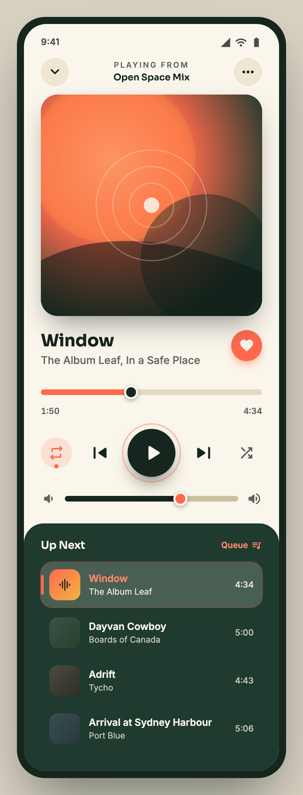

# Editorial Music Player (Now Playing)

A high-contrast editorial "Now Playing" mobile music player: a light cream top with a warm sunset gradient album art, bold track title + scrubber, dark high-contrast transport controls on cream circles, over a deep forest-green "Up Next" playlist with a coral now-playing highlight.



## Prompt

```text
{
  "summary": "A high-contrast editorial 'Now Playing' mobile music player: a light cream top half with a warm sunset-gradient album art, a bold track title, a scrubber, and dark high-contrast transport controls on cream circles, sitting over a deep forest-green 'Up Next' playlist with a coral now-playing highlight. Warm, legible, and deliberately not the cliche dark-neumorphic-purple player.",
  "style": {
    "description": "Warm editorial duotone: light cream 'now playing' over a deep forest-green playlist, one warm-coral accent, flat with restrained depth (no neumorphism).",
    "prompt": "Two stacked zones: a light cream top (#fbf6ec / sand #efe6d3) for 'now playing', and a deep forest-green panel (#16261f / moss #1f3a2e) for the playlist. ONE warm accent: coral #ff6a4d (-> #ff8a6e), with a gold #f2b441 highlight; NO indigo/violet/blue. Controls are solid and HIGH-CONTRAST (dark glyphs on cream circles, white on the dark play button) — never dark-on-dark. Flat with restrained shadow depth, not neumorphism. Fonts: Sora (display, track title) + Inter (UI/body). Every control clearly readable and optically centered."
  },
  "layout_and_structure": {
    "description": "Single mobile screen, two zones: status bar + top nav, album art, track meta, scrubber, transport controls, volume, then a dark 'Up Next' playlist.",
    "prompts": [
      {"part": "Top bar", "prompt": "Status bar; a row with a circular chevron-down (collapse), a centered 'PLAYING FROM' eyebrow + playlist name, and a circular '...' menu."},
      {"part": "Album art", "prompt": "A large rounded square with a warm sunset gradient (coral -> deep) and faint concentric rings radiating from a center dot — distinctive, ties to the coral accent."},
      {"part": "Track meta", "prompt": "Bold Sora track title (~24px, dark) + a muted artist/album subtitle; a circular coral like button on the right."},
      {"part": "Scrubber", "prompt": "A thin track with a filled coral portion and a draggable knob at the playhead; elapsed (left) and total (right) times below."},
      {"part": "Transport controls", "prompt": "A centered row on cream circles: shuffle, previous, a large dark circular play/pause (white triangle, intentional optical offset), next, repeat. All high-contrast and readable."},
      {"part": "Volume", "prompt": "A volume row with a low/high speaker icon at each end and a coral-thumb slider."},
      {"part": "Up Next playlist", "prompt": "A deep forest-green panel with an 'Up Next' header + a coral 'Queue' action; rows of upcoming tracks (thumbnail + title + artist + duration), the now-playing row highlighted with a coral title + subtle tint."}
    ]
  },
  "special_ui_components": [
    {"component": "Sunset gradient album art", "description": "The warm hero artwork.", "prompt": "A rounded-square album cover built from a warm coral-to-deep radial/linear gradient with faint concentric rings and a center dot; no photo needed."},
    {"component": "High-contrast transport row", "description": "Readable playback controls.", "prompt": "Transport icons as dark glyphs on cream circles, with a single large dark play button (white triangle); every control must read at a glance — no low-contrast or dark-on-dark."}
  ],
  "special_notes": "High contrast everywhere (no dark-on-dark controls). Keep the accent warm coral, never indigo/violet/blue. Optically center every icon. Real mobile-screen proportions (~390px-wide phone)."
}
```

**▶ Try it live → [https://superdesign.dev/library/editorial-music-player-now-playing](https://p.superdesign.dev/draft/aa288fc2-2f00-463c-9142-439dcca4eb3a)**

**Use it in your coding agent:** install the [Superdesign skill](https://github.com/superdesigndev/superdesign-skill), then:

```bash
superdesign get-prompts --slugs "editorial-music-player-now-playing" --json
```

*1 copies · 2,420 tries · Mobile Apps · General · mobile app, music player, now playing, editorial*
