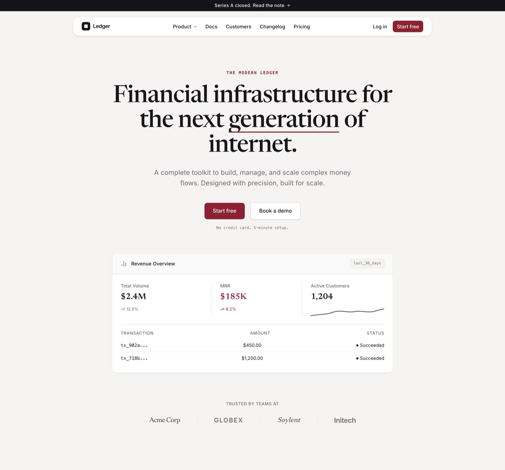

# Editorial-Restraint SaaS Product Landing Hero

A restrained, editorial-premium B2B SaaS product landing-page hero on a cool porcelain off-white canvas with ONE flat deep-oxblood accent as the only chroma (no gradient). A display SERIF headline (Newsreader) carries a big three-line hero line with a single oxblood underline tick over a quiet muted grotesk subtitle; a monospace is reserved for the uppercase oxblood eyebrow and inline labels. A thin near-black announcement bar tops a floating white rounded nav pill; two CTAs (a filled oxblood "Start free" + a white hairline "Book a demo") sit under the subtitle with a mono "no credit card" caption; and the signature move is a floating white "embedded product-card" (a Revenue Overview panel with three stat tiles, a tiny SVG sparkline, and a transaction table) lifted on a refined multi-layer soft shadow that reads as pixel-perfect embedded UI, with a trusted-by monochrome logo strip closing the hero. Whitespace-heavy, calm, expensive, precise. Reusable for any premium / restrained SaaS, fintech, or dev-tool landing hero with a single confident accent and an embedded product-card demo.



## Prompt

```text
{
  "summary": "A RESTRAINED, editorial-premium B2B SaaS product LANDING-PAGE HERO for a single 1440-wide desktop viewport into a scrolling page, built so a SINGLE flat deep-oxblood accent (#8a2233) is the entire personality against a cool porcelain off-white ground (#f5f4f2) and strictly neutral ink. Typography is a three-face system carrying hierarchy from FAMILY CONTRAST + size + weight: a high-contrast DISPLAY SERIF (Newsreader) does the big hero headline (the anti-slop taste signal, NOT Inter); a grotesk sans (Inter) does the subtitle, nav, buttons and labels; a MONOSPACE (Space Mono) is reserved ONLY for the uppercase oxblood eyebrow micro-label and small captions. TOP: a thin near-black #141317 ANNOUNCEMENT BAR with tiny centered white text ('Series A closed. Read the note ->'). Under it a FLOATING white rounded NAV PILL (a rounded-2xl white container with a 1px hairline #e3e1dd border + a soft shadow, NOT a full-bleed bar): a small dark mark + a #17161a 'Ledger' wordmark left; center text links (Product with a caret, Docs, Customers, Changelog, Pricing) in Inter 14px; a 'Log in' link + a small OXBLOOD 'Start free' pill right. CENTER HERO STACK, upper-mid, generous whitespace, centered: (1) a MONO UPPERCASE oxblood eyebrow ('THE MODERN LEDGER', ~12px / 1.5px tracking); (2) a big Newsreader SERIF H1 at ~68px / weight 500 / line-height ~1.05 / tight tracking in near-black #17161a on ~3 lines ('Financial infrastructure for the next generation of internet.'), with ONE key word ('generation') carrying a 3px OXBLOOD underline tick; (3) a muted Inter SUBTITLE at ~19px / 400 / line-height ~1.6 in #6b6a72, max ~600px, ~2 lines; (4) a ROW of two CTAs -- a filled OXBLOOD #8a2233 primary ('Start free', white, 15px/500, 8px radius) + a white secondary ('Book a demo', #17161a text, 1px hairline border, refined soft shadow, 8px radius); (5) a tiny MONO #6b6a72 caption ('No credit card. 5-minute setup.'). SIGNATURE, below the copy: a floating white 'EMBEDDED PRODUCT-CARD' -- a rounded white product-UI panel lifted off the ground on a REFINED MULTI-LAYER soft shadow (0 2px 3px -1px rgba(0,0,0,.08) + a 0 0 0 .5px rgba(23,22,26,.10) hairline ring + an inset 0 1px 0 rgba(255,255,255,.9) top highlight) with NO hard border, so it reads as embedded UI not a screenshot. Its content: a 'Revenue Overview' header row (a bar-chart glyph + title left, a mono 'last_30_days' chip right); a three-column stat row (Total Volume $2.4M with a neutral trend, MRR $185K rendered in the SINGLE oxblood accent with an oxblood trend, Active Customers 1,204 with a tiny inline-SVG sparkline in ink); and a two-row transaction TABLE (Transaction / Amount / Status headers, mono tx ids, dollar amounts, and small neutral status dots + 'Succeeded'). BOTTOM: a 'Trusted by teams at' strip -- a muted uppercase label over a row of monochrome wordmark logos separated by faint verticals. ONE accent color only -- oxblood #8a2233 in the eyebrow, the headline underline tick, the primary CTA + nav pill, and the single highlighted MRR metric; every other element is strictly neutral (#17161a ink, #6b6a72 muted, #e3e1dd hairline, #ffffff cards, #f5f4f2 ground). No gradient, no second hue, no photos, no glow. Whitespace-heavy, calm, expensive, editorial, precise. Responsive: on a narrow viewport the nav collapses to logo + Start-free pill, the headline steps down, the CTA row and the card's stat tiles stack, and the logo strip wraps.",
  "style": {
    "description": "Editorial-restraint, quiet-luxury SaaS-landing aesthetic -- the opposite of a busy or default-indigo product hero. A cool PORCELAIN off-white #f5f4f2 ground (a calm near-neutral with a faint cool undertone, NOT warm ivory) carries near-black #17161a ink, muted #6b6a72 secondary text, a #e3e1dd hairline, and white #ffffff surfaces. The single saturated element is a deep CLARET / OXBLOOD #8a2233 accent, held to just a few touchpoints (a mono eyebrow, one headline underline tick, the primary CTA + nav pill, and one highlighted metric); everything else is strictly neutral. Type is a three-face system where hierarchy comes from FAMILY CONTRAST, size and weight rather than color: a high-contrast DISPLAY SERIF (Newsreader) for the big headline is the deliberate taste move (a real designer reaches for a display serif; an AI defaults to Inter-only), a grotesk sans (Inter) for subtitle / nav / UI, and a MONOSPACE (Space Mono) reserved ONLY for the uppercase eyebrow micro-label and small captions. The shape language is flat and refined -- small 8px-radius pill buttons and, as the signature, a floating 'pixel-perfect embedded' product card lifted on a refined MULTI-LAYER soft shadow (a soft drop + a 0.5px hairline ring + an inset top highlight, NO hard border) so it reads as embedded UI. Chrome floats: a thin near-black announcement bar on top, a hairline-bordered white nav pill under it, a muted monochrome trusted-by strip at the bottom. No gradient anywhere, no second accent color, no photos, no glow -- whitespace-heavy, calm, expensive, editorial, precise.",
    "prompt": "Design a RESTRAINED, editorial-premium B2B SaaS product landing-page HERO for a single 1440-wide desktop viewport on a cool PORCELAIN off-white #f5f4f2 ground (NOT warm ivory), making ONE flat deep-oxblood #8a2233 accent the entire personality against strictly neutral ink. Build a three-typeface system where hierarchy comes from FAMILY CONTRAST + size + weight: a high-contrast DISPLAY SERIF (Newsreader) for a big centered H1 at ~68px / weight 500 / line-height ~1.05 / tight tracking in near-black #17161a (this serif is the taste signal -- do NOT set the headline in Inter), a grotesk sans (Inter) for a quiet ~19px / 400 muted #6b6a72 subtitle and all nav / buttons / labels, and a MONOSPACE (Space Mono) reserved ONLY for an uppercase oxblood eyebrow micro-label and small captions. Confine the accent to a few touchpoints only -- the mono eyebrow, a 3px oxblood underline tick behind ONE headline word, the primary CTA + the nav 'Start free' pill, and one highlighted metric inside the product card -- and keep every other element strictly neutral (#17161a ink, #6b6a72 muted, #e3e1dd hairline, #ffffff cards). Keep everything flat and refined: small 8px-radius pill buttons, and as the signature a floating 'pixel-perfect embedded' product card lifted on a refined multi-layer soft shadow -- 0 2px 3px -1px rgba(0,0,0,.08) + a 0 0 0 .5px rgba(23,22,26,.10) hairline ring + an inset 0 1px 0 rgba(255,255,255,.9) top highlight -- with NO hard border so it reads as embedded UI. Float the chrome (a thin near-black announcement bar, a hairline-bordered white nav pill, a muted trusted-by logo strip). NO gradient, NO second accent color, NO photos, NO glow -- whitespace-heavy, calm, expensive, editorial, precise. Make it fully responsive.",
    "keywords": [
      "editorial",
      "restraint",
      "quiet-luxury",
      "premium",
      "porcelain",
      "oxblood",
      "single-accent",
      "display-serif",
      "saas-landing",
      "hero"
    ]
  },
  "layout_and_structure": {
    "description": "A vertical scroll on porcelain, centered and whitespace-heavy: (1) a thin near-black full-width ANNOUNCEMENT BAR; (2) a FLOATING white rounded NAV PILL (mark + wordmark left, center caret links, 'Log in' + oxblood 'Start free' pill right); (3) a centered HERO STACK -- a mono oxblood eyebrow, a big Newsreader serif H1 with one oxblood underline tick, a muted subtitle, a row of two CTAs (oxblood primary + white hairline secondary), and a mono 'no credit card' caption; (4) the SIGNATURE floating white EMBEDDED PRODUCT-CARD (a 'Revenue Overview' panel: a header row, a three-column stat tile row with a tiny SVG sparkline, and a two-row transaction table) lifted on a refined multi-layer soft shadow; (5) a 'Trusted by teams at' monochrome logo strip closing the hero. On a narrow viewport the nav collapses to logo + 'Start free' pill, the headline steps down in size, the CTA row stacks full-width, the card's three stat tiles stack vertically, and the logo strip wraps.",
    "prompts": [
      {
        "part": "Announcement bar + floating nav pill",
        "prompt": "Top the page with a thin full-width near-black #141317 ANNOUNCEMENT BAR, tiny centered white text ('Series A closed. Read the note ->'). Just under it, pin a FLOATING white rounded NAV PILL -- a rounded-2xl white container with a 1px hairline #e3e1dd border and a soft shadow, centered with generous padding, NOT a full-bleed bar. Left: a small dark rounded mark + a #17161a wordmark ('Ledger'). Center: Inter 14px links (Product with a small caret, Docs, Customers, Changelog, Pricing). Right: a 'Log in' text link and a small OXBLOOD #8a2233 'Start free' pill (white text, 8px radius)."
      },
      {
        "part": "Eyebrow + serif headline + subtitle",
        "prompt": "Center a MONO UPPERCASE oxblood #8a2233 eyebrow ('THE MODERN LEDGER', ~12px / weight 700 / 1.5px tracking). Below it a big DISPLAY SERIF H1 in Newsreader at ~68px / weight 500 / line-height ~1.05 / tight tracking in near-black #17161a on ~3 lines ('Financial infrastructure for the next generation of internet.'), with ONE key word ('generation') wearing a 3px OXBLOOD underline tick sitting just under the baseline. Directly below, a centered SUBTITLE in Inter ~19px / weight 400 / line-height ~1.6 muted #6b6a72 at max ~600px, wrapping to ~2 lines. Do NOT set the headline in a sans -- the serif is the point."
      },
      {
        "part": "CTA row + caption",
        "prompt": "Under the subtitle, a ROW of two CTAs with generous whitespace: a filled OXBLOOD #8a2233 primary button ('Start free', white text, Inter 15px / weight 500, 8px radius) and a white secondary button ('Book a demo', #17161a text, 1px hairline #e3e1dd border, a refined soft shadow, 8px radius). Below the row, a tiny MONO caption in #6b6a72 ('No credit card. 5-minute setup.'). On a narrow viewport the two buttons stack full-width."
      },
      {
        "part": "Signature embedded product-card",
        "prompt": "Below the copy, center a floating white 'EMBEDDED PRODUCT-CARD' -- a rounded (12px) white panel lifted on a REFINED MULTI-LAYER soft shadow (box-shadow: 0 2px 3px -1px rgba(0,0,0,.08), 0 0 0 .5px rgba(23,22,26,.10), inset 0 1px 0 rgba(255,255,255,.9)) with NO hard border, max ~800px wide, fluid below. HEADER row (faint #fafafa fill, hairline bottom): a bar-chart glyph + a 'Revenue Overview' title left; a mono #6b6a72 'last_30_days' chip (hairline border) right. BODY: a three-column stat row -- (a) 'Total Volume' label + '$2.4M' in serif + a NEUTRAL muted trend '12.5%'; (b) 'MRR' label + '$185K' in serif rendered in the SINGLE oxblood accent + an oxblood trend '8.2%' (this is the one highlighted metric); (c) 'Active Customers' + '1,204' + a tiny inline-SVG SPARKLINE in ink (a small line path with a viewBox matching its coords, non-scaling stroke). Then a two-row transaction TABLE with uppercase muted headers (Transaction / Amount / Status), mono tx ids ('tx_902a...'), dollar amounts, and a small NEUTRAL ink status dot + 'Succeeded' per row. Keep the whole card strictly neutral except the single oxblood MRR figure."
      },
      {
        "part": "Trusted-by logo strip",
        "prompt": "Close the hero with a centered 'TRUSTED BY TEAMS AT' uppercase muted #6b6a72 label over a row of 4-5 monochrome wordmark logos (varied weights / a mix of serif and grotesk so they read as distinct brands), at reduced opacity + grayscale, separated by faint #e3e1dd vertical rules. The strip wraps on a narrow viewport."
      },
      {
        "part": "Responsive + build constraints",
        "prompt": "Pure CSS + inline SVG, NO JavaScript (freeze-safe + template-faithful). No h-screen / overflow-hidden app-shell wrapper -- the page grows to natural height. Fully responsive at mobile 390px and desktop 1440px with no horizontal overflow: use fluid widths and max-widths (never fixed px widths on top-level containers), collapse the nav to logo + Start-free pill on mobile, step the headline down, stack the CTA row and the card's stat tiles, and wrap the logo strip."
      }
    ]
  },
  "special_ui_components": [
    {
      "component": "Floating embedded product-card",
      "description": "The signature move -- a product-UI panel that reads as pixel-perfect embedded UI, lifted off the ground on a refined multi-layer soft shadow rather than a hard border.",
      "prompt": "A rounded (12px) white panel with NO hard border, lifted on a multi-layer shadow: box-shadow 0 2px 3px -1px rgba(0,0,0,.08), 0 0 0 .5px rgba(23,22,26,.10), inset 0 1px 0 rgba(255,255,255,.9). Inside: a faint-fill header row (glyph + title + a mono period chip), a three-column stat-tile row (label + a serif figure + a small trend, with exactly ONE tile rendered in the brand accent), a tiny inline-SVG sparkline with a viewBox and a non-scaling stroke, and a compact two-row transaction table (uppercase muted headers, mono ids, neutral status dots). Keep every inner element neutral except the single accented metric so it reads calm and real."
    },
    {
      "component": "Single-accent discipline (one oxblood)",
      "description": "The restraint engine -- exactly one saturated hue, held to a few touchpoints, everything else strictly neutral.",
      "prompt": "Pick ONE flat, confident accent (a deep claret / oxblood #8a2233) and use it in ONLY a handful of places: the mono uppercase eyebrow, a short underline tick behind one headline word, the primary CTA + the nav pill, and one highlighted metric inside the product card. Never introduce a second hue (no green trend chips, no colored status dots -- neutralize those to ink), never a gradient, never a glow. Every non-accent element is near-black ink, muted grey, a hairline, white, or the porcelain ground. This discipline is what makes a light hero read as premium restraint rather than a default template."
    },
    {
      "component": "Serif + grotesk + mono type stack",
      "description": "Hierarchy from family contrast -- a display serif headline as the taste signal, a grotesk for UI, a mono for micro-labels.",
      "prompt": "Set the big hero headline in a high-contrast DISPLAY SERIF (Newsreader) at a large size with tight tracking (this is the anti-slop move -- do NOT default to Inter for the headline). Set the subtitle, nav, buttons and labels in a grotesk sans (Inter). Reserve a MONOSPACE (Space Mono) strictly for the uppercase eyebrow micro-label and small captions. Let hierarchy come from the family contrast + size + weight rather than color, so the single accent stays the only chroma."
    },
    {
      "component": "Floating hairline nav pill",
      "description": "Chrome that floats -- a rounded white nav container over the ground rather than a full-bleed bar.",
      "prompt": "A rounded-2xl white container with a 1px hairline border and a soft shadow (NOT a full-width bar): a small dark mark + wordmark left, center caret-dropdown text links, and a 'Log in' link + a small accent 'Start free' pill right. Sits under a thin near-black announcement bar. On mobile it collapses to just the logo + the 'Start free' pill."
    },
    {
      "component": "Underline-tick headline emphasis",
      "description": "A restrained accent detail -- a short colored rule under one headline word instead of a highlight block.",
      "prompt": "Wrap ONE key word of the serif headline in a relative span with an absolutely-positioned 3px bar in the brand accent sitting just below the baseline, spanning the word width. Use it on a single word only; it is the one place the accent touches the headline, keeping the emphasis quiet and editorial rather than loud."
    }
  ]
}
```
