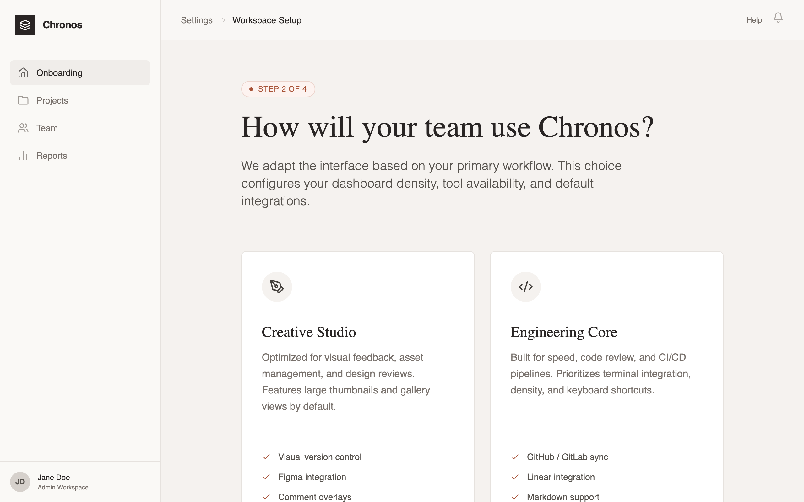

# Editorial SaaS Onboarding

An editorial SaaS onboarding experience featuring a calm, sophisticated aesthetic. It uses a muted warm stone palette with terracotta accents, high-contrast serif headlines (Crimson Pro) paired with clean sans-serif UI text (Inter). The layout follows a natural document flow within a product shell, avoiding scroll-locks or overlays. Suitable for premium B2B SaaS, design tools, publishing platforms, and luxury fintech applications that prioritize a confident, professional, and non-intrusive user experience.



## Prompt

```text
{
  "summary": "A sophisticated, scroll-based SaaS onboarding page embedded in a professional product shell. The design emphasizes an editorial feel through elegant typography, a warm neutral color palette, and high-quality whitespace management.",
  "style": {
    "description": "The style is 'Editorial Minimalist'—combining the structure of a modern application with the readability of a high-end magazine. It utilizes a warm neutral palette (Stone/Beige) instead of pure grays to create a 'calm' atmosphere. Key features include serif headings for a literary feel, tactile borders (1px) over drop shadows, and a muted terracotta accent for focus.",
    "prompt": "Create a design system with a warm, editorial aesthetic. \n\n### Colors:\n- **Backgrounds**: Main page bg: #F5F2EF (Stone-100); Sidebar bg: #FAF9F6 (Stone-50).\n- **Borders**: Subtle 1px lines using #E6E2DE (Stone-200).\n- **Typography**: Primary text #292524 (Stone-900); Secondary text #78716C (Stone-500).\n- **Accent**: Muted Terracotta #A85338 for primary actions and active states; #FDF3F0 for light accent backgrounds.\n\n### Typography:\n- **Headings**: Serif font 'Crimson Pro'. Sizes: 48px (h1), 24px (h2). Weight: 400 (regular) or 600 (semibold). Line-height: 1.15.\n- **UI & Body**: Sans-serif font 'Inter' or 'Satoshi'. Sizes: 14px (body/UI), 12px (labels), 18px (intro paragraphs). Weight: 400-500.\n\n### Components & Effects:\n- **Borders**: 1px solid #E6E2DE. Use rounded corners (8px) for cards.\n- **Shadows**: Minimize shadows. Use a subtle 'Stone-200' shadow only on primary CTAs (e.g., `shadow-lg shadow-[#E6E2DE]`).\n- **Animations**: Use 300ms transitions for hover states. Scale icons by 10% on card hover. No scroll-jacking."
  },
  "layout_and_structure": {
    "description": "A classic dashboard layout with a fixed sidebar and header, where the central onboarding content is a long, naturally scrollable column focused on a single-column container.",
    "prompts": [
      {
        "part": "Product Shell",
        "prompt": "Construct a 2nd-level layout. Sidebar: Fixed 256px width, border-right #E6E2DE, contains logo, vertical navigation links, and a bottom user profile section. Header: 64px height, sticky top, glassmorphism blur effect (backdrop-blur-sm) with 80% opacity bg #FAF9F6, containing breadcrumbs and notification icons."
      },
      {
        "part": "Onboarding Hero",
        "prompt": "Center a max-width 768px (max-w-3xl) container with vertical spacing of 64px (space-y-16). Start with a 'Step Indicator' badge: pill-shaped, bg #FDF3F0, text #A85338, all-caps 12px. Follow with an H1 Serif headline and a lead paragraph in 20px light sans-serif."
      },
      {
        "part": "Selection Grid",
        "prompt": "A 2-column grid of interactive cards. Cards must be min-height 400px. Unselected state: 1px border #E6E2DE, white bg. Hover state: border #D6D1CC. Selected state: 1px border #A85338 with a small checkmark icon badge in the top-right corner. Each card contains a 48px icon in a stone-100 circle, a serif title, a descriptive paragraph, and a bulleted list of features with terracotta checkmarks."
      },
      {
        "part": "Editorial Explanation",
        "prompt": "Include a section with 'prose' styling. Use Serif H2 titles and Sans-serif body text with generous leading (1.6). This section should explain implications of choices in 2-3 paragraphs, maintaining a professional and helpful tone."
      },
      {
        "part": "Interface Preview",
        "prompt": "A mock UI component. Card container with a 40px 'browser header' bar containing 3 dots. Inside, use abstract rectangles and lines in Stone-200 to represent a dashboard layout without using real content."
      },
      {
        "part": "Personalization & CTA",
        "prompt": "A footer section separated by a top border #E6E2DE. Include horizontal rows for 'Interface Density' (button toggle group) and 'Reduce Motion' (pill toggle switch). Finish with a primary CTA button: bg #292524, text #FFFFFF, 16px font, padding 16px 32px, featuring a right-arrow icon that translates 4px right on hover."
      }
    ]
  },
  "special_ui_components": [
    {
      "component": "Interactive Mode Card",
      "description": "Tall, vertically oriented cards used for primary selection.",
      "prompt": "Card implementation: white background, 1px border #E6E2DE, radius 8px, padding 32px. Inner elements: Circle icon (48x48, bg #F5F2EF), Serif Title (24px), Body text (14px, #78716C). Bottom section: border-top 1px #F5F2EF, list items with 4px gap. Transition: border-color 0.3s ease-in-out. Selected state: peer-checked:border-[#A85338] and peer-checked:ring-1."
    },
    {
      "component": "Density Toggle",
      "description": "A segmented control for UI density selection.",
      "prompt": "A container with bg #FFFFFF, 1px border #E6E2DE, 4px padding. Buttons inside have 8px radius. Active button: bg #F5F2EF, text #292524, subtle shadow. Inactive: text #78716C. Transition: all 0.2s ease."
    }
  ],
  "special_notes": "Must maintain a calm, quiet aesthetic; never use exclamation marks or 'hype' sales language. Ensure the page length is significant enough to require scrolling (min-height: 100vh). Use icons from a consistent thin-line set (like Lucide). Use natural document flow—do not hide content behind tabs if they can be scrolled through."
}
```

**▶ Try it live → [https://superdesign.dev/library/editorial-saas-onboarding](https://superdesign.dev/library/editorial-saas-onboarding?utm_source=github&utm_medium=prompt-repo&utm_campaign=prompt-library)**

**Use it in your coding agent:** install the [Superdesign skill](https://github.com/superdesigndev/superdesign-skill), then:

```bash
superdesign get-prompts --slugs "editorial-saas-onboarding" --json
```

*16 copies · 2,349 tries · Onboarding · SaaS · sass, onboarding, modern, editorial design system*
