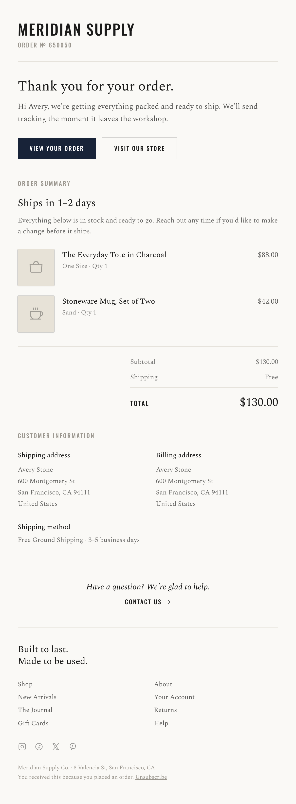

# Editorial Serif Receipt Email

A premium, editorial order-confirmation / receipt email in a centered 600px column: a condensed all-caps wordmark + order number, a serif 'Thank you for your order' headline, a solid-navy primary + outline secondary button pair, then an itemized order summary where each product row uses a thumbnail and a dotted leader line running to a right-aligned price, a subtotal / shipping / big Total block, a two-column shipping + billing address grid, a shipping method line, an italic help prompt, and a link-column footer with a serif tagline. Oswald condensed + Spectral serif, ink on warm paper with a single deep-navy accent. Reusable for any e-commerce receipt or transactional email.



## Prompt

```text
{"summary": "A premium editorial receipt / order-confirmation email in a centered ~600px column on warm paper. It leads with a condensed all-caps wordmark and a small order number, a serif 'Thank you for your order' headline + a short greeting, and a button pair (solid-navy 'View your order' + outline 'Visit our store'). An 'Order summary' section follows: a serif ship-status subhead, itemized product rows (a bordered thumbnail, the product name with a dotted leader line running out to a right-aligned price, and a variant / qty line), then a right-aligned subtotal / shipping / large Total block. Below: a two-column shipping + billing address grid, a shipping-method line, an italic 'Have a question?' help prompt with a Contact link, and a footer with a serif tagline, two link columns, social glyphs, and fine print.", "style": {"description": "Quiet-luxury, editorial e-commerce receipt. Warm paper background, near-black ink, muted grey micro-labels, and a single deep-navy accent for the primary button and Total. A condensed all-caps grotesque wordmark and tracked all-caps micro-copy pair with a readable serif for the headline, body, and product names. Thin hairline rules separate the phases; no heavy boxes or fills.", "prompt": "Design an order-confirmation / receipt email in a centered max-width 600px column on a warm paper surface (#faf9f6) over a soft neutral body (#eceae4). Typography pairs Oswald (condensed, 500-700, UPPERCASE, letter-spacing ~0.13-0.16em) for the wordmark, section labels, buttons, and Total label with Spectral (serif, 400-700, plus an italic) for the headline, body copy, product names, and prices. Palette: ink #1b1b1a text, paper #faf9f6 surface, a single deep navy #182338 for the primary button + emphasis, muted #9a968e for micro-labels, and hairline rules #e6e3dc. Separate each phase (greeting / items / totals / customer info / help / footer) with thin 1px rules. Buttons are rectangular (not pill): primary = solid navy with uppercase Oswald white label; secondary = 1px ink/25 outline. Product thumbnails are 74px rounded-sm tiles with a 1px ink/15 ring + a subtle shadow so they read against the paper. Keep it calm, editorial, and email-safe (no sticky nav)."}, "layout_and_structure": {"description": "Centered ~600px column, receipt flow: (1) wordmark + order number, (2) serif thank-you headline + greeting + button pair, (3) order summary = ship-status subhead + itemized rows + right-aligned totals, (4) two-column shipping/billing addresses + shipping method, (5) italic help prompt, (6) footer with serif tagline, two link columns, social row, fine print. On mobile the address grid stays 2-up and the dotted price leaders collapse gracefully (price stays right-aligned).", "prompts": [{"part": "Header", "prompt": "A ~30px Oswald 700 UPPERCASE wordmark with light letter-spacing, and under it a 12px Oswald 500 uppercase muted 'Order No 650050'. A hairline rule closes the header."}, {"part": "Thank-you block", "prompt": "A ~28px Spectral 700 headline 'Thank you for your order.', a 15.5px serif greeting at ink/75 (2 lines), and a button pair: solid-navy 'View your order' (uppercase Oswald white) + outline 'Visit our store'."}, {"part": "Order summary + line items", "prompt": "A muted uppercase Oswald 'Order summary' label, a 21px Spectral 700 ship-status subhead ('Ships in 1-2 days'), a short serif note, then itemized rows. Each row: a 74px bordered thumbnail tile (icon or product image) + a flex body where the serif product name is followed by a dotted leader line (border-dotted ink/25, hidden below sm) running to a right-aligned serif price, with a small ink/55 variant / qty line beneath."}, {"part": "Totals", "prompt": "A right-aligned max-280px block above a hairline: Subtotal and Shipping rows at ink/60, then a bordered-top row with an uppercase Oswald 'Total' label and a large ~24px Spectral 700 amount."}, {"part": "Customer information", "prompt": "A muted uppercase label, then a 2-column grid: 'Shipping address' and 'Billing address', each a serif bold label + a 13.5px ink/65 multi-line address. Below, a 'Shipping method' label + one line."}, {"part": "Help + footer", "prompt": "A centered italic serif 'Have a question? We're glad to help.' with an uppercase Oswald 'Contact us' link. Footer: a 19px Spectral 700 two-line tagline ('Built to last. Made to be used.'), a 2-column link list (Shop / New Arrivals / The Journal / Gift Cards ; About / Your Account / Returns / Help), a row of 4 social glyphs, and muted fine print with an Unsubscribe link."}]}, "special_ui_components": "Condensed all-caps wordmark; itemized product row with a dotted leader line connecting the product name to a right-aligned price; right-aligned subtotal / shipping / large Total block; two-column shipping + billing address grid; rectangular solid + outline button pair.", "special_notes": "This is a transactional EMAIL layout: a centered ~600px column, no sticky nav. Uses a generic store ('Meridian Supply') and sample order data so the spec ships without bundled assets; swap the wordmark, items, and addresses. The reusable value is the editorial receipt anatomy (dotted-leader line items + right-aligned Total + two-col addresses) and the warm-paper + serif + single-navy system."}
```
