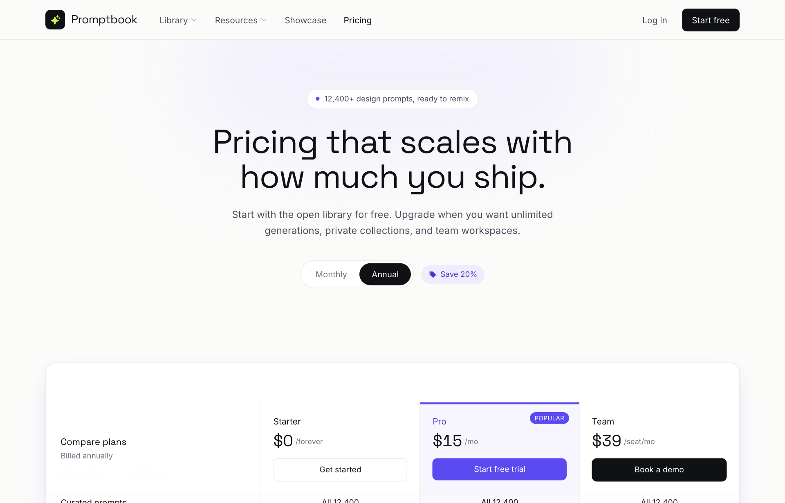

# Editorial Violet SaaS Pricing Matrix

A light, editorial SaaS pricing page led by a full-width grouped comparison matrix with a sticky 3-plan header, electric-violet accent, and a monthly/annual toggle.



## Prompt

```text
{"summary": "A light-mode, editorial SaaS pricing page for a design-prompt library ('Promptbook'). The signature move is its centerpiece: a single full-width feature-COMPARISON MATRIX (a bordered white card with a sticky 3-plan header and feature rows grouped into labeled sections) instead of the usual three floating price cards. Plus a paper-white canvas, near-black ink, a single electric violet accent, a lime-on-black logo mark, and a Space Grotesk / Inter / JetBrains Mono type stack. Copy structure: pill eyebrow, two-line display headline, sub, monthly/annual toggle, the matrix, then a two-column FAQ and a slim footer.", "style": {"description": "Clean, premium, editorial light theme. Off-white 'paper' page (#fbfbfa) with a very subtle dot-grain texture in the hero, hairline warm-grey borders (#eceae5) everywhere to draw the grid, near-black 'ink' text, and ONE saturated accent: electric violet (#5b4af0). The Pro/featured column is washed in a pale violet tint (violet-soft #efedfd). The logo mark is the one high-contrast pop: a black rounded square with a LIME (#c9f24a) sparkle glyph. Numbers use tabular-nums. Generous whitespace, restrained shadows (one soft violet-tinted glow on the featured card/matrix).", "prompt": "Build a light, editorial pricing page. Palette: page background paper off-white #fbfbfa; primary text ink-900 #0f1115; secondary inks #2b3038 (ink-700), #4a525f (ink-600), #6b7480 (ink-500), #9aa2ad (ink-400); hairline borders/dividers line #eceae5; cards/surfaces pure white #ffffff. Single accent = electric violet #5b4af0 (DEFAULT), with #efedfd (violet-soft) as a pale tint fill and #4536c4 (violet-deep) for hover/emphasis text. Reserve lime #c9f24a only for the sparkle glyph inside the black logo square. Typography: display/headlines in 'Space Grotesk' 700 with tight tracking (-0.02em), body/UI in 'Inter' (weights 400-700, note the unusual 450 and 500 micro-weights), and all data/section-eyebrows in 'JetBrains Mono' (uppercase, letter-spacing ~0.14em for section labels). Use tabular-nums on every price and quantity. Apply antialiasing and optimizeLegibility. Keep shadows almost invisible except one soft violet-tinted drop glow (box-shadow: 0 1px 2px rgba(15,17,21,.04), 0 12px 34px -16px rgba(91,74,240,.35)) on the featured surface. Add a faint radial dot-grain (radial-gradient dots, 22px grid, ~3.5% black) only behind the hero, plus a blurred violet-soft glow blob above the headline."}, "layout_and_structure": {"description": "Frameless, fully responsive web page on an off-white canvas, max content width ~1180px, generous horizontal padding. Vertical flow: sticky top nav -> hero (eyebrow pill, two-line headline, sub, billing toggle) -> the comparison matrix (the hero of the page) -> two-column FAQ -> slim footer. The matrix is the defining element: on md+ it is ONE bordered white card laid out as a CSS grid with a 1.35fr label column + three equal plan columns, a header row that sticks under the nav, and feature rows split into mono-labeled groups; below md it REFLOWS into three stacked plan cards (each plan's features become a bulleted check-list). Cards/columns reflow 3 -> 2 -> 1 across breakpoints; nav stays sticky.", "prompts": [{"part": "Sticky top nav", "prompt": "Sticky header (top:0, z-50) with a translucent paper background (paper/85) and backdrop-blur, a single bottom hairline border. Inside, a 1180px-max flex row, 64px tall: LEFT = logo lockup (8x8 black rounded square holding a lime sparkle icon + 'Promptbook' in Space Grotesk 700, 19px) followed by a horizontal nav (hidden below lg) of small 14px ink-600 links — 'Library' and 'Resources' each with a tiny caret, 'Showcase', and the current 'Pricing' shown in darker ink-900 500. RIGHT = a ghost 'Log in' text link (hidden on xs) and a solid black 'Start free' pill button (rounded-lg, white text, hover to ink-800)."}, {"part": "Hero / headline", "prompt": "Centered hero on the grain texture with the blurred violet glow blob above. Top: a rounded-full white pill with a hairline border and a tiny solid violet dot, reading '12,400+ design prompts, ready to remix'. Then a Space Grotesk 700 headline ~40px (54px on md), tight leading (1.06) and tracking (-0.02em), in two lines: 'Pricing that scales with / how much you ship.' Below, a ~16px ink-600 sub: 'Start with the open library for free. Upgrade when you want unlimited generations, private collections, and team workspaces.' All centered, constrained to ~680px / ~540px max widths."}, {"part": "Monthly / Annual billing toggle", "prompt": "Below the sub, a centered inline control: a rounded-full white segmented toggle (hairline border, p-1) with two pills 'Monthly' and 'Annual' — the active one is solid black with white text, the inactive is plain ink-500. Next to it, a small violet-soft pill with a tag icon reading 'Save 20%' in violet-deep 600. Wire it so toggling swaps the Pro/Team prices live: Annual shows $15 (Pro) / $39 (Team), Monthly shows $19 / $49, updating every price element on the page (both the matrix header and the mobile cards)."}, {"part": "Comparison matrix — sticky plan header (md+)", "prompt": "Wrap the whole matrix in a single rounded-2xl white card with a hairline border and the soft violet glow shadow, overflow hidden. First row is a sticky (top:16/under-nav) plan header as a CSS grid grid-template-columns: 1.35fr repeat(3, 1fr), each cell hairline-separated. Cell 1 = label block ('Compare plans' in Space Grotesk 600 + 'Billed annually' sub). Cells 2-4 = the three plans: STARTER ($0 /forever, outline 'Get started' button); PRO (highlighted — pale violet-soft tint fill, a 3px violet bar across the top, an uppercase 'Popular' violet badge top-right, name in violet-deep, '$15 /mo', a solid violet 'Start free trial' button); TEAM ('$39 /seat/mo', solid black 'Book a demo' button). Prices in Space Grotesk 700 ~26px tabular."}, {"part": "Comparison matrix — grouped feature rows (md+)", "prompt": "Below the header, list feature rows in the same 1.35fr+3 grid, every row hairline-bordered and the Pro (3rd) column tinted violet-soft/40 down its whole length. Break rows into three labeled GROUPS, each introduced by a full-width band (paper-tinted) with a JetBrains Mono uppercase tracked label + a small violet icon: 'Library & generation' (books icon), 'Export & handoff' (code icon), 'Collaboration & support' (users icon). Cells render three ways: a value string ('All 12,400', '40 / mo', 'Unlimited', '7 days', 'Community', 'Priority email', 'Dedicated'), a check icon (violet in the Pro column, ink-700 elsewhere), or a muted ink-400 minus for 'not included'. Sample rows: Curated prompts, AI generations (with a 'Renders from any prompt' subtext), Infinite canvas editor, Private collections, Remix history & versions, Export to PNG/SVG, React + Tailwind export, Coding-agent skill (CLI), Design tokens & theming, Team workspaces, Shared brand kits, SSO & SCIM, Support."}, {"part": "Comparison matrix — mobile stacked cards (< md)", "prompt": "Below md, hide the matrix grid and instead render three stacked plan cards (space-y-5): Starter, Pro, Team. Each is a rounded-2xl white card (Pro gets a 2px violet border, the violet glow shadow, and a 'Popular' badge), with plan name, big ~32px tabular price + cadence, the plan's CTA button (outline / solid violet / solid black respectively), and a check-list of its top ~5 features (violet checks on Pro, ink checks elsewhere, muted minus + greyed text for excluded items). End with a centered ~12.5px ink-500 reassurance line: 'All plans include the full open library. No credit card required to start.'"}, {"part": "FAQ", "prompt": "FAQ section on a white band with a top hairline border. Two-column grid (0.8fr / 1.2fr on md). LEFT = a Space Grotesk 700 ~28px heading 'Questions, answered.', a short ink-600 line ('Can't find what you need? Ping us and we'll sort it together.'), and a violet-deep 'Talk to us ->' link whose arrow nudges right on hover. RIGHT = a divided list (divide-y hairlines) of Q&A items, each with a 15px 600 question, a small ink-400 plus icon on the right, and a 14px ink-600 answer. Use real Q&A: what counts as an AI generation, switching plans/proration, is the library free, annual discount."}, {"part": "Footer", "prompt": "Slim footer on the paper background with a top hairline border, 1180px-max. A flex row (stacks on mobile): the small logo lockup (black square + lime sparkle + 'Promptbook'), a wrapped row of ink-600 nav links (Library, Showcase, Changelog, Docs, Privacy) that darken on hover, and a faint ink-400 copyright '© 2026 Promptbook Labs'."}]}, "special_ui_components": [{"component": "Full-width grouped comparison matrix", "description": "The page's centerpiece: instead of three floating price cards, one bordered white card holds a sticky plan header + feature rows arranged as a CSS grid, with features bucketed into labeled groups and the featured (Pro) column tinted down its full height.", "prompt": "Implement the comparison as a single CSS grid card, columns 1.35fr repeat(3,1fr). Keep the plan-header row sticky just below the nav. Tint the entire Pro column with violet-soft/40 so it reads as one continuous highlighted lane top to bottom. Separate feature buckets with full-width 'group' bands using JetBrains Mono uppercase labels + a small violet glyph. Cells support three render modes: value text, a check icon, or a muted minus. Below the md breakpoint, swap this whole grid for stacked per-plan cards with bulleted feature lists (3 -> 1 column reflow)."}, {"component": "Highlighted 'Popular' plan treatment", "description": "The Pro plan is visually elevated wherever it appears — a violet-soft tint, a 3px violet top bar (matrix) or 2px violet border (mobile card), an uppercase 'Popular' badge, violet plan name and violet check icons, and a solid violet CTA.", "prompt": "Give the Pro/featured plan a consistent treatment across desktop and mobile: pale violet-soft fill, a thin violet accent edge (3px top bar in the matrix column, 2px full border on the mobile card), a small rounded uppercase 'Popular' badge in solid violet/white at top-right, the plan name in violet-deep, violet check icons for its features, and a solid violet primary button (hover to violet-deep)."}, {"component": "Live monthly/annual price toggle", "description": "A segmented pill toggle (active = solid black) plus a 'Save 20%' tag that, on click, rewrites every Pro and Team price element on the page in real time.", "prompt": "Build a two-option segmented toggle (Monthly / Annual) where the active option is a solid black pill and the inactive is plain ink-500 text, paired with a violet-soft 'Save 20%' tag pill. On toggle, update all elements carrying a price class (e.g. .price-pro, .price-team) in both the matrix header and the mobile cards: Annual -> $15 / $39, Monthly -> $19 / $49."}, {"component": "Lime-on-black sparkle logo mark", "description": "Brand lockup: a small black rounded-square holding a lime sparkle icon, next to the 'Promptbook' wordmark in Space Grotesk. It is the only place the lime accent appears.", "prompt": "Create a logo lockup: an 8x8 (footer 7x7) black (#0f1115) rounded-lg square that centers a sparkle glyph in lime #c9f24a, followed by the wordmark 'Promptbook' in Space Grotesk 700 with tight tracking. Use lime ONLY here for a single point of warm contrast against the otherwise violet/ink palette."}], "special_notes": "FRAMELESS, fully responsive web page (not a fixed-size artboard): content centers in a ~1180px max-width column and everything reflows — the comparison matrix is a CSS grid (1.35fr + three equal plan columns) on md+ that collapses into stacked per-plan cards (3 -> 2 -> 1 column) below md, and the top nav stays sticky on scroll. Two sticky layers (nav at top:0, matrix plan-header at top:16) coexist. The whole page is one accent system: near-black ink on off-white paper, electric violet #5b4af0 as the sole UI accent (with the featured column tinted violet-soft), and lime reserved exclusively for the logo sparkle. Keep hairline #eceae5 borders on every cell/divider — the visible grid is core to the look. Fonts: Space Grotesk (display), Inter (UI/body, includes 450/500 micro-weights), JetBrains Mono (prices use tabular-nums and section eyebrows use uppercase mono with wide tracking). Replace the placeholder brand/prices/copy with your own; the transferable value is the matrix-led layout + this restrained editorial palette and type pairing."}
```

**▶ [Try it live →](https://superdesign.dev/library/editorial-violet-saas-pricing-matrix?utm_source=github&utm_medium=prompt-repo&utm_campaign=prompt-library)**

**Use it in your coding agent:** install the [Superdesign skill](https://github.com/superdesigndev/superdesign-skill), then:

```bash
superdesign get-prompts --slugs "editorial-violet-saas-pricing-matrix" --json
```

*0 copies · 2,385 tries · Pricing Pages · Dev Tools · pricing page, comparison-table, saas, light*
