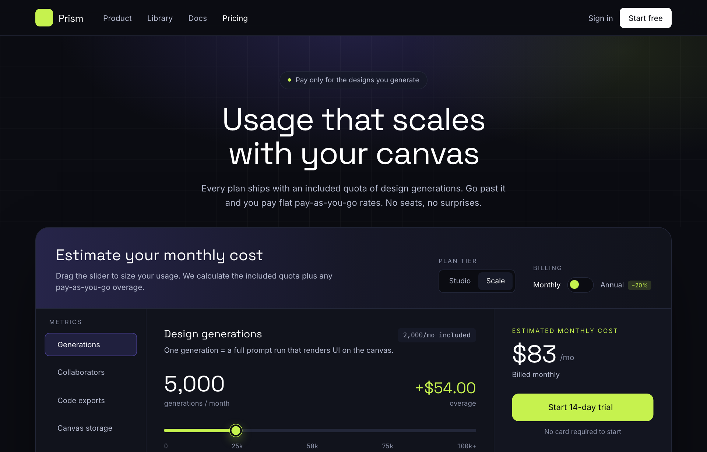

# Electric Dark Usage-Based Pricing Calculator

An electric dark dev-tool pricing page built around an interactive slider calculator that live-computes included quota plus tiered pay-as-you-go overage, with a lime accent, a highlighted plan card row, and an FAQ accordion.



## Prompt

```text
{"summary": "An electric dark, developer-tool pricing page anchored by an interactive usage-based cost calculator: a near-black UI with a faint engineering grid, soft iris/lime radial glows, and a giant rounded calculator panel where a lime range slider, a Studio/Scale tier toggle, and a monthly/annual switch drive a live volume readout, a highlighted pay-as-you-go rate table, and a sticky estimate card. Below it a 3-tier comparison card row (one highlighted 'Most popular' card) and a minimal FAQ accordion. The transferable value is the look (electric dark + lime accent + mono numerals) plus the usage-based-pricing structure (included quota + tiered overage calculator).", "style": {"description": "Electric dark dev-tool aesthetic: deep ink/near-black backgrounds with a subtle white engineering grid and dual radial glows (violet iris + acid lime), high-contrast white headings in a geometric display face, lime as the single high-energy accent, and JetBrains Mono for all numbers/prices to read like a console. Cards are large-radius panels with hairline borders and deep, soft drop shadows.", "prompt": "Use a dark, high-contrast 'electric dev-tool' palette. Exact colors: page/base background ink #0B0C12; panel surface #11131C; card surface #161927 (and translucent #161927 at ~40% for secondary cards); hairline borders #232739 (line); muted text #8A90A6 (mute); soft body text #B6BBD0 (soft); pure #FFFFFF for headings; primary accent lime #C6F24E (CTAs, slider thumb/track-fill, highlights, check icons); secondary accent iris violet #7C6CFF with a darker #5B4BE0, used in low-opacity gradient washes and active table-row tints. Selection highlight = lime background with ink text. Background texture: a faint white engineering grid (linear-gradient lines at ~3.5% white, 56px x 56px cells) plus two soft radial glows up top \u2014 a violet glow (~rgba(124,108,255,0.22)) centered and a lime glow (~rgba(198,242,78,0.10)) upper-right. Fonts: display/headings 'Space Grotesk' (weights 600-700, tight tracking); body/UI 'Inter' (400-600); ALL numerals, prices, and tabular data in 'JetBrains Mono'. Use large border radii (xl-3xl), thin #232739 dividers, and a deep soft shadow on the main calculator panel (0 40px 120px -40px rgba(0,0,0,0.8)). Uppercase micro-labels with wide letter-spacing (~0.14em) in muted gray for section eyebrows."}, "layout_and_structure": {"description": "Frameless, fully responsive web page on a max-width 1200px centered container. Top to bottom: sticky translucent nav, a centered hero, the headline interactive cost calculator (3-column inner grid that collapses on mobile), a trust line, a 3-up plan comparison card row (reflows 3->2->1 columns), a centered FAQ accordion, and a slim footer. Sticky nav stays pinned; cards reflow responsively.", "prompts": [{"part": "Sticky top nav", "prompt": "A sticky top header (sticky top-0, z-50) with a bottom hairline border and a blurred translucent ink background (bg-ink at ~80% + backdrop-blur). Inside a 1200px max-width row, 64px tall: left side has the logo (an 8x8 lime rounded-square tile with a ph:sparkle-fill icon in ink + the wordmark 'Prism' in white Space Grotesk 700) followed by inline nav links (Product, Library, Docs, Pricing) in 14px soft gray, hidden below md; the current page link ('Pricing') is white. Right side: a 'Sign in' text link and a solid WHITE pill button 'Start free' with ink text. Generous gap spacing."}, {"part": "Hero / headline", "prompt": "A centered hero section sitting on the grid background with the radial glow overlay. Centered stack: a small pill badge (rounded-full, hairline border, translucent card bg) reading 'Pay only for the designs you generate' with a tiny lime dot; a large display headline in white Space Grotesk 700, ~46-58px, tight leading (~1.05): 'Usage that scales with your canvas' (line break between 'scales' and 'with'); a 16px soft-gray subhead (max ~560px) explaining included quota + flat pay-as-you-go overage, 'No seats, no surprises.' Padding ~64px top."}, {"part": "Interactive cost calculator (the centerpiece pricing layout)", "prompt": "A single large rounded-3xl panel (bg-panel #11131C, hairline border, deep soft shadow) containing the whole calculator. (1) Header strip with a left-to-right iris-violet gradient wash (from-iris/20 via-iris/5 to-transparent): left = 'Estimate your monthly cost' (Space Grotesk 700, ~24-28px) + helper line; right = two controls \u2014 a 'Plan tier' segmented toggle (Studio | Scale) in a bordered pill on ink bg (active segment = card bg + white text), and a 'Billing' Monthly/Annual switch (a small pill toggle with a lime knob that slides; Annual shows a '-20%' lime chip). (2) Calculator body laid out as an inner grid lg:grid-cols-[200px_1fr_320px], collapsing to one column on mobile. LEFT RAIL: a 'Metrics' list of selectable category buttons (Generations [active: iris-tinted border+bg], Collaborators, Code exports, Canvas storage) each with a phosphor icon; on mobile this becomes a horizontal scroll row. CENTER: title 'Design generations' with a mono chip 'X/mo included'; a big two-up readout (left: huge mono volume number e.g. 2,000 with 'generations / month'; right: lime '+$0.00' overage); a custom RANGE SLIDER (6px track, lime fill on the left portion, 22px lime circular thumb with ink border + lime glow) with mono tick labels 0 / 25k / 50k / 75k / 100k+; then a 'Pay-as-you-go rates' RATE TABLE (rounded, hairline border, ink/60 bg) with columns 'Volume / mo' and 'Price / generation' in mono, where the active band row is tinted iris and tagged with a lime 'YOU' badge. RIGHT: a sticky 'Estimated monthly cost' card (translucent card bg) with a lime uppercase eyebrow, a huge white mono-style price '$29 /mo', a billed-monthly/annually note, a lime 'You save $X / year' line when annual, a full-width lime CTA button 'Start 14-day trial' with arrow icon + 'No card required to start', then an itemized cost breakdown list (Scale base, Generations w/ 'incl.'/'over quota' subtext, Collaborators, Canvas storage, each on a hairline-divided row with mono values) ending in a bold lime 'Total'. All money/volume values are computed live from the slider, tier, and annual toggle."}, {"part": "Trust line", "prompt": "A centered horizontal row of trust items below the calculator, 13px muted gray, each prefixed with a lime ph:check-circle-fill icon: 'Cancel anytime', 'Volume discounts auto-apply', 'SOC 2 Type II'. Wraps on small screens."}, {"part": "Plan comparison cards", "prompt": "A section on the darker ink bg with a centered heading 'Or pick a plan' (Space Grotesk 700, ~34px) and a soft-gray subhead. Below, a responsive card grid: grid-cols-1 sm:grid-cols-2 lg:grid-cols-3 (reflows 3->2->1). Three rounded-2xl cards: Studio ($9/mo, translucent card bg, hairline border, outline 'Choose Studio' button) and Enterprise (Custom, 'Contact sales' outline button) are standard; the MIDDLE 'Scale' card ($29/mo) is highlighted \u2014 lime-tinted border, an iris->card vertical gradient bg, a soft lime glow shadow, and a '-top' lime 'Most popular' ribbon. Each card has tier name (Space Grotesk 600), one-line audience descriptor, a big display price with '/mo', a CTA button (the Scale CTA is solid lime with ink text; others are bordered panel buttons), and a feature checklist using lime ph:check-bold bullets (generations/mo, collaborators, storage, exports, etc.)."}, {"part": "FAQ accordion", "prompt": "A narrow centered section (max-width ~760px) titled 'Pricing questions' (Space Grotesk 700, ~30px). A vertical list of <details> accordion items divided by hairlines (divide-line, top/bottom border): each summary is a 15.5px white 600 question with a muted ph:plus-bold icon on the right that rotates 45deg when open; the answer is 14px soft-gray relaxed-leading body text. First item open by default. Questions: 'What counts as a generation?', 'What happens if I exceed my quota?', 'Do unused generations roll over?'."}, {"part": "Footer", "prompt": "A slim footer on ink bg with a top hairline border, inside the 1200px container, flex row on desktop / stacked centered on mobile: left = small lime sparkle tile + 'Prism' wordmark; center = copyright '(c) 2026 Prism Design, Inc. All rights reserved.' in muted gray; right = social icon links (X, GitHub, Discord) in muted gray that brighten to white on hover."}]}, "special_ui_components": [{"component": "Usage cost calculator (slider-driven pricing estimator)", "description": "The defining element: an interactive estimator where a range slider sets monthly generation volume and the page live-computes included quota vs tiered pay-as-you-go overage, updating a big readout, the highlighted rate-table band, and the sticky estimate card + breakdown.", "prompt": "Build an interactive usage-based pricing calculator. State = { tier: 'studio'|'scale', annual: bool } plus a slider value 0-100. Map the slider non-linearly to a 0-100k volume (ease-in so the low end is usable, round to nearest 500). Each tier defines a base price, an included quota, and ordered overage rate bands (e.g. Scale: $29 base, 2,000 included, then $0.018 -> $0.012 -> $0.008 per generation as volume grows; Studio: $9 base, 500 included, $0.024 -> $0.016 -> $0.011). On any input: recompute overage by summing units * band price across bands above the included quota; total = (base + overage) * (annual ? 0.8 : 1). Update the huge volume readout, the lime '+overage' figure, the big '$X /mo' price, the billed-monthly/annually note, an annual 'You save $X/year' line, and the itemized breakdown (base, generations w/ 'incl.' or 'over quota' subtext, seats, storage, bold Total). Re-render the rate table each time and highlight the band the current volume falls into with an iris tint + a lime 'YOU' badge. Drive the slider's filled track via a left-to-right lime->#232739 linear-gradient at the current percent."}, {"component": "Custom lime range slider", "description": "A restyled native range input: thin pill track that fills lime up to the thumb, with a large lime circular thumb ringed in ink and a lime glow.", "prompt": "Style a native input[type=range]: 6px tall, 999px radius, base track #232739; webkit/moz thumb 22px circle filled lime #C6F24E with a 3px ink #0B0C12 border, a 1px lime ring, and a soft lime drop shadow (0 6px 18px rgba(198,242,78,0.35)); thumb scales ~1.12x on hover. Fill the consumed portion of the track via inline linear-gradient (lime to #232739 at the value percent). Add mono tick labels (0/25k/50k/75k/100k+) below."}, {"component": "Segmented tier toggle + annual switch", "description": "Two compact controls in the calculator header: a Studio|Scale segmented button group and a Monthly/Annual pill toggle with a sliding lime knob and a '-20%' chip.", "prompt": "Tier toggle: an inline bordered pill on ink bg holding two buttons (Studio, Scale); the active one gets card bg + white text, inactive is soft gray; clicking switches the tier and re-runs the calculator. Annual switch: a Monthly label, a small rounded-full toggle (h-7 w-12, ink bg, hairline border) with a 16px lime knob that translates ~20px right when on, an Annual label, and a small lime/15 '-20%' chip; toggling applies the 0.8 multiplier and reveals the savings line. Active labels go white, inactive soft gray; the switch uses a cubic-bezier transition on the knob."}, {"component": "Live rate table with active-band highlight", "description": "A pay-as-you-go price ladder where the row matching the current slider volume is tinted and tagged.", "prompt": "A bordered, rounded table titled 'Pay-as-you-go rates' (with the current tier name). Columns: 'Volume / mo' and right-aligned 'Price / generation', body in JetBrains Mono. Rows list each volume band and its per-generation price (or 'Included' for the quota band). The band containing the current slider volume gets an iris-tinted row (bg-iris/15, white text) and a small lime 'YOU' badge appended to the volume cell. Re-render on every change."}, {"component": "Highlighted 'Most popular' plan card", "description": "The middle plan card visually elevated with a lime-tinted border, iris gradient, glow shadow, and a ribbon.", "prompt": "Elevate the center plan card: lime/60 border, a top-to-bottom iris/10 -> card/40 gradient background, a soft lime glow shadow (0 0 60px -20px rgba(198,242,78,0.4)), and an absolutely-positioned lime ribbon at the top-left edge reading 'Most popular' in uppercase ink text. Its CTA is a solid lime button with ink text, vs bordered-panel buttons on the neighboring cards."}], "special_notes": "Frameless, fully responsive web page (not an app screen): single centered max-width 1200px container, sticky blurred nav, and grids that reflow (calculator inner grid 200px/1fr/320px -> single column with the metric rail becoming a horizontal scroll; plan cards 3 -> 2 -> 1 columns). Single high-energy accent discipline: lime #C6F24E carries all CTAs/active states/numbers-emphasis, iris #7C6CFF is reserved for low-opacity gradient washes and the active table-row tint. ALL numerals and prices use JetBrains Mono for the console feel; headings use Space Grotesk, body uses Inter. Built with Tailwind (CDN config maps the named colors), Phosphor icons via Iconify, and a small vanilla-JS controller that wires the slider, tier toggle, and annual switch to live price math. No em-dashes in copy."}
```

**▶ Try it live → [https://superdesign.dev/library/electric-dark-usage-based-pricing-calculator-20e556](https://p.superdesign.dev/draft/e3f0a688-7da8-4f75-87b7-2e7b2c4829c2)**

**Use it in your coding agent:** install the [Superdesign skill](https://github.com/superdesigndev/superdesign-skill), then:

```bash
superdesign get-prompts --slugs "electric-dark-usage-based-pricing-calculator-20e556" --json
```

*0 copies · 2,451 tries · Pricing Pages · Dev Tools · pricing page, saas, dark, developer-tool*
