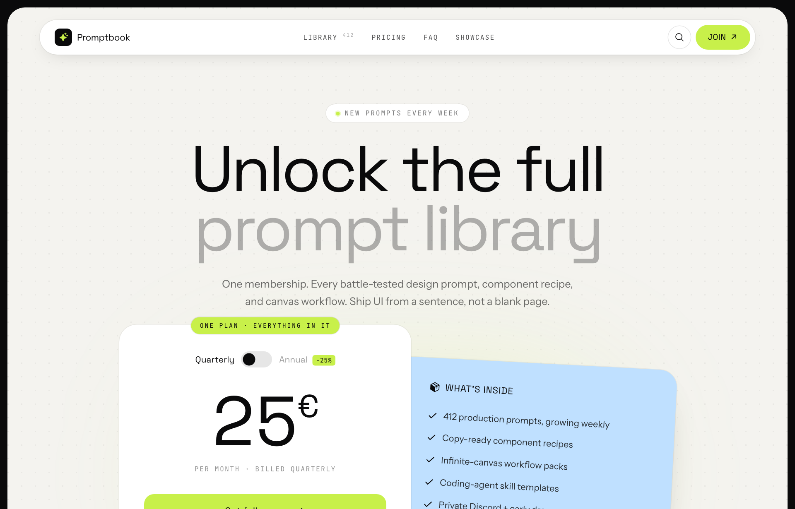

# Electric-Lime Single-Plan SaaS Pricing

A bold editorial single-plan pricing page with a giant toggling price card, a tilted sky-blue feature card, and one electric-lime accent on warm paper inside a charcoal frame.



## Prompt

```text
{"summary": "A single-plan SaaS pricing page in an editorial 'electric-lime on warm-paper' style: one giant centered price card with a quarterly/annual toggle, paired with a tilted sky-blue 'what's inside' card, all framed inside a rounded charcoal browser-like shell with a sticky pill nav. The transferable value is the bold display-type hierarchy, the warm-paper-over-ink frame, the lime accent system, and the offset two-card pricing composition.", "style": {"description": "High-contrast editorial dark-frame aesthetic: a near-black charcoal page background wraps a warm off-white 'paper' panel (subtle dot-grain texture), with one electric lime accent and a soft sky-blue secondary. Big tight-tracked Space Grotesk display type does the heavy lifting; mono labels in caps with wide letter-spacing add a technical/zine feel. Generous whitespace, fully rounded corners (pills + 28px cards), soft long-throw shadows, and a lime blur glow behind the price card.", "prompt": "Use a charcoal near-black page background (#0a0a0b, the 'ink' color) that frames an inner warm off-white 'paper' panel (#f4f3ef) with rounded-[28px] corners and a faint radial dot-grain texture overlay. Accent everything with one electric lime (#c8f04a) for CTAs, badges, the logo mark glyph, and a soft blurred glow; use a pale sky-blue (#bfe0ff) as the secondary surface for the features card. Text is the ink color at varying opacities (full ink for headings, ink/60 for body, ink/45 for mono meta). Cards and surfaces are pure white (#ffffff) sitting on the paper. Typography: 'Space Grotesk' (700 weight, tracking-[-0.04em], leading-[0.92]) for huge display headlines and the price numeral; 'Instrument Sans' for body copy; 'JetBrains Mono' for small UPPERCASE labels with wide letter-spacing (tracking 0.12em-0.18em). Pills and badges are fully rounded; cards use rounded-[28px] with soft long-throw shadows (e.g. 0 40px 80px -30px rgba(10,10,11,0.35)). Keep it airy, confident, slightly zine-like; no gradients except the lime blur glow."}, "layout_and_structure": {"description": "A frameless, responsive single-page pricing layout living inside a rounded charcoal 'browser shell'. Top to bottom: a sticky floating pill nav, a centered hero headline, the pricing centerpiece (a two-card offset composition: a tall white price card with billing toggle + a tilted sky-blue feature card overlapping behind it), a 3-item FAQ accordion, and a slim footer. It is fully responsive: the two pricing cards sit side-by-side on desktop and reflow/stack to a single column on mobile (the tilt straightens out), and the nav stays sticky.", "prompts": [{"part": "Page frame / shell", "prompt": "Wrap the entire page in a min-h-screen charcoal (#0a0a0b) background with small padding (p-2 to p-3), and place all content inside a single rounded-[28px] warm-paper (#f4f3ef) panel with overflow-hidden and a subtle dot-grain texture. This creates a 'framed canvas' look, like the site sits inside a soft charcoal browser chrome."}, {"part": "Sticky pill nav", "prompt": "A sticky top nav (top-0, z-50) that floats as a white fully-rounded pill (max-w-6xl, centered) with a soft shadow and a hairline ink/5 ring. Left: brand lockup = a small rounded ink square with a lime sparkle glyph + 'Promptbook' in Space Grotesk 700. Center (hidden on mobile): mono uppercase nav links with wide tracking ('LIBRARY' with a tiny superscript count, 'PRICING', 'FAQ', 'SHOWCASE'). Right: a circular ghost search icon button + a lime pill CTA 'JOIN' with an up-right arrow icon."}, {"part": "Hero headline", "prompt": "A centered hero (max-w-4xl): a small white pill eyebrow badge with a pulsing lime dot reading 'NEW PROMPTS EVERY WEEK' in mono caps, then a huge two-line Space Grotesk 700 headline using clamp() sizing (clamp(2.8rem,9vw,6.5rem)), very tight tracking and leading. First line full-ink ('Unlock the full'), second line faded to ink/30 ('prompt library') for a two-tone effect. Below, a max-w-xl supporting paragraph in ink/60 describing the membership."}, {"part": "Pricing centerpiece (offset two-card composition)", "prompt": "The hero of the page is a single-plan pricing block in a max-w-4xl container with a lime blur glow behind it (a blurred lime/25 ellipse, blur-[110px]). Lay out two cards in a desktop grid (md:grid-cols-[1.05fr_0.95fr]) that overlap, stacking to one column on mobile. CARD A (primary, z-20, white, rounded-[28px], heavy shadow): a small lime ribbon badge pinned to the top edge ('ONE PLAN · EVERYTHING IN IT'); a centered Quarterly/Annual toggle (pill switch with an ink knob that slides, plus a lime '-25%' tag on Annual); a giant centered price (Space Grotesk 700, clamp(4rem,14vw,7rem), tabular-nums) showing '25' with a smaller '€' superscript; a mono caps terms line ('PER MONTH · BILLED QUARTERLY'); a full-width lime CTA button 'Get full access' with arrow; and a small centered guarantee line with a shield-check icon ('7-day money-back guarantee. Cancel anytime.'). CARD B (secondary, z-10, sky-blue #bfe0ff, rounded-[28px], slightly tilted ~3deg, negative margin so it tucks behind/under Card A on desktop): header 'WHAT'S INSIDE' with a package icon, then a checklist (ph:check-bold icons) of 5 included items (e.g. '412 production prompts, growing weekly', 'Copy-ready component recipes', 'Infinite-canvas workflow packs', 'Coding-agent skill templates', 'Private Discord + early drops'). On mobile the tilt straightens to 0deg and cards stack."}, {"part": "Billing toggle behavior", "prompt": "The Quarterly/Annual switch is interactive: toggling it slides the ink knob, darkens the track to ink, swaps the price (25 -> 19), updates the terms line ('BILLED QUARTERLY' -> 'BILLED ANNUALLY'), and shifts the active/inactive label opacity. Active label is full ink, inactive is ink/40."}, {"part": "FAQ accordion", "prompt": "A centered max-w-3xl FAQ section titled 'Questions, answered' (Space Grotesk 700, clamp sizing). Below it, a list of native <details> accordion rows separated by ink/10 hairline dividers with top+bottom borders. Each summary is a Space Grotesk 600 question with a ph:plus-bold icon that rotates 45deg (to an x) when open; the answer is ink/60 body copy. Keep it to ~3 concise Q&As."}, {"part": "Footer", "prompt": "A slim footer with a top hairline border: left = the brand lockup again (smaller), center = a mono caps tagline with copyright ('DESIGN PROMPTS FOR PEOPLE WHO SHIP · © 2026'), right = a row of ink/45 social glyphs (X, Discord, GitHub) that darken on hover. Stacks vertically on mobile."}]}, "special_ui_components": [{"component": "Billing period toggle", "description": "A pill switch that flips the single plan between Quarterly and Annual, animating a knob and live-swapping the price, terms line, label emphasis, and showing a lime '-25%' savings tag on the Annual side.", "prompt": "Build a small pill toggle (w-12 h-6, rounded-full, ink/10 track) with a sliding ink knob (cubic-bezier ease). Flank it with two Space Grotesk 600 labels ('Quarterly' / 'Annual'); the inactive one is ink/40. On toggle: slide knob translateX(24px), darken the track to ink, change the big price numeral, rewrite the mono terms line, and append a lime '-25%' tag next to 'Annual'."}, {"component": "Offset / tilted card pairing", "description": "The signature composition: a white price card layered over a tilted sky-blue feature card so they overlap into one object, then flatten and stack on mobile.", "prompt": "Place a primary white price card and a secondary sky-blue feature card in a 2-col grid where the blue card is given a slight rotate(3deg) tilt and a negative left margin (md:-ml-8) so it tucks under the price card, with z-index layering (price card on top). Add responsive overrides so the tilt reduces at tablet width and resets to 0deg with normal stacking on mobile."}, {"component": "Pinned ribbon badge", "description": "A lime mono-caps pill badge pinned to the top edge of the price card to flag the single-plan offer.", "prompt": "Absolutely position a fully-rounded lime pill badge (mono caps, tracking-[0.18em], thin ink ring) so it straddles the top border of the price card (-top-3, centered via left-1/2 -translate-x-1/2). Use copy like 'ONE PLAN · EVERYTHING IN IT'."}, {"component": "Lime glow halo", "description": "A soft blurred lime ellipse behind the price card that makes the centerpiece glow off the warm paper.", "prompt": "Behind the pricing cards, add a pointer-events-none absolutely-centered ellipse of lime at ~25% opacity with a very large blur (blur-[110px]) and rounded-full, so a soft green halo bleeds out from behind the price card."}], "special_notes": "This is a FRAMELESS, fully RESPONSIVE single web page (not a fixed-size artboard): the rounded charcoal shell, sticky pill nav, and clamp()-based type all scale with the viewport, and the pricing/feature cards reflow from a side-by-side offset pair (3->2->1 effective columns across the page's grids) down to a single stacked column on mobile, where the blue card's tilt straightens to 0deg. It is a SINGLE-PLAN pricing model (one product, billing-period toggle only), so there is no multi-tier comparison table or per-tier columns. The whole vibe depends on three moves: the warm-paper-inside-charcoal frame, the one electric-lime accent against muted ink text, and the offset tilted two-card composition. Icons use the Phosphor (ph:) set via Iconify; fonts are Space Grotesk / Instrument Sans / JetBrains Mono."}
```

**▶ Try it live → [https://superdesign.dev/library/electric-lime-single-plan-saas-pricing](https://superdesign.dev/library/electric-lime-single-plan-saas-pricing?utm_source=github&utm_medium=prompt-repo&utm_campaign=prompt-library)**

**Use it in your coding agent:** install the [Superdesign skill](https://github.com/superdesigndev/superdesign-skill), then:

```bash
superdesign get-prompts --slugs "electric-lime-single-plan-saas-pricing" --json
```

*0 copies · 2,462 tries · Pricing Pages · Dev Tools · pricing page, saas, single-plan, editorial*
