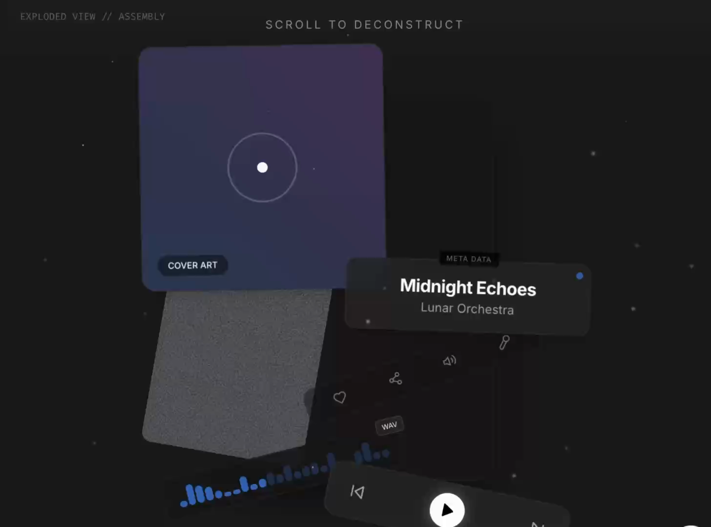

# "Exploded View" Assembly

A scroll-driven animation where a central product or UI element explodes into its constituent parts and then reassembles into a new layout. Perfect for 'how it works' or feature breakdown sections.



▶ **[Watch the animated preview](preview.mp4)** (MP4)

## Prompt

```text
### **The "Exploded View" Assembly**

Perfect for showing product components or "how it works."

> *"Pin a central product mockup. As the user scrolls, have the internal components (UI elements, icons, layers) 'explode' outwards in different directions. As they continue to scroll, have the components fly back together and 'lock' into a final, different layout."*
```

**▶ Try it live → [https://superdesign.dev/library/exploded-view-assembly](https://superdesign.dev/library/exploded-view-assembly?utm_source=github&utm_medium=prompt-repo&utm_campaign=prompt-library)**

**Use it in your coding agent:** install the [Superdesign skill](https://github.com/superdesigndev/superdesign-skill), then:

```bash
superdesign get-prompts --slugs "exploded-view-assembly" --json
```

*490 copies · 1,814 tries · Animations & Backgrounds · General · animation, scroll animation, landing page*
