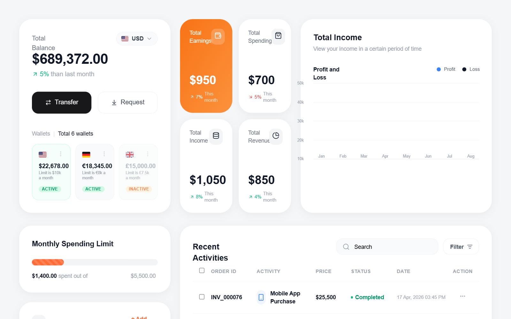

# Fintech Dashboard with Line Chart

A high-fidelity fintech dashboard featuring a clean, modern aesthetic with a focus on data visualization and personal finance management. Key features include a smooth SVG line chart with dual-axis data points, high-radius card components (32px), a multi-currency wallet system, and a detailed transaction table. The style is defined by its use of the 'Outfit' typeface, a vibrant orange (#FF6B35) and blue (#3B82F6) color palette against a light gray background (#F5F6F8). Suitable for banking apps, investment platforms, SaaS analytics, and crypto dashboards.



## Prompt

```text
{
  "summary": "Design a modern, professional fintech dashboard using a high-radius card grid. The layout prioritizes visibility of total balance, quick stats, a smooth bezier-curve line chart, and an itemized activity list. Use a light background with subtle shadows and large border radii to create a friendly yet sophisticated financial environment.",
  "style": {
    "description": "The style is characterized by wide-set typography (Outfit), rounded corners (32px on cards), and a palette of charcoal, bright orange, and tech-blue. It utilizes glassmorphism-lite (low opacity overlays) for status tags and interactive elements. Animations are implied through hover states and smooth transitions, while charts use SVG paths for fluid data representation.",
    "prompt": "Apply a 'Modern Fintech' theme. Typography: Use 'Outfit' from Google Fonts (weights 400, 500, 600, 700). H1: 36px/Bold, H3: 18px/SemiBold, Body: 14px/Medium. Color Palette: Background: #F5F6F8; Card Surface: #FFFFFF; Primary: #FF6B35 (Orange); Secondary: #3B82F6 (Blue); Text: #111827 (Zinc-900); Accents: #10B981 (Emerald) for growth, #EF4444 (Red) for decline. Shadows: 'card-shadow' 0 4px 20px rgba(0, 0, 0, 0.05). Borders: Use 2px border-width for secondary buttons. Radius: Parent cards at 32px, small UI elements (tags, inner buttons) at 12px-16px. Chart Style: Smooth SVG paths (cubic-bezier), stroke-width 2.5, with circular nodes (10px) featuring a 2px white border and shadow."
  },
  "layout_and_structure": {
    "description": "The layout is a 12-column grid system. The top section (Header/Hero) displays primary balance and metrics. The middle section holds a wide line chart and a 2x2 grid of small metric cards. The bottom section is split into a narrow sidebar for cards/limits and a wide main area for transaction history.",
    "prompts": [
      {
        "part": "Total Balance Card",
        "prompt": "Create a vertical card (lg:col-span-4). Header: 'Total Balance' label in gray-500 next to a pill-shaped currency switcher (USD with flag icon). Main: Large amount $689,372.00 in Zinc-900. Below: Emerald-500 growth percentage. Middle: Two primary buttons (Transfer: Zinc-900, Request: White/Bordered). Footer: A 'Wallets' section showing a 3-column grid of mini-wallet cards for USD, EUR, GBP, each with a flag icon and active/inactive status pills."
      },
      {
        "part": "Earning and Stats Grid",
        "prompt": "Implement a 2x2 grid of stats cards (lg:col-span-3). One card (Top-Left) must have a gradient background (orange-500 to orange-400) with white text. Other cards are white with gray icons. Each card contains: Title (text-sm), Icon (in a rounded-xl container), Big Number (text-3xl), and a small trend indicator (e.g., +7% this month)."
      },
      {
        "part": "Smooth Line Chart Section",
        "prompt": "Design a large chart card (lg:col-span-5). Header: Title 'Total Income' and subtitle. Legend: Color dots for 'Profit' (Blue) and 'Loss' (Black). Chart: An SVG area with horizontal grid lines. Profit Line: Solid blue #3b82f6 smooth path. Loss Line: Dashed zinc-900 path. Both lines must have circular nodes at monthly intervals (Jan-Aug). Labels: Y-axis (10k-50k) and X-axis (Months) in gray-400, 10px size."
      },
      {
        "part": "Monthly Spending and Cards",
        "prompt": "Vertical sidebar section. Top: Monthly Spending Limit card with a thick horizontal progress bar. The bar should have a diagonal stripe pattern (linear-gradient). Bottom: 'My Cards' horizontal slider showing credit card mockups (one Zinc-900, one Orange-500 gradient). Cards include Mastercard-style circles, chip icons, and masked numbers."
      },
      {
        "part": "Recent Activities Table",
        "prompt": "Large white card containing a search bar and filter button. Table: Headers in gray-400, uppercase. Rows: Checkbox, Order ID (Medium weight), Activity (Icon + Label), Price (Bold), Status (Pill with dot: Completed=Emerald, Pending=Red, In Progress=Orange), Date, and Action Menu. Hover state: Light gray #F9FAFB background."
      }
    ]
  },
  "special_ui_components": [
    {
      "component": "Progress Stripe Bar",
      "description": "A progress bar with a diagonal animated-feel stripe overlay.",
      "prompt": "Container: bg-gray-100, h-4, rounded-full. Fill: bg-[#FF6B35]. Overlay: Create a CSS class 'progress-stripe' with background-image: linear-gradient(45deg, rgba(255,255,255,.15) 25%, transparent 25%, transparent 50%, rgba(255,255,255,.15) 50%, rgba(255,255,255,.15) 75%, transparent 75%, transparent); background-size: 1rem 1rem."
    },
    {
      "component": "Credit Card Mockup",
      "description": "Miniature bank card visualization with glassmorphism status pill.",
      "prompt": "Dimensions: 280x170px. Base: Zinc-900. Elements: Top-left RSS icon; Top-right glassmorphism pill (bg-white/10, backdrop-blur) with 'ACTIVE' text. Center-left: Dual overlapping circles (red/orange) for issuer logo. Bottom: Card number masked with asterisks, expiry date, and CVV in small uppercase labels with 40% opacity."
    },
    {
      "component": "Smooth SVG Line Chart",
      "description": "Double line chart using SVG paths for organic, curved data representation.",
      "prompt": "SVG Viewbox: '0 0 100 100' with preserveAspectRatio='none'. Use <path> with 'C' (cubic bezier) commands rather than 'L' (line) to ensure smooth curves. Profit Path: #3b82f6, stroke-width 2.5. Loss Path: #18181b, dashed (stroke-dasharray='4 2'). Place absolute-positioned 10px circles at each data vertex with a 2px white border."
    }
  ],
  "special_notes": "MUST: Maintain the 32px border radius for all primary dashboard cards to ensure the visual signature of the design. MUST: Use the progress-stripe class for progress bars (diagonal stripes at 45deg). MUST NOT: Use sharp corners or harsh black colors; stick to #18181B or Zinc-900 for 'black' elements. MUST NOT: Over-clutter the line chart; keep only 5 horizontal grid lines."
}
```

**▶ Try it live → [https://superdesign.dev/library/fintech-dashboard-with-line-chart](https://superdesign.dev/library/fintech-dashboard-with-line-chart)**

*114 copies · 2,283 tries · tags: *
