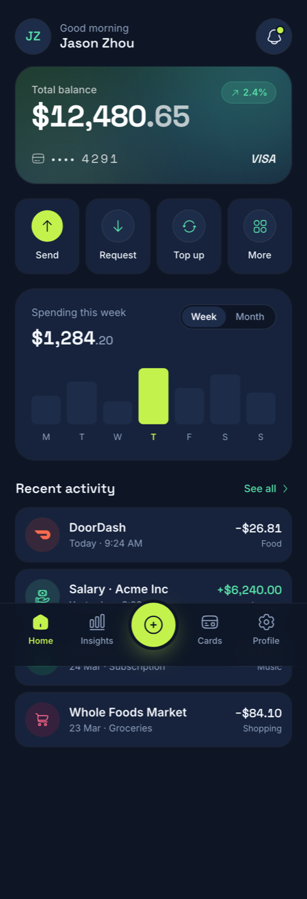

# Fintech Mobile App: Midnight Mint Navy Wallet Home

A dark premium fintech mobile app home screen (a neobank banking wallet dashboard) in deep ink-navy with a fresh mint and lime accent. A gradient balance hero card shows the total balance, a change pill, a masked card number and a VISA mark; a four-up quick-action row (Send, Request, Top up, More) sits above a Spending this week card with a seven-bar weekly chart, then a Recent activity transaction list with category-tinted icons and signed amounts. A sticky bottom tab bar with a raised center plus FAB anchors the screen. Flat and data-forward, not neon and not glassmorphism, set in Space Grotesk and Inter. Reusable for any banking, wallet, payments, budgeting or finance app home screen.



## Prompt

```text
{
  "summary": "A dark premium fintech mobile HOME screen (a neobank / banking wallet dashboard). It opens on a sticky top bar: a circular monogram avatar, a small 'Good morning' greeting over the user's name, and a bell with a lime notification dot. Below, a green-navy gradient balance hero card shows a 'Total balance' label, a large tabular figure ($12,480.65 with the cents dimmed), a small mint '+2.4%' change pill, a masked card number (four dots then 4291) tracked wide, and a VISA mark, lit by two soft blurred mint/lime glows for depth. A four-up quick-action row follows: Send on a filled lime disc, Request / Top up / More on outlined mint discs, each over a near-white label. Then a 'Spending this week' card with a Week/Month toggle and a seven-bar weekly chart whose Thursday (peak) bar is lime. A 'Recent activity' list with a mint 'See all' shows transaction rows: a category-tinted round icon, a merchant name + a muted relative date, and a right-aligned amount in Space Grotesk (income mint with +, expenses near-white with -) over a tiny category tag. A sticky bottom tab bar anchors the screen with a raised center lime plus FAB (Home active in lime; Insights / Cards / Profile muted). Frameless full-bleed mobile screen constrained to a 440px max-width, with the content scrolling between the two sticky bars.",
  "style": {
    "description": "Modern premium fintech, flat and data-forward: a deep ink-navy ground with soft elevated navy cards, a fresh mint + lime accent used sparingly, crisp near-white text, and Space Grotesk numerals for a confident financial voice. Not neon, not glassmorphism, not skeuomorphic.",
    "prompt": "Deep ink-navy ground (#0e1626, page backdrop #0a1120) with soft elevated cards (#17233c and #1d2c49) and hairline borders (white at ~6%). One fresh accent pair used sparingly: lime #c3f24d for the primary action, the active tab, and the single peak chart bar; mint #57e0a8 for positive numerals, secondary icons, and links. Near-white ink #f2f6ff, muted #8fa0bf for labels and dates, soft red #ff7a7a for expenses. The balance hero is a green-navy gradient (from #1c3a2f via #16324a to #14213b) lit by two large blurred mint/lime radial glows for depth, NOT a frosted-glass blur. Space Grotesk (500-700) for display, headings and every tabular numeral; Inter (400-600) for body and labels. Keep it flat and premium: generous radii (hero ~26px, cards ~24px, rows ~16px), no glassmorphism, no neon wash, no skeuomorphic texture. Set figures in tabular-nums so columns align."
  },
  "layout_and_structure": {
    "description": "A single mobile home screen between two sticky chrome bars: a sticky top bar, a scrolling content column (balance hero, quick actions, spend chart, recent activity), and a sticky bottom tab bar with a raised center FAB. Frameless, max-width 440px centered on large screens, reflows cleanly from 360px to tablet width.",
    "prompts": [
      {
        "part": "Sticky top bar",
        "prompt": "A sticky top bar (top-0, blurred navy background): on the left, a circular monogram avatar in a subtle ring; a two-line 'Good morning' label over a Space Grotesk user name. On the right, a circular bell button with a small lime notification dot ringed in the ground colour so it reads as a badge."
      },
      {
        "part": "Balance hero card",
        "prompt": "A rounded (~26px) green-navy gradient card with two large blurred mint/lime glows behind the content. Top row: a 'Total balance' label plus a small mint pill ('+2.4%' with an up-right arrow). Below, a large Space Grotesk balance ($12,480.65) with the cents dimmed. Bottom row: a card glyph + a masked number (four dots then 4291) tracked wide, and a VISA wordmark on the right."
      },
      {
        "part": "Quick actions",
        "prompt": "A four-column row of equal rounded tiles: Send (icon on a FILLED lime disc with a dark glyph), then Request, Top up and More (icons on outlined mint discs), each over a small near-white label. Equal widths, consistent gaps."
      },
      {
        "part": "Spending chart",
        "prompt": "A card titled 'Spending this week' with the weekly total in Space Grotesk and a segmented Week/Month pill toggle. Below, seven equal-width rounded vertical bars (Mon to Sun) at varied heights; the peak bar (Thursday) and its day letter are lime, the rest are muted navy. No axis chrome, just the day letters under each bar."
      },
      {
        "part": "Recent activity",
        "prompt": "A section header 'Recent activity' with a mint 'See all' link. A stack of transaction rows: a category-tinted round icon (a brand or category glyph), a bold merchant name over a muted relative date/category, and a right-aligned amount in Space Grotesk (income in mint with a leading +, expenses in near-white with a leading -) over a tiny muted category tag."
      },
      {
        "part": "Sticky bottom tab bar",
        "prompt": "A sticky bottom tab bar (bottom-0, blurred navy, hairline top border) as a five-slot grid: Home (active, lime icon and label), Insights, a raised center lime circular plus FAB (dark glyph, a ground-coloured ring, a soft lime glow) breaking the bar line, Cards, and Profile (all muted except Home)."
      }
    ]
  },
  "special_ui_components": [
    {
      "component": "Gradient balance hero with glow depth",
      "description": "A dark card that earns depth from light, not from glass.",
      "prompt": "A rounded green-navy gradient card (from #1c3a2f via #16324a to #14213b) with two large blurred radial glows (mint top-right, lime bottom-left) sitting behind the content, a thin white/10 ring, holding the balance figure, a change pill, a masked card number and a VISA mark. Depth comes from the gradient + glows; never a frosted-glass blur."
    },
    {
      "component": "Seven-bar weekly spend chart",
      "description": "A pure-HTML bar chart with one highlighted day, no SVG.",
      "prompt": "Seven flex-1 rounded bars in a fixed-height track, each height set inline as a percentage; all bars muted navy (#1d2c49) except the peak day, which is lime (#c3f24d) with a lime day letter. No SVG and no axis lines: the single letters under each bar are the only labels."
    },
    {
      "component": "Category-tinted transaction row",
      "description": "A scannable activity row colour-coded by category.",
      "prompt": "A rounded row: a 44px round icon on a per-category tinted wash (warm orange for food delivery, mint for income, green for a subscription, pink for shopping), a bold merchant name over a muted relative date, and a right-aligned Space Grotesk amount coloured by sign (mint + for income, near-white - for expenses) over a tiny muted category tag."
    },
    {
      "component": "Raised center-FAB tab bar",
      "description": "A five-slot tab bar with a lifted primary action.",
      "prompt": "A sticky bottom nav as a five-column grid; the middle slot is a raised (negative top margin) lime circular FAB with a dark plus glyph, a ground-coloured ring and a soft lime shadow, breaking the bar line. The active tab (Home) is lime; the other three are muted."
    }
  ]
}
```
