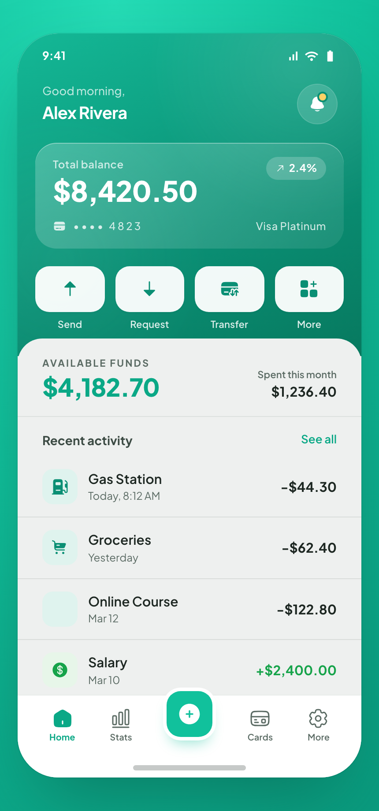

# Fintech Wallet — Mobile Home Screen

A mobile fintech wallet home screen: a teal gradient hero with a frosted balance card, four quick-action buttons, and a clean recent-activity list, on an off-white sheet with a center-FAB tab bar.



## Prompt

```text
{
  "summary": "A polished mobile fintech wallet home screen: a teal gradient hero with a greeting + frosted glass balance card, a row of four quick-action buttons (Send/Request/Transfer/More), an off-white sheet overlapping the hero with available funds + a recent-activity transaction list, and a bottom tab bar with a center FAB. Premium, trustworthy, not generic.",
  "style": {
    "description": "Flat-teal fintech: a teal gradient hero on an off-white sheet, mint accent numerals, neutral ink text, frosted-glass card with inset highlight.",
    "prompt": "Teal hero gradient (#14b896 -> #07795f) on an off-white sheet (#eef0ef / #e9ebea). Mint accent for positive numerals (#0aa886), neutral ink text (#1d2722 / #5b6b64), warm amber notification dot (#ffd166), green for income (#16a34a). A frosted-glass balance card with an inset top highlight creates depth; the off-white sheet overlaps the gradient hero for layered depth (not template flatness). Font: Plus Jakarta Sans (400-800). Real iPhone framing: status bar, home indicator, bottom tab bar with a raised center FAB (ring-4)."
  },
  "layout_and_structure": {
    "description": "Single mobile home screen: status bar, greeting + avatar, balance card, quick actions, off-white sheet with available funds + transaction list, bottom tab bar with center FAB.",
    "prompts": [
      {"part": "Header", "prompt": "Status bar; a 'Good morning,' line + bold user name (white on the teal hero), and a circular avatar with a notification dot whose ring matches the hero."},
      {"part": "Balance card", "prompt": "A frosted-glass card on the hero: 'Total balance' label, a large ~32px balance figure, a small change pill (e.g. up 2.4% MTD), masked card number, and card tier."},
      {"part": "Quick actions", "prompt": "Four equal frosted buttons in a row: Send, Request, Transfer, More, each an icon over a SOLID white semibold label (with a subtle text-shadow for legibility on the gradient)."},
      {"part": "Activity sheet", "prompt": "An off-white sheet overlapping the hero: 'Available funds' (mint figure) + 'Spent this month', then 'Recent activity' with a 'See all' link and rows of transaction tiles (icon + name + relative time, amount right-aligned; income green, expenses ink). Give 2-3 categories distinct tints so the list scans."},
      {"part": "Tab bar", "prompt": "A 5-item bottom tab bar (Home, Stats, [center FAB], Cards, More) on a fixed equal grid; the center FAB is raised and accent-filled."}
    ]
  },
  "special_ui_components": [
    {"component": "Frosted balance card", "description": "Glassmorphic card on the gradient.", "prompt": "A translucent white card over the teal hero with a subtle inset top highlight and soft shadow, holding the balance + meta."},
    {"component": "Center-FAB tab bar", "description": "Raised primary action.", "prompt": "A bottom tab bar whose middle slot is a raised, accent-filled circular FAB with a light ring, breaking the bar line."}
  ],
  "special_notes": "Keep one consistent date format. Make quick-action labels solid white (not low-opacity). Real mobile proportions (~390px-wide phone)."
}
```

**▶ Try it live → [https://superdesign.dev/library/fintech-wallet-mobile-home-screen](https://p.superdesign.dev/draft/63451e2f-914d-4d98-a710-24cc6b614303)**

**Use it in your coding agent:** install the [Superdesign skill](https://github.com/superdesigndev/superdesign-skill), then:

```bash
superdesign get-prompts --slugs "fintech-wallet-mobile-home-screen" --json
```

*1 copies · 2,314 tries · Mobile Apps · Finance & Crypto · mobile app, fintech, banking, wallet*
