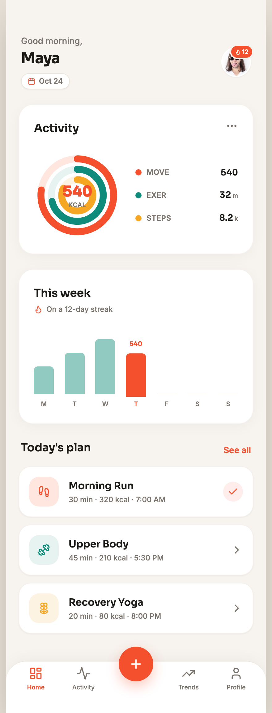

# Fitness Tracker Mobile App Home with Activity Rings

A warm, energetic home screen for a fitness or activity tracker mobile app on a warm-porcelain canvas with a single dominant coral accent. Concentric coral, teal and amber progress rings track move, exercise and steps; a seven-day bar chart highlights today and the current streak; a today's-plan list shows per-type-tinted workout rows; and a sticky tab bar carries a raised coral start-workout button. Flat-modern, Sora + Inter, fully responsive. Ideal for fitness, health, wellness, workout and activity-tracking apps.



## Prompt

```text
{
  "summary": "A warm, energetic mobile HOME screen for a fitness / activity tracker app on a warm-porcelain ground with one dominant coral accent. It opens with a 'Good morning,' greeting + a bold user name, a date pill, and a circular avatar with a small coral streak badge. Below, an Activity card holds a large concentric three-ring progress cluster (outer coral Move, middle teal Exercise, inner amber Steps) with the headline calorie number centered in the rings and a three-row dot + label + value legend beside them. A 'This week' card shows seven vertical day bars (muted teal, today coral and taller with its value labelled) and a streak caption. A 'Today's plan' list shows workout rows with per-type-tinted rounded icon tiles (coral run, teal strength, amber yoga), the workout name, a muted duration / kcal / time sub-line, and a right chevron (one row marked done). A sticky bottom tab bar carries Home / Activity / a raised coral center start-workout FAB / Trends / Profile. Warm, athletic, clean, copy-worthy.",
  "style": {
    "description": "Flat-modern warm fitness UI on a LIGHT warm-porcelain ground with a single dominant coral accent, a deep-teal cool support, and an amber tertiary. White cards with soft single-layer shadows, Sora display + Inter body, big tabular activity numbers. No indigo/violet, no glassmorphism, no clay.",
    "prompt": "Warm-porcelain ground (#f7f3ee), white cards (#ffffff), near-black warm ink (#1c1a17), muted ink (#7a746c), hairline (#ece6dd). ONE dominant coral accent (#f5502e) held to about six real touchpoints (the outer progress ring, the center-FAB, the primary link/CTA, the active tab, today's bar, the streak badge), a soft coral wash (#ffe6de) for tinted tiles, a deep-teal cool support (#0e8b7a) and an amber tertiary (#f5a623) for the other two rings and workout icons. Type: Sora 600-800 for display and big tabular activity numbers, Inter 400-600 for body and labels; two families only. Flat-modern with soft single-layer card shadows (not glass, not clay). Real mobile framing (about a 420px-wide column), FRAMELESS and responsive, with a sticky top header and a sticky bottom tab bar."
  },
  "layout_and_structure": {
    "description": "A single mobile home screen, top to bottom: (1) status area + header (greeting, name, date pill, avatar with streak badge); (2) an Activity card with a concentric three-ring progress cluster + legend; (3) a 'This week' card with a seven-day bar strip; (4) a 'Today's plan' workout list; (5) a sticky bottom tab bar with a raised center FAB. Constrained to about a 420px column, fluid to 390px, centered on desktop.",
    "prompts": [
      {
        "part": "Header",
        "prompt": "A small muted 'Good morning,' line over a bold Sora user name ('Maya'); a small pill showing the date ('Oct 24') with a calendar glyph; top-right a circular avatar with a small coral streak badge (a flame + a number) overlapping its corner."
      },
      {
        "part": "Activity card",
        "prompt": "A white rounded card titled 'Activity'. On the left, a concentric THREE-ring progress cluster in pure inline SVG (outer coral Move, middle teal Exercise, inner amber Steps, rounded caps) with the headline calorie number centered big ('540' + a small 'KCAL'). On the right, a three-row legend, each row a colored dot + a caps label (MOVE / EXER / STEPS) + a bold value (540 / 32 m / 8.2 k)."
      },
      {
        "part": "This week",
        "prompt": "A white rounded card titled 'This week' with a small flame + 'On a 12-day streak' caption, then a seven-column bar strip Mon-Sun: muted-teal bars of varying height for past days, TODAY's bar coral and taller with its value ('540') labelled above it, and future days shown as faint baselines. Day letters sit under each bar."
      },
      {
        "part": "Today's plan",
        "prompt": "A 'Today's plan' section header with a coral 'See all' link, then three workout rows on white cards: a rounded per-type-tinted icon tile (soft-coral run, soft-teal strength, soft-amber yoga), the workout name in Sora 600, a muted 'duration . kcal . time' sub-line, and a right chevron; the first (completed) row shows a coral check in a soft-coral circle instead of a chevron."
      },
      {
        "part": "Tab bar",
        "prompt": "A sticky bottom tab bar with five slots: Home (active, coral icon + label), Activity, a raised coral circular center FAB with a white '+' (start a workout, breaking the bar line with a soft glow), Trends, Profile; icons over tiny labels."
      }
    ]
  },
  "special_ui_components": [
    {
      "component": "Concentric three-ring activity cluster",
      "description": "The signature fitness progress summary.",
      "prompt": "A pure inline-SVG cluster of three concentric progress rings sharing a center, each a rounded-cap arc drawn with stroke-dasharray / stroke-dashoffset over a faint track: outer coral (Move kcal), middle teal (Exercise minutes), inner amber (Steps). Center the headline metric big (Sora 800 '540' + a small 'KCAL'). Give the SVG an explicit viewBox so it scales cleanly."
    },
    {
      "component": "Weekly bar strip with today highlight",
      "description": "A seven-day activity trend.",
      "prompt": "A flex row of seven day columns of equal width and full card height; each column has a rounded-top bar with a definite height (percent of the row height) and a day letter beneath. Past days are muted teal; TODAY is coral, taller, with its value labelled above; future days are faint hairline baselines."
    },
    {
      "component": "Per-type-tinted workout row",
      "description": "A scannable plan / session list item.",
      "prompt": "A white card row: left a rounded-square icon tile tinted by workout type (soft-coral for run, soft-teal for strength, soft-amber for yoga) holding a matching line icon; the workout name in Sora 600; a muted 'duration . kcal . time' sub-line; and a right chevron, or a coral check in a soft-coral circle if the workout is done."
    },
    {
      "component": "Center-FAB tab bar",
      "description": "A raised primary start-workout action.",
      "prompt": "A sticky bottom tab bar whose middle slot is a raised, coral-filled circular FAB with a white '+' and a soft glow, breaking the bar line; the four other slots are icon-over-label tabs with the active tab in coral."
    },
    {
      "component": "Streak badge",
      "description": "A gamified consistency marker.",
      "prompt": "A small coral pill (a flame glyph + a number, e.g. '12') overlapping the corner of the circular avatar, signalling a streak of consistent days."
    }
  ]
}
```

**▶ [Try it live →](https://superdesign.dev/library/fitness-tracker-mobile-app-home-with-activity-rings?utm_source=github&utm_medium=prompt-repo&utm_campaign=prompt-library)**

**Use it in your coding agent:** install the [Superdesign skill](https://github.com/superdesigndev/superdesign-skill), then:

```bash
superdesign get-prompts --slugs "fitness-tracker-mobile-app-home-with-activity-rings" --json
```

*0 copies · 0 tries · Mobile Apps · Health & Wellness · mobile app, fitness, health, activity tracker*
