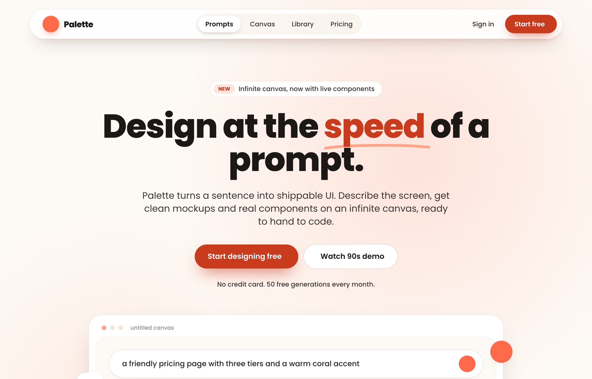

# Floating Pill Coral navbar — legibility fixes applied

A sticky floating-pill navbar in a warm coral-and-cream palette: a blurred white rounded-full bar floating inset from the top, sparkle logo, a centered inner pill link group with a raised white active pill, and a solid coral Start free CTA.



## Prompt

```text
{"summary": "A sticky floating-pill navbar in a warm coral-and-cream palette: a white, blurred, rounded-full bar that floats inset from the top of the page, with a sparkle logo on the left, a centered inner pill group of nav links (the active link sits on its own white sub-pill), and right-side Sign in + a solid coral Start free CTA. Built on Poppins with a soft, friendly shadow system and a responsive collapse to a hamburger + dropdown card under lg.", "style": {"description": "Warm, friendly, modern-SaaS aesthetic on a cream canvas (#fdfaf6) with a single coral accent ramp. Rounded-everything (pill radius 999px), heavy Poppins weights for branding, generous soft shadows, and a subtle grain dot texture. The look reads approachable and premium rather than corporate.", "prompt": "Use a warm coral + cream design system on a cream page background #fdfaf6. Typeface: Poppins (Google Fonts), weights 300-800; use extrabold (800) for the logo wordmark and headings, semibold (600) for the primary CTA and active nav link, medium (500) for secondary nav links. Color ramp - coral: 50 #fff4f0, 100 #ffe6dd, 200 #ffc9b8, 300 #ffa488, 400 #ff855f, 500 #ff6b4a, 600 #f04d29, 700 #c93b1d; cream: 50 #fdfaf6, 100 #f8f1e9, 200 #f1e6d9; ink (text): 700 #3a3330, 800 #2a2422, 900 #1c1816. Radius is pill (999px) for the bar, logo badge, links, and buttons. Soft layered shadows - bar uses '0 18px 40px -18px rgba(40,28,22,0.28), 0 6px 16px -10px rgba(255,107,74,0.25)' plus a 1px ring of ink-900 at 5% opacity. Body text is ink-700; primary headings ink-900. Add a barely-visible grain dot texture (radial-gradient(rgba(255,107,74,0.05) 1px, transparent 1px) at 22px tile) behind hero areas. Visible keyboard focus: a coral focus ring (box-shadow 0 0 0 2px #fdfaf6, 0 0 0 4px #c93b1d) on links/buttons, swapping ring color per surface (light coral on dark sections, white on coral bands)."}, "layout_and_structure": {"description": "A fixed, full-width container pinned to the top (z-50) with horizontal padding (16px, 24px at sm) and top padding (16px, 20px at sm) so the bar floats inset from every edge. Inside it, a centered max-w-6xl nav bar uses a three-zone flex row: logo (left, shrink-0), centered link pill group (hidden below lg), and right actions (shrink-0). The active link is a white sub-pill inside a cream-tinted inner pill track. Below lg the center group disappears and a hamburger reveals a rounded dropdown card just under the bar.", "prompts": [{"part": "Floating sticky container", "prompt": "Wrap the whole navbar in a `fixed top-0 inset-x-0 z-50` div with `px-4 sm:px-6 pt-4 sm:pt-5` so the bar never touches the viewport edges and floats as the page scrolls underneath."}, {"part": "The pill bar itself", "prompt": "A `mx-auto max-w-6xl` nav with `bg-white/85 backdrop-blur-xl`, the soft pill shadow, a `ring-1 ring-ink-900/5`, fully rounded (border-radius 999px), asymmetric padding `pl-5 pr-3 sm:pl-7 sm:pr-3 py-2.5` (more left padding so the logo breathes, tighter right so the CTA hugs the edge), laid out as `flex items-center justify-between`."}, {"part": "Logo (left zone)", "prompt": "An anchor with `flex items-center gap-2.5 shrink-0`: a 36x36 (h-9 w-9) coral-500 (#ff6b4a) rounded-full badge holding a white sparkle icon (ph:sparkle-fill) with a coral drop shadow, next to an extrabold tracking-tight 18px wordmark in ink-900."}, {"part": "Centered link group (inner pill)", "prompt": "A `hidden lg:flex items-center gap-1` track with `bg-cream-100/70 rounded-pill p-1`. The active link is its own white sub-pill: `px-4 py-2 text-sm font-semibold text-ink-900 rounded-pill bg-white` with a tiny inset shadow. Inactive links are `px-4 py-2 text-sm font-medium text-ink-700 rounded-pill hover:text-ink-900` and get an animated coral underline on hover (a 2px coral bar that scales in from center via transform scaleX)."}, {"part": "Right actions zone", "prompt": "A `flex items-center gap-2 shrink-0` group: a ghost `Sign in` link (`hidden sm:inline-flex px-4 py-2 text-sm font-medium text-ink-800 rounded-pill hover:bg-cream-100`), then the primary CTA - a `Start free` button `bg-coral-700 hover:bg-coral-600 text-white text-sm font-semibold px-4 sm:px-5 py-2.5 rounded-pill` with a coral drop shadow and `active:scale-[0.98]`, ending in a small `ph:arrow-right-bold` icon. After it, a `lg:hidden` 40x40 hamburger button (ph:list-bold) that toggles the mobile menu."}, {"part": "Responsive mobile dropdown", "prompt": "Below lg, hide the center group and show a `lg:hidden hidden` dropdown card (`mx-auto max-w-6xl mt-2 bg-white/95 backdrop-blur-xl shadow-soft ring-1 ring-ink-900/5 rounded-3xl p-3`) that the hamburger toggles. It stacks the nav links as full-width `block px-4 py-3 rounded-2xl text-sm font-medium hover:bg-cream-100` rows, and reveals the Sign in link below sm. Wire a tiny script: clicking the menu button toggles `.hidden` on the dropdown; clicking any link inside re-hides it."}]}, "special_ui_components": [{"name": "Pill-in-pill active state", "prompt": "Render the navigation links inside a cream-tinted rounded track, and give the current page its own solid white pill with a soft inset shadow so the active item reads as physically raised inside the group, instead of using an underline or color change alone."}, {"name": "Animated coral hover underline", "prompt": "On inactive nav links, add a 2px coral (#ff6b4a) underline pinned 6px from the bottom and inset 12px left/right, hidden by default via transform scaleX(0) from center, transitioning to scaleX(1) on hover over .25s ease."}, {"name": "Coral arrow CTA", "prompt": "Primary CTA is a deep-coral (coral-700 #c93b1d) pill button with white semibold label, a trailing arrow-right icon, a coral-tinted drop shadow, hover lightening to coral-600 (#f04d29), and a subtle active:scale-[0.98] press."}, {"name": "Logo sparkle badge", "prompt": "Brand mark is a 36px coral-500 rounded-full badge with a centered white sparkle (Phosphor ph:sparkle-fill) and a soft coral glow shadow, paired with an extrabold Poppins wordmark."}], "special_notes": "Icons are Phosphor via Iconify (e.g. ph:sparkle-fill, ph:arrow-right-bold, ph:list-bold). Pill radius is a literal 999px token applied to the bar, badge, links, and buttons. The bar floats inset from the top using a fixed outer wrapper with its own padding rather than sitting flush. Legibility fixes vs the source reference: body/nav text uses warm ink tones (ink-700/800/900) for sufficient contrast on white and cream, the active link is reinforced with both a white pill and weight change, and every link/button has an explicit, surface-aware coral focus ring for keyboard users. Layout is responsive: the centered link group collapses below lg into a hamburger-triggered dropdown card, and the Sign in link hides below sm."}
```

**▶ Try it live → [https://superdesign.dev/library/floating-pill-coral-navbar-legibility-fixes-applied](https://superdesign.dev/library/floating-pill-coral-navbar-legibility-fixes-applied?utm_source=github&utm_medium=prompt-repo&utm_campaign=prompt-library)**

**Use it in your coding agent:** install the [Superdesign skill](https://github.com/superdesigndev/superdesign-skill), then:

```bash
superdesign get-prompts --slugs "floating-pill-coral-navbar-legibility-fixes-applied" --json
```

*0 copies · 2,476 tries · navbar, floating, pill, sticky, coral*
