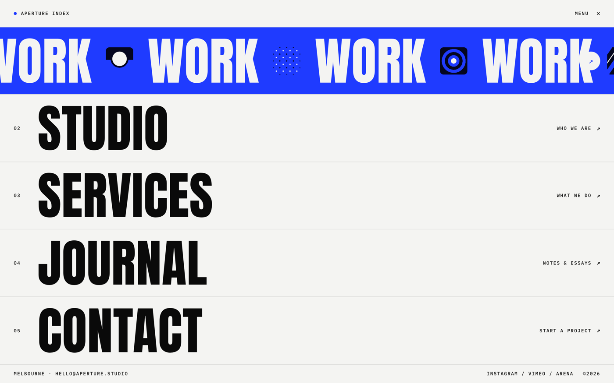

# Flowing Menu: Kinetic Fullscreen Studio Navigation with Marquee Hover Reveal

A bold, kinetic fullscreen navigation menu (the "flowing menu" pattern) for a creative or motion studio. Five oversized condensed-grotesk menu rows (WORK / STUDIO / SERVICES / JOURNAL / CONTACT) stack full-width, each with a mono index number, the giant uppercase label, and a small mono descriptor plus an arrow. On hover a solid electric-blue panel slides up to fill the row and a horizontal marquee scrolls the repeating item name interleaved with small rounded thumbnail tiles, the label flipping to white. A thin top bar (studio wordmark + a MENU / close glyph) and a mono footer (location, email, socials) frame it. Strictly three colors: near-white canvas, near-black ink, one electric-blue accent, so the blue reveal pops. Anton for the giant labels, a mono for all furniture. Reusable as the animated nav / menu overlay for any studio, agency, portfolio, or bold marketing site.



## Prompt

```text
{
  "summary": "A full-viewport (100vh) fullscreen NAVIGATION MENU overlay for a creative / motion studio, built on the 'flowing menu' interaction pattern. A thin top bar holds a mono wordmark ('APERTURE INDEX' with a small dot) on the left and a mono 'MENU' label + close (X) glyph on the right, over a 1px hairline. Below, five full-width menu rows stack and share the remaining height, each divided by 1px hairlines: a mono index ('01'-'05') on the left, a GIANT condensed-grotesk uppercase label (WORK / STUDIO / SERVICES / JOURNAL / CONTACT) filling the row, and on the right a small mono descriptor ('Selected projects', 'Who we are', 'What we do', 'Notes & essays', 'Start a project') with an up-right arrow. Rows sit at rest in near-black on near-white EXCEPT the top row, shown in its ACTIVE hover state: a solid electric-blue panel fills the row and a single-line horizontal MARQUEE scrolls the word repeating in white ('WORK * WORK * WORK') interleaved with small (~64px) rounded duotone tiles, with partial words/tiles bleeding off both edges to imply motion; the resting index + descriptor are hidden and a white arrow pill sits at the right. A mono footer bar (location + email left, social links + copyright right) closes the screen over a hairline. Strictly three colors so the blue reveal is the whole hook.",
  "style": {
    "description": "Bold, kinetic, high-contrast editorial. STRICT three-color palette: near-white canvas (#f4f4f2), near-black ink (#0a0a0a), and ONE electric-blue accent (#1f3bff) used only for the hover-reveal panel + marquee; 1px hairlines are ink at ~12% opacity. No gradients (except tiny duotone shapes inside the marquee tiles), no second accent, and deliberately NOT the default purple/indigo AI gradient. TWO typefaces by role: a super-condensed heavy display face (Anton) for the giant uppercase menu labels, and a monospace (IBM Plex Mono) for ALL furniture (index numbers, wordmark, descriptors, footer meta) at ~11-12px uppercase, letter-spacing ~0.14em. Aggressive scale ratio (giant labels vs tiny mono labels). The resting screen is near-monochrome and calm so the electric-blue reveal reads as pure energy; motion is the message.",
    "prompt": "Design a 100vh fullscreen navigation menu overlay for a creative studio using STRICTLY three colors: canvas #f4f4f2, ink #0a0a0a, and a single electric-blue accent #1f3bff (hairlines = ink at ~12%). NO gradients, no purple/indigo, no second accent. Use TWO typefaces by role: Anton (super-condensed heavy) for the giant uppercase menu labels, and IBM Plex Mono for ALL furniture (index numbers, wordmark, descriptors, footer meta) at 11-12px uppercase, letter-spacing ~0.14em. Keep an aggressive scale ratio (labels ~clamp(52px,8.5vw,120px) vs ~11px mono). Keep resting rows near-monochrome and calm so the electric-blue hover reveal pops. Motion is the point but legibility comes first."
  },
  "layout_and_structure": {
    "description": "A single 100vh screen as a CSS grid: a ~64px top bar, a 1fr menu stack of five equal full-width rows, and a ~44px footer bar (totaling exactly the viewport, no page scroll). Each menu row is a horizontal grid: mono index left, giant label center-left, mono descriptor + arrow right, with 1px hairline dividers between rows. The top row is frozen in its active reveal state to demonstrate the interaction; the other four are at rest. Each row is position:relative with overflow:hidden so the absolutely-positioned reveal panel is clipped to the row and can never spill into the header or a neighbor. Reflows to a taller stacked list on mobile.",
    "prompts": [
      {
        "part": "Top bar",
        "prompt": "A thin (~64px) top bar over a 1px hairline: left = a small filled dot + a mono uppercase wordmark ('APERTURE INDEX'); right = a mono uppercase 'MENU' label next to a close (X) glyph. All ink on canvas, ~11-12px, letter-spacing ~0.14em."
      },
      {
        "part": "Menu stack",
        "prompt": "Five full-width rows sharing the remaining height (grid 1fr each), divided by 1px hairlines (ink @12%). Each row = a horizontal layout: a mono index ('01'-'05') at far left, a GIANT Anton uppercase label (one word: WORK / STUDIO / SERVICES / JOURNAL / CONTACT) at ~clamp(52px,8.5vw,120px) line-height 1 vertically centered, and at far right a small mono descriptor ('Selected projects' / 'Who we are' / 'What we do' / 'Notes & essays' / 'Start a project') + an up-right arrow. Give each row position:relative; overflow:hidden."
      },
      {
        "part": "Active row (hover reveal)",
        "prompt": "Show the first row (WORK) in its active state to demo the interaction: an absolutely-positioned electric-blue (#1f3bff) panel fills the row (inset:0, clipped by the row's overflow:hidden), the resting index + label + descriptor are hidden (visibility:hidden; opacity:0), and a single-line horizontal marquee scrolls over the blue: the word 'WORK' repeating in white Anton interleaved with small (~64px, 8px-radius) duotone-blue tiles, with partial words/tiles bleeding off the left and right edges to imply motion. A small white arrow pill sits at the right, layered above the marquee (z-index) with a solid backing so it never looks like ghosted bleed-through."
      },
      {
        "part": "Footer bar",
        "prompt": "A thin (~44px) footer bar over a 1px hairline: left = mono 'MELBOURNE * HELLO@APERTURE.STUDIO'; right = mono social links ('INSTAGRAM / VIMEO / ARENA') + a mono copyright ('(c)2026'). All ~11px uppercase mono, ink on canvas."
      }
    ]
  },
  "special_ui_components": [
    {
      "component": "Flowing-menu row with vertical panel reveal",
      "description": "The core interaction: a full-width menu row whose colored panel slides up on hover.",
      "prompt": "Build each menu row as position:relative; overflow:hidden. Inside, an absolutely-positioned reveal panel (inset:0) sits at transform:translateY(101%) at rest so no color shows, and slides to translateY(0) on :hover over ~0.5s cubic-bezier(0.19,1,0.22,1). On hover, hide the resting index/label/descriptor (visibility:hidden; opacity:0) so only the panel's marquee shows. Enter the panel from the edge nearest the cursor (top vs bottom) for the 'flowing' feel."
    },
    {
      "component": "Horizontal text marquee with interleaved tiles",
      "description": "The scrolling repeated label + thumbnail tiles that fill the revealed panel.",
      "prompt": "Inside the reveal panel, a single-line horizontal marquee = two duplicated track copies side by side, each a repeating sequence of the item word (white Anton, line-height 1, vertically centered) plus small (~64px, 8px-radius) rounded duotone tiles. Animate the pair translateX(0 -> -50%) in a linear infinite loop (~14s) for a seamless scroll. For a static demo frame, freeze it mid-scroll (translateX(-27%)) so partial words/tiles bleed off both edges."
    },
    {
      "component": "Giant condensed-grotesk menu label",
      "description": "One oversized word per row, the visual spine of the menu.",
      "prompt": "Set each menu label in Anton (super-condensed heavy), uppercase, one word, font-size ~clamp(52px,8.5vw,120px), line-height 1, vertically centered in its row with display:flex; align-items:center. It must never touch or cross its row's hairline; give the row enough height and overflow:hidden."
    },
    {
      "component": "Mono furniture system (index + descriptors + meta)",
      "description": "All the small type: row numbers, wordmark, descriptors, footer.",
      "prompt": "Render every small label (row index '01'-'05', wordmark, per-row descriptors, footer location/email/socials/copyright) in a monospace (IBM Plex Mono) at ~11-12px, uppercase, letter-spacing ~0.14em, in ink. This mono furniture against the giant Anton labels is the whole type contrast."
    },
    {
      "component": "Duotone marquee tile",
      "description": "The small rounded image chips that ride the marquee.",
      "prompt": "Draw ~64px, 8px-radius rounded tiles with pure CSS using only blue/black/white (abstract motifs: concentric rings, a dot grid, diagonal bars, a horizon). Interleave them between the repeated marquee words so the reveal reads as a project ticker, not just scrolling text. Do not hotlink external images."
    }
  ]
}
```

**▶ [Try it live →](https://superdesign.dev/library/flowing-menu-kinetic-fullscreen-studio-navigation-with-marquee-hover-reveal?utm_source=github&utm_medium=prompt-repo&utm_campaign=prompt-library)**

**Use it in your coding agent:** install the [Superdesign skill](https://github.com/superdesigndev/superdesign-skill), then:

```bash
superdesign get-prompts --slugs "flowing-menu-kinetic-fullscreen-studio-navigation-with-marquee-hover-reveal" --json
```

*0 copies · 0 tries · Components · Agency & Studio · navigation, menu, flowing-menu, animated-menu*
