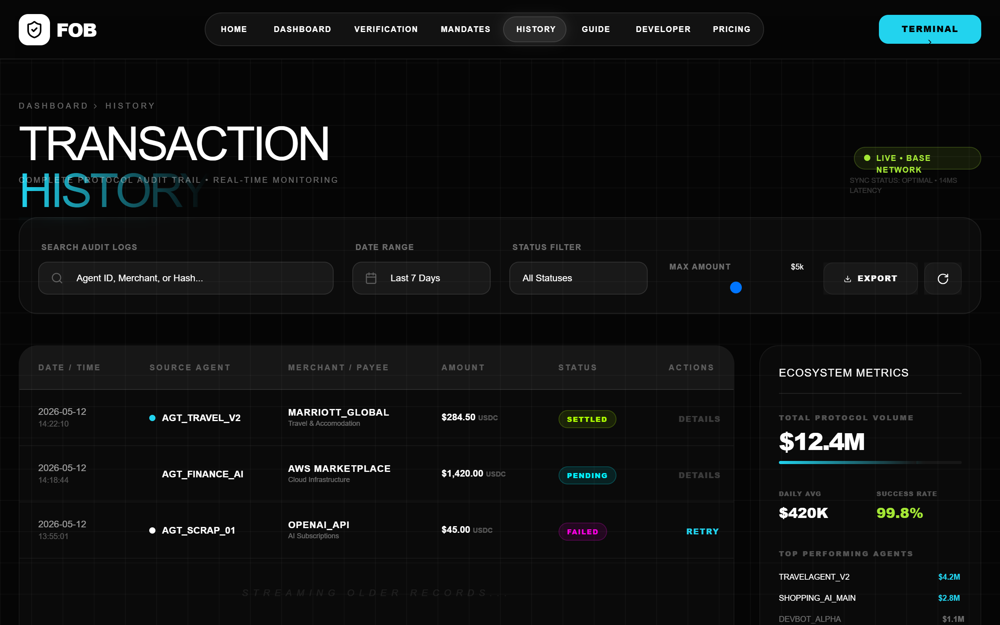

# FOB Transaction History | Protocol Audit Ledger

A high-fidelity cyberpunk fintech dashboard style designed for Web3 protocol auditing, transaction ledgers, and AI agent monitoring. Features a deep dark theme (#050505) with high-contrast neon accents (Cyan #00f2ff, Magenta #ff00e5, Lime #adff00). It utilizes glassmorphism, grid backgrounds, and scanline animations to create a technical, 'next-gen terminal' aesthetic. Best suited for SaaS dashboards, crypto platforms, developer tools, and security auditing interfaces.



## Prompt

```text
{
  "summary": "A sophisticated cyberpunk transaction history ledger using glassmorphism and neon accents. It features a dense data table, a technical analytics sidebar, and a multi-filter control bar, all set against a dark grid-patterned background with subtle scanline animations.",
  "style": {
    "description": "The design system pairs heavy editorial typography (Cabinet Grotesk) with technical monospace fonts (Space Grotesk). Colors are strictly limited to a deep black base with vibrant neon status indicators. UI elements use backdrop blurs and thin translucent borders.",
    "prompt": "Create a UI with a deep background of #050505 and a 40px square grid overlay in rgba(255,255,255,0.03). Use 'Cabinet Grotesk' for primary titles (weight 800-900, tight tracking) and 'Space Grotesk' for technical labels (weight 700, uppercase, tracking 0.2em-0.3em). Colors: Neon Cyan (#00f2ff), Neon Magenta (#ff00e5), Neon Lime (#adff00). Apply a glassmorphism effect to cards: background rgba(255, 255, 255, 0.02), backdrop-filter blur(12px), border 1px solid rgba(255, 255, 255, 0.05). Include a 'scanline' animation: a 2px horizontal gradient moving top-to-bottom over 12s. Status badges should be low-opacity fills with high-opacity borders (e.g., Lime for settled, Magenta for failed, Cyan pulse for pending)."
  },
  "layout_and_structure": {
    "description": "A structured layout prioritizing data density and quick filtering. It uses a top-down flow starting with a global glass nav, a breadcrumb header, a functional filter bar, and a main 4-column grid where the table occupies 75% and analytics occupy 25%.",
    "prompts": [
      {
        "part": "Global Navigation",
        "prompt": "A fixed top header with 90% opacity background and backdrop blur. Center a pill-shaped navigation container with 1px border. Navigation items should be uppercase Space Grotesk font (10px). Active state is a white background pill with black text and subtle glow."
      },
      {
        "part": "Header Section",
        "prompt": "Include breadcrumbs (e.g., Home > History) in 10px uppercase tracking. Use massive Cabinet Grotesk font for the main title, featuring a text gradient from Cyan to Magenta. To the right, include a 'Live Status' indicator with a pulsing green dot and network latency meta-data."
      },
      {
        "part": "Filter Bar",
        "prompt": "A 6-column glassmorphism grid. Elements include a search box with search icon, a date range picker with calendar icon, a custom styled select dropdown, and a custom range slider using a Neon Magenta thumb (#ff00e5) with a 10px outer glow. Add an 'Export' button with a download icon."
      },
      {
        "part": "Audit Ledger Table",
        "prompt": "A dense table inside a glass container. Table headers in 10px uppercase white/30 opacity. Rows should have a 0.3s cubic-bezier hover transition to background rgba(255,255,255,0.03). Column data: Date/Time (stacked), Source (with color-coded dots), Merchant (bold uppercase), Amount (bold with USDC suffix), and Status (pill badges)."
      },
      {
        "part": "Analytics Sidebar",
        "prompt": "A sticky sidebar containing 'Ecosystem Metrics'. Include a large 'Total Volume' display with a gradient progress bar (Cyan to Magenta). Use small lists for 'Top Performing Agents' and 'Top Merchants' featuring simple monochrome icons and data-heavy mono-spacing."
      }
    ]
  },
  "special_ui_components": [
    {
      "component": "Neon Status Badge",
      "description": "A micro-component for transaction states.",
      "prompt": "Create a pill-shaped badge with 1px solid border. 'Settled': bg rgba(173, 255, 0, 0.1), border #adff00, text #adff00. 'Pending': bg rgba(0, 242, 255, 0.1), border #00f2ff, text #00f2ff with a subtle 1.5s pulse animation. 'Failed': bg rgba(255, 0, 229, 0.1), border #ff00e5, text #ff00e5."
    },
    {
      "component": "Transaction Detail Modal",
      "description": "A full-screen glassmorphism overlay for deep audit inspection.",
      "prompt": "A center-aligned card with backdrop-blur(20px). Header includes 'Transaction Detail' in Cabinet Grotesk. Content area uses a 2-column grid for 'Hash' and 'Network Fee'. Include a 'Verification Proof' list with lime-colored checkmark icons. A primary Cyan (#00f2ff) button at the bottom should have a black text label and a strong glow on hover."
    }
  ],
  "special_notes": "MUST use uppercase for all labels and technical metadata. MUST maintain high contrast between text (#FFFFFF) and background. DO NOT use rounded corners greater than 24px; stick to sharp or semi-rounded aesthetics. Transactions hashes and IDs MUST be displayed in monospace 'Space Grotesk' or similar."
}
```

**▶ Try it live → [https://superdesign.dev/library/fob-transaction-history-or-protocol-audit-ledger](https://superdesign.dev/library/fob-transaction-history-or-protocol-audit-ledger)**

*31 copies · 2,492 tries · tags: *
