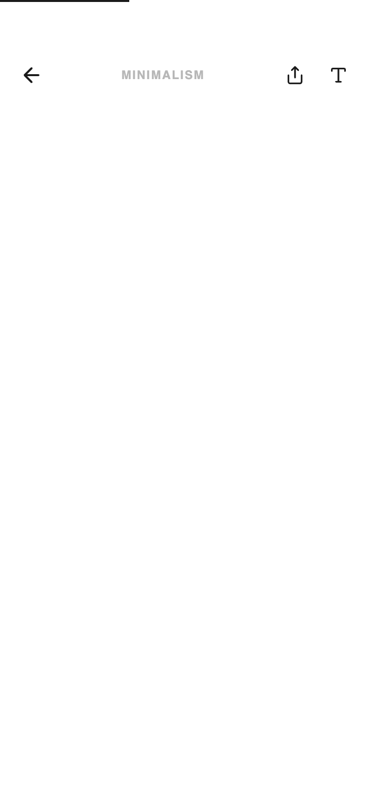

# Focus Mode Detail

Features include a reading progress indicator, drop-cap styling, and a grayscale image aesthetic. This design is ideal for long-form journalism, philosophical blogs, high-end lifestyle magazines, or premium SaaS documentation systems that prioritize content clarity over interface chrome.



## Prompt

```text
{
  "summary": "A high-end, editorial-style mobile reading view that eliminates UI distraction. It uses a sophisticated pairing of serif and sans-serif typography, a monochromatic color scheme, and generous white space to create a 'Focus Mode' experience.",
  "style": {
    "description": "The style is 'Editorial Minimalism' or 'Digital Paper.' It pairs the elegant serif 'Boska' for headings with the functional sans-serif 'Satoshi' for body text. The color palette is strictly limited to Paper (#FFFFFF), Ink (#1A1A1A), and subtle grays. Images are treated with grayscale and low contrast to maintain visual harmony. Animations are slow, purposeful fade-ups (cubic-bezier) that emphasize a calm atmosphere.",
    "prompt": "### Visual Style Guide\n\n**Colors:**\n- Primary Background (Paper): `#FFFFFF`\n- Primary Text (Ink): `#1A1A1A`\n- Secondary Text/Metadata: `#888888`\n- Borders/Dividers: `#E5E5E5`\n\n**Typography:**\n- **Headings (Serif):** 'Boska', serif. Title size: `2.75rem` (44px), `leading-tight` (1.1). Subheadings: `1.5rem` (24px), often italicized.\n- **Body Text (Sans):** 'Satoshi', sans-serif. Size: `1.125rem` (18px), `leading-relaxed`. High legibility.\n- **Metadata/Labels:** 'Satoshi' Bold, uppercase, tracking `0.1em`, size `0.625rem` (10px).\n\n**Imagery & Effects:**\n- **Grayscale Treatment:** All images should have `grayscale(20%)` and `contrast(95%)` for an archival feel.\n- **Borders:** Thin `1px` solid lines for dividers.\n- **Shadows:** None. Use whitespace and borders for depth.\n\n**Animations:**\n- **Fade-Up Entry:** `opacity: 0` to `1`, `translateY(10px)` to `0`. Duration: `0.8s`. Curve: `cubic-bezier(0.16, 1, 0.3, 1)`.\n- **Image Hover:** Subtle scale transition (`scale(1.05)`) over `2s` for a slow, cinematic zoom effect."
  },
  "layout_and_structure": {
    "description": "A vertical, single-column mobile layout focusing on a 90% content width. The UI uses a fixed header with backdrop-blur and a scroll-triggered reading progress bar.",
    "prompts": [
      {
        "part": "Reading Progress Indicator",
        "prompt": "Position a 2px high horizontal bar at the very top of the screen (`z-index: 50`). Background: transparent. Foreground (the bar): `#1A1A1A`. Width should dynamically update based on scroll percentage."
      },
      {
        "part": "Minimalist Header",
        "prompt": "Fixed header with `backdrop-blur-sm` and `bg-white/95`. Height: approximately `80px` including safe area padding. Left: 40px circular back button with `lucide:arrow-left`. Center: Small uppercase tracking-wide text for category/context. Right: Two action icons (Share, Typography settings) using `lucide` icons at `20px` size."
      },
      {
        "part": "Article Intro Section",
        "prompt": "Top padding of `16px`. Main Title: `2.75rem` serif font. Below title: A metadata bar bounded by top and bottom `#E5E5E5` borders. Bar height: `56px`. Include a circular author avatar (`32px`, grayscale), author name in uppercase bold, and date/read-time in `10px` gray text. Include a bookmark icon at the far right."
      },
      {
        "part": "Featured Media",
        "prompt": "Aspect ratio `3:2`. Full width container with `24px` horizontal margins. Subtitle below image: Right-aligned, `10px`, uppercase, tracking-widest, labeled 'Fig 1.0 — [Title]'."
      },
      {
        "part": "Content Body",
        "prompt": "Maximum width container with `24px` side margins. Implement a 'Drop Cap' for the first paragraph: first letter should be `6rem`, serif, light weight, floated left with a negative top margin of `-6px`. Blockquotes: `border-l-2 border-ink`, `pl-6`, using `20px` serif text and a capitalized bold footer for the source. Paragraph spacing: `mb-6`."
      },
      {
        "part": "Related Content Section",
        "prompt": "Header: 'Continue reading' in `italic` serif. List items: `96px x 96px` square grayscale thumbnails on the left, Title in `20px` serif on the right with an underline hover effect. Category and duration labels in `10px` uppercase text below the title."
      }
    ]
  },
  "special_ui_components": [
    {
      "component": "Typographic Drop Cap",
      "description": "A stylized initial letter that sets the editorial tone.",
      "prompt": "Select the first letter of the article. Style: `font-family: Boska`, `font-size: 60px`, `font-weight: 300`, `float: left`, `margin-right: 12px`, `margin-top: -6px`, `line-height: 1`. Ensure it aligns vertically with the first 3 lines of text."
    },
    {
      "component": "Meta-Divider Row",
      "description": "A high-contrast informational bar separating header from body.",
      "prompt": "Create a horizontal container with `border-top: 1px solid #E5E5E5` and `border-bottom: 1px solid #E5E5E5`. Vertical padding: `16px`. Use flexbox to space-between an author profile group (left) and a secondary action (right). Use `10px` bold uppercase tracking for all text elements inside."
    }
  ]
}
```

**▶ Try it live → [https://superdesign.dev/library/focus-mode-detail](https://superdesign.dev/library/focus-mode-detail?utm_source=github&utm_medium=prompt-repo&utm_campaign=prompt-library)**

**Use it in your coding agent:** install the [Superdesign skill](https://github.com/superdesigndev/superdesign-skill), then:

```bash
superdesign get-prompts --slugs "focus-mode-detail" --json
```

*6 copies · 2,493 tries · Mobile Apps · General · mobile app, detail, layout*
