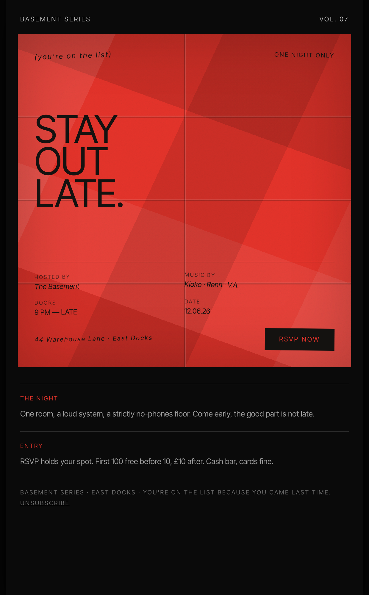

# Folded-Paper Club Invite Email

An edgy, underground event RSVP email in a centered 600px column: a deep-black surface framing a bright-red hero panel that reads like a folded-paper flyer or ticket stub, with fold-crease grid lines and flat near-black type. The flyer embeds the key info (host, music, doors, date, location) plus an RSVP button; brief 'The Night' / 'Entry' text blocks sit below on black. Reusable for nightclubs, secret gigs, limited-capacity events, and streetwear drops.



## Prompt

```text
{"summary": "An edgy underground club / event RSVP email in a centered ~600px column on deep black. A small header (series name + volume) sits above the centerpiece: a bright-red hero panel styled like a folded-paper flyer, complete with fold-crease grid lines, holding an italic overline ('you're on the list'), a big flat near-black headline ('Stay out late.'), a rotated credits grid (Hosted by / Music by / Doors / Date), a location line, and an RSVP button, all embedded in the flyer. Below the flyer, brief 'The Night' and 'Entry' text blocks on black, then a footer with unsubscribe.", "style": {"description": "Edgy, industrial, underground. Extreme contrast between a deep-black canvas and a bright-red hero panel that simulates a creased, folded sheet of paper (a grid of fold lines + soft crease shadows + paper grain). Flat near-black type is 'printed' on the red paper, with microcopy slightly rotated to follow the folds. Minimal, no-nonsense: Inter Tight sans, italics to differentiate data points, tracked-caps micro-labels.", "prompt": "Design an underground club / event RSVP email in a centered max-width 600px column on a near-black surface (#0a0a0a) over a black body (#050505). Typeface: Inter Tight. The centerpiece is a bright-red (#e5342b) hero panel that reads as a FOLDED SHEET OF PAPER, built purely in CSS: a base red, per-cell tonal shading (so each folded rectangle catches light differently), a grid of fold creases (each a dark valley + a light ridge), a subtle SVG fractal-noise grain, and an inset shadow. Flat near-black (#141210) type is printed on the paper; microcopy is slightly rotated (-2deg to +1deg) to sit on the folds. A ~64px font-800 uppercase headline, a rotated credits grid, and a solid near-black RSVP button (red label). Below the flyer, brief text blocks on black use a red tracked-caps kicker + white/60 body. Email-safe: centered column, no sticky nav."}, "layout_and_structure": {"description": "Centered ~600px column: (1) header (series name + volume), (2) folded red-paper flyer panel holding all key info + RSVP, (3) two brief text blocks ('The Night' / 'Entry') on black, (4) footer with unsubscribe. Reflows to one column at ~380px (credits grid stays 2-up).", "prompts": [{"part": "Header", "prompt": "A row on black: tracked-caps series name left ('Basement Series'), tracked-caps volume right ('Vol. 07'), both white/70."}, {"part": "Folded-paper flyer", "prompt": "A red folded-paper panel (see style) ~560px tall, flex column: top = a rotated italic overline ('(you're on the list)') + a tracked-caps 'One night only'; middle = a ~64px font-800 uppercase headline stacked ('Stay / out / late.'); bottom = a 2-column credits grid (Hosted by / Music by / Doors / Date, each a tracked-caps label + an italic-or-bold value, slightly rotated), a rotated location line, and a solid near-black 'RSVP now' button with a red label."}, {"part": "Detail blocks", "prompt": "On black, a 2-column set of brief blocks, each a red tracked-caps kicker ('The Night' / 'Entry') over a ~13px white/60 paragraph."}, {"part": "Footer", "prompt": "Tracked-caps white/40 fine print (series \u00b7 location \u00b7 why-received) with an Unsubscribe link."}]}, "special_ui_components": "CSS folded-paper panel (fold-crease grid + per-cell shading + grain) used as a flyer/ticket hero; rotated 'printed' microcopy following the folds; embedded credits grid; near-black RSVP button on red.", "special_notes": "Email layout: centered ~600px column, no sticky nav. IMPORTANT for implementers: keep the flyer's vital info (host, music, doors, date, location, RSVP) as LIVE HTML TEXT layered over the CSS paper texture, do NOT rasterize the flyer into a single background image, so the info still shows when a client blocks images; if a texture image is used, provide a real fallback text block + alt text. Generic placeholder event ('Basement Series') and sample details so the spec is reusable. The reusable value is the folded-paper 'printed flyer' email system (CSS crease texture + flat rotated type) and the intimate RSVP structure. Source system: reverse-engineered from a Canva typographic club-flyer (measured black + crumpled red-paper #e5342b, Helvetica Now, rotated microcopy)."}
```
