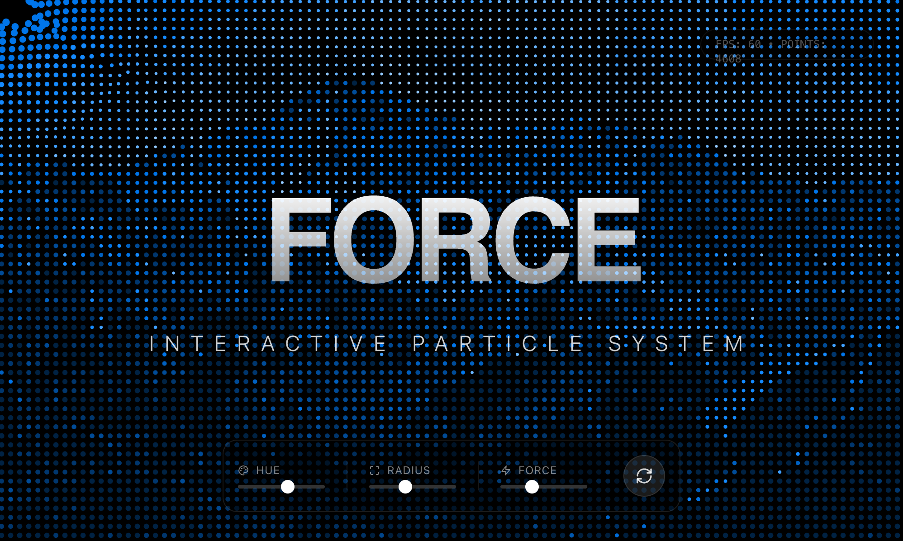

# Force Field Background

An interactive, particle-based force field background effect that reacts to mouse movement. Uses p5.js to render particles based on image brightness maps, creating a fluid, magnetic visual experience.

Source: https://codepen.io/vainsan/pen/ByoXMoB



## Prompt

```text
You are given a task to integrate an existing React component in the codebase

~~~/README.md
# ForceFieldBackground

A high-performance, interactive particle system background that reacts to mouse movement with a magnetic "force field" effect. Built with p5.js and React.

## Features

- **Interactive Force Field**: Particles disperse as the mouse moves through them.
- **Image-Based Mapping**: Particles are generated based on the brightness map of an underlying image (defaults to a mountain landscape).
- **Dynamic Physics**: Fluid motion with friction and restoration forces.
- **Customizable**: Control hue, saturation, particle density, stroke width, and force field physics.
- **Production Ready**: Responsive canvas resizing, proper React cleanup, and TypeScript support.

## Dependencies

- `p5`: For high-performance canvas rendering
- `react`: Core framework

## Usage

```tsx
import { ForceFieldBackground } from '@/sd-components/febbd3b8-b30b-407b-a997-55442e42be27';

function MyPage() {
  return (
    <div className="relative w-screen h-screen">
      <ForceFieldBackground 
        hue={210} 
        spacing={10} 
        forceStrength={15}
      />
      
      <div className="absolute inset-0 z-10 flex items-center justify-center pointer-events-none">
        <h1 className="text-white text-6xl font-bold mix-blend-overlay">
          Hello World
        </h1>
      </div>
    </div>
  );
}
```

## Props

| Prop | Type | Default | Description |
|------|------|---------|-------------|
| `imageUrl` | string | (Mountain Image) | Source image URL for particle mapping |
| `hue` | number | 210 | Base color hue (0-360) |
| `saturation` | number | 100 | Color saturation (0-100) |
| `spacing` | number | 10 | Grid spacing (lower = more particles) |
| `density` | number | 2.0 | Random density factor |
| `minStroke` | number | 2 | Minimum particle size |
| `maxStroke` | number | 6 | Maximum particle size |
| `forceStrength` | number | 10 | Strength of cursor repulsion |
| `magnifierRadius` | number | 150 | Radius of interaction area |
| `friction` | number | 0.9 | Movement friction (0.5-0.99) |
| `restoreSpeed` | number | 0.05 | Speed of return to origin |

## Notes

- The component automatically fills its parent container. Ensure the parent has dimensions.
- Mouse interaction is relative to the canvas.
- For best performance, avoid setting `spacing` lower than 5 on large screens.
~~~

~~~/src/App.tsx
import React, { useState } from 'react';
import { ForceFieldBackground } from './Component';
import { RefreshCw, Zap, Sliders, Maximize, Palette } from 'lucide-react';

export default function App() {
  const [params, setParams] = useState({
    hue: 210,
    saturation: 100,
    minStroke: 2,
    maxStroke: 6,
    spacing: 10,
    forceStrength: 10,
    magnifierRadius: 150
  });

  const randomize = () => {
    setParams({
      ...params,
      hue: Math.floor(Math.random() * 360),
      minStroke: parseFloat((Math.random() * 3 + 1).toFixed(1)),
      maxStroke: parseFloat((Math.random() * 8 + 4).toFixed(1)),
      spacing: Math.floor(Math.random() * 8 + 8),
      magnifierRadius: Math.floor(Math.random() * 100 + 100)
    });
  };

  return (
    <div className="relative w-full min-h-screen font-sans text-white bg-black overflow-hidden">
      {/* Background Component */}
      <div className="absolute inset-0 z-0">
        <ForceFieldBackground 
          hue={params.hue}
          saturation={params.saturation}
          minStroke={params.minStroke}
          maxStroke={params.maxStroke}
          spacing={params.spacing}
          forceStrength={params.forceStrength}
          magnifierRadius={params.magnifierRadius}
        />
      </div>

      {/* Foreground Content Overlay */}
      <div className="relative z-10 flex flex-col items-center justify-center min-h-screen pointer-events-none">
        <div className="text-center space-y-8 p-8 max-w-4xl mix-blend-difference">
          <h1 className="text-7xl md:text-9xl font-bold tracking-tighter leading-none bg-clip-text text-transparent bg-gradient-to-b from-white to-white/50"
              style={{ fontFamily: '"Inter", sans-serif' }}>
            FORCE FIELD
          </h1>
          <p className="text-xl md:text-2xl font-light tracking-[0.5em] text-white/80 uppercase">
            Interactive Particle System
          </p>
        </div>
      </div>

      {/* Floating Controls (Pointer events enabled) */}
      <div className="fixed bottom-8 left-1/2 -translate-x-1/2 z-20 flex gap-4 pointer-events-auto">
        <div className="bg-black/40 backdrop-blur-md border border-white/10 p-4 rounded-2xl shadow-2xl flex items-center gap-6 animate-in slide-in-from-bottom-10 fade-in duration-700">
          
          <div className="flex flex-col gap-2">
            <div className="flex items-center gap-2 text-xs text-white/50 uppercase tracking-wider">
              <Palette className="w-3 h-3" /> Hue
            </div>
            <input 
              type="range" min="0" max="360" 
              value={params.hue} 
              onChange={(e) => setParams({...params, hue: parseInt(e.target.value)})}
              className="w-24 accent-white h-1 bg-white/20 rounded-full appearance-none cursor-pointer"
            />
          </div>

          <div className="w-px h-8 bg-white/10" />

          <div className="flex flex-col gap-2">
            <div className="flex items-center gap-2 text-xs text-white/50 uppercase tracking-wider">
              <Maximize className="w-3 h-3" /> Radius
            </div>
            <input 
              type="range" min="50" max="300" 
              value={params.magnifierRadius} 
              onChange={(e) => setParams({...params, magnifierRadius: parseInt(e.target.value)})}
              className="w-24 accent-white h-1 bg-white/20 rounded-full appearance-none cursor-pointer"
            />
          </div>

          <div className="w-px h-8 bg-white/10" />

          <div className="flex flex-col gap-2">
             <div className="flex items-center gap-2 text-xs text-white/50 uppercase tracking-wider">
              <Zap className="w-3 h-3" /> Force
            </div>
            <input 
              type="range" min="0" max="30" 
              value={params.forceStrength} 
              onChange={(e) => setParams({...params, forceStrength: parseInt(e.target.value)})}
              className="w-24 accent-white h-1 bg-white/20 rounded-full appearance-none cursor-pointer"
            />
          </div>

          <button 
            onClick={randomize}
            className="ml-4 p-3 rounded-full bg-white/10 hover:bg-white/20 transition-colors border border-white/10 group"
            title="Randomize Parameters"
          >
            <RefreshCw className="w-5 h-5 text-white/80 group-hover:rotate-180 transition-transform duration-500" />
          </button>
        </div>
      </div>

      <div className="fixed top-8 right-8 z-20 pointer-events-none">
        <div className="bg-black/20 backdrop-blur-sm border border-white/5 px-4 py-2 rounded-full text-xs text-white/30 font-mono">
          FPS: 60 • POINTS: {(1280/params.spacing * 720/params.spacing * 0.5).toFixed(0)}
        </div>
      </div>
    </div>
  );
}
~~~

~~~/package.json
{
  "name": "force-field-background",
  "description": "Interactive p5.js force field background component",
  "dependencies": {
    "p5": "^1.9.0",
    "lucide-react": "^0.344.0"
  }
}
~~~

~~~/src/Component.tsx
import React, { useEffect, useRef, useState } from 'react';
import p5 from 'p5';

export interface ForceFieldBackgroundProps {
  /**
   * URL of the image to use as the base for the particle field
   * @default "https://cdn.pixabay.com/photo/2024/12/13/20/29/alps-9266131_1280.jpg"
   */
  imageUrl?: string;
  /**
   * Base hue for the color palette (0-360)
   * @default 210
   */
  hue?: number;
  /**
   * Color saturation (0-100)
   * @default 100
   */
  saturation?: number;
  /**
   * Brightness threshold for particle visibility (0-255)
   * @default 255
   */
  threshold?: number;
  /**
   * Minimum stroke weight for particles
   * @default 2
   */
  minStroke?: number;
  /**
   * Maximum stroke weight for particles
   * @default 6
   */
  maxStroke?: number;
  /**
   * Spacing between particles (lower = more density)
   * @default 10
   */
  spacing?: number;
  /**
   * Noise scale for particle placement irregularity
   * @default 0
   */
  noiseScale?: number;
  /**
   * Density factor (probability of particle existence)
   * @default 2.0
   */
  density?: number;
  /**
   * Invert the source image brightness mapping
   * @default true
   */
  invertImage?: boolean;
  /**
   * Invert the wireframe/particle visibility condition
   * @default true
   */
  invertWireframe?: boolean;
  /**
   * Enable the magnifier/force field effect
   * @default true
   */
  magnifierEnabled?: boolean;
  /**
   * Radius of the force field effect around the cursor
   * @default 150
   */
  magnifierRadius?: number;
  /**
   * Strength of the force pushing particles away
   * @default 10
   */
  forceStrength?: number;
  /**
   * Friction factor for particle movement (0-1)
   * @default 0.9
   */
  friction?: number;
  /**
   * Speed at which particles return to original position
   * @default 0.05
   */
  restoreSpeed?: number;
  /**
   * Additional CSS class names
   */
  className?: string;
}

/**
 * ForceFieldBackground
 * 
 * An interactive, particle-based background that reacts to mouse movement.
 * It uses an underlying image to determine particle color and size, creating
 * a "force field" effect where particles are pushed away by the cursor.
 */
export function ForceFieldBackground({
  imageUrl = "https://cdn.pixabay.com/photo/2024/12/13/20/29/alps-9266131_1280.jpg",
  hue = 210,
  saturation = 100,
  threshold = 255,
  minStroke = 2,
  maxStroke = 6,
  spacing = 10,
  noiseScale = 0,
  density = 2.0,
  invertImage = true,
  invertWireframe = true,
  magnifierEnabled = true,
  magnifierRadius = 150,
  forceStrength = 10,
  friction = 0.9,
  restoreSpeed = 0.05,
  className = "",
}: ForceFieldBackgroundProps) {
  const containerRef = useRef<HTMLDivElement>(null);
  const p5InstanceRef = useRef<p5 | null>(null);
  const [isLoading, setIsLoading] = useState(true);
  const [error, setError] = useState<string | null>(null);

  // Keep latest props in ref to access inside p5 closure without re-instantiating
  const propsRef = useRef({
    hue, saturation, threshold, minStroke, maxStroke, spacing, noiseScale, 
    density, invertImage, invertWireframe, magnifierEnabled, magnifierRadius,
    forceStrength, friction, restoreSpeed
  });

  useEffect(() => {
    propsRef.current = {
      hue, saturation, threshold, minStroke, maxStroke, spacing, noiseScale,
      density, invertImage, invertWireframe, magnifierEnabled, magnifierRadius,
      forceStrength, friction, restoreSpeed
    };
  }, [hue, saturation, threshold, minStroke, maxStroke, spacing, noiseScale, density, invertImage, invertWireframe, magnifierEnabled, magnifierRadius, forceStrength, friction, restoreSpeed]);

  useEffect(() => {
    if (!containerRef.current) return;

    // Cleanup previous instance if exists
    if (p5InstanceRef.current) {
      p5InstanceRef.current.remove();
    }

    const sketch = (p: p5) => {
      let originalImg: p5.Image;
      let img: p5.Image;
      let palette: p5.Color[] = [];
      let points: {
        pos: p5.Vector;
        originalPos: p5.Vector;
        vel: p5.Vector;
      }[] = [];
      
      // Internal state tracking to detect changes
      let lastHue = -1;
      let lastSaturation = -1;
      let lastSpacing = -1;
      let lastNoiseScale = -1;
      let lastDensity = -1;
      let lastInvertImage: boolean | null = null;
      let magnifierX = 0;
      let magnifierY = 0;
      let magnifierInertia = 0.1;

      p.preload = () => {
        // Use p5's loadImage with callbacks
        p.loadImage(
          imageUrl,
          (loadedImg) => {
            originalImg = loadedImg;
            setIsLoading(false);
          },
          (err) => {
            console.error("Failed to load image", err);
            setError("Failed to load image");
            setIsLoading(false);
          }
        );
      };

      p.setup = () => {
        if (!originalImg) return; // Should be loaded by preload
        
        // Create canvas to fill parent
        const { clientWidth, clientHeight } = containerRef.current!;
        p.createCanvas(clientWidth, clientHeight);
        
        // Initialize magnifier position
        magnifierX = p.width / 2;
        magnifierY = p.height / 2;

        processImage();
        generatePalette(propsRef.current.hue, propsRef.current.saturation);
        generatePoints();
      };

      p.windowResized = () => {
        if (!containerRef.current || !originalImg) return;
        const { clientWidth, clientHeight } = containerRef.current;
        p.resizeCanvas(clientWidth, clientHeight);
        processImage();
        generatePoints();
      };

      function processImage() {
        if (!originalImg) return;
        img = originalImg.get();
        // Resize image to match canvas for 1:1 pixel mapping
        if (p.width > 0 && p.height > 0) {
          img.resize(p.width, p.height);
        }
        img.filter(p.GRAY);

        if (propsRef.current.invertImage) {
          img.loadPixels();
          for (let i = 0; i < img.pixels.length; i += 4) {
            img.pixels[i] = 255 - img.pixels[i];
            img.pixels[i + 1] = 255 - img.pixels[i + 1];
            img.pixels[i + 2] = 255 - img.pixels[i + 2];
          }
          img.updatePixels();
        }
        lastInvertImage = propsRef.current.invertImage;
      }

      function generatePalette(h: number, s: number) {
        palette = [];
        p.push();
        p.colorMode(p.HSL);
        for (let i = 0; i < 12; i++) {
          let lightness = p.map(i, 0, 11, 95, 5);
          palette.push(p.color(h, s, lightness));
        }
        p.pop();
      }

      function generatePoints() {
        if (!img) return;
        points = [];
        const { spacing, density, noiseScale } = propsRef.current;
        
        // Guard against infinite loop or too many points
        const safeSpacing = Math.max(2, spacing); 

        for (let y = 0; y < img.height; y += safeSpacing) {
          for (let x = 0; x < img.width; x += safeSpacing) {
            if (p.random() > density) continue;
            
            let nx = p.noise(x * noiseScale, y * noiseScale) - 0.5;
            let ny = p.noise((x + 500) * noiseScale, (y + 500) * noiseScale) - 0.5;
            let px = x + nx * safeSpacing;
            let py = y + ny * safeSpacing;
            
            points.push({
              pos: p.createVector(px, py),
              originalPos: p.createVector(px, py),
              vel: p.createVector(0, 0)
            });
          }
        }
        
        lastSpacing = spacing;
        lastNoiseScale = noiseScale;
        lastDensity = density;
      }

      function applyForceField(mx: number, my: number) {
        const props = propsRef.current;
        if (!props.magnifierEnabled) return;

        for (let pt of points) {
          // Repel force
          let dir = p5.Vector.sub(pt.pos, p.createVector(mx, my));
          let d = dir.mag();
          
          if (d < props.magnifierRadius) {
            dir.normalize();
            let force = dir.mult(props.forceStrength / Math.max(1, d)); // Avoid div by zero
            pt.vel.add(force);
          }
          
          // Friction
          pt.vel.mult(props.friction);
          
          // Restore force (spring back to original)
          let restore = p5.Vector.sub(pt.pos, pt.originalPos).mult(-props.restoreSpeed);
          pt.vel.add(restore);
          
          // Update position
          pt.pos.add(pt.vel);
        }
      }

      p.draw = () => {
        if (!img) return;
        p.background(0);

        const props = propsRef.current;

        // Check for prop changes that require regeneration
        if (props.hue !== lastHue || props.saturation !== lastSaturation) {
          generatePalette(props.hue, props.saturation);
          lastHue = props.hue;
          lastSaturation = props.saturation;
        }

        if (props.invertImage !== lastInvertImage) {
          processImage(); // This sets lastInvertImage
        }

        if (props.spacing !== lastSpacing || props.noiseScale !== lastNoiseScale || props.density !== lastDensity) {
          generatePoints();
        }

        // Mouse interaction
        // Use lerp for smooth movement of the 'magnifier' center
        magnifierX = p.lerp(magnifierX, p.mouseX, magnifierInertia);
        magnifierY = p.lerp(magnifierY, p.mouseY, magnifierInertia);

        applyForceField(magnifierX, magnifierY);

        img.loadPixels();
        p.noFill();

        for (let pt of points) {
          let x = pt.pos.x;
          let y = pt.pos.y;
          let d = p.dist(x, y, magnifierX, magnifierY);
          
          let px = p.constrain(p.floor(x), 0, img.width - 1);
          let py = p.constrain(p.floor(y), 0, img.height - 1);
          
          // Access pixel data (RGBA)
          let index = (px + py * img.width) * 4;
          // Just use R channel since it's grayscale
          let brightness = img.pixels[index]; 
          
          // Guard against undefined brightness if image resized or not ready
          if (brightness === undefined) continue;

          let condition = props.invertWireframe
            ? brightness < props.threshold
            : brightness > props.threshold;

          if (condition) {
            let shadeIndex = Math.floor(p.map(brightness, 0, 255, 0, palette.length - 1));
            shadeIndex = p.constrain(shadeIndex, 0, palette.length - 1);
            
            let strokeSize = p.map(brightness, 0, 255, props.minStroke, props.maxStroke);
            
            if (props.magnifierEnabled && d < props.magnifierRadius) {
              let factor = p.map(d, 0, props.magnifierRadius, 2, 1); // 2x size at center
              strokeSize *= factor;
            }
            
            if (palette[shadeIndex]) {
              p.stroke(palette[shadeIndex]);
              p.strokeWeight(strokeSize);
              p.point(x, y);
            }
          }
        }
      };
    };

    const myP5 = new p5(sketch, containerRef.current);
    p5InstanceRef.current = myP5;

    return () => {
      myP5.remove();
    };
  }, [imageUrl]); // Re-init if imageUrl changes

  return (
    <div 
      className={`relative w-full h-full overflow-hidden bg-black ${className}`} 
      ref={containerRef}
    >
      {isLoading && (
        <div className="absolute inset-0 flex items-center justify-center text-white/50 text-xs tracking-widest uppercase">
          Initializing Force Field...
        </div>
      )}
      {error && (
        <div className="absolute inset-0 flex items-center justify-center text-red-500/50 text-xs tracking-widest uppercase">
          {error}
        </div>
      )}
    </div>
  );
}

export default ForceFieldBackground;
~~~

Implementation Guidelines

1. Analyze the component structure, styling, animation implementations
2. Review the component's arguments and state
3. Think through what is the best place to adopt this component/style into the design we are doing
4. Then adopt the component/design to our current system

Help me integrate this into my design
```

**▶ Try it live → [https://superdesign.dev/library/force-field-background](https://superdesign.dev/library/force-field-background?utm_source=github&utm_medium=prompt-repo&utm_campaign=prompt-library)**

**Use it in your coding agent:** install the [Superdesign skill](https://github.com/superdesigndev/superdesign-skill), then:

```bash
superdesign get-prompts --slugs "force-field-background" --json
```

*865 copies · 1,588 tries · animation, background*
