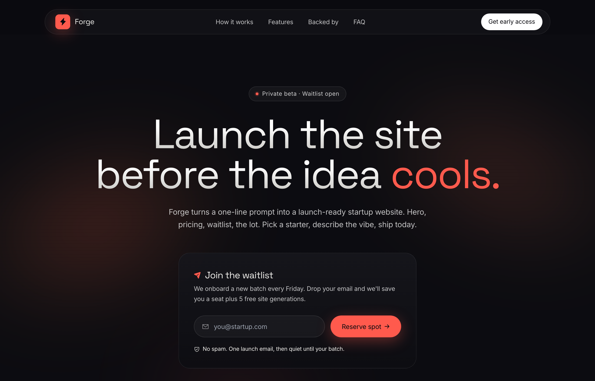

# Forge — Launch Waitlist (dark, warm-ember)

Dark, warm-ember startup launch / waitlist landing page: near-black ink base with a single hot coral accent, Space Grotesk display + Inter body, blurred coral/amber ambient glows, a floating glass pill nav, a centered gradient headline, a glassmorphic email-capture waitlist card, a 'backed by' logo row, and a sticky-titled editorial 3-step feature spread.



## Prompt

```text
{"summary": "A dark, warm-ember startup launch / waitlist landing page. Near-black ink base (#0a0a0f) with a single coral accent (#ff5a4d), large Space Grotesk display headline, and a centered single-column hero whose copy ends with a coral emphasis word. Behind the hero sit soft blurred warm-ember radial 'streak' glows plus a faint dot grain. A glassy waitlist card (email + coral 'Reserve spot' pill) is the primary conversion surface, followed by a social icon row, an uppercase 'backed by' logo row, a sticky-titled editorial 3-step feature spread on a 12-col grid, and a quiet split footer. A floating glass pill nav sits at the top.", "style": {"description": "Dark warm-ember minimal launch page. Near-black ink base (#0a0a0f) with warm off-white text (#f4f3ef), one hot coral accent (#ff5a4d) used for the logo mark, ping dot, emphasis word, feature numerals/icons, focus ring and the primary CTA. Space Grotesk for all display headings (weights 600-700, tight -0.03em tracking) and Inter for body/UI (slightly negative -0.01em letter-spacing, antialiased). Mood: confident, fast, indie-founder. Atmosphere comes from large blurred coral/amber radial 'streak' glows behind the hero, a subtle white-dot grain overlay, glassmorphism (blurred translucent dark panels with hairline white borders) on the nav pill and waitlist card, fully-rounded pill controls, and a soft coral box-shadow glow on the brand mark and CTA. Headlines use a white-to-grey vertical gradient text clip.", "prompt": "Design in a dark, warm-ember, minimal startup-launch style. Palette: near-black ink base #0a0a0f, warm off-white text #f4f3ef, a single hot coral accent #ff5a4d (with warmer amber #ff8c3c / #ffaa5a only inside the ambient glows). Headings use Space Grotesk (weights 600-700, tracking -0.03em, leading ~0.98); body and UI use Inter (weights 400-600, letter-spacing -0.01em, -webkit-font-smoothing antialiased). Use glassmorphism for floating panels: linear-gradient dark fill (rgba(22,22,28,0.92)->rgba(13,13,18,0.92)), backdrop-blur ~16px, 1px rgba(255,255,255,0.07) border; the nav pill uses rgba(20,20,26,0.7) + blur 14px. Behind the hero place 3 large blurred (filter: blur(90px)) coral/amber radial 'streak' ellipses at ~0.55 opacity, plus a faint white radial-dot grain (rgba(255,255,255,0.025) 1px dots on a 3px grid). All buttons, the badge, the input shell and social icons are fully-rounded pills. The primary CTA and the logo mark carry a soft coral glow box-shadow (0 8px 30px rgba(255,90,77,0.35)). Headline text uses a white->grey (#ffffff 35% -> #b9b8b3 100%) vertical gradient clipped to text, with one trailing word in solid coral. Feature icon tiles are coral-tinted (bg rgba(255,90,77,0.10), border rgba(255,90,77,0.22)). Keep it spacious, centered, dark and warm, never cold blue or neon."}, "layout_and_structure": {"description": "Single-column, centered, long-scroll launch page in a max-w-6xl (72rem) container with px-5 / sm:px-8 gutters. Top-down order: a floating sticky glass pill nav, a centered hero (badge -> gradient headline -> one-line statement -> glass waitlist card -> social icon row) over blurred warm-ember glows + grain, an uppercase 'backed by' logo row, an editorial feature spread (12-col grid: a sticky 4-col title column + an offset, staggered 3-item numbered feature list), and a quiet split footer. Responsive: nav links hide below md, the waitlist form stacks vertically below sm, the feature grid collapses from 12 cols to a single stacked column on mobile and the second feature row loses its sm:pl-10 offset.", "prompts": [{"part": "Sticky pill nav", "prompt": "A sticky top header (z-50, top-0) holding a floating 'nav pill' centered in a max-w-6xl row with top padding. The pill is fully rounded, glassy (rgba(20,20,26,0.7), backdrop-blur 14px, 1px white/7 border) with small px-3 py-2 padding. Left: the logo = an 8x8 rounded-lg coral square with a soft coral glow containing a black ph:lightning-fill icon, next to the 'Forge' wordmark in Space Grotesk 600. Center (hidden below md): four pill text links (How it works, Features, Backed by, FAQ) in white/75 at 13.5px that brighten to white on hover. Right: a solid white fully-rounded pill CTA 'Get early access' in black 13px 600."}, {"part": "Hero", "prompt": "A centered single-column hero in a relative max-w-6xl container with pt-20/sm:pt-28 top padding, over an absolutely-positioned ambient layer (3 large blurred coral/amber radial 'streak' ellipses) and a faint white dot grain. Stack centered: (1) a small rounded-full badge with a 1px white/10 border and white/4 fill containing an animated coral ping dot and the label 'Private beta - Waitlist open' in 12.5px white/80; (2) a huge Space Grotesk 700 headline at clamp(2.7rem,8.5vw,5.5rem), leading 0.98, tracking -0.03em reading 'Launch the site / before the idea cools.' where the first two lines use a white->grey gradient text clip and the final word 'cools.' is solid coral; (3) a max-w-xl white/75 sub-paragraph at ~16px ('Forge turns a one-line prompt into a launch-ready startup website. Hero, pricing, waitlist, the lot. Pick a starter, describe the vibe, ship today.'); (4) the glass waitlist card; (5) a social icon row."}, {"part": "Waitlist card (primary CTA)", "prompt": "A glassmorphic card (the 'glass' style: dark gradient fill, backdrop-blur 16px, 1px white/7 border) max-w-lg, rounded-3xl, p-7/sm:p-8, left-aligned text, mt-12. Header: a coral ph:paper-plane-tilt-fill icon beside a Space Grotesk 600 'Join the waitlist' at 20px. Sub-line in white/75 13.5px ('We onboard a new batch every Friday. Drop your email and we'll save you a seat plus 5 free site generations.'). Form (stacks vertically below sm, row on sm+): a fully-rounded 'input shell' (white/4 fill, 1px white/10 border) wrapping a white/55 ph:envelope-simple icon + an email input with placeholder 'you@startup.com'; on focus-within the shell border turns coral/55 with a 4px coral/10 ring. Beside it a solid coral fully-rounded 'Reserve spot' pill button (black text, coral glow shadow, ph:arrow-right-bold icon) that brightens on hover. Below: a reassurance line with a ph:shield-check icon in white/72 12px ('No spam. One launch email, then quiet until your batch.')."}, {"part": "Social row", "prompt": "A centered horizontal row (mt-8, gap-3) of three 9x9 fully-rounded icon buttons (1px white/10 border, white/3 fill, white/55 icons) for X (ph:x-logo-bold), GitHub (ph:github-logo-bold) and Discord (ph:discord-logo-bold). On hover each gets a coral/40 border and coral icon."}, {"part": "Backed-by logo row", "prompt": "A section with a thin top border (white/6). Centered uppercase eyebrow at 11.5px, white/72, letter-spacing 0.22em: 'Backed by founders & funds who ship fast'. Below, a centered flex-wrap row (gap-x-10/14, gap-y-6) of five placeholder backer logos, each a ph:* outline icon (rocket-launch, diamond, hexagon, circles-three, mountains) at 20px beside a Space Grotesk 600 16px wordmark (Liftoff, Northpeak, Hexa, Trio Capital, Basecamp) in white/72, brightening to white on hover."}, {"part": "Editorial feature spread", "prompt": "A features section in max-w-6xl with a 12-col grid (gap-x-14 gap-y-10). Left 4 cols = a sticky (md:top-28) editorial title block: a coral eyebrow row (a 10px-wide coral/60 hairline + uppercase 0.28em-tracked coral 'The kit'), a Space Grotesk 700 heading at clamp(1.9rem,4.4vw,2.9rem) ('Everything between the idea and the' + a white->grey gradient 'first signup.'), a max-w-xs white/75 intro paragraph, and a white text link 'Reserve your spot' with a ph:arrow-right-bold icon that turns coral on hover. Right ~7 cols (lg:col-start-6) = a vertically divided (divide-white/8) list of 3 numbered feature articles; the 2nd article is offset with sm:pl-10 for a staggered rhythm. Each article: a coral/80 Space Grotesk tabular two-digit number (01-03), a 12x12 coral-tinted rounded-xl 'feature-icon' tile (ph:magic-wand / ph:squares-four / ph:export coral icons) that gains a coral/40 border on group-hover, then a Space Grotesk 600 18px title and a max-w-md white/75 14px description (Prompt to page / Starter library / Ship anywhere)."}, {"part": "Footer", "prompt": "A quiet footer with a thin top border (white/6). In a max-w-6xl row that is column-stacked on mobile and a 3-part space-between row on sm+: left = a 7x7 rounded-md coral square with a black ph:lightning-fill icon beside the 'Forge' Space Grotesk 600 wordmark; center = a white/72 12.5px copyright line '\u00a9 2026 Forge Labs. Built for founders in a hurry.'; right = three white/72 12.5px text links (Privacy, Terms, Changelog) that brighten to white on hover."}]}, "special_ui_components": ["Floating glass pill nav: a fully-rounded, backdrop-blurred translucent dark pill (rgba(20,20,26,0.7), blur 14px, 1px white/7 border) that sticks to the top", "Ambient warm-ember glows: 3 large absolutely-positioned blurred (blur 90px, ~0.55 opacity) coral/amber radial 'streak' ellipses rotated behind the hero, plus a faint white radial-dot grain (rgba(255,255,255,0.025) 1px dots on a 3px grid)", "Glassmorphic waitlist card: dark linear-gradient fill, backdrop-blur 16px, hairline white/7 border, rounded-3xl, holding the primary email-capture form", "Animated coral ping dot in the status badge (an animate-ping coral halo over a solid coral dot)", "Gradient text headline: white->grey (#ffffff 35% -> #b9b8b3) vertical gradient clipped to text, with one trailing word in solid coral", "Fully-rounded 'input shell' with a coral focus state: white/4 fill + white/10 border that switches to a coral/55 border and a 4px coral/10 focus ring on focus-within", "Coral-glow buttons/mark: a 0 8px 30px rgba(255,90,77,0.35) box-shadow on the primary CTA and the lightning logo square", "Coral-tinted feature icon tiles: rounded-xl tiles with rgba(255,90,77,0.10) fill and rgba(255,90,77,0.22) border, brightening on group-hover", "Sticky editorial title column with an offset, staggered, divided numbered feature list (the middle row indented via sm:pl-10)", "Phosphor (Iconify ph:*) icons throughout: lightning-fill, paper-plane-tilt-fill, envelope-simple, arrow-right-bold, shield-check, social logos, rocket-launch/diamond/hexagon/circles-three/mountains, magic-wand/squares-four/export"], "special_notes": "Fonts loaded from Google Fonts: Space Grotesk (weights 400-700, display) and Inter (weights 400-600, body/UI). Styled with Tailwind via CDN using a custom theme (colors ink #0a0a0f and coral #ff5a4d; fontFamily display = Space Grotesk, sans = Inter); icons via the Iconify iconify-icon web component (Phosphor 'ph:*' set). Body background #0a0a0f, text #f4f3ef, html scroll-behavior smooth. The mood must stay dark, warm and ember-toned (coral/amber on near-black), never cold blue, purple or neon. Copy and brand 'Forge' are placeholders; the transferable value is the dark warm-ember launch/waitlist STYLE + the centered-hero + glass-card + editorial-feature LAYOUT."}
```

**▶ [Try it live →](https://p.superdesign.dev/draft/b2872932-7c44-4ec1-8128-99a65fb985f1)**

**Use it in your coding agent:** install the [Superdesign skill](https://github.com/superdesigndev/superdesign-skill), then:

```bash
superdesign get-prompts --slugs "forge-launch-waitlist-dark-warm-ember" --json
```

*0 copies · 1,962 tries · Waitlist & Coming Soon · SaaS · startup-website, launch, waitlist, landing-page*
