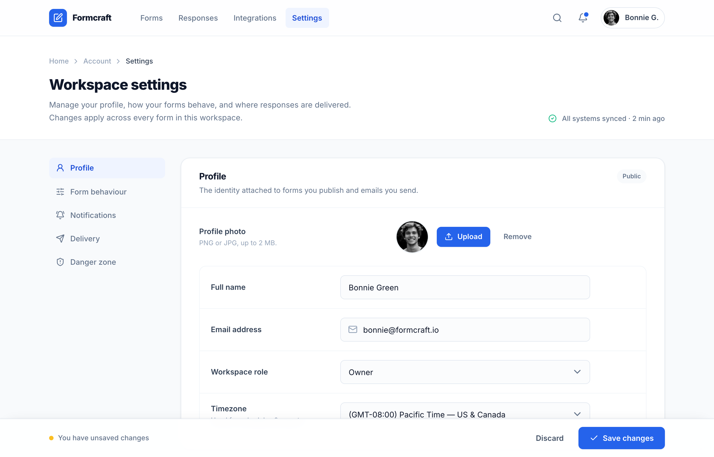

# Formcraft — Workspace Settings (cobalt two-column)

A two-column SaaS workspace-settings screen: sticky app nav, left section nav, grouped settings cards with toggles, a segmented control, selectable delivery cards, and a fixed save bar, in Inter on slate with one cobalt accent.



## Prompt

```text
{"summary": "A two-column workspace-settings screen on a light SaaS canvas: a sticky translucent app nav and breadcrumb header, a left in-page section nav, and a right column of grouped settings cards (Profile, Form behaviour, Notifications, Response delivery, Danger zone). Inputs sit in slate-filled bordered rows with right-aligned controls; toggles, a segmented control, icon-led notification rows, and selectable delivery-destination cards carry one disciplined cobalt accent. A fixed bottom save bar with an unsaved-changes indicator persists across the page. Everything reflows from a two-column desktop grid to a single stacked column on mobile.", "style": {"description": "Calm, modern product-settings aesthetic on a near-white (#f8fafc) canvas with a slate ink palette and one disciplined cobalt-blue accent (#2563eb). Inter typeface, soft rounded cards with hairline borders and a very light card shadow, generous padding, and translucent backdrop-blurred sticky chrome top and bottom.", "prompt": "Use a light, calm SaaS settings visual style. Page background slate-50 #f8fafc; cards and chrome white #ffffff (sticky bars at 85-90% opacity with backdrop-blur). Text in slate: headings/primary #0f172a (ink-900), body/secondary #64748b (ink-500), muted #94a3b8 (ink-400), strong-label #334155 (ink-700) and #1e293b (ink-800). Single accent color cobalt blue #2563eb (cobalt-600), hover #1d4ed8 (cobalt-700), light accent fill #eff4ff (cobalt-50), accent text #1d4ed8 (cobalt-700); focus ring rgba(37,99,235,0.12) at 4px. Borders #e2e8f0 (ink-200, often at 70-80% opacity) and #f1f5f9 (ink-100) for inner row dividers; input fill slate-50 at 60% (#f8fafc/60) turning white #fff on focus, input border #e2e8f0. Danger uses rose: border #fecdd3 (rose-200), text #be123c (rose-700)/#e11d48 (rose-600), hover fill rose-50; success uses emerald-500 #10b981; the unsaved-changes dot is amber-400 #fbbf24. Typeface Inter (weights 400/500/600/700/800), system fallback, antialiased with -webkit-font-smoothing and optimizeLegibility. Headings extrabold with tight tracking (page H1 ~26px, card H2 ~16px); labels semibold ~13.5px; helper/body ~12.5-13px. Rounded corners: lg (8px) on inputs/buttons/icon tiles, xl (12px) on inner grouped field boxes and destination cards, 2xl (16px) on the settings cards. Elevation: a very light card shadow (0 1px 2px rgba(15,23,42,.04), 0 1px 3px rgba(15,23,42,.06)), shadow-sm on primary buttons, and an upward bar shadow on the fixed footer. Selection highlight cobalt-100 #dbe6fe. Keep cobalt rare: only the primary button, selected nav item, focus rings, selected destination card, links, and notification icon tiles."}, "layout_and_structure": {"description": "A max-w-6xl page with a sticky top app nav, a white breadcrumb + title header band, then a body that is a CSS grid of [208px sidebar | 1fr content] on large screens and a single stacked column on mobile. The left sidebar is a sticky in-page section nav; the right column is a vertical stack (gap-7) of rounded settings cards, each card a titled header strip plus rows. A fixed bottom save bar spans the viewport. The sidebar nav becomes a horizontal scrollable strip and every label/field row collapses to stacked on mobile.", "prompts": [{"part": "Sticky app nav", "prompt": "Sticky top header, full width, white at 85% opacity with backdrop-blur-md and a bottom hairline (ink-200/70). Inside a max-w-6xl row (h-16, px-6): left = a cobalt-600 rounded-lg logo tile (h-8 w-8) holding a white lucide:square-pen icon plus an extrabold 'Formcraft' wordmark; then primary nav links 'Forms / Responses / Integrations / Settings' (13.5px medium ink-500, hover bg ink-50) with the active 'Settings' link in a cobalt-50 pill with cobalt-700 semibold text. Right cluster: a ghost search icon button, a bell icon button with a cobalt notification dot ringed in white, and an avatar pill (rounded-full ink-200 border, h-7 avatar image + 'Bonnie G.' name)."}, {"part": "Breadcrumb + page header band", "prompt": "A white section with a bottom hairline. Inside max-w-6xl (pt-9 pb-7 px-6): a breadcrumb row (12.5px ink-400) 'Home > Account > Settings' with lucide:chevron-right separators and the current crumb in ink-700; below it a flex header that is column on mobile and row on sm+: left = an extrabold ~26px 'Workspace settings' H1 with a slate-500 description paragraph ('Manage your profile, how your forms behave, and where responses are delivered. Changes apply across every form in this workspace.'); right = a small status line in ink-500 with an emerald lucide:check-circle-2 icon: 'All systems synced · 2 min ago'."}, {"part": "Two-column body grid + in-page nav", "prompt": "Main wraps a max-w-6xl (pt-8, pb-32 to clear the fixed bar) grid: grid-cols-1 on mobile, lg:grid-cols-[208px_minmax(0,1fr)] with gap-7. Left aside is lg:sticky lg:top-24: a vertical nav (flex-col on lg, horizontal overflow-x-auto strip on mobile) of section links each a rounded-lg row with a lucide icon + label (Profile lucide:user-round, Form behaviour lucide:sliders-horizontal, Notifications lucide:bell-ring, Delivery lucide:send, Danger zone lucide:shield-alert). Active link = cobalt-50 fill + cobalt-700 semibold; others ink-500 with hover bg white. Right column is a flex-col gap-7 stack of cards."}, {"part": "Profile card", "prompt": "Card: rounded-2xl, border ink-200/80, white, light card shadow, overflow-hidden. Header strip (px-6 py-5, sm:px-8, ink-100 bottom border): bold 16px 'Profile' H2 + slate-500 helper line, and a right-aligned ink-50 'Public' status pill. Body (px-6 py-6): first an avatar row that is column on mobile / row on sm justified between, with a left 52-wide semibold label 'Profile photo' + ink-400 sub-hint ('PNG or JPG, up to 2 MB.') and a right group: a 14x14 rounded-full avatar ringed in ink-100, a cobalt-600 'Upload' button with a lucide:upload icon, and a ghost 'Remove' button. Below, a rounded-xl ink-100 bordered group whose rows are split by top hairlines: each row is a label+control pair (label left, control in a max-w-md field box right). Rows: Full name (text input value 'Bonnie Green'), Email address (input with leading lucide:mail icon, value 'bonnie@formcraft.io'), Workspace role (custom select Owner/Admin/Editor/Viewer), Timezone (custom select with a sub-hint label 'Used for schedules & reports.')."}, {"part": "Form behaviour card (toggles + segmented control)", "prompt": "Card with header 'Form behaviour' + helper ('Defaults applied to every new form. Individual forms can override these.'). Body rows split by hairlines: three toggle rows, each a left text block (semibold ink-800 title + ink-500 description) and a right pill toggle switch: 'Smart spam filtering' (on), 'Save partial responses' (on), 'Custom thank-you redirect' (off). Then a 'Submission limit' row whose control is a segmented control: an ink-100 rounded-lg track holding four buttons (None [active = white pill with a light shadow + ink-800 text], 100, 500, Custom). The row is row-on-sm, stacked-on-mobile."}, {"part": "Notifications card (icon rows + select)", "prompt": "Card with header 'Notifications' + helper, and a right cobalt-600 'Select all' text button. Body rows: three notification toggle rows, each left = a 9x9 cobalt-50 rounded-lg icon tile with a cobalt-600 lucide icon (lucide:inbox 'New submissions', lucide:bar-chart-3 'Weekly summary', lucide:megaphone 'Product news') beside a semibold title + description, and right = a pill toggle (first two on, last off). Final row = a label 'Deliver alerts to' + a custom select (Email only / Email + Slack / Slack only)."}, {"part": "Response delivery card (selectable destination cards)", "prompt": "Card with header 'Response delivery' + helper. Body opens with a 2-up responsive grid (grid-cols-1 sm:grid-cols-2, gap-3) of selectable destination cards rendered as labels: the selected 'Google Sheets' card has a 2px cobalt-600 border + cobalt-50/50 fill, a white icon tile (lucide:table-2 cobalt-600), title + 'Connected · 2 forms' subline, and a trailing cobalt lucide:check-circle-2; the unselected 'Webhook' card has a 2px ink-200 border (hover ink-300), an ink-50 icon tile (lucide:webhook), 'Not connected' subline, and a trailing cobalt 'Connect' link. Below, a rounded-xl ink-100 bordered group with two hairline-split rows: a 'Reply-to address' email input (value 'hello@formcraft.io') and an 'Attach file uploads' toggle row (on)."}, {"part": "Danger zone card + fixed save bar", "prompt": "Last card uses a rose-200 border instead of ink: header row (column on mobile, row on sm justified between) with a bold 15px rose-700 'Delete workspace' title + slate-500 warning paragraph, and a right outline danger button (rose-200 border, white bg, rose-600 text, lucide:trash-2 icon, hover rose-50) reading 'Delete'. At the very bottom, a fixed full-width save bar (white at 90% + backdrop-blur, top hairline, upward bar shadow): inside max-w-6xl, left = an amber-400 dot + 'You have unsaved changes' (ink-500 12.5px), right = a ghost 'Discard' button and a cobalt-600 primary 'Save changes' button with a lucide:check icon."}]}, "special_ui_components": ["Pill toggle switch drawn in pure CSS: appearance-none checkbox with ::before track (ink-300 -> cobalt-600 #2563eb on :checked) and a white ::after knob that translates on check, plus a cobalt focus-visible outline", "Segmented control: an ink-100 rounded track of buttons where the active button is a white pill with a light shadow and ink-800 text (.seg-active)", "Custom-styled native select (appearance-none) with an inlined SVG chevron-down (ink-500) positioned right via background-image", "Input with a leading inline lucide:mail icon absolutely positioned inside the field", "Selectable destination cards as <label>s: a selected 2px-cobalt-border + cobalt-50 fill state with a trailing check vs an unselected ink-200 border with a 'Connect' affordance", "Grouped field box: a rounded-xl ink-100 bordered container whose child rows are separated only by top hairlines (.row-divide > * + *)", "Notification rows with a 9x9 cobalt-50 rounded icon tile + cobalt-600 lucide icon", "Translucent sticky top app nav and a fixed bottom save bar, both with backdrop-blur and an unsaved-changes amber dot", "Sticky left in-page section nav that becomes a horizontal scrollable strip on mobile"], "special_notes": "Single accent discipline is the core idea: cobalt #2563eb is reserved for the active nav item, links, focus rings, the primary 'Save/Upload' buttons, the selected destination card, and the notification icon tiles; everything else is slate-on-white, with rose used only for the danger zone, emerald only for the synced status, and amber only for the unsaved-changes dot. The page is a two-column [208px sidebar | 1fr] grid on lg and a single stacked column on mobile; the left section nav is sticky on desktop and a horizontal overflow strip on mobile. Each label+field row is row-on-sm and stacked-on-mobile, with controls capped at max-w-md so long forms stay scannable. Inputs default to a slate-50/60 fill that turns white with a 4px cobalt focus ring. Toggles, segmented control, and selects are drawn in pure CSS (pseudo-elements + inlined SVG), not images. A fixed bottom save bar (pb-32 on main reserves space) keeps the primary action always reachable. Fonts via Google Fonts Inter (400-800); icons via Iconify lucide:* set; Tailwind via CDN with extended 'cobalt' (50 #eff4ff -> 900 #1e3a8a) and 'ink' (50 #f8fafc -> 900 #0f172a) color scales."}
```

**▶ Try it live → [https://superdesign.dev/library/formcraft-workspace-settings-cobalt-two-column](https://p.superdesign.dev/draft/60697ec6-b6f8-4d17-8b48-3729600554c2)**

**Use it in your coding agent:** install the [Superdesign skill](https://github.com/superdesigndev/superdesign-skill), then:

```bash
superdesign get-prompts --slugs "formcraft-workspace-settings-cobalt-two-column" --json
```

*0 copies · 2,284 tries · Forms & Contact · SaaS · form, settings, saas, two-column*
