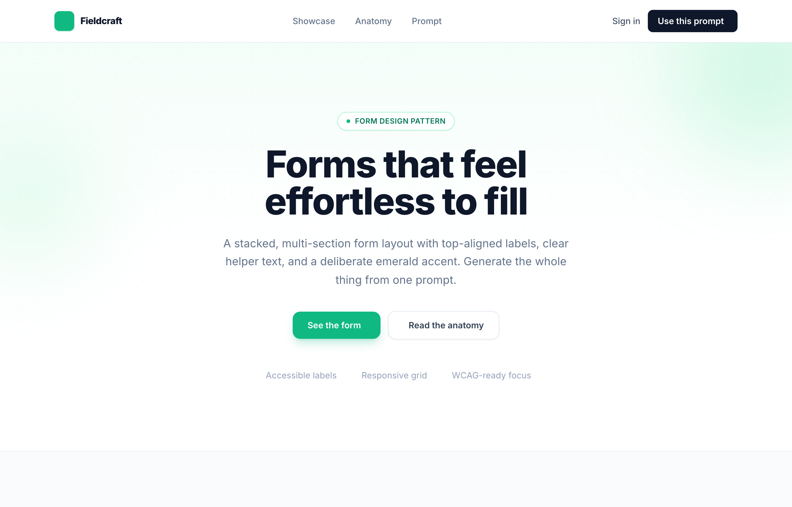

# Forms that feel effortless to fill — Fieldcraft

A stacked, multi-section account-settings form on a white card: top-aligned labels, helper text, a 6-column responsive grid, custom checkboxes and radios, and one disciplined emerald accent for focus and the primary action.



## Prompt

```text
{"summary": "A stacked, multi-section account-settings form on a single white card: top-aligned semibold labels, helper text under the fields that need it, a 6-column responsive grid for name/address rows, custom checkboxes and radios, and a single emerald accent reserved for focus rings, the primary button, and selected states. Wrapped in a marketing-style landing page (sticky nav, gradient hero, anatomy cards, dark prompt-CTA section, footer) that frames the form as a reusable pattern.", "style": {"description": "Calm, editorial SaaS aesthetic on a white canvas with a slate-900 ink palette and one disciplined emerald accent (#10b981). Inter typeface, generous whitespace, soft rounded corners, faint dotted grain texture, and large blurred emerald glow blobs behind the hero and dark CTA.", "prompt": "Use a light, calm SaaS visual style. Background white (#ffffff); body text and headings in slate (#0f172a text-slate-900, secondary text #64748b text-slate-500, muted #94a3b8 text-slate-400). Single accent color emerald #10b981 (hover #059669, focus ring rgba(16,185,129,0.12), darker text #047857/#065f46). Borders #e2e8f0 (slate-200) and inputs #cbd5e1 (slate-300); field fill #f8fafc / slate-50. Typeface Inter (weights 400/500/600/700/800), system-ui fallback, antialiased, -webkit-font-smoothing. Headings extrabold with tight tracking and 1.05 line-height; eyebrow labels uppercase, bold, letter-spacing 0.18em, emerald-600. Rounded corners: lg (8px) on inputs/buttons, xl (12px) on icon tiles, 2xl (16px) on the form card and anatomy cards. Soft elevation: shadow-sm on chips/buttons, shadow-xl with a 5% slate tint on the form card, colored shadow-emerald-500/25 under primary buttons. Add a faint dotted grain (radial-gradient rgba(15,23,42,0.035) 1px dots on a 22px grid) and large blurred emerald glow blobs (bg-emerald-200/40, blur-3xl) behind hero and the dark CTA. Keep emerald rare: only focus, primary action, and selected states."}, "layout_and_structure": {"description": "Single-column, centered max-w-6xl page. Sticky translucent nav, gradient hero with centered headline, a slate-50 showcase band holding the form on a max-w-3xl white card, a 3-up anatomy grid on white, a dark emerald-glow prompt CTA with a code block, then a footer. The form itself is divided into stacked sections separated by hairline dividers, each section using a vertical stack or a 6-column responsive grid that collapses to one column on mobile.", "prompts": [{"part": "Sticky nav", "prompt": "Sticky top nav, full width, white at 85% opacity with backdrop-blur and a bottom border (slate-200/80). Inside a max-w-6xl row (px-6 py-4): left = emerald square-pen logo tile (h-8 w-8, rounded-lg, bg-emerald-500, white lucide:square-pen icon) plus extrabold 'Fieldcraft' wordmark; center = hidden-on-mobile links 'Showcase / Anatomy / Prompt' in slate-500 medium that darken on hover; right = a text 'Sign in' link and a slate-900 pill button 'Use this prompt' with a lucide:arrow-right icon."}, {"part": "Hero", "prompt": "Centered hero (max-w-2xl, py-20 to py-28) over a gradient from emerald-50/60 to white, with dotted grain and two blurred emerald blobs. Top: a rounded-full white pill badge with an emerald dot and 'FORM DESIGN PATTERN' in emerald-700. Then an extrabold 5xl/6xl two-line headline 'Forms that feel effortless to fill', a slate-500 lg subhead, and a button row: primary emerald 'See the form' (lucide:arrow-down) + secondary white outline 'Read the anatomy' (lucide:layout-list). Below, a centered row of three slate-400 trust items each prefixed with an emerald lucide:check: 'Accessible labels', 'Responsive grid', 'WCAG-ready focus'."}, {"part": "Showcase form card", "prompt": "Showcase band on slate-50/70 with faint grain. Centered eyebrow 'THE COMPONENT' (emerald-600), an 'Account settings form' h2, and a subhead. The form sits on a max-w-3xl white card: rounded-2xl, border slate-200, shadow-xl, with sections separated by divide-y divide-slate-100. Section padding px-6 py-8 (sm:px-10 sm:py-10). Each section opens with a bold base-size title and a slate-500 description line."}, {"part": "Profile section", "prompt": "First form section 'Profile' (helper: 'This information is displayed publicly...'). Fields, vertically stacked with space-y-6: (1) Username input with a left prefix 'fieldcraft.app/' inside a single bordered group; (2) 'About' textarea, 4 rows, with helper text 'Write a few sentences about yourself. Markdown is supported.'; (3) 'Photo' row = a 12x12 emerald-100 avatar circle with a person glyph plus a white outline 'Change' button; (4) 'Cover photo' dashed-border dropzone (border-2 border-dashed, rounded-xl) with a lucide:image-up icon, 'Upload a file or drag and drop' (the 'Upload a file' part emerald-600), and 'PNG, JPG, GIF up to 10MB'."}, {"part": "Personal information section", "prompt": "Second section 'Personal information' (helper: 'Use a permanent address...') laid out on a 6-column grid (grid-cols-1 sm:grid-cols-6, gap-x-5 gap-y-6): First name + Last name each span 3; Email (span 4) with a leading lucide:mail icon inside the input; Country (span 2) as a custom select with an appended lucide:chevron-down; Street address spans all 6; City / State / Province / ZIP each span 2. All inputs are slate-50 filled, slate-300 bordered, rounded-lg, with top-aligned semibold slate-700 labels."}, {"part": "Notifications section", "prompt": "Third section 'Notifications'. A 'By email' fieldset with three start-aligned custom checkbox rows (Comments checked by default, Mentions, Product updates), each row showing a bold title plus a slate-500 description. Then a 'Push notifications' fieldset (helper line) with three custom radio rows: 'Everything' (selected), 'Same as email', 'No push notifications'."}, {"part": "Form actions bar", "prompt": "Bottom action bar on slate-50/60, right-aligned: a ghost 'Cancel' text button and a primary emerald 'Save changes' button (rounded-lg, bg-emerald-500, lucide:check icon, colored emerald shadow). Below the card, a centered slate-400 micro-caption: 'Every field, label, and helper line is selectable and keyboard-navigable. No screenshots, no mockups.'"}, {"part": "Anatomy section", "prompt": "White section with eyebrow 'WHY IT WORKS', h2 'The anatomy of a calm form', and a 3-column card grid (md:grid-cols-3). Each card: rounded-2xl, slate-200 border, an emerald-50 icon tile with emerald-600 lucide icon (align-left, grid-2x2, focus), a bold title ('Labels on top', 'A 6-column grid', 'One accent, used sparingly') and a slate-500 paragraph; cards lift slightly on hover."}, {"part": "Prompt CTA + footer", "prompt": "Dark slate-900 CTA section with emerald glow blobs: extrabold white h2 'Generate this form from one prompt', a slate-300 subhead, a faux code window (rounded-xl, border white/10, bg-slate-950/60, a 'prompt.txt' header row with an emerald 'Copy' affordance) holding the prompt text, then a button row: emerald 'Open in Acme' (lucide:sparkles) + a translucent white-outline 'Back to the form'. Footer on white: logo + 'Fieldcraft', a slate-400 caption, and github/twitter icon links."}]}, "special_ui_components": ["Input with leading text prefix (fieldcraft.app/) sharing one focus ring across prefix + field", "Input with a leading inline icon (lucide:mail) absolutely positioned inside the field", "Custom-styled native select with an appended lucide:chevron-down (appearance-none)", "Dashed-border file dropzone with upload icon, emerald hover, and accepted-formats hint", "Custom CSS-drawn checkboxes (.ck): emerald fill + white checkmark via ::after on :checked, 4px emerald focus ring", "Custom CSS-drawn radios (.rd): emerald ring + emerald dot via ::after on :checked, 4px emerald focus ring", "Group-level focus state on the username field via focus-within (border + bg + ring shift to emerald)", "Faux code-editor window (titlebar + Copy affordance + monospace prompt) in the dark CTA", "Translucent sticky nav with backdrop-blur"], "special_notes": "Single accent discipline is the core idea: emerald (#10b981) is used ONLY on focus rings, the primary button, and selected checkbox/radio states; everything else is slate/white. Labels are always top-aligned and semibold (text-slate-700) so the eye scans straight down. The 6-column grid is the responsive backbone: paired/tripled fields collapse to one column on mobile with no rework. Inputs default to a slate-50 fill that turns white on focus. Custom checkbox/radio marks are drawn in pure CSS (::after pseudo-elements), not images, and carry visible focus rings for WCAG. Fonts via Google Fonts Inter; icons via Iconify (lucide:* set). Tailwind via CDN with an extended emerald scale (50 #ecfdf5 -> 900 #064e3b)."}
```

**▶ Try it live → [https://superdesign.dev/library/forms-that-feel-effortless-to-fill-fieldcraft](https://p.superdesign.dev/draft/1e008422-dd41-414e-aa04-f6b300ad210d)**

**Use it in your coding agent:** install the [Superdesign skill](https://github.com/superdesigndev/superdesign-skill), then:

```bash
superdesign get-prompts --slugs "forms-that-feel-effortless-to-fill-fieldcraft" --json
```

*0 copies · 2,299 tries · Forms & Contact · SaaS · form, forms, settings, saas*
