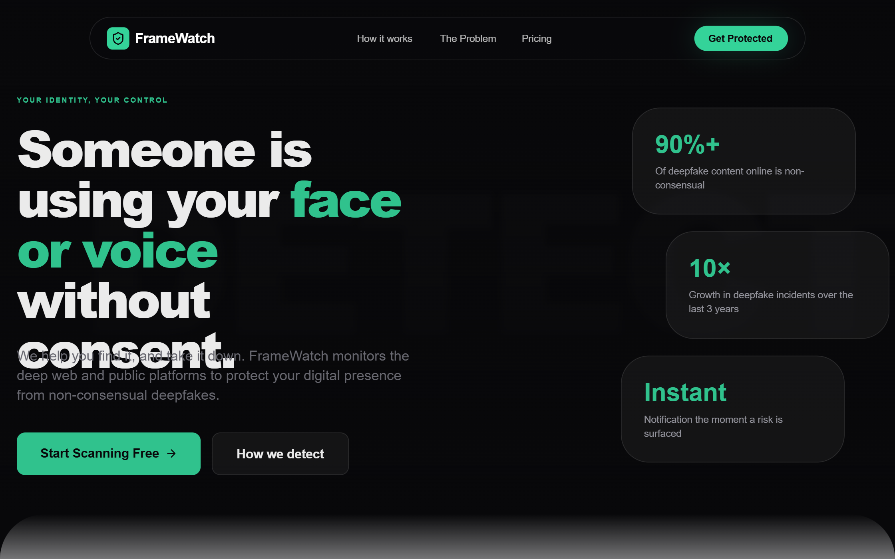

# FrameWatch | Matrix Enhanced Hero

A high-end, light-themed tech aesthetic with a 'Matrix' inspired twist. It features a clean white/slate background punctuated by vibrant rose/coral accents (#fb7185) and diverse code-snippet colors. Suitable for cybersecurity, SaaS, fintech, or AI identity protection startups. The style utilizes glassmorphism, bold editorial typography (Satoshi), and sophisticated scroll-triggered animations. Notable for its 'Code Matrix' hero background where floating snippets of logic create a technical yet breathable atmosphere.



## Prompt

```text
{
  "summary": "A minimalist tech-security design system utilizing high-contrast typography, a vibrant rose-colored accent, and a signature 'Matrix' code-floating hero effect. It balances a professional white-label look with futuristic animation and glassmorphism elements.",
  "style": {
    "description": "The style is defined by its clean, premium light-mode interface. It uses 'Satoshi' for headlines and body text to convey modern authority, paired with 'JetBrains Mono' for technical accents. The color palette centers on Slate-900 (#0f172a) for depth and Rose-500 (#fb7185) for urgency and branding. Glassmorphism is used for navigation and cards (blur: 24px, border-opacity: 0.08). Transitions are exceptionally smooth, using a signature cubic-bezier(0.16, 1, 0.3, 1) for all movement.",
    "prompt": "Create a design system with a clean white base (#ffffff) and slate hierarchy (950: #020617, 500: #64748b, 50: #f8fafc). **Primary Accent**: Rose-500 (#fb7185). **Typography**: Use 'Satoshi' as the primary font; Headings should be 900 weight, tracking-tighter (-0.05em), and leading-none. Use 'JetBrains Mono' for small, uppercase technical labels. **Borders**: 1px solid rgba(0, 0, 0, 0.05) for cards. **Shadows**: Soft, multi-layered shadows for floating elements. **Animations**: Use a 'reveal-on-scroll' effect with `transform: translateY(60px)` to `0` and `opacity: 1` over 1.5s using `cubic-bezier(0.16, 1, 0.3, 1)`. **The Matrix Effect**: A grid-based background with floating text snippets in diverse colors like Teal-600, Amber-500, and Purple-600, with a float animation: `translateY(-20px) translateX(10px)` over 20-40s."
  },
  "layout_and_structure": {
    "description": "A structured landing page layout that flows from a high-impact animated hero into vertical timeline statistics, followed by asymmetrical feature sections and a horizontal tiered pricing list.",
    "prompts": [
      {
        "part": "Header / Navigation",
        "prompt": "Design a pill-shaped glass navigation bar fixed at the top. Background: `rgba(255, 255, 255, 0.8)` with 24px backdrop blur. Border: `1px solid rgba(0,0,0,0.08)`. Links should be 11px, bold, uppercase, with a 0.2em letter spacing. The login button is a high-contrast Rose-500 pill with a shadow-rose-500/20. Include a hover effect where an underline expands from the center."
      },
      {
        "part": "Hero Section",
        "prompt": "Full-screen section with a white-to-slate-50 gradient. The background is filled with a non-overlapping grid of floating code snippets in various colors. Central content: A pill-shaped badge with a pulsing rose dot, followed by a massive 8xl headline ('Satoshi' Black). The text must have a subtle white drop-shadow to maintain readability over the background code matrix. Include a bouncing chevron-down at the bottom center."
      },
      {
        "part": "Statistics Timeline",
        "prompt": "A vertical layout featuring a central thin rose line (1px, opacity 0.3). Statistics blocks are centered on the line. Each block features an oversized background number in `rose-500/0.04` (200px size) and a high-contrast heading. Use icons in circles with 2px rose borders as 'milestones' on the timeline."
      },
      {
        "part": "Feature Sections",
        "prompt": "Implement sections with `5rem` top corner radii for a 'card stacking' feel. Use an asymmetrical layout: one side contains a large step number (01, 02) with 0.25 opacity and Satoshi Black font, while the other side contains a 'glass-card' container (aspect-square) holding a large icon with a custom animation (e.g., spinning radar or pulsing shield)."
      },
      {
        "part": "Pricing List",
        "prompt": "A vertical stack of horizontal glass cards. Each card should have three segments: (1) Icon and title, (2) Feature tags in small pill badges, (3) Price and CTA button. Highlight the middle card with a faint rose background tint (`rose-500/0.03`) and a 'Most Popular' badge floating above the top-right corner."
      }
    ]
  },
  "special_ui_components": [
    {
      "component": "Floating Code Matrix",
      "description": "An interactive background grid that prevents overlapping text and simulates 'live execution'.",
      "prompt": "Create a grid-based container with `mask-image: radial-gradient(circle, black 30%, transparent 85%)`. Fill the grid with `JetBrains Mono` text strings. Each string should have a random color from a predefined set (Rose, Teal, Amber, Sky) and a unique animation duration for the floating effect. Use a script to periodically flicker the opacity of random snippets to simulate data processing."
    },
    {
      "component": "Interactive Pricing Card",
      "description": "A horizontal layout card that scales and changes border color on hover.",
      "prompt": "Design a horizontal card with `transition: all 0.5s cubic-bezier(0.16, 1, 0.3, 1)`. On hover, scale by 1.01, increase shadow to `0 25px 50px -12px rgba(0, 0, 0, 0.08)`, and change the border color to `rgba(251, 113, 133, 0.4)`. The CTA button inside should transition from white-to-black or rose-to-darker-rose."
    }
  ]
}
```

**▶ Try it live → [https://superdesign.dev/library/framewatch-or-matrix-enhanced-hero](https://superdesign.dev/library/framewatch-or-matrix-enhanced-hero)**

*15 copies · 2,480 tries · tags: *
