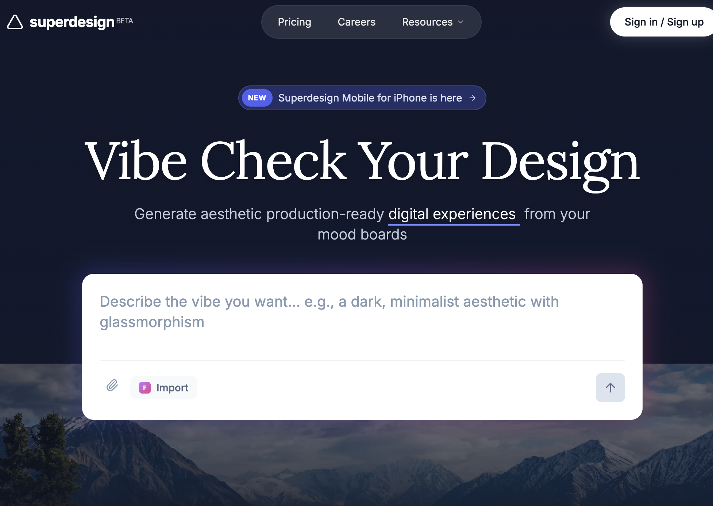

# Futuristic SasS Landing Page

A modern, atmospheric SaaS design system featuring a high-contrast blend of dark mode hero sections and light mode content areas. Characterized by glassmorphism, sophisticated serif-sans typography pairing, and ethereal glows, it is ideal for AI startups, design tools, creative portfolios, and premium digital platforms. The style emphasizes depth through backdrop blurs, subtle borders (1px), and smooth micro-interactions like scroll-triggered navigation and hover-based transforms.



## Prompt

```text
{
  "summary": "Superdesign is a sophisticated, vibe-centric design system that blends deep slate atmospheric backgrounds with a clean, grid-based feature layout. It utilizes a mix of 'Inter' (sans) for utility, 'Lora' (serif) for emotional headlines, and 'Space Grotesk' for a technical edge. The visual identity relies on glass panels (blur 12px), vibrant indigo accents (#6366f1), and animated glow gradients to create a futuristic, premium feel.",
  "style": {
    "description": "The style is 'Modern Atmospheric'. It pairs dark, deep backgrounds (#0f172a) in the hero and testimonials with clean, off-white surfaces (#f8f9fa) for detailed features. Typography is a critical pillar, using a serif font (Lora) for large, expressive headlines and a high-legibility sans (Inter) for body text. Animations are subtle but intentional: typing cursors, 180-degree logo rotations on hover, and 500ms smooth transitions for sticky navigation states.",
    "prompt": "### Visual Language\n- **Base Palette**: Primary Dark (#0f172a), Brand Indigo (#6366f1), Surface White (#f8f9fa), Border White (rgba(255,255,255,0.1)).\n- **Typography**: \n  - Headlines: Serif (Lora), 400-700 weight, tracking-tight, leading 1.1.\n  - UI/Body: Sans (Inter), 400-600 weight, leading-relaxed.\n  - Accents/Branding: Display (Space Grotesk), tracking-tight.\n- **Glassmorphism**: \n  - Soft: `background: rgba(255, 255, 255, 0.05); backdrop-filter: blur(12px); border: 1px solid rgba(255, 255, 255, 0.1);`.\n  - Strong: `background: rgba(30, 41, 59, 0.7); backdrop-filter: blur(16px); border: 1px solid rgba(255, 255, 255, 0.1); shadow: 0 4px 30px rgba(0, 0, 0, 0.1);`.\n- **Effects**: \n  - Outer Glow: `radial-gradient(from-indigo-500 via-purple-500 to-pink-500), blur(20px), opacity(0.3)`. \n  - Grid Overlays: Subtle 1px grid pattern with linear-gradient masks."
  },
  "layout_and_structure": {
    "description": "A tiered layout starting with a 110vh atmospheric hero section, transitioning into a multi-column feature section with sticky side-navigation, followed by a glassmorphic masonry testimonial grid and a clean accordion-based FAQ.",
    "prompts": [
      {
        "part": "Navigation",
        "prompt": "Sticky or absolute top navigation. Logo on left (icon + bold lowercase text). Center: a capsule-shaped pill `bg-white/10 backdrop-blur-md` containing links. Right: Primary CTA button with `shadow-[0_0_20px_rgba(255,255,255,0.2)]`."
      },
      {
        "part": "Hero Section",
        "prompt": "Full viewport (110vh). Background: Image overlayed with a slate-900 to transparent gradient. Center-aligned content. Top: Small indigo badge with a 'New' tag. Middle: Serif headline (text-7xl). Bottom: Large white input area (rounded-2xl) with a multi-colored outer glow shadow. Ensure a typing cursor animation on subheading text."
      },
      {
        "part": "Integration Bar",
        "prompt": "Floating glass panel (width: max-w-4xl) at the bottom of the hero. Two-part horizontal split. Left: 'Frameworks' label + logos. Right: 'Integrations' label + marquee/scrollable list of monochrome icons with hover color transitions."
      },
      {
        "part": "Feature Scroll-Spy",
        "prompt": "Light mode background (#f8f9fa). Layout: 25% sticky left sidebar for navigation, 75% main content. Sidebar features vertical links with a dot indicator that activates on scroll. Feature cards are alternating 2-column grids (Text vs Visual). Visuals include code snippets in dark blocks or grayscale blueprints with SVG overlay lines."
      },
      {
        "part": "Testimonials",
        "prompt": "Switch back to Slate-900 background. Use a masonry grid layout. Cards must use 'Glass Strong' style. Profiles include avatar, name, and social handle. Quotes should use 14px text-slate-200 with high line-height."
      },
      {
        "part": "FAQ",
        "prompt": "Centered 4xl container on white background. Items use light gray (#f3f4f6) rounded blocks. Interaction: Smooth height transition from 0 to max-content on click, with chevron rotation."
      }
    ]
  },
  "special_ui_components": [
    {
      "component": "Vibe Input Box",
      "description": "A high-fidelity text input that feels like a primary command center.",
      "prompt": "White container, 16px padding, rounded-2xl. Underneath, a hidden `div` with absolute positioning and `-inset-1` spacing applies a multi-color gradient (indigo to pink) with a `blur-lg` effect that intensifies on hover. Internal layout includes a borderless textarea (text-xl) and a bottom utility bar with attachment and 'send' (arrow-up) buttons."
    },
    {
      "component": "Sticky Feature Nav",
      "description": "Vertical navigation that tracks user progress through content sections.",
      "prompt": "Left-aligned list. Items transition from text-slate-400 (medium) to text-slate-900 (bold) based on scroll intersection. A 6px rounded circle (bg-black) appears to the left of the active item. Use a 500ms ease-in-out transition for the opacity and color shift."
    }
  ]
}
```

**▶ Try it live → [https://superdesign.dev/library/futuristic-sass-landing-page](https://superdesign.dev/library/futuristic-sass-landing-page?utm_source=github&utm_medium=prompt-repo&utm_campaign=prompt-library)**

**Use it in your coding agent:** install the [Superdesign skill](https://github.com/superdesigndev/superdesign-skill), then:

```bash
superdesign get-prompts --slugs "futuristic-sass-landing-page" --json
```

*942 copies · 1,663 tries · landing page, page, style, webapp, techfoward*
