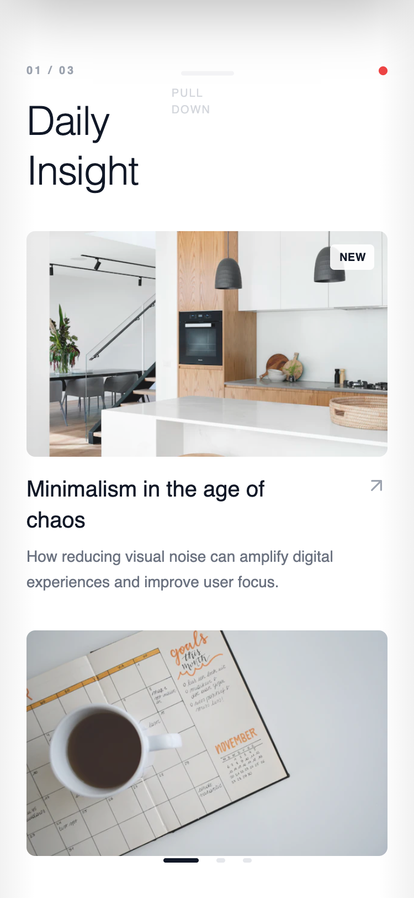

# Gesture First Navigation System

A content-first navigation system that minimizes visible chrome and relies primarily on swipe gestures to move between major sections, creating an immersive and fluid experience.

Best Suitable For
Media apps, reading apps, gallery-style products, experimental consumer experiences.



## Prompt

```text
Here is a reference implementation:

~~~html
<!DOCTYPE html>
<html lang="en">
<head>
    <meta charset="UTF-8">
    <meta name="viewport" content="width=device-width, initial-scale=1.0, maximum-scale=1.0, user-scalable=no">
    <title>Gesture Navigation System</title>
    <script src="https://cdn.tailwindcss.com"></script>
    <script src="https://code.iconify.design/iconify-icon/1.0.7/iconify-icon.min.js"></script>
    <link href="https://fonts.googleapis.com/css2?family=Manrope:wght@200;300;400;500;600;700;800&display=swap" rel="stylesheet">
    <style>
        body {
            font-family: 'Manrope', sans-serif;
            overscroll-behavior: none;
            background-color: #f3f4f6;
        }
        /* Hide scrollbars for clean look */
        .no-scrollbar::-webkit-scrollbar { display: none; }
        .no-scrollbar { -ms-overflow-style: none; scrollbar-width: none; }
        
        /* Physics-based transitions */
        .snap-transition {
            transition: transform 0.5s cubic-bezier(0.19, 1, 0.22, 1);
        }

        /* Animation for gesture hints */
        @keyframes hint-bounce-x {
            0%, 100% { transform: translateX(0); opacity: 0; }
            20% { opacity: 0.6; }
            50% { transform: translateX(-12px); opacity: 0; }
        }
        @keyframes hint-bounce-y {
            0%, 100% { transform: translateY(0); opacity: 0; }
            20% { opacity: 0.6; }
            50% { transform: translateY(12px); opacity: 0; }
        }
        .hint-x { animation: hint-bounce-x 2.5s ease-in-out infinite; }
        .hint-y { animation: hint-bounce-y 2.5s ease-in-out infinite 1s; }

        /* Glass morphism */
        .glass {
            background: rgba(255, 255, 255, 0.8);
            backdrop-filter: blur(12px);
            -webkit-backdrop-filter: blur(12px);
        }
    </style>
</head>
<body>
    <!-- Main App Container -->
    <!-- touch-action: pan-y allows vertical scroll on children but we capture horizontal -->
    <div id="app" class="w-full h-screen bg-white overflow-hidden relative text-gray-900 shadow-2xl mx-auto" style="touch-action: none; max-width: 100%;">
        
        <!-- TOP ACTION LAYER (Hidden initially) -->
        <div id="action-layer" class="absolute inset-0 bg-gray-900 z-50 transform -translate-y-full text-white pt-14 pb-[34px] px-6 flex flex-col justify-between shadow-2xl" style="will-change: transform;">
            <div class="opacity-0 transition-opacity duration-500 delay-100" id="action-content">
                <div class="flex items-center justify-between mb-12">
                    <h2 class="text-3xl font-light tracking-tight">Quick Actions</h2>
                    <button id="close-actions" class="w-12 h-12 flex items-center justify-center bg-white/10 rounded-full hover:bg-white/20 active:scale-95 transition-all">
                        <iconify-icon icon="lucide:x" class="text-2xl"></iconify-icon>
                    </button>
                </div>
                
                <div class="grid grid-cols-2 gap-4">
                    <button class="h-32 bg-white/5 rounded-2xl flex flex-col items-center justify-center gap-3 hover:bg-white/10 active:scale-95 transition-all group">
                        <iconify-icon icon="lucide:filter" class="text-3xl text-gray-400 group-hover:text-white transition-colors"></iconify-icon>
                        <span class="font-medium text-sm text-gray-300">Filter Feed</span>
                    </button>
                    <button class="h-32 bg-white/5 rounded-2xl flex flex-col items-center justify-center gap-3 hover:bg-white/10 active:scale-95 transition-all group">
                        <iconify-icon icon="lucide:search" class="text-3xl text-gray-400 group-hover:text-white transition-colors"></iconify-icon>
                        <span class="font-medium text-sm text-gray-300">Search</span>
                    </button>
                    <button class="h-32 bg-white/5 rounded-2xl flex flex-col items-center justify-center gap-3 hover:bg-white/10 active:scale-95 transition-all group">
                        <iconify-icon icon="lucide:bell" class="text-3xl text-gray-400 group-hover:text-white transition-colors"></iconify-icon>
                        <span class="font-medium text-sm text-gray-300">Notifications</span>
                    </button>
                    <button class="h-32 bg-white/5 rounded-2xl flex flex-col items-center justify-center gap-3 hover:bg-white/10 active:scale-95 transition-all group">
                        <iconify-icon icon="lucide:settings-2" class="text-3xl text-gray-400 group-hover:text-white transition-colors"></iconify-icon>
                        <span class="font-medium text-sm text-gray-300">Preferences</span>
                    </button>
                </div>
            </div>
            
            <div class="flex flex-col items-center gap-2 pb-8 opacity-50">
                <iconify-icon icon="lucide:chevron-up" class="text-2xl animate-bounce"></iconify-icon>
                <span class="text-xs font-mono uppercase tracking-widest">Push up to close</span>
            </div>
        </div>

        <!-- CONTENT WRAPPER (Horizontal Slider) -->
        <div id="content-wrapper" class="flex h-full w-[300%] relative z-10" style="will-change: transform;">
            
            <!-- PAGE 1: FEED -->
            <div class="w-1/3 h-full pt-14 pb-[34px] px-6 flex flex-col bg-white overflow-hidden">
                <header class="shrink-0 mb-8">
                    <div class="flex justify-between items-center">
                        <span class="text-[10px] font-bold tracking-[0.2em] text-gray-400 uppercase">01 / 03</span>
                        <div class="w-2 h-2 rounded-full bg-red-500"></div>
                    </div>
                    <h1 class="text-4xl font-light mt-4 leading-tight tracking-tight">Daily<br>Insight</h1>
                </header>
                
                <div class="flex-1 overflow-y-auto no-scrollbar pb-10 space-y-8 scroll-container">
                    <article class="group">
                        <div class="w-full aspect-[16/10] bg-gray-100 mb-4 rounded-lg overflow-hidden relative">
                            
                            <div class="absolute top-3 right-3 bg-white/90 backdrop-blur px-2 py-1 rounded text-[10px] font-bold uppercase tracking-wide">New</div>
                        </div>
                        <div class="flex justify-between items-start">
                            <h3 class="text-xl font-medium leading-snug w-3/4">Minimalism in the age of chaos</h3>
                            <iconify-icon icon="lucide:arrow-up-right" class="text-xl text-gray-400"></iconify-icon>
                        </div>
                        <p class="text-gray-500 text-sm mt-2 leading-relaxed line-clamp-2">How reducing visual noise can amplify digital experiences and improve user focus.</p>
                    </article>

                    <article class="group">
                        <div class="w-full aspect-[16/10] bg-gray-100 mb-4 rounded-lg overflow-hidden relative">
                            
                        </div>
                        <div class="flex justify-between items-start">
                            <h3 class="text-xl font-medium leading-snug w-3/4">Natural forms</h3>
                            <iconify-icon icon="lucide:arrow-up-right" class="text-xl text-gray-400"></iconify-icon>
                        </div>
                        <p class="text-gray-500 text-sm mt-2 leading-relaxed line-clamp-2">Exploring organic shapes in rigid grid systems.</p>
                    </article>
                </div>
            </div>

            <!-- PAGE 2: EXPLORE -->
            <div class="w-1/3 h-full pt-14 pb-[34px] px-6 flex flex-col bg-gray-50 overflow-hidden">
                <header class="shrink-0 mb-8">
                    <div class="flex justify-between items-center">
                        <span class="text-[10px] font-bold tracking-[0.2em] text-gray-400 uppercase">02 / 03</span>
                    </div>
                    <h1 class="text-4xl font-light mt-4 leading-tight tracking-tight">Explore<br>Topics</h1>
                </header>

                <div class="flex-1 overflow-y-auto no-scrollbar pb-10 scroll-container">
                    <!-- Masonry-ish Grid -->
                    <div class="flex gap-4 mb-4">
                        <div class="w-1/2 aspect-[3/4] bg-white p-4 flex flex-col justify-between rounded-lg shadow-sm active:scale-95 transition-transform">
                            <iconify-icon icon="lucide:camera" class="text-2xl text-gray-300"></iconify-icon>
                            <span class="text-sm font-medium">Photography</span>
                        </div>
                        <div class="w-1/2 flex flex-col gap-4">
                             <div class="flex-1 bg-gray-900 p-4 flex flex-col justify-between rounded-lg shadow-sm text-white active:scale-95 transition-transform">
                                <iconify-icon icon="lucide:music" class="text-2xl text-gray-600"></iconify-icon>
                                <span class="text-sm font-medium">Music</span>
                            </div>
                             <div class="flex-1 bg-white p-4 flex flex-col justify-between rounded-lg shadow-sm active:scale-95 transition-transform">
                                <iconify-icon icon="lucide:pen-tool" class="text-2xl text-gray-300"></iconify-icon>
                                <span class="text-sm font-medium">Design</span>
                            </div>
                        </div>
                    </div>
                    
                    <div class="w-full aspect-video bg-white mb-4 rounded-lg p-6 flex flex-col justify-center gap-2 shadow-sm active:scale-95 transition-transform">
                        <span class="text-xs font-bold text-blue-600 uppercase tracking-widest">Featured Collection</span>
                        <h3 class="text-2xl font-light">Interface Dynamics</h3>
                        <p class="text-sm text-gray-400">12 curated items</p>
                    </div>

                    <div class="flex gap-4">
                        <div class="w-1/2 aspect-square bg-gray-200 p-4 flex flex-col justify-between rounded-lg active:scale-95 transition-transform">
                            <iconify-icon icon="lucide:code-2" class="text-2xl text-gray-500"></iconify-icon>
                            <span class="text-sm font-medium">Dev</span>
                        </div>
                        <div class="w-1/2 aspect-square bg-white p-4 flex flex-col justify-between rounded-lg shadow-sm active:scale-95 transition-transform">
                            <iconify-icon icon="lucide:globe" class="text-2xl text-gray-300"></iconify-icon>
                            <span class="text-sm font-medium">Web</span>
                        </div>
                    </div>
                </div>
            </div>

            <!-- PAGE 3: PROFILE -->
            <div class="w-1/3 h-full pt-14 pb-[34px] px-6 flex flex-col bg-white overflow-hidden">
                <header class="shrink-0 mb-8 flex justify-between items-start">
                    <div>
                        <span class="text-[10px] font-bold tracking-[0.2em] text-gray-400 uppercase">03 / 03</span>
                        <h1 class="text-4xl font-light mt-4 leading-tight tracking-tight">User<br>Profile</h1>
                    </div>
                    <div class="w-14 h-14 rounded-full bg-gray-100 overflow-hidden ring-4 ring-gray-50">
                        
                    </div>
                </header>

                <div class="flex gap-12 mb-10 shrink-0">
                    <div>
                        <div class="text-2xl font-light tabular-nums">842</div>
                        <div class="text-[10px] text-gray-400 uppercase tracking-widest mt-1">Following</div>
                    </div>
                    <div>
                        <div class="text-2xl font-light tabular-nums">12.5k</div>
                        <div class="text-[10px] text-gray-400 uppercase tracking-widest mt-1">Followers</div>
                    </div>
                </div>

                <div class="flex-1 border-t border-gray-100 pt-6 overflow-y-auto no-scrollbar scroll-container">
                    <h3 class="text-xs font-bold uppercase tracking-widest mb-6 text-gray-400">Saved Lists</h3>
                    <div class="space-y-3">
                        <div class="group flex items-center justify-between p-4 bg-gray-50 hover:bg-gray-100 transition-colors rounded-lg cursor-pointer">
                            <div class="flex items-center gap-4">
                                <div class="w-10 h-10 bg-white rounded flex items-center justify-center text-gray-400">
                                    <iconify-icon icon="lucide:bookmark"></iconify-icon>
                                </div>
                                <span class="font-medium">Reading List</span>
                            </div>
                            <span class="text-gray-400 text-xs font-mono">12</span>
                        </div>
                        
                        <div class="group flex items-center justify-between p-4 bg-gray-50 hover:bg-gray-100 transition-colors rounded-lg cursor-pointer">
                            <div class="flex items-center gap-4">
                                <div class="w-10 h-10 bg-white rounded flex items-center justify-center text-gray-400">
                                    <iconify-icon icon="lucide:heart"></iconify-icon>
                                </div>
                                <span class="font-medium">Liked Posts</span>
                            </div>
                            <span class="text-gray-400 text-xs font-mono">148</span>
                        </div>

                         <div class="group flex items-center justify-between p-4 bg-gray-50 hover:bg-gray-100 transition-colors rounded-lg cursor-pointer">
                            <div class="flex items-center gap-4">
                                <div class="w-10 h-10 bg-white rounded flex items-center justify-center text-gray-400">
                                    <iconify-icon icon="lucide:archive"></iconify-icon>
                                </div>
                                <span class="font-medium">Archive</span>
                            </div>
                            <span class="text-gray-400 text-xs font-mono">4</span>
                        </div>
                    </div>
                </div>
            </div>

        </div>

        <!-- OVERLAYS & CONTROLS -->
        
        <!-- Pagination Indicators -->
        <div class="absolute bottom-8 left-0 w-full flex justify-center gap-4 z-30 pointer-events-none">
            <div id="dot-0" class="h-1 rounded-full bg-gray-900 transition-all duration-300 w-8"></div>
            <div id="dot-1" class="h-1 rounded-full bg-gray-200 transition-all duration-300 w-2"></div>
            <div id="dot-2" class="h-1 rounded-full bg-gray-200 transition-all duration-300 w-2"></div>
        </div>

        <!-- Initial Gesture Hints -->
        <div id="hints" class="absolute inset-0 pointer-events-none z-40 transition-opacity duration-700">
            <div class="absolute top-1/2 right-6 -translate-y-1/2 flex flex-col items-end opacity-0 hint-x">
                <iconify-icon icon="lucide:arrow-left" class="text-3xl text-gray-400"></iconify-icon>
            </div>
            <div class="absolute top-14 left-0 w-full flex justify-center opacity-0 hint-y">
                <div class="flex flex-col items-center gap-2">
                    <div class="w-12 h-1 bg-gray-200 rounded-full"></div>
                    <span class="text-[10px] uppercase tracking-widest text-gray-400 font-medium">Pull Down</span>
                </div>
            </div>
        </div>

        <!-- Depth Shadows -->
        <div class="absolute top-0 bottom-0 left-0 w-8 bg-gradient-to-r from-black/5 to-transparent pointer-events-none z-20"></div>
        <div class="absolute top-0 bottom-0 right-0 w-8 bg-gradient-to-l from-black/5 to-transparent pointer-events-none z-20"></div>

    </div>

    <script>
        /* 
           GESTURE NAVIGATION CORE 
           Handles horizontal swipes for pages and vertical pull for action layer.
        */
        
        // State
        let state = {
            page: 0,
            isDragging: false,
            startX: 0,
            startY: 0,
            direction: null, // 'horizontal' or 'vertical'
            isActionOpen: false
        };

        // Configuration
        const config = {
            snapThreshold: window.innerWidth * 0.25,
            verticalThreshold: 120,
            dragResistance: 0.3
        };

        // DOM Elements
        const els = {
            app: document.getElementById('app'),
            content: document.getElementById('content-wrapper'),
            actions: document.getElementById('action-layer'),
            actionContent: document.getElementById('action-content'),
            closeBtn: document.getElementById('close-actions'),
            hints: document.getElementById('hints'),
            dots: [0, 1, 2].map(i => document.getElementById(`dot-${i}`))
        };

        // Lifecycle & Hints
        setTimeout(() => {
            if (els.hints) {
                els.hints.querySelectorAll('div').forEach(el => el.classList.remove('opacity-0'));
            }
        }, 500);

        const removeHints = () => {
            const hintsEl = els.hints;
            if(hintsEl) {
                hintsEl.style.opacity = '0';
                setTimeout(() => hintsEl.remove(), 700);
                els.hints = null;
            }
        };

        // UI Updates
        const updatePagination = () => {
            els.dots.forEach((dot, idx) => {
                if (idx === state.page) {
                    dot.className = 'h-1 rounded-full bg-gray-900 transition-all duration-300 w-8';
                } else {
                    dot.className = 'h-1 rounded-full bg-gray-200 transition-all duration-300 w-2';
                }
            });
        };

        const updateActionLayerOpacity = (percent) => {
            // Fade in content as we pull down
            const opacity = Math.min(Math.max(percent, 0), 1);
            els.actionContent.style.opacity = opacity;
        };

        // Input Handlers
        const onPointerDown = (e) => {
            removeHints();
            state.isDragging = true;
            state.startX = e.clientX;
            state.startY = e.clientY;
            state.direction = null;
            
            // Disable transitions for direct 1:1 movement
            els.content.classList.remove('snap-transition');
            els.actions.classList.remove('snap-transition');
        };

        const onPointerMove = (e) => {
            if (!state.isDragging) return;

            const dx = e.clientX - state.startX;
            const dy = e.clientY - state.startY;

            // Determine Gesture Direction (Lock)
            if (!state.direction) {
                if (Math.abs(dx) > Math.abs(dy) && Math.abs(dx) > 5) state.direction = 'horizontal';
                else if (Math.abs(dy) > Math.abs(dx) && Math.abs(dy) > 5) state.direction = 'vertical';
            }

            if (state.direction === 'horizontal') {
                if (state.isActionOpen) return; // Lock horiz swipe if actions open
                
                // Prevent default browser nav actions
                if (e.cancelable) e.preventDefault();

                const baseTranslate = -state.page * els.app.clientWidth;
                let moveX = baseTranslate + dx;
                
                // Resistance at edges
                if ((state.page === 0 && dx > 0) || (state.page === 2 && dx < 0)) {
                    moveX = baseTranslate + (dx * config.dragResistance);
                }
                
                els.content.style.transform = `translateX(${moveX}px)`;

            } else if (state.direction === 'vertical') {
                // Logic for Pull Down Actions
                
                // Only trigger pull down if we are at top of scroll or action layer is open
                // For this demo, we assume pull down works from header area mostly, but we'll allow it generally
                // if the intention is clearly DOWN and we are at top.
                
                // Simple check: if dragging DOWN and not open, OR dragging UP and open
                if (!state.isActionOpen && dy > 0) {
                     // Opening
                     const moveY = -els.app.clientHeight + dy;
                     // Only move if we are actually pulling down
                     if (moveY < 0) {
                         els.actions.style.transform = `translateY(${moveY}px)`;
                         updateActionLayerOpacity(dy / (els.app.clientHeight * 0.5));
                     }
                } else if (state.isActionOpen) {
                    // Closing (dragging up)
                    let moveY = dy;
                    if (moveY > 0) moveY *= 0.2; // Resistance if pulling down more
                    els.actions.style.transform = `translateY(${moveY}px)`;
                }
            }
        };

        const onPointerUp = (e) => {
            if (!state.isDragging) return;
            state.isDragging = false;
            
            // Restore smooth physics
            els.content.classList.add('snap-transition');
            els.actions.classList.add('snap-transition');

            const dx = e.clientX - state.startX;
            const dy = e.clientY - state.startY;

            if (state.direction === 'horizontal') {
                if (Math.abs(dx) > config.snapThreshold) {
                    if (dx > 0 && state.page > 0) state.page--;
                    else if (dx < 0 && state.page < 2) state.page++;
                }
                els.content.style.transform = `translateX(-${state.page * (100 / 3)}%)`;
                updatePagination();

            } else if (state.direction === 'vertical') {
                if (state.isActionOpen) {
                    // Close if dragged up significantly
                    if (dy < -config.verticalThreshold) {
                        state.isActionOpen = false;
                        els.actions.style.transform = 'translateY(-100%)';
                        els.actionContent.style.opacity = '0';
                    } else {
                        els.actions.style.transform = 'translateY(0)'; // Snap back open
                    }
                } else {
                    // Open if dragged down significantly
                    if (dy > config.verticalThreshold) {
                        state.isActionOpen = true;
                        els.actions.style.transform = 'translateY(0)';
                        els.actionContent.style.opacity = '1';
                    } else {
                        els.actions.style.transform = 'translateY(-100%)'; // Snap back closed
                        els.actionContent.style.opacity = '0';
                    }
                }
            }
            
            state.direction = null;
        };

        // Bind Events
        els.app.addEventListener('pointerdown', onPointerDown);
        els.app.addEventListener('pointermove', onPointerMove);
        els.app.addEventListener('pointerup', onPointerUp);
        els.app.addEventListener('pointerleave', onPointerUp);

        // Accessibility / Mouse Fallbacks
        els.closeBtn.addEventListener('click', (e) => {
            e.stopPropagation();
            state.isActionOpen = false;
            els.actions.classList.add('snap-transition');
            els.actions.style.transform = 'translateY(-100%)';
            els.actionContent.style.opacity = '0';
        });

    </script>
</body>
</html>
~~~
```

**▶ Try it live → [https://superdesign.dev/library/gesture-first-navigation-system](https://superdesign.dev/library/gesture-first-navigation-system?utm_source=github&utm_medium=prompt-repo&utm_campaign=prompt-library)**

**Use it in your coding agent:** install the [Superdesign skill](https://github.com/superdesigndev/superdesign-skill), then:

```bash
superdesign get-prompts --slugs "gesture-first-navigation-system" --json
```

*3 copies · 2,465 tries · Mobile Apps · General · mobile app, navigation, layout*
