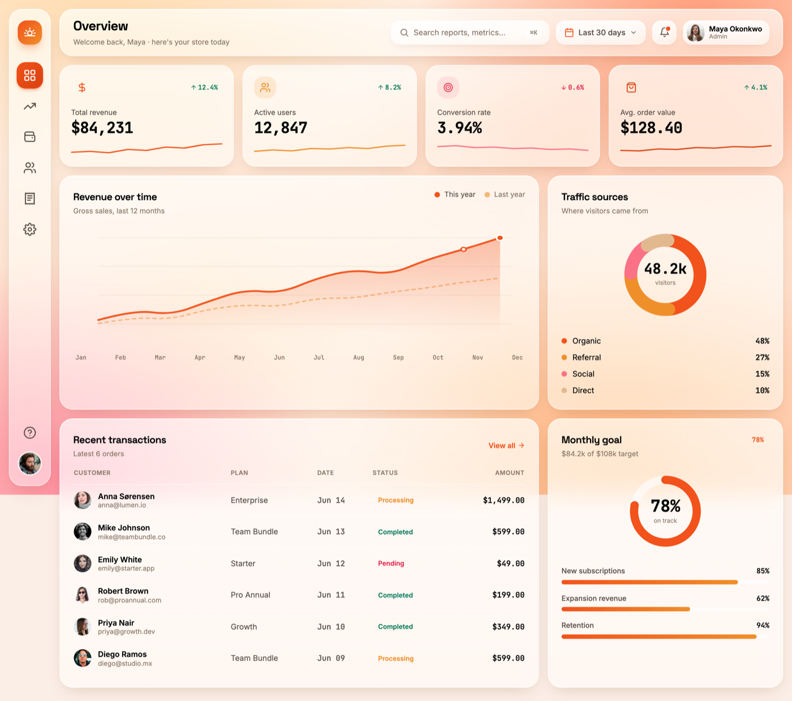

# Glassmorphism Dashboard: Frosted Sunrise Analytics UI

A light, warm, high-contrast glassmorphism SaaS analytics dashboard (desktop). Frosted white glass cards with backdrop-blur, a hairline white border and a soft shadow float over a warm *sunrise* aurora gradient (peach to coral to amber, with a soft rose corner). Text is near-black ink for strong contrast, and a single saturated coral is the only accent. Layout: a compact left icon rail, a top bar with search + date range + notifications + avatar, a row of four KPI stat cards (big mono numbers, trend-delta pills, tiny sparklines), a large inline-SVG area chart with a dashed last-year comparison line, a donut traffic-source card, a scannable transactions data table with status pills, and a monthly-goal radial with progress bars. Typography pairs Space Grotesk (display) with Inter (body) and JetBrains Mono (numerals). The airy, warm alternative to a dark glass dashboard.

Source: https://templatemo.com/tm-607-glass-admin



## Prompt

```text
{
  "summary": "A light, warm, high-contrast glassmorphism analytics dashboard for a SaaS/admin product, rendered as a real desktop web screen (no device frame). Frosted-white glass cards (semi-transparent white with backdrop-blur, a 1px white border and a soft warm shadow) float over a warm SUNRISE aurora background built from layered radial gradients: peach and soft amber at the top corners, coral on the right, a soft rose glow bottom-left, over a pale peach base. All text is near-black ink (#1c1512) for WCAG-safe contrast on the glass, with one saturated coral (#f2521b) as the single accent. The frame is a compact LEFT ICON RAIL (rounded glass, a coral gradient logo mark on top, a vertical stack of inline-SVG nav icons where the active one is a solid coral rounded-square, and a help icon + avatar pinned to the bottom). To its right, a glass TOP BAR holds the page title + greeting, a glass search field with a hint key, a 'Last 30 days' date-range pill, a notification bell with a coral dot, and an avatar chip. Below the top bar: a row of four KPI STAT CARDS (each = a tinted icon chip, a trend-delta pill in green for up / rose for down, a small label, a big mono number, and a tiny coloured sparkline). Then a two-thirds / one-third row: a large REVENUE AREA CHART drawn in inline SVG (soft coral gradient fill under a smooth line, faint horizontal gridlines, a dashed amber last-year comparison line, month labels, and highlighted end points) beside a TRAFFIC-SOURCE DONUT (SVG ring segments in coral/amber/rose/tan, a centred total, and a labelled legend with percentages). The bottom row pairs a RECENT-TRANSACTIONS TABLE (avatar + name + email, plan, date, a coloured status pill, right-aligned mono amount) with a MONTHLY-GOAL card (a coral radial progress ring with a big percentage, plus labelled progress bars). Everything is airy, glassy, and warm — the light counterpart to a dark glass dashboard.",
  "style": {
    "description": "Warm, airy, high-contrast glassmorphism. The signature is frosted-WHITE glass (not dark glass) over a warm SUNRISE aurora, so it reads bright and premium instead of moody. Cards are semi-transparent white (linear-gradient from ~0.74 to ~0.56 alpha) with backdrop-blur ~22px and saturate(150%), a 1px near-white border, an inset top highlight, and a soft warm-brown shadow — they look like frosted glass panes lit from behind. The background is a multi-stop radial aurora: peach (#ffd9a8) top-left, coral (#ff9d7a) top-right, warm amber bottom-right, a soft rose (#ff8fa0) bottom-left, over a pale peach base — plus a faint blurred coral/amber bloom layer. Ink is near-black #1c1512 for headings and numbers, #5c5049 for secondary text, #8a7768 for muted labels; the ONE accent is a saturated coral #f2521b (with a deeper #d8410f and a warm amber #ef8f2a as supporting hues, and rose #fb7185 only for negative/decorative). Status uses emerald for positive, rose for negative. Type pairs a grotesk DISPLAY face (Space Grotesk) for headings with a clean sans (Inter) for body and a MONO (JetBrains Mono, tabular figures) for every number, which gives the data a precise, engineered feel. Generous rounding (rounded-3xl cards, rounded-2xl chips/buttons), soft shadows, and small coloured pills. ABSOLUTELY no indigo/violet/blue gradient — the warmth is the identity.",
    "prompt": "Design a LIGHT, warm, high-contrast glassmorphism dashboard. Float frosted-WHITE glass cards over a warm SUNRISE aurora background — do NOT use a dark glass or any indigo/violet/blue gradient. Build the background from layered radial-gradients: peach #ffd9a8 top-left, coral #ff9d7a top-right, warm amber bottom-right, soft rose #ff8fa0 bottom-left, over a pale peach base (#fff2e6 to #ffd9c4), plus a faint blurred coral/amber bloom. Make every card semi-transparent white (linear-gradient rgba(255,255,255,0.74) to 0.56) with backdrop-filter blur(22px) saturate(150%), a 1px rgba(255,255,255,0.78) border, an inset top highlight, and a soft warm shadow (rgba(120,60,20,0.28)). Use near-black ink #1c1512 for headings/numbers, #5c5049 secondary, #8a7768 muted; ONE saturated accent coral #f2521b (deeper #d8410f, supporting amber #ef8f2a; rose #fb7185 only for negatives). Keep all functional text and icons at WCAG ~4.5:1 on the glass. Pair Space Grotesk (display headings) + Inter (body) + JetBrains Mono with tabular figures for ALL numbers. Round cards to rounded-3xl and chips/buttons to rounded-2xl, use soft shadows and small coloured status pills, and keep the whole thing airy and bright."
  },
  "layout_and_structure": {
    "description": "A gap-separated glass layout on the aurora: a slim sticky LEFT ICON RAIL, and to its right a MAIN column of a sticky top bar, a 4-up KPI row, a 2/3 + 1/3 chart+donut row, and a 2/3 + 1/3 table+goal row. Desktop uses a 4-col KPI grid and 3-col content grid (chart/table span 2). At ~1024 the KPI grid drops to 2 columns and the content rows stack to full-width; at mobile the rail hides and everything is one column. Top bar and rail are sticky.",
    "prompts": [
      {
        "part": "Left icon rail",
        "prompt": "A slim (~76px) rounded glass rail, sticky full-height. At the top a rounded-2xl coral-to-amber gradient logo mark holding a white sun icon. Below, a vertical stack of ~6 inline-SVG nav icons (dashboard/grid, trending-up, wallet, users, receipt, settings) each in a 48px rounded-2xl hit area — the ACTIVE item is a solid coral-gradient rounded-square with a white icon, the rest are muted ink that darken on hover. Pin a help icon and a circular avatar to the bottom. Icons are inline SVG (never an async icon font) so they always render, optically centred."
      },
      {
        "part": "Top bar",
        "prompt": "A sticky glass top bar. Left: an 'Overview' title in the grotesk display face plus a muted one-line greeting. Right, in a row: a glass search field (magnifier icon, placeholder, a small mono kbd hint), a glass 'Last 30 days' date-range pill (coral calendar icon + chevron), a glass bell button with a coral notification dot, and an avatar chip (photo + name + role). All controls are rounded-2xl glass at a consistent 44px height."
      },
      {
        "part": "KPI stat cards",
        "prompt": "A responsive 4-up row of glass stat cards (2-up at ~1024). Each card: top row = a tinted rounded-2xl icon chip (accent-coloured inline-SVG icon) on the left and a trend-delta pill on the right (rounded-full, arrow + percent, emerald text/tint for up, rose for down); then a small muted label; then a big bold number in JetBrains Mono; then a thin full-width coloured sparkline (inline-SVG polyline). Example metrics: Total revenue $84,231 +12.4%, Active users 12,847 +8.2%, Conversion 3.94% -0.6%, Avg. order value $128.40 +4.1%."
      },
      {
        "part": "Revenue area chart",
        "prompt": "A large glass card (spans 2/3). Header: 'Revenue over time' + a muted subtitle, and a small legend (coral 'This year', amber 'Last year'). Body: an inline-SVG area chart — a smooth coral line over a soft coral-gradient fill (fades to transparent at the baseline), faint horizontal gridlines, a dashed amber 'last year' comparison line beneath it, a highlighted white-ringed point and a solid coral end point, and a row of 12 month labels in mono below. Trend rises left to right. preserveAspectRatio none so it stretches fluidly."
      },
      {
        "part": "Traffic-source donut",
        "prompt": "A glass card (1/3). 'Traffic sources' + muted subtitle. A centred SVG donut ring (~26px stroke) split into four rounded segments — coral 48% (Organic), amber 27% (Referral), rose 15% (Social), warm tan 10% (Direct) — over a faint white track, rotated so it starts at top; a big mono total ('48.2k') and 'visitors' centred inside. Below, a legend list: a coloured dot + label on the left, the mono percent right-aligned."
      },
      {
        "part": "Transactions table",
        "prompt": "A glass card (spans 2/3). Header: 'Recent transactions' + subtitle, and a coral 'View all →' link. A table with uppercase muted column headers (Customer, Plan, Date, Status, Amount) and ~6 rows separated by hairline white dividers. Each row: an avatar + name + muted email, the plan, a mono date, a rounded-full status pill (amber 'Processing', emerald 'Completed', rose 'Pending'), and a right-aligned bold mono amount. Wrap in an overflow-x-auto with a min-width so it scrolls rather than crushes on narrow widths."
      },
      {
        "part": "Monthly-goal card",
        "prompt": "A glass card (1/3). 'Monthly goal' + a coral percent pill, and a muted '$84.2k of $108k target' line. A centred SVG radial progress ring (coral arc on a faint white track, ~78%) with a big mono percentage and 'on track' inside. Below, 2-3 labelled progress bars (New subscriptions 85%, Expansion revenue 62%, Retention 94%) each = a label + mono percent over a rounded track with a coral-to-amber gradient fill."
      }
    ]
  },
  "special_ui_components": [
    {
      "component": "Warm sunrise aurora background",
      "description": "The signature backdrop — layered radial gradients in peach/coral/amber/rose, NOT the default blue.",
      "prompt": "Build a fixed full-viewport background from stacked radial-gradients: peach #ffd9a8 at top-left, coral #ff9d7a at top-right, warm amber bottom-right, soft rose #ff8fa0 bottom-left, over a diagonal pale-peach base (#fff2e6 to #ffe4d1 to #ffd9c4). Add a second blurred bloom layer of faint coral and amber radials. This warmth is the identity — never substitute an indigo/violet/blue gradient."
    },
    {
      "component": "Frosted-white glass card",
      "description": "Light glass panes lit from behind — the light counterpart to dark glassmorphism.",
      "prompt": "Style cards as semi-transparent white: background linear-gradient(180deg, rgba(255,255,255,0.74), rgba(255,255,255,0.56)), backdrop-filter blur(22px) saturate(150%), a 1px rgba(255,255,255,0.78) border, an inset 0 1px 0 rgba(255,255,255,0.6) top highlight, and a soft warm shadow 0 10px 30px -12px rgba(120,60,20,0.28). Round to rounded-3xl. Use a slightly lighter 'glass-soft' variant for small controls."
    },
    {
      "component": "KPI card with delta pill + sparkline",
      "description": "A dense stat tile: icon chip, coloured trend pill, big mono number, mini sparkline.",
      "prompt": "Compose each KPI as: a tinted rounded-2xl icon chip (accent inline-SVG), a rounded-full delta pill (arrow + percent; emerald text on emerald/12 tint for positive, rose on rose/12 for negative), a small muted label, a ~28px bold JetBrains-Mono number, and a thin inline-SVG polyline sparklinein the card's accent colour."
    },
    {
      "component": "Inline-SVG area chart with comparison line",
      "description": "A real area chart, hand-drawn in SVG, with a dashed last-year line.",
      "prompt": "Draw the revenue chart as inline SVG: a smooth quadratic path for this year, filled with a coral vertical gradient that fades to transparent at the baseline, stroked in coral #f2521b; a dashed amber path for last year beneath it; faint horizontal gridlines; a highlighted white-ringed data point and a solid coral end point; and mono month labels below. Use preserveAspectRatio='none' so it flexes with the card."
    },
    {
      "component": "Segmented donut with legend",
      "description": "Traffic-source ring using stroke-dasharray segments.",
      "prompt": "Render the donut with four overlaid SVG circles sharing a radius, each using stroke-dasharray/stroke-dashoffset to draw one rounded segment (coral 48 / amber 27 / rose 15 / tan 10), over a faint white track, rotated -90deg to start at top. Centre a big mono total and a muted caption; pair with a dot+label / right-aligned-percent legend."
    },
    {
      "component": "Radial goal + gradient progress bars",
      "description": "A coral progress ring plus labelled coral-to-amber bars.",
      "prompt": "Show a coral SVG arc on a faint white track (stroke-dasharray for the percent), big mono percentage centred inside; beneath it stack labelled progress bars — a label + mono percent over a rounded white track filled with a coral-to-amber gradient sized to the value."
    },
    {
      "component": "Status pill",
      "description": "Small rounded-full state chips in the warm/status palette.",
      "prompt": "Use rounded-full pills with a tinted background and matching text: amber on amber/12 for 'Processing', emerald on emerald/12 for 'Completed', rose on rose/12 for 'Pending'. Keep them small (12px, semibold) and high-contrast on the glass."
    }
  ]
}
```

**▶ [Try it live →](https://superdesign.dev/library/glassmorphism-dashboard-frosted-sunrise-analytics-ui?utm_source=github&utm_medium=prompt-repo&utm_campaign=prompt-library)**

**Use it in your coding agent:** install the [Superdesign skill](https://github.com/superdesigndev/superdesign-skill), then:

```bash
superdesign get-prompts --slugs "glassmorphism-dashboard-frosted-sunrise-analytics-ui" --json
```

*0 copies · 0 tries · Dashboards · SaaS · dashboard, analytics, saas, admin*
