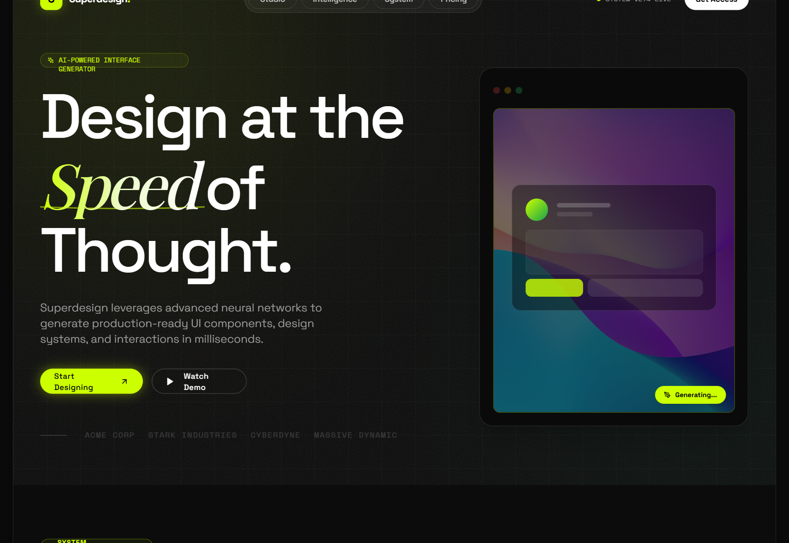

# Glassmorphism Style

A high-tech glassmorphism design system featuring neon lime accents, deep obsidian surfaces, and a sophisticated blend of architectural grid patterns and organic glowing gradients. Optimized for high-end SaaS, AI product studios, and fintech platforms, this style uses JetBrains Mono for a developer-centric feel and Space Grotesk for bold, editorial headings. Key elements include backdrop-blur effects (glassmorphism), grain/noise overlays, and a 'floating shell' layout that gives the web interface a premium, app-like quality.



## Prompt

```text
{
  "summary": "A futuristic 'Obsidian & Lime' glassmorphism design system characterized by high contrast, blurred transparency, and tech-industrial typography. It utilizes a bento-grid structure and floating layouts to create a multi-layered, interactive experience.",
  "style": {
    "description": "The style is defined by its 'dark-mode-first' approach using an obsidian base (#0a0a0a) and high-vibrancy lime accents (#ccff00). Typography pairings involve 'Space Grotesk' for high-impact, tight-tracked headings and 'JetBrains Mono' for technical metadata. Glassmorphism is executed with subtle white overlays (3% opacity) combined with intense 16px background blurs. Visual depth is added through grainy noise textures and 60px grid backgrounds.",
    "prompt": "Base theme: Deep black (#000000) shell with obsidian surfaces (#0c0c0c). Primary accent color: Neon Lime (#ccff00). Secondary accent: Emerald Glow (#10b981). Typography: Headings in 'Space Grotesk' (weights: 300 to 700, tracking: -0.06em), body in 'Space Grotesk' (weight: 400), and technical labels in 'JetBrains Mono' (uppercase, tracked out). Glassmorphism specs: Background: rgba(255, 255, 255, 0.03), Backdrop-filter: blur(16px), Border: 1px solid rgba(255, 255, 255, 0.1). Text colors: Primary White (#ebebeb), Secondary White (opacity 60%), Disabled/Muted (opacity 30%). Decorative elements: 60x60px linear-gradient grid pattern, 15% opacity noise SVG overlay, and large 'glow-sphere' radial gradients with 120px blur filters. Animation curves: ease-in-out for floating elements, cubic-bezier(0.4, 0, 0.2, 1) for transitions."
  },
  "layout_and_structure": {
    "description": "A 'floating shell' architecture where the entire site content resides in a rounded container (2.5rem radius) nested within a black viewport. The internal layout follows a bento-grid methodology for features and a high-contrast split-section for the hero.",
    "prompts": [
      {
        "part": "Floating Shell Container",
        "prompt": "Wrap the entire site in a container with max-width 1600px. Apply 'rounded-[2.5rem]', 'ring-1 ring-white/10', and 'shadow-2xl'. This shell should have a background of #0c0c0c."
      },
      {
        "part": "Navigation",
        "prompt": "Fixed/Absolute header. Logo on the left (rounded-xl lime box with black initial). Center: Pill-shaped navigation bar (rgba(255,255,255,0.05) background, backdrop-blur, rounded-full) containing links with white/70 opacity. Right side: Monospaced system status indicator with a pulsing lime dot next to a white rounded-full button."
      },
      {
        "part": "Hero Section",
        "prompt": "Split 12-column grid. Left (7 cols): Giant typography (font-size: 7.5rem, line-height: 0.85) featuring an italicized gradient span (#ccff00 to white). Include a mono-styled 'AI label' above the heading. Right (5 cols): Interactive glassmorphism mockup shell with floating cards (float-anim: 6s infinite ease-in-out) and an 'AI Cursor' floating label (#ccff00 background)."
      },
      {
        "part": "Bento Grid Features",
        "prompt": "Grid-cols-4 for desktop. Cards should have 'rounded-[2.5rem]' and 'border border-white/10'. Large card: spans 2x2, features internal data visualization (vertical bars). Tall card: spans 1x2, features color/token swatches. Accent card: solid #ccff00 background with black text and noise texture. Hover state: border color changes to #ccff00/40."
      },
      {
        "part": "Contrast Section (Methodology)",
        "prompt": "Full-width section with light-grey background (#e5e5e5) and dark text (#000000). Rounded top corners (4rem radius). Features a numbered list (01, 02, 03) in monospaced font inside circles. Right side: Greyscale circular portrait with a glassmorphism testimonial card overlaying the bottom."
      },
      {
        "part": "Footer",
        "prompt": "Obsidian background (#000000). Top: Massive background watermark text 'SUPER' (10rem size, 5% opacity). Call to action: Oversized lime button (#ccff00) with a slide-up white background transition on hover. Bottom: 3-column footer with policy links, social icons (hollow circles), and monospaced copyright info."
      }
    ]
  },
  "special_ui_components": [
    {
      "component": "Glass Floating Card",
      "description": "A multi-layered glass element that appears to float over the background.",
      "prompt": "Create a div with `background: rgba(255, 255, 255, 0.03)`, `backdrop-filter: blur(16px)`, `border: 1px solid rgba(255, 255, 255, 0.1)`, and `border-radius: 1.5rem`. Add a `float-anim` using `@keyframes float { 0%, 100% { transform: translateY(0); } 50% { transform: translateY(-10px); } }`."
    },
    {
      "component": "Neon Pulse Button",
      "description": "High-visibility primary action button with a glowing shadow.",
      "prompt": "Button style: `background-color: #ccff00`, `color: #000000`, `font-weight: 700`, `border-radius: 9999px`, `padding: 1rem 2rem`. Shadow: `box-shadow: 0 0 30px rgba(204, 255, 0, 0.3)`. Hover: `scale: 1.05`."
    },
    {
      "component": "System Status Tag",
      "description": "Monospaced utility tag for technical labels.",
      "prompt": "Container: `display: flex`, `align-items: center`, `gap: 0.5rem`, `font-family: 'JetBrains Mono'`, `text-transform: uppercase`, `letter-spacing: 0.2em`, `font-size: 10px`. Dot: `width: 6px`, `height: 6px`, `border-radius: 50%`, `background-color: #ccff00`, `animation: pulse 2s infinite`."
    }
  ],
  "special_notes": "MUST use #ccff00 as the primary accent. MUST NOT use standard system fonts; stick to Space Grotesk and JetBrains Mono. MUST maintain at least 16px blur on all glass elements to ensure legibility. MUST use grid patterns and noise overlays to prevent 'flat' dark mode looks. Ensure all container corners have a high radius (at least 2rem) for a modern, hardware-like feel."
}
```

**▶ Try it live → [https://superdesign.dev/library/glassmorphism-style](https://superdesign.dev/library/glassmorphism-style?utm_source=github&utm_medium=prompt-repo&utm_campaign=prompt-library)**

**Use it in your coding agent:** install the [Superdesign skill](https://github.com/superdesigndev/superdesign-skill), then:

```bash
superdesign get-prompts --slugs "glassmorphism-style" --json
```

*1,713 copies · 2,451 tries · landing page, page, style*
