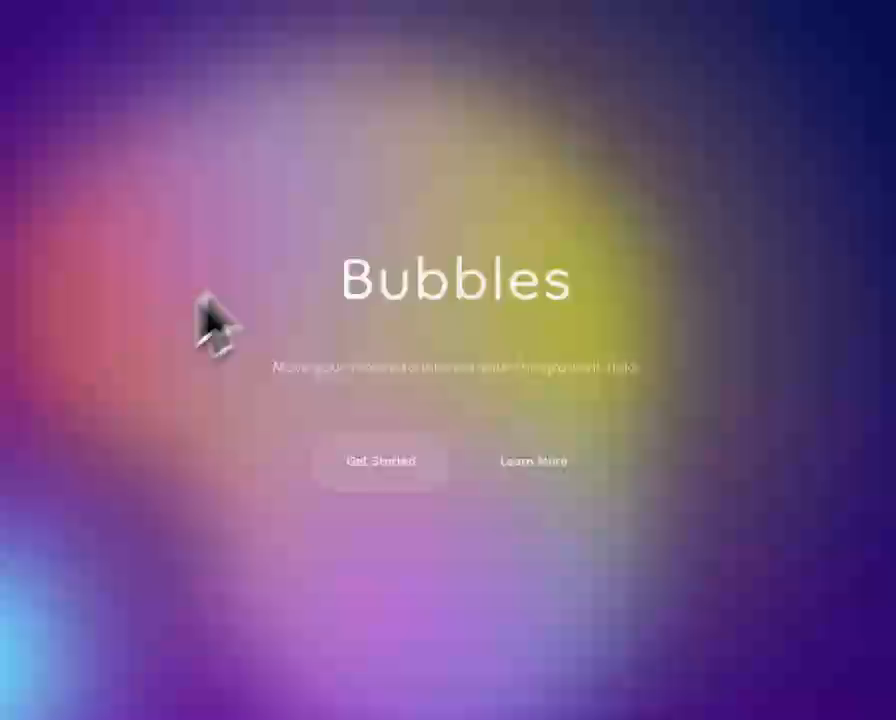

# Gooey Gradient Background

A mesmerizing, interactive gooey liquid gradient background with animated blobs and mouse-following effect. Perfect for immersive landing pages.



▶ **[Watch the animated preview](preview.mp4)** (MP4)

## Prompt

```text
Here is a reference implementation of a Gooey Gradient Background

~~~/README.md
# Gooey Gradient Background

A mesmerizing, interactive gooey liquid gradient background with animated blobs and mouse-following effect. This component creates an immersive visual experience using SVG filters and CSS animations.

## Features

- 🎨 **Liquid "Gooey" Effect**: Uses SVG `feColorMatrix` and `feGaussianBlur` filters to create merging blob effects.
- 🖱️ **Interactive**: Includes a mouse-following gradient blob that interacts with the background.
- 🌈 **Vibrant Gradients**: Complex, multi-layered gradient animations.
- 🚀 **Performance Optimized**: Uses CSS transforms and `requestAnimationFrame` for smooth rendering.
- 📱 **Responsive**: Adapts to container size.

## Usage

```tsx
import { GooeyGradientBackground } from '@/sd-components/942b8e8e-129e-4697-b695-3b1397a42949';

export default function HeroSection() {
  return (
    <div className="h-screen w-full">
      <GooeyGradientBackground>
        <div className="flex items-center justify-center h-full">
          <h1 className="text-white text-6xl font-bold">Welcome</h1>
        </div>
      </GooeyGradientBackground>
    </div>
  );
}
```

## Props

| Prop | Type | Default | Description |
|------|------|---------|-------------|
| `children` | `ReactNode` | `undefined` | Content to render on top of the background |
| `className` | `string` | `''` | Additional classes for the container |

## Implementation Details

The component uses a combination of:
1. **CSS Keyframes**: For independent movement of 5 distinct gradient blobs.
2. **SVG Filters**: A hidden SVG provides the `#goo` filter reference used by the container.
3. **React Ref & JS**: Handles the mouse interaction logic to update the `transform` of the interactive blob without triggering React re-renders.
~~~

~~~/src/App.tsx
import React from 'react';
import { GooeyGradientBackground } from './Component';

export default function App() {
  return (
    <div className="w-full h-screen">
      <GooeyGradientBackground>
        <div className="flex flex-col items-center justify-center w-full h-full text-white/90">
          <h1 className="text-[96px] leading-none font-light select-none tracking-wide drop-shadow-sm" style={{ fontFamily: 'Dongle, sans-serif' }}>
            Bubbles
          </h1>
          <p className="text-2xl mt-4 font-light opacity-80 max-w-md text-center px-4" style={{ fontFamily: 'Dongle, sans-serif' }}>
            Move your mouse to interact with the gradient field.
          </p>
          
          <div className="mt-12 flex gap-4">
             <button className="px-8 py-3 bg-white/10 backdrop-blur-md border border-white/20 rounded-full text-xl hover:bg-white/20 transition-all cursor-pointer" style={{ fontFamily: 'Dongle, sans-serif' }}>
                Get Started
             </button>
             <button className="px-8 py-3 bg-transparent border border-white/20 rounded-full text-xl hover:bg-white/5 transition-all cursor-pointer" style={{ fontFamily: 'Dongle, sans-serif' }}>
                Learn More
             </button>
          </div>
        </div>
      </GooeyGradientBackground>
    </div>
  );
}
~~~

~~~/package.json
{
  "name": "gooey-gradient-background",
  "description": "A mesmerizing, interactive gooey liquid gradient background with animated blobs",
  "dependencies": {
    "react": "^18.2.0",
    "react-dom": "^18.2.0",
    "lucide-react": "^0.344.0"
  }
}
~~~

~~~/src/Component.css
.gooey-wrapper {
  /* Using the specific colors from the design */
  --color-bg1: rgb(108, 0, 162);
  --color-bg2: rgb(0, 17, 82);
  --color1: 18, 113, 255;
  --color2: 221, 74, 255;
  --color3: 100, 220, 255;
  --color4: 200, 50, 50;
  --color5: 180, 180, 50;
  --color-interactive: 140, 100, 255;
  --circle-size: 80%;
  --blending: hard-light;
  
  font-family: 'Dongle', sans-serif;
  width: 100%;
  height: 100%;
  position: relative;
  overflow: hidden;
}

@keyframes moveInCircle {
  0% { transform: rotate(0deg); }
  50% { transform: rotate(180deg); }
  100% { transform: rotate(360deg); }
}

@keyframes moveVertical {
  0% { transform: translateY(-50%); }
  50% { transform: translateY(50%); }
  100% { transform: translateY(-50%); }
}

@keyframes moveHorizontal {
  0% { transform: translateX(-50%) translateY(-10%); }
  50% { transform: translateX(50%) translateY(10%); }
  100% { transform: translateX(-50%) translateY(-10%); }
}

.gradient-bg {
  width: 100%;
  height: 100%;
  position: absolute;
  overflow: hidden;
  background: linear-gradient(40deg, var(--color-bg1), var(--color-bg2));
  top: 0;
  left: 0;
  z-index: 0;
}

.gradient-bg svg {
  position: fixed;
  top: 0;
  left: 0;
  width: 0;
  height: 0;
}

.gradients-container {
  filter: url(#goo) blur(40px);
  width: 100%;
  height: 100%;
}

.g1 {
  position: absolute;
  background: radial-gradient(circle at center, rgba(var(--color1), 0.8) 0, rgba(var(--color1), 0) 50%) no-repeat;
  mix-blend-mode: var(--blending);
  width: var(--circle-size);
  height: var(--circle-size);
  top: calc(50% - var(--circle-size) / 2);
  left: calc(50% - var(--circle-size) / 2);
  transform-origin: center center;
  animation: moveVertical 30s ease infinite;
  opacity: 1;
}

.g2 {
  position: absolute;
  background: radial-gradient(circle at center, rgba(var(--color2), 0.8) 0, rgba(var(--color2), 0) 50%) no-repeat;
  mix-blend-mode: var(--blending);
  width: var(--circle-size);
  height: var(--circle-size);
  top: calc(50% - var(--circle-size) / 2);
  left: calc(50% - var(--circle-size) / 2);
  transform-origin: calc(50% - 400px);
  animation: moveInCircle 20s reverse infinite;
  opacity: 1;
}

.g3 {
  position: absolute;
  background: radial-gradient(circle at center, rgba(var(--color3), 0.8) 0, rgba(var(--color3), 0) 50%) no-repeat;
  mix-blend-mode: var(--blending);
  width: var(--circle-size);
  height: var(--circle-size);
  top: calc(50% - var(--circle-size) / 2 + 200px);
  left: calc(50% - var(--circle-size) / 2 - 500px);
  transform-origin: calc(50% + 400px);
  animation: moveInCircle 40s linear infinite;
  opacity: 1;
}

.g4 {
  position: absolute;
  background: radial-gradient(circle at center, rgba(var(--color4), 0.8) 0, rgba(var(--color4), 0) 50%) no-repeat;
  mix-blend-mode: var(--blending);
  width: var(--circle-size);
  height: var(--circle-size);
  top: calc(50% - var(--circle-size) / 2);
  left: calc(50% - var(--circle-size) / 2);
  transform-origin: calc(50% - 200px);
  animation: moveHorizontal 40s ease infinite;
  opacity: 0.7;
}

.g5 {
  position: absolute;
  background: radial-gradient(circle at center, rgba(var(--color5), 0.8) 0, rgba(var(--color5), 0) 50%) no-repeat;
  mix-blend-mode: var(--blending);
  width: calc(var(--circle-size) * 2);
  height: calc(var(--circle-size) * 2);
  top: calc(50% - var(--circle-size));
  left: calc(50% - var(--circle-size));
  transform-origin: calc(50% - 800px) calc(50% + 200px);
  animation: moveInCircle 20s ease infinite;
  opacity: 1;
}

.interactive {
  position: absolute;
  background: radial-gradient(circle at center, rgba(var(--color-interactive), 0.8) 0, rgba(var(--color-interactive), 0) 50%) no-repeat;
  mix-blend-mode: var(--blending);
  width: 100%;
  height: 100%;
  top: -50%;
  left: -50%;
  opacity: 0.7;
  /* Will be controlled by JS for performance */
}
~~~

~~~/src/Component.tsx
import React, { useEffect, useRef } from 'react';
import './Component.css';

interface GooeyGradientBackgroundProps {
  /**
   * Content to render on top of the background
   */
  children?: React.ReactNode;
  /**
   * Additional class names for the container
   */
  className?: string;
}

/**
 * A mesmerizing, interactive gooey liquid gradient background with animated blobs.
 * Features:
 * - Pure CSS animations for background blobs
 * - SVG filter for the "gooey" liquid effect
 * - Interactive mouse-following blob
 * - Responsive and container-aware
 */
export function GooeyGradientBackground({ children, className = '' }: GooeyGradientBackgroundProps) {
  const interactiveRef = useRef<HTMLDivElement>(null);

  useEffect(() => {
    let curX = 0;
    let curY = 0;
    let tgX = 0;
    let tgY = 0;

    const handleMouseMove = (event: MouseEvent) => {
      tgX = event.clientX;
      tgY = event.clientY;
    };

    const animate = () => {
      if (!interactiveRef.current) return;
      
      curX += (tgX - curX) / 20;
      curY += (tgY - curY) / 20;
      
      interactiveRef.current.style.transform = `translate(${Math.round(curX)}px, ${Math.round(curY)}px)`;
      requestAnimationFrame(animate);
    };

    window.addEventListener('mousemove', handleMouseMove);
    animate();

    return () => {
      window.removeEventListener('mousemove', handleMouseMove);
    };
  }, []);

  return (
    <div className={`gooey-wrapper w-full h-full relative overflow-hidden ${className}`}>
      <div className="gradient-bg">
        <svg xmlns="http://www.w3.org/2000/svg">
          <defs>
            <filter id="goo">
              <feGaussianBlur in="SourceGraphic" stdDeviation="10" result="blur" />
              <feColorMatrix in="blur" mode="matrix" values="1 0 0 0 0  0 1 0 0 0  0 0 1 0 0  0 0 0 18 -8" result="goo" />
              <feBlend in="SourceGraphic" in2="goo" />
            </filter>
          </defs>
        </svg>
        <div className="gradients-container">
          <div className="g1"></div>
          <div className="g2"></div>
          <div className="g3"></div>
          <div className="g4"></div>
          <div className="g5"></div>
          <div ref={interactiveRef} className="interactive"></div>
        </div>
      </div>
      
      {/* Content Layer */}
      <div className="relative z-10 w-full h-full">
        {children}
      </div>
    </div>
  );
}

export default GooeyGradientBackground;
~~~

Implementation Guidelines

1. Analyze the component structure, styling, animation implementations
2. Review the component's arguments and state
3. Think through what is the best place to adopt this component/style into the design we are doing
4. Then adopt the component/design to our current system

Help me integrate this into my design
```

**▶ Try it live → [https://superdesign.dev/library/gooey-gradient-background](https://superdesign.dev/library/gooey-gradient-background?utm_source=github&utm_medium=prompt-repo&utm_campaign=prompt-library)**

**Use it in your coding agent:** install the [Superdesign skill](https://github.com/superdesigndev/superdesign-skill), then:

```bash
superdesign get-prompts --slugs "gooey-gradient-background" --json
```

*485 copies · 2,278 tries · Animations & Backgrounds · General · animation, background*
