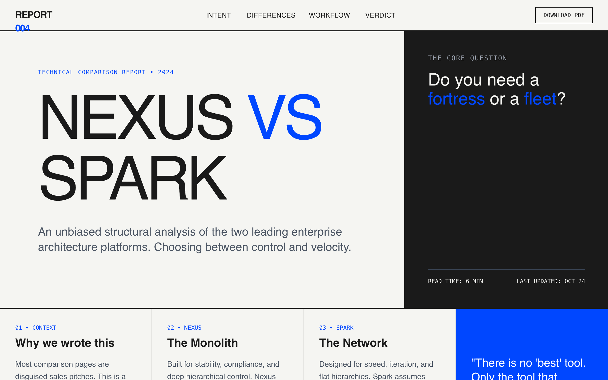

# Graphic Comparison Report

A highly visual, typography-driven comparison report design. This style eschews traditional tables and icons for a bold, editorial layout inspired by graphic posters. Featuring a brutalist-lite aesthetic with high-contrast 'ink' and 'paper' tones, it utilizes oversized headlines, a strict 12-column grid, and structural 2px borders. Suitable for technical comparisons, whitepapers, B2B SaaS decision pages, fintech analysis, and deep-dive product evaluations where clarity and authority are paramount.



## Prompt

```text
{
  "summary": "A sophisticated, text-first comparison report that uses a 'poster' aesthetic. It features heavy typography, a stark color palette with a single vibrant accent, and a layout that treats information as graphic blocks. The design prioritizes readability and architectural clarity through rigid grid systems and visible dividing lines.",
  "style": {
    "description": "The style is defined by a pairing of 'Space Grotesk' (display) and 'Inter' (sans). It uses a muted off-white background (#F5F5F2) and near-black text (#1A1A1A) to mimic a high-quality print report. A vibrant 'Cobalt' blue (#0047FF) is used sparingly for accents and structural markers. Design relies on weight, scale, and 2px borders rather than shadows or gradients.",
    "prompt": "### Visual Style Guide\n- **Color Palette:** Background 'Paper' (#F5F5F2), Primary Text 'Ink' (#1A1A1A), Accent 'Cobalt' (#0047FF), Secondary Accent 'Cobalt-Dim' (#E6ECFF).\n- **Typography:** \n  - **Display Headers:** 'Space Grotesk', weight 700/500, tracking -0.05em, leading 0.85-1.0.\n  - **Body Sans:** 'Inter', weight 400/500, line-height 1.6.\n  - **Technical Labels:** Monospace font (Courier or similar), weight 500, uppercase, tracking 0.1em, font-size 12px.\n- **Borders:** Constant 2px solid #1A1A1A for primary containers and section dividers. Sub-dividers use 1px with 20% opacity.\n- **Shadows:** None. Depth is achieved via color blocking and border layers.\n- **Animations:** \n  - **Hover States:** Smooth color transitions (300ms cubic-bezier(0.4, 0, 0.2, 1)).\n  - **Interactions:** Subtle X-axis translation (2-4px) on hover for interactive scenario cards.\n  - **Scrolling:** Fixed navigation and sticky sidebar headers in 'Core DNA' sections."
  },
  "layout_and_structure": {
    "description": "The layout follows a modular grid system that transitions between full-width hero sections and multi-column comparison blocks. It uses vertical and horizontal borders to define content cells, creating a sense of a structured physical document.",
    "prompts": [
      {
        "part": "Fixed Navigation",
        "prompt": "A 64px height bar with a 2px bottom border (#1A1A1A). Left-aligned logo in bold uppercase Space Grotesk. Center-aligned links in uppercase monospace (12px). Right-aligned 'Download' button with 1px border and hover-fill transition."
      },
      {
        "part": "Hero Section",
        "prompt": "12-column grid layout. Left 8 columns: Large display text (9xl) with a vertical 2px border on the right. Right 4 columns: Solid #1A1A1A background with high-contrast white/cobalt text. Use tracking-tighter for the main VS comparison headline."
      },
      {
        "part": "Context Bar",
        "prompt": "A 4-column horizontal strip. The first 3 columns contain descriptive text with a mono-font label (e.g., '01 • Context'). The 4th column is a solid color block (#0047FF) containing a punchy, centered quote in 2xl font-size."
      },
      {
        "part": "Scenario Grid",
        "prompt": "A 2x2 grid of cards. Each card has a 1px border and a hover state that changes background to #E6ECFF. Content includes a mono-label, a 3xl heading that moves +8px on hover, and a recommendation line at the bottom in cobalt text."
      },
      {
        "part": "Sticky Comparison (Core DNA)",
        "prompt": "Split 50/50 layout. Left side: #1A1A1A background, sticky position, housing 8xl vertical title text. Right side: Scrolling content blocks with 1px dividers, each containing a header and a 2-column sub-grid comparing features side-by-side."
      },
      {
        "part": "Feature Matrix",
        "prompt": "Text-heavy 12-column grid. Header row with uppercase mono labels. Rows are separated by 1px ink borders. Column 1 (4 cols) for the feature name. Columns 2 and 3 (4 cols each) for detailed textual comparison. Use light gray backgrounds (#F9F9F9) to alternate column visibility."
      },
      {
        "part": "Workflow Narrative",
        "prompt": "Side-by-side narrative blocks. Left block: white background with 'Ink' labels. Right block: Light blue background (#F0F4FF) with 'Cobalt' labels. Both feature blockquotes with a 4px left-border accent."
      },
      {
        "part": "Decision Summary CTA",
        "prompt": "Full-width cobalt (#0047FF) section. Centered layout with 8xl heading. Two large, chunky buttons below: one white with ink text, one outline-white with white text. Padding: 96px top/bottom."
      }
    ]
  },
  "special_ui_components": [
    {
      "component": "Side-by-Side Narrative Cards",
      "description": "A split-screen storytelling component that uses contrasting backgrounds to highlight differences.",
      "prompt": "Create two vertical blocks. Block A: Background #FFFFFF, Border 2px #1A1A1A. Block B: Background #F0F4FF. Each block has an absolute-positioned label at top-left (padding 4px 16px, background #1A1A1A or #0047FF). Include an italicized blockquote with a high-contrast accent border."
    },
    {
      "component": "Truth Matrix",
      "description": "A list-based comparison that uses plus and minus symbols for unbiased assessments.",
      "prompt": "Grid layout on #1A1A1A background. Headers are uppercase mono (14px). List items use green-400 for '+' and red-500 for '-' markers. Text is light gray (#D1D5DB) in font-size 18px with generous line spacing (leading-relaxed)."
    }
  ]
}
```

**▶ Try it live → [https://superdesign.dev/library/graphic-comparison-report](https://superdesign.dev/library/graphic-comparison-report?utm_source=github&utm_medium=prompt-repo&utm_campaign=prompt-library)**

**Use it in your coding agent:** install the [Superdesign skill](https://github.com/superdesigndev/superdesign-skill), then:

```bash
superdesign get-prompts --slugs "graphic-comparison-report" --json
```

*17 copies · 2,470 tries · E-commerce · SaaS · comparison page, high contrast, offwhite, vibrant cobalt*
