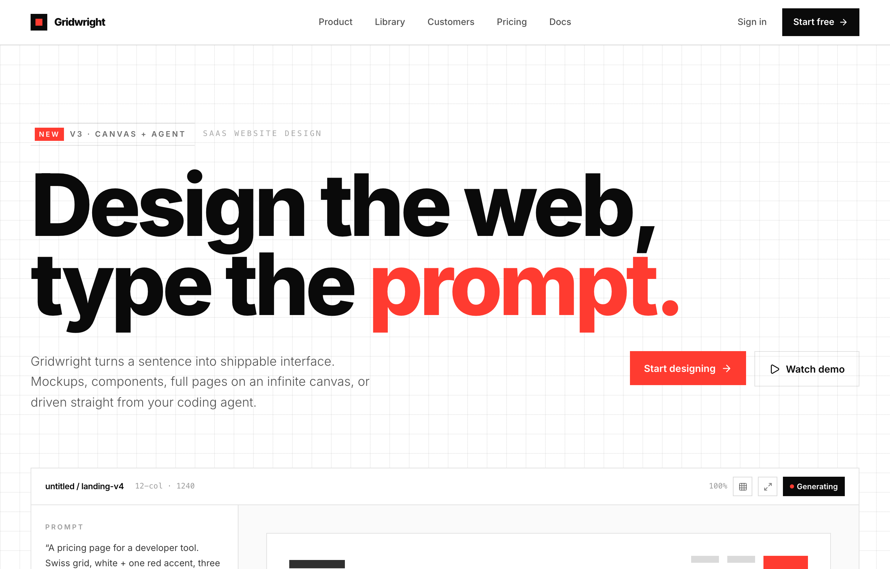

# Gridwright — Design the web, type the prompt (Swiss Grid / Signal Red)

A Swiss-grid SaaS marketing homepage: stark white paper, near-black ink, one signal-red accent, an oversized two-line hero, an embedded prompt-to-canvas product mock, a hover-invert feature grid, a dark variant-tile workflow split, a 3-tier pricing block with an inverted Pro card, and a hairline-celled mega footer.



## Prompt

```text
{"summary": "Build a Swiss-grid SaaS marketing homepage on a stark white paper canvas with near-black ink type and a single signal-red accent. The whole page is a visible 12-column grid drawn with 1px hairlines: a sticky nav, an oversized two-line hero, an embedded 'canvas' product mock (prompt rail + artboard), a trusted-by logo strip, a 6-cell feature grid that inverts to black on hover, a dark workflow split with a 6-tile variant grid, a 4-up stats row, a 3-tier pricing block with one inverted dark Pro card, a full-bleed signal-red CTA band, and a hairline-celled mega footer.", "style": {"description": "International Typographic Style (Swiss design) for a developer tool: pure white paper, near-black ink, and exactly one signal red used surgically for the accent word, primary CTAs, indicator dots, the Popular badge and the CTA band. The page is built as an explicit 12-column grid where every section sits inside drawn 1px hairlines, so the structure itself is the decoration. Inter does all the work across nine weights, set very tight on display type; tabular numbers for stats and prices; uppercase wide-tracked micro-labels and a mono register for metadata. No gradients, no shadows, no rounded corners. Black-on-white that flips to white-on-black on hover and in the Pro/workflow/CTA panels.", "prompt": "Swiss / International Typographic Style, stark and grid-driven. Palette is three tokens only: ink #0a0a0a (near-black, all primary text + dark panels), paper #ffffff (page + inverted text), and signal #ff3b30 (the single accent: hero accent word 'prompt.', primary CTAs, the New chip, indicator dots, the Popular badge, stat unit marks, the full CTA band, and ::selection background with white text). Hairlines are the system: light hairline rgba(10,10,10,0.12) on white, dark hairline rgba(255,255,255,0.14) on the black panels, applied as top/bottom/left/right 1px borders to draw every cell. Secondary surface is #fafafa (artboard well) and #111 (mini variant tiles inside the dark split). Text uses graded ink opacity: body ink/70, muted ink/55-60, micro ink/35-45; on dark panels paper/55-80. Typography: Inter only (Google Fonts, weights 300-900), font-extrabold/900 for all display. Tracking classes: tt = -0.02em, tt-tight = -0.045em (giant headlines, set leading 0.92), tt-wide = 0.22em uppercase (eyebrows, micro-labels). font-mono register (ui monospace) for metadata like '12-col / 1240', section run-labels and footer copyright; tabular-nums for stats, prices and step numbers. Strictly NO gradients, NO drop shadows, NO border-radius (only the tiny indicator dots are rounded-full). Mood: precise, editorial, engineered, confident; the visible grid IS the aesthetic."}, "layout_and_structure": {"description": "A max-w-[1240px] container with px-6, and a reusable 12-column grid (grid-template-columns: repeat(12,1fr)) that every section snaps to. Sections are separated and bounded by 1px hairlines (hair-t/b/l/r) so the page reads as one continuous ledger of cells. The hero, feature grid, dark split, stats, pricing and footer all reuse the same column math and hairline cells. Responsive: the 12-col layout collapses to col-span-12 stacks on mobile, feature grid goes 1->2->3 columns, footer link columns go 4-up to 2-up, hero CTAs and sub-copy reflow under the headline.", "prompts": [{"part": "Sticky nav", "prompt": "position: sticky, top 0, z-50, bg paper at 90% with backdrop-blur-md and a bottom hairline. Inside the 1240 container, a 12-col grid, h-16, items-center: logo (col-span-3) = a 24px ink square containing a 10px signal-red square, then 'Gridwright' in extrabold tt-tight 15px. Center nav (col-span-6, justify-center, hidden on mobile) = 5 medium 13px links (Product, Library, Customers, Pricing, Docs) in ink/70 with hover:text-ink. Right (col-span-3, justify-end) = a 'Sign in' text link plus a solid ink 'Start free' button with a lucide:arrow-right that hover:bg-signal and nudges the arrow on hover."}, {"part": "Hero", "prompt": "Section with a bottom hairline and a faint full-bleed 28px square baseline grid behind (mark-grid at opacity 0.5). col-span-12, pt-20/28 pb-14/20. Eyebrow row: a hairline-bounded pill 'New | v3 / Canvas + agent' with the 'New' tag on a signal-red chip, plus a muted mono label 'SaaS Website Design'. Oversized two-line headline in tt-tight extrabold, leading 0.92, fluid 12vw up to 124px: line 1 'Design the web,' / line 2 'type the ' + signal-red 'prompt.'. Sub row is a nested 12-col grid: a 5-col light-weight 18px paragraph on the left, and on the right (col-start-9, 4-col, justify-end) two buttons: solid signal-red 'Start designing' (hover:bg-ink) and a hairline-outlined 'Watch demo' with a lucide:play (hover inverts to ink/paper)."}, {"part": "Embedded canvas product mock", "prompt": "Inside the container, a paper card bounded by top/left/right hairlines simulating the app canvas. Toolbar row (12-col, bottom hairline): left 'untitled / landing-v4' label + mono '12-col / 1240'; right has mono '100%', two 28px square outline icon buttons (grid-3x3, maximize-2) and a solid ink 'Generating' pill with a signal-red dot. Body is a 12-col grid: left 'Prompt' rail (col-span-3, right hairline) with an uppercase micro-label, a quoted prompt string, a hairline divider, and a 'Variants' list (A / B / C) where the active row shows a signal-red dot. Right artboard (col-span-9) on a #fafafa well holds a hairline mini-page wireframe built from ink-opacity bars + one signal-red block, a 7/5 split hero, and a 3-up feature card row, all using mark-grid texture and hairline cells."}, {"part": "Trusted-by logo strip", "prompt": "A 12-col row inside left/right/top hairlines: a 3-col uppercase micro-label 'Trusted by teams at' (right hairline), then a 9-col grid of 5 logo cells (2->3->5 columns) each a hairline-celled box with an iconify mark (vercel, hexagon, command, aperture, box) + a 13px semibold wordmark, all in muted ink/55."}, {"part": "Feature grid (6 cells)", "prompt": "Section header first: a 12-col block inside left/right hairlines with a 3-col signal-red eyebrow '01 / Capabilities' + mono 'build -> iterate -> ship', and a 9-col area with a tt-tight extrabold 52px h2 and a light intro paragraph. Then the feature grid: 6 cells in a 1->2->3 column layout, each cell bounded by hairlines, p-6/8. Each cell = a 24px signal-red lucide icon top-left, a mono index (01..06) top-right, an 19px bold title, and an ink/60 paragraph. Signature interaction: each cell has group hover:bg-ink hover:text-paper (full black invert on hover) with the muted text shifting to paper/60. Features: Infinite canvas, Prompt to UI, Agent-driven, Prompt library, Clean export, Real-time rooms."}, {"part": "Dark workflow split", "prompt": "Full bg-ink text-paper section using dark hairlines (hd-*). 12-col grid: left (col-span-5, right dark hairline) = signal-red eyebrow '02 / Workflow', a tt-tight extrabold 44px h2 'From a sentence to a system, on one surface.', a light paper/55 paragraph, then a 3-step list separated by dark hairlines (each step = signal-red mono number + semibold label), then a solid signal-red 'Browse the library' button (hover:bg-paper hover:text-ink). Right (col-span-7) = a 6-tile variant grid (2->3 cols) on a 1px paper/12 gap-grid; each tile is a #111 mini-artboard aspect-[3/4] labelled A grid / B cards / C stack / D hero / E docs / F price, built from paper-opacity bars, hairline mini-cells, a 12px grid-texture panel, and signal-red highlight blocks/dots to show the 'selected' variant."}, {"part": "Stats row", "prompt": "A single hairline-bounded row, 2->4 columns, each stat cell separated by hairlines, p-6/10. Each = a huge tt-tight extrabold tabular-nums number (44->64px, leading-none) with the unit accented in signal-red where present (2.4M, 99.9%), and an uppercase wide-tracked ink/45 caption. Stats: 57k Designers building, 2.4M Screens generated, 11s Avg. prompt to draft, 99.9% Canvas uptime."}, {"part": "Pricing (3 tiers)", "prompt": "12-col grid inside left/right hairlines. Left header (col-span-3, right hairline): signal-red eyebrow '03 / Pricing', tt-tight extrabold 40px h2 'Simple, scales with you.', a light note, and a hairline-bounded Annual/Monthly segmented toggle (Annual on an ink fill). Right (col-span-9) = 3 tier columns separated by hairlines. Solo $0/mo and Team $60/seat are white cells with ink check icons and hairline-outlined buttons. The middle Pro $20/mo card is inverted (bg-ink text-paper): a signal-red 'Popular' badge pinned top-right, a signal-red 'Pro' eyebrow, signal-red check icons, and a solid signal-red 'Start Pro' button (hover:bg-paper hover:text-ink). Prices use tabular-nums."}, {"part": "CTA band", "prompt": "Full-bleed bg-signal (signal red) text-paper section with a bottom hairline. 12-col items-center: an 8-col tt-tight extrabold 52px two-line headline 'Type the prompt. / Ship the page.', and a 4-col right-aligned solid ink 'Start designing free' button with a lucide:arrow-right (hover:bg-paper hover:text-ink, arrow nudges)."}, {"part": "Mega footer", "prompt": "bg-paper footer, 12-col grid inside left/right hairlines. Brand block (col-span-4, right hairline): the square logo mark + wordmark, a light tagline, and a social row (twitter, github, youtube) with hover:text-signal. Then four 2-col link columns (Product, Company, Resources, Legal) separated by hairlines, each a 10px uppercase micro-title over 13px ink/65 links that hover:text-signal. Bottom bar: a top+bottom hairline 12-col row with mono '(c) 2026 Gridwright Labs Inc.' left and uppercase mono 'Designed on a 12-column grid' right."}]}, "special_ui_components": [{"component": "Hairline 12-column grid system", "description": "The defining device: a reusable .grid12 (12 equal columns) plus .hair-t/b/l/r and .hd-t/b/l/r utilities that draw 1px borders (rgba(10,10,10,0.12) on white, rgba(255,255,255,0.14) on black). Every section, card, stat, tier, logo and footer column is a bounded cell, so the structural grid itself is the visual style. Faint mark-grid (28px square line texture) sits behind the hero and inside the mock artboards."}, {"component": "Square logo mark", "description": "A 24px solid ink square containing a centered 10px signal-red square, paired with the 'Gridwright' wordmark in extrabold tt-tight. Reused identically in the nav and the footer."}, {"component": "Embedded canvas / app mock", "description": "An in-page recreation of the product canvas: a toolbar (file label, zoom %, square icon buttons, a 'Generating' status pill with a red dot), a left Prompt rail with a quoted prompt and an A/B/C variants list (active = red dot), and a right #fafafa artboard holding a hairline wireframe of a landing page (opacity bars + one red block + mark-grid texture)."}, {"component": "Hover-invert feature cells", "description": "Each of the 6 feature cells flips from black-on-white to white-on-black on hover (group hover:bg-ink hover:text-paper), with the red icon staying red and the muted body text easing to paper/60. Each carries a red lucide icon and a mono index number (01-06)."}, {"component": "Variant mini-artboard grid", "description": "On the dark split, a 6-tile grid of #111 aspect-[3/4] cards (A grid, B cards, C stack, D hero, E docs, F price) on a 1px paper/12 hairline gap-grid, each abstractly rendering a layout from paper-opacity bars, hairline mini-cells and signal-red highlight blocks/dots marking the selected option."}, {"component": "Inverted Pro pricing card", "description": "The middle of three tier columns is the only inverted card: bg-ink text-paper with a red 'Popular' badge pinned to the top-right corner, a red 'Pro' eyebrow, red check bullets, and a solid red 'Start Pro' CTA that inverts to paper-on-ink on hover. The outer Solo/Team cards stay white with ink checks and hairline-outlined buttons."}, {"component": "Segmented Annual/Monthly toggle", "description": "A hairline-bounded inline segmented control where the active segment ('Annual') is a solid ink fill with paper text and the inactive segment ('Monthly') is ink/50, no rounding, matching the square Swiss aesthetic."}], "special_notes": "Strict three-token palette: ink #0a0a0a, paper #ffffff, signal #ff3b30 only. Light hairline rgba(10,10,10,0.12), dark-panel hairline rgba(255,255,255,0.14); secondary surfaces #fafafa and #111 inside the dark split. Inter (300-900) is the only typeface; tt-tight = -0.045em on giant display, tt-wide = 0.22em uppercase on micro-labels, mono register + tabular-nums for metadata/stats/prices. NO gradients, NO drop shadows, NO border-radius anywhere except the tiny rounded-full indicator dots. The visible 12-column hairline grid must remain the dominant visual idea (it is the brand). Restrict red to true accents (accent word, primary CTAs, dots, Popular badge, CTA band, ::selection); never let it become a second body color. Keep it fully responsive: 12-col stacks to col-span-12, feature grid 1->2->3, footer 4->2 columns, hero CTAs and sub-copy reflow. No em-dashes in any copy."}
```

**▶ Try it live → [https://superdesign.dev/library/gridwright-design-the-web-type-the-prompt-swiss-grid-signal-red](https://superdesign.dev/library/gridwright-design-the-web-type-the-prompt-swiss-grid-signal-red?utm_source=github&utm_medium=prompt-repo&utm_campaign=prompt-library)**

**Use it in your coding agent:** install the [Superdesign skill](https://github.com/superdesigndev/superdesign-skill), then:

```bash
superdesign get-prompts --slugs "gridwright-design-the-web-type-the-prompt-swiss-grid-signal-red" --json
```

*3 copies · 2,498 tries · saas-website, swiss-grid, international-typographic-style, landing-page, minimal*
