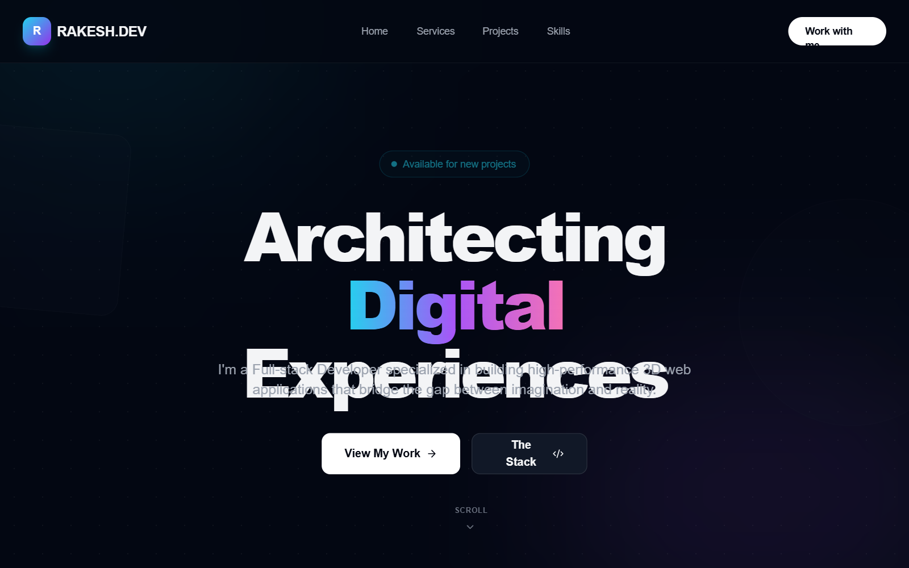

# Hyper-Interactive 3D Developer Portfolio with Three.js

Hyper-interactive dark mode portfolio with Three.js 3D background, neon cyan-purple-pink color palette, and high-end editorial typography. Featuring glassmorphism, 3D tilt interactions, and scroll-triggered reveal animations. Optimized for developer portfolios, SaaS dashboards, and creative agencies wanting a futuristic, high-performance aesthetic.



## Prompt

```text
{
  "summary": "A high-fidelity developer portfolio design characterized by a deep space background (#030712), vibrant neon accents, and a dynamic 3D WebGL hero section. It utilizes a grid-pattern texture, glassmorphism cards with 12px blur, and perspective-based hover effects to create depth and interactivity.",
  "style": {
    "description": "The style utilizes a 'Dark Cyber' aesthetic. Typography pairs 'Cabinet Grotesk' (Heavy, tracking-tighter) for headings with 'Satoshi' for body text. Colors are centered around a dark charcoal base (#030712) with a primary gradient of Cyan (#22d3ee), Purple (#a855f7), and Pink (#f472b6). Animations include Three.js wireframe mesh rotations, particle systems orbiting in the background, and smooth CSS 3D transforms on cards.",
    "prompt": "Create a visual style with a base background of #030712 and a subtle radial grid pattern (rgba(255,255,255,0.05) dots every 40px). Use a typography system featuring 'Cabinet Grotesk' for titles (800 weight, -0.05em tracking) and 'Satoshi' for body (400, 500 weights). Implement a 'Glassmorphism' card style: background rgba(17, 24, 39, 0.7), backdrop-filter blur(12px), border 1px solid rgba(255, 255, 255, 0.1). Accents must use a linear gradient from #22d3ee to #a855f7 and #f472b6. All interactive elements should have a cubic-bezier(0.23, 1, 0.32, 1) transition. Background animations should include large, blurred ambient blobs (#06b6d4 and #8b5cf6 at 10% opacity) that slowly drift."
  },
  "layout_and_structure": {
    "description": "A single-page vertical layout with clearly defined sections (Hero, Services, Skills, Projects, Contact). Uses a sticky navigation and wide margins (max-width 7xl) to maintain readability.",
    "prompts": [
      {
        "part": "Navigation",
        "prompt": "Sticky header with background #090e1a (80% opacity) and 12px backdrop blur. Left side: Logo mark using a 40px rounded-xl box with a diagonal gradient (#22d3ee to #a855f7). Right side: Text links in #9ca3af with a #22d3ee hover state. Call-to-action button: White background, black text, fully rounded (pill shape), font-weight: 800."
      },
      {
        "part": "Hero Section",
        "prompt": "Full-height (min-h-screen) centered container. Background: Three.js canvas with 15 rotating wireframe shapes (Icosahedrons, Boxes, Torus Knots) colored #22d3ee, #a855f7, and #f472b6. Include a particle system of 800 white dots. Foreground: 'Available' badge with pulse animation. Heading: Font-size 8xl, tracking-tighter, with 'Architecting' in white and 'Digital' as a gradient text (#22d3ee to #f472b6). CTA buttons: One solid white, one dark with a border."
      },
      {
        "part": "Services Grid",
        "prompt": "3-column grid of glass-cards. Each card has a 56px icon container with a light background tint of the accent color. Cards feature a 3D tilt effect on hover (rotateX 5deg, rotateY 5deg) and a transition duration of 500ms. Headers inside cards are text-2xl bold."
      },
      {
        "part": "Project Sections",
        "prompt": "Alternating 'zig-zag' layout. Project images are housed in 'Perspective Containers' that rotate slightly (+/- 2 degrees) and straighten on hover. Use 1000px perspective. Include a featured project tag in all-caps tracking-widest. Links feature arrow icons that slide right on hover."
      },
      {
        "part": "Contact Section",
        "prompt": "Large, centered glass card with rounded-3xl corners. Background includes internal blur blobs for a deep glow effect. Title: Gradient text at 7xl size. Footer area inside the card shows a 4-column metadata grid (Email, Social, Location, Timezone) with uppercase bold headers."
      }
    ]
  },
  "special_ui_components": [
    {
      "component": "3D Interactive Perspective Cards",
      "description": "Cards that tilt based on mouse movement or hover.",
      "prompt": "Implement a container with CSS 'perspective: 1000px'. Inner card should have 'transform-style: preserve-3d' and 'transition: transform 0.5s cubic-bezier(0.23, 1, 0.32, 1)'. On hover, apply 'rotateX(5deg) rotateY(5deg) scale(1.02)'. Images inside should have a scale transition to create a layering effect."
    },
    {
      "component": "Three.js Wireframe Background",
      "description": "A dynamic WebGL scene with orbiting geometric shapes.",
      "prompt": "Initialize a Three.js scene with a PerspectiveCamera(75, aspect, 0.1, 1000). Create 15 meshes using IcosahedronGeometry and MeshPhongMaterial with 'wireframe: true' and 'opacity: 0.6'. Colors should alternate between #22d3ee, #a855f7, and #f472b6. Add a BufferGeometry particle system with 800 points. On mouse move, update the camera position (camera.position.x += (mouseX * 5 - camera.position.x) * 0.05) to create a parallax effect."
    }
  ],
  "special_notes": "MUST include Three.js for the background to achieve the intended depth. MUST use 'Cabinet Grotesk' or a similar geometric display font for the headers to maintain the editorial look. MUST NOT use solid solid colors for cards; they must remain translucent with backdrop-blur. MUST ensure all animations are triggered by scroll (reveal class) using an Intersection Observer for performance."
}
```

**▶ Try it live → [https://superdesign.dev/library/hyper-interactive-3d-developer-portfolio-with-threejs](https://superdesign.dev/library/hyper-interactive-3d-developer-portfolio-with-threejs)**

*69 copies · 2,378 tries · tags: *
