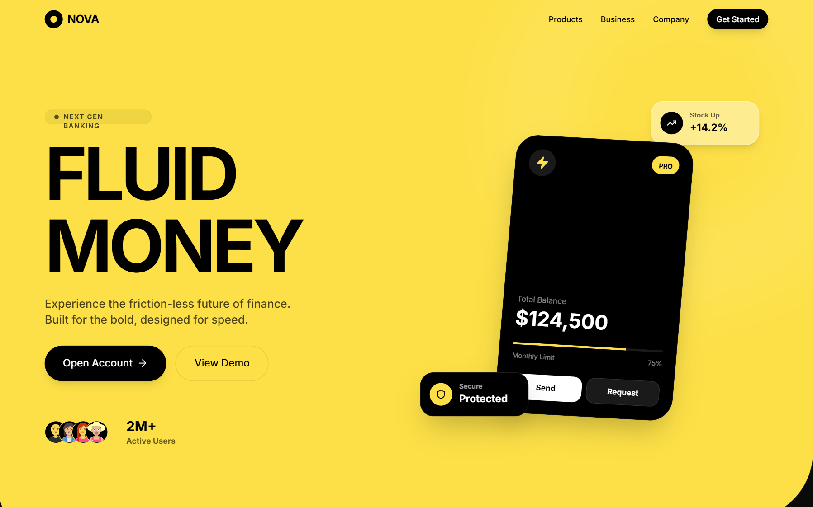

# Hyper-Saturated Fluid

A landing page featuring a Hyper-Saturated Fluid design style. It uses a 'Cyber Yellow' primary color with organic 'liquid' sectioning, contrasting against a 'Deep Onyx' dark void. Includes glassmorphic data cards, massive typography, and pill-shaped interactive elements.



## Prompt

```text
<design-system>

Design Style: Hyper-Saturated Fluid\
Design Philosophy\
Core Concept: High-Contrast Fluidity This style merges the aggressive energy of high-saturation palettes with the soft, modern sophistication of glassmorphism and organic "liquid" geometry. It is designed to feel high-end, technologically advanced, and instantly memorable. Unlike standard flat design, it uses massive, asymmetrical "blob" sectioning to guide the eye.

Core Tenets:

Liquid Sectioning: Ditch straight horizontal divisions. Sections are divided by large-scale, organic "waves" or "liquid" cutouts. One primary color (usually a vibrant yellow or neon) dominates the hero area, bleeding into dark "void" sections.

Aggressive Saturation: Use one "shout" color that takes up 60% of the viewport. This color must be highly saturated (Cyber Yellow, Neon Green, or Electric Blue) to create an immediate psychological impact.

Glassmorphic Overlays: Primary interactive data (like credit cards or stat panels) are rendered as "frosted glass." They use high backdrop-blur and thin, white inner-strokes to simulate depth without breaking the clean aesthetic.

Massive Minimalist Typography: Headlines are oversized and bold, serving as the primary visual anchor. Body text is kept tiny and functional to maximize the impact of the hero scale.

The Dark Void: High-saturation areas are always balanced by deep black or charcoal "void" sections. This contrast ensures that the vibrant colors don't overwhelm the user and maintains a "premium" feel.

The Vibe:

Premium Fintech: Feels like a next-generation bank or a high-end luxury tech product.

Modern & Bold: Unapologetically loud but structurally disciplined.

Fluid Tech: Suggests movement, ease of use, and "frictionless" transactions.

Design Token System (The DNA)\
Colors (The "High-Impact" Palette)\
The Shout Color:

Primary (Cyber Yellow): #FDE047 (Vibrant, high-vis yellow). This is the "Hero" color. The Void:

Background (Deep Onyx): #0A0A0A (Rich black-gray).

Surface (Charcoal): #171717 (For secondary dark panels). Accents:

Pure White: #FFFFFF (For primary text on dark backgrounds and glass borders).

Deep Gray: #262626 (For UI elements inside the dark void).

Typography\
Font Family: "Inter" (Google Fonts) or "General Sans" (Fontshare). A clean, geometric sans-serif is mandatory.

Hierarchy:

Hero Headline: text-6xl to text-8xl, font-bold, tracking-tight.

Sub-headers: text-xl, font-medium, opacity-80.

Body: text-sm, font-normal, leading-relaxed.

Labels: text-[10px], uppercase, tracking-widest.

Shapes & Radii\
The "Liquid" Cut: Section containers use rounded-[100px] or custom clip-path waves to create asymmetrical, organic edges.

Component Radii: Pill-shapes (rounded-full) for buttons and badges. rounded-[32px] for glass containers.

Glass Depth: backdrop-blur-xl, bg-white/10, and a 1px white border at 20% opacity.

Component Stylings

1. The "Liquid" Hero Section\
   Base Styles: bg-cyber-yellow with a large rounded-b-[120px] (bottom-right) and rounded-bl-[40px] (bottom-left) to create an asymmetrical wave.

Content: Text is strictly left-aligned. Massive headlines in black.

1. The "Glassmorphic" Data Card\
   Base Styles: bg-white/10 with backdrop-blur-2xl and border border-white/20.

Interaction: A "Pill" badge in the top-right (bg-cyber-yellow) for actions like "Add Money."

Shadow: A very soft, large-radius black shadow (shadow-2xl) to lift the glass off the "liquid" surface.

1. The "Pill" CTA Button\
   Solid State: bg-black with text-white or bg-cyber-yellow with text-black.

Outline State: border-2 border-black/20 with a clean, centered label.

Hover: scale-105 and shadow-lg.

Animation & Motion\
Fluid Entrance: Sections slide up with a "liquid" elastic ease (cubic-bezier(0.22, 1, 0.36, 1)).

Glass Drift: Glassmorphic cards have a very subtle, slow floating animation (animate-float).

Micro-interactions: Buttons should use a smooth "squish" effect on click (active:scale-95).

Non-Genericness (The "Bold" Factor)\
Asymmetrical Sectioning: The page shouldn't be a stack of blocks; it should be a flow of organic shapes where the yellow "bleeds" into the black at different depths.

Logo Ticker in the Void: Partner logos (dbt, Tableau, etc.) are placed in the black "void" section at the bottom, styled in monochromatic white/gray to maintain focus on the hero.

High-Vis Trust Badges: Use pill-shaped badges with gold/yellow icons to showcase awards (e.g., "The world's best digital bank") inside the transition areas.

Dos and Don'ts\
DO use one dominant, saturated color to anchor the brand identity.

DO use heavy backdrop-blur for all floating UI elements.

DO prioritize massive typography for the main value proposition.

DON'T use standard 8px or 12px border radii; go extreme with pill shapes or huge organic curves.

DON'T clutter the high-saturation area; let the color and the type breathe.

DON'T use gradients on the "shout" color; keep it a flat, vibrant punch.

</design-system>
```

**▶ Try it live → [https://superdesign.dev/library/hyper-saturated-fluid](https://superdesign.dev/library/hyper-saturated-fluid?utm_source=github&utm_medium=prompt-repo&utm_campaign=prompt-library)**

**Use it in your coding agent:** install the [Superdesign skill](https://github.com/superdesigndev/superdesign-skill), then:

```bash
superdesign get-prompts --slugs "hyper-saturated-fluid" --json
```

*1,002 copies · 1,971 tries · style*
