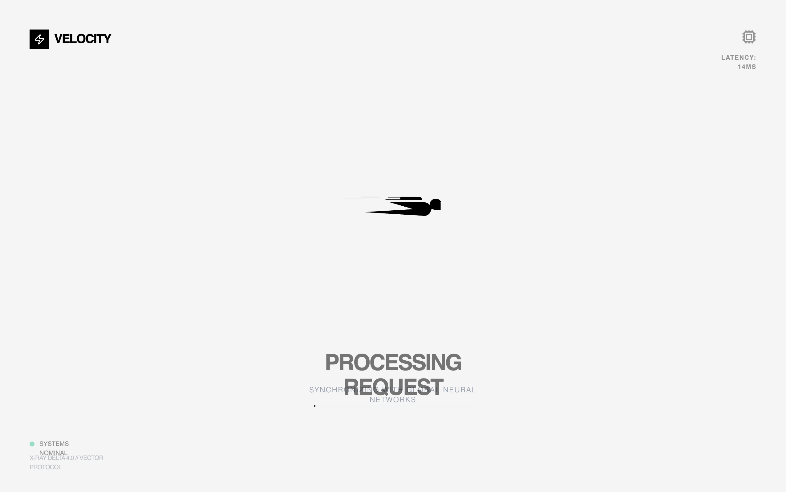

# Hyper-Speed Loading State

Loading animation UI featuring a character-like loader with animated lines, a body made from geometric shapes, and moving horizontal lines across the background. The loader have smooth animations with multiple synchronized motion effects including rotation, translation, and opacity fades.



## Prompt

```text
Create a complete loading animation UI featuring the spinner design from the provided code: a character-like loader with animated lines, a body made from geometric shapes, and moving horizontal lines across the background. The loader should have smooth animations with multiple synchronized motion effects including rotation, translation, and opacity fades. The design should showcase the full animation in action with a clean, centered presentation and minimal background to highlight the animation effects.

Here is a reference implementation:

~~~html
<!DOCTYPE html>
<html lang="en">
<head>
  <meta charset="UTF-8">
  <meta name="viewport" content="width=device-width, initial-scale=1.0">
  <title>Hyper-Speed Loading State</title>
  <script src="https://cdn.tailwindcss.com"></script>
  <script src="https://code.iconify.design/iconify-icon/1.0.7/iconify-icon.min.js"></script>
  <link rel="preconnect" href="https://fonts.googleapis.com">
  <link rel="preconnect" href="https://fonts.gstatic.com" crossorigin>
  <link href="https://fonts.googleapis.com/css2?family=Outfit:wght@300;400;600&family=Space+Grotesk:wght@500;700&display=swap" rel="stylesheet">
  <style>
    @view-transition {
      navigation: auto;
    }

    /* --- REPLICATED LOADER CSS --- */
    .loader {
      position: absolute;
      top: 50%;
      margin-left: -50px;
      left: 50%;
      animation: speeder 0.4s linear infinite;
      z-index: 10;
    }

    .loader > span {
      height: 5px;
      width: 35px;
      background: #000;
      position: absolute;
      top: -19px;
      left: 60px;
      border-radius: 2px 10px 1px 0;
    }

    .base span {
      position: absolute;
      width: 0;
      height: 0;
      border-top: 6px solid transparent;
      border-right: 100px solid #000;
      border-bottom: 6px solid transparent;
    }

    .base span:before {
      content: "";
      height: 22px;
      width: 22px;
      border-radius: 50%;
      background: #000;
      position: absolute;
      right: -110px;
      top: -16px;
    }

    .base span:after {
      content: "";
      position: absolute;
      width: 0;
      height: 0;
      border-top: 0 solid transparent;
      border-right: 55px solid #000;
      border-bottom: 16px solid transparent;
      top: -16px;
      right: -98px;
    }

    .face {
      position: absolute;
      height: 12px;
      width: 20px;
      background: #000;
      border-radius: 20px 20px 0 0;
      transform: rotate(-40deg);
      right: -125px;
      top: -15px;
    }

    .face:after {
      content: "";
      height: 12px;
      width: 12px;
      background: #000;
      right: 4px;
      top: 7px;
      position: absolute;
      transform: rotate(40deg);
      transform-origin: 50% 50%;
      border-radius: 0 0 0 2px;
    }

    .loader > span > span:nth-child(1),
    .loader > span > span:nth-child(2),
    .loader > span > span:nth-child(3),
    .loader > span > span:nth-child(4) {
      width: 30px;
      height: 1px;
      background: #000;
      position: absolute;
      animation: fazer1 0.2s linear infinite;
    }

    .loader > span > span:nth-child(2) {
      top: 3px;
      animation: fazer2 0.4s linear infinite;
    }

    .loader > span > span:nth-child(3) {
      top: 1px;
      animation: fazer3 0.4s linear infinite;
      animation-delay: -1s;
    }

    .loader > span > span:nth-child(4) {
      top: 4px;
      animation: fazer4 1s linear infinite;
      animation-delay: -1s;
    }

    @keyframes fazer1 {
      0% { left: 0; }
      100% { left: -80px; opacity: 0; }
    }
    @keyframes fazer2 {
      0% { left: 0; }
      100% { left: -100px; opacity: 0; }
    }
    @keyframes fazer3 {
      0% { left: 0; }
      100% { left: -50px; opacity: 0; }
    }
    @keyframes fazer4 {
      0% { left: 0; }
      100% { left: -150px; opacity: 0; }
    }

    @keyframes speeder {
      0% { transform: translate(2px, 1px) rotate(0deg); }
      10% { transform: translate(-1px, -3px) rotate(-1deg); }
      20% { transform: translate(-2px, 0px) rotate(1deg); }
      30% { transform: translate(1px, 2px) rotate(0deg); }
      40% { transform: translate(1px, -1px) rotate(1deg); }
      50% { transform: translate(-1px, 3px) rotate(-1deg); }
      60% { transform: translate(-1px, 1px) rotate(0deg); }
      70% { transform: translate(3px, 1px) rotate(-1deg); }
      80% { transform: translate(-2px, -1px) rotate(1deg); }
      90% { transform: translate(2px, 1px) rotate(0deg); }
      100% { transform: translate(1px, -2px) rotate(-1deg); }
    }

    .longfazers {
      position: absolute;
      width: 100%;
      height: 100%;
      overflow: hidden;
      pointer-events: none;
    }

    .longfazers span {
      position: absolute;
      height: 2px;
      width: 20%;
      background: #000;
      opacity: 0.1;
    }

    .longfazers span:nth-child(1) {
      top: 20%;
      animation: lf 0.6s linear infinite;
      animation-delay: -5s;
    }

    .longfazers span:nth-child(2) {
      top: 40%;
      animation: lf2 0.8s linear infinite;
      animation-delay: -1s;
    }

    .longfazers span:nth-child(3) {
      top: 60%;
      animation: lf3 0.6s linear infinite;
    }

    .longfazers span:nth-child(4) {
      top: 80%;
      animation: lf4 0.5s linear infinite;
      animation-delay: -3s;
    }

    @keyframes lf { 0% { left: 200%; } 100% { left: -200%; opacity: 0; } }
    @keyframes lf2 { 0% { left: 200%; } 100% { left: -200%; opacity: 0; } }
    @keyframes lf3 { 0% { left: 200%; } 100% { left: -100%; opacity: 0; } }
    @keyframes lf4 { 0% { left: 200%; } 100% { left: -100%; opacity: 0; } }

    /* Styling the background */
    .noise-bg {
      background-image: url("data:image/svg+xml,%3Csvg viewBox='0 0 200 200' xmlns='http://www.w3.org/2000/svg'%3E%3Cfilter id='noiseFilter'%3E%3CfeTurbulence type='fractalNoise' baseFrequency='0.65' numOctaves='3' stitchTiles='stitch'/%3E%3C/filter%3E%3Crect width='100%25' height='100%25' filter='url(%23noiseFilter)'/%3E%3C/svg%3E");
      opacity: 0.03;
    }

    .font-outfit { font-family: 'Outfit', sans-serif; }
    .font-space { font-family: 'Space Grotesk', sans-serif; }
  </style>
</head>
<body>
  <div class="min-h-screen bg-[#FDFDFD] relative overflow-hidden flex flex-col items-center justify-center">
    
    <!-- Background Texture -->
    <div class="absolute inset-0 noise-bg pointer-events-none"></div>

    <!-- Long Fazers Background -->
    <div class="longfazers">
      <span></span>
      <span></span>
      <span></span>
      <span></span>
    </div>

    <!-- Loader Component Container -->
    <div class="relative w-full max-w-2xl h-[400px] flex items-center justify-center">
      <div class="loader">
        <span>
          <span></span>
          <span></span>
          <span></span>
          <span></span>
        </span>
        <div class="base">
          <span></span>
          <div class="face"></div>
        </div>
      </div>
    </div>

    <!-- Content Overlay -->
    <div class="z-20 text-center mt-8 space-y-4">
      <h1 class="font-space text-4xl font-bold tracking-tighter text-black uppercase animate-pulse">
        Processing Request
      </h1>
      <p class="font-outfit text-gray-400 font-light tracking-widest uppercase text-xs">
        Synchronizing with global neural networks
      </p>

      <!-- Progress Bar Mockup -->
      <div class="w-64 h-1 bg-gray-100 rounded-full mx-auto mt-12 overflow-hidden relative">
        <div class="h-full bg-black w-1/3 animate-[progress_3s_ease-in-out_infinite]"></div>
      </div>
    </div>

    <!-- Decorative Elements -->
    <div class="absolute bottom-12 left-12 flex flex-col items-start space-y-2 opacity-40">
      <div class="flex items-center space-x-2 text-[10px] font-space">
        <span class="w-2 h-2 rounded-full bg-emerald-500"></span>
        <span class="text-black">SYSTEMS NOMINAL</span>
      </div>
      <div class="text-[10px] font-outfit text-gray-500 uppercase tracking-tighter">
        X-RAY DELTA 4.0 // VECTOR PROTOCOL
      </div>
    </div>

    <div class="absolute top-12 right-12 text-right opacity-40">
      <iconify-icon icon="lucide:cpu" class="text-2xl text-black mb-2"></iconify-icon>
      <div class="text-[10px] font-space text-black font-bold uppercase tracking-widest">
        LATENCY: 14ms
      </div>
    </div>

    <!-- Branding -->
    <div class="absolute top-12 left-12">
      <a href="#" id="brand-logo-link" class="flex items-center space-x-2 group">
        <div class="w-8 h-8 bg-black flex items-center justify-center">
          <iconify-icon icon="lucide:zap" class="text-white text-lg group-hover:scale-110 transition-transform"></iconify-icon>
        </div>
        <span class="font-space text-xl font-bold tracking-tighter">VELOCITY</span>
      </a>
    </div>

  </div>

  <style>
    @keyframes progress {
      0% { transform: translateX(-100%); }
      50% { transform: translateX(50%); }
      100% { transform: translateX(200%); }
    }
  </style>
</body>
</html>
~~~
```

**▶ Try it live → [https://superdesign.dev/library/hyper-speed-loading-state](https://superdesign.dev/library/hyper-speed-loading-state?utm_source=github&utm_medium=prompt-repo&utm_campaign=prompt-library)**

**Use it in your coding agent:** install the [Superdesign skill](https://github.com/superdesigndev/superdesign-skill), then:

```bash
superdesign get-prompts --slugs "hyper-speed-loading-state" --json
```

*749 copies · 2,182 tries · Components · General · animation, loading*
