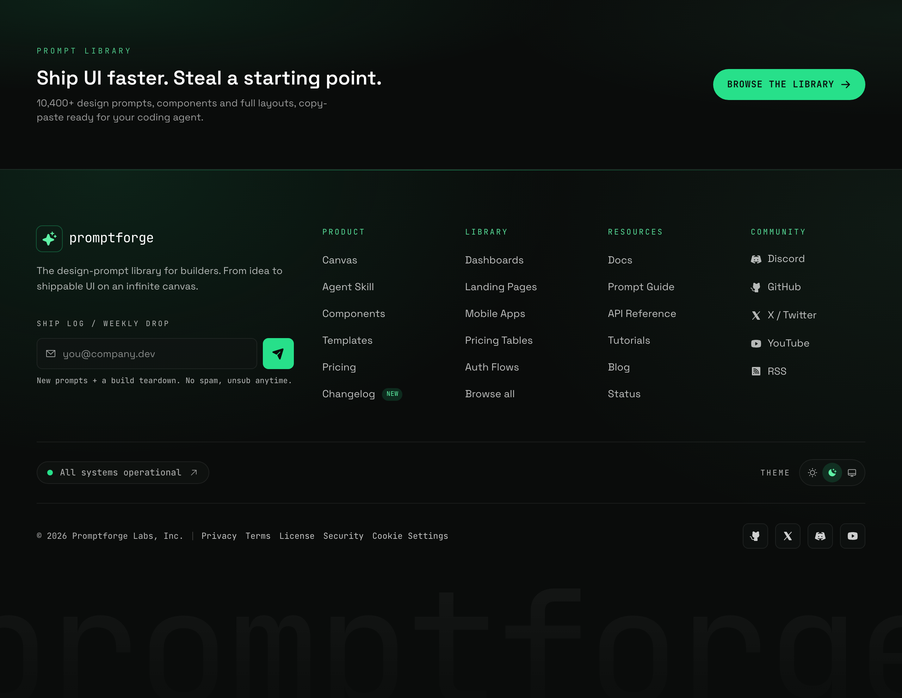

# Ink & Acid Mono Sitemap Footer

A near-black ink footer with acid-green accents and mono labels: four link columns, a newsletter, a live status pill, and a giant ghost wordmark.



## Prompt

```text
{"summary": "Build a frameless, full-bleed dark sitemap footer for a developer-tooling / prompt-library product, with a brand+newsletter block, four columns of links, a status+theme strip, a legal bar, and a huge ghosted wordmark watermark.", "style": "Near-black 'ink' palette: page base #0a0c0b, surfaces #101413 (ink-900) and #161b19 (ink-850) at low opacity, raised tones #1c2321 / #283230. Acid-green accent ramp #5ff2a6 (acid-400), #27e08a (acid-500), #16c476 (acid-600) used for the wordmark glyph gradient, link hover, the primary send button, focus rings and the live status dot. Text is white at graded opacity (white, white/75, white/70, white/60). Fonts via Google Fonts: Space Grotesk for sans / body and JetBrains Mono for all labels, eyebrows, links-as-code, status text and legal. Mood: technical, confident, terminal-adjacent but premium; accents stay restrained (thin glows, 0.06-0.15 alpha green washes), never neon-flooded. Subtle grain via two faint radial green gradients in the corners and a hairline top border glow (transparent -> acid-500/40 -> transparent).", "layout_and_structure": "Frameless, full-width <footer> with overflow hidden; content centered in a max-w-[1240px] container, px-6 on mobile rising to px-8. Top edge carries a 1px gradient hairline glow. Upper region is a 12-column grid (md:grid-cols-12, pt-16 -> pt-20): brand+newsletter block spans 4 cols on desktop (full width on tablet), the link area spans 8 cols and itself holds a nested 4-column grid (Product, Library, Resources, Community). Below the grid sit three stacked hairline-divided strips: a status + theme row (mt-14, border-t, flex row on sm), then a legal bar (border-t: copyright + dotted divider + Privacy/Terms/License/Security/Cookie links on the left, social icon chips on the right), then an oversized centered wordmark watermark (text-[17.5vw], font-700 mono, white/4.5% top-to-transparent gradient bg-clip-text, pulled up under the legal bar). Responsive reflow: desktop = brand 4 / four link columns 4-wide; tablet (md) = brand full width then columns in a 2-up grid, all columns expanded; mobile (single col) = the four link columns become <details> accordions with caret chevrons and hairline dividers (cols are forced open and non-clickable >=768px). The status/theme strip stacks vertically below sm and goes row-between at sm; the legal bar stacks until lg then goes row-between.", "special_ui_components": "Brand lockup = rounded-lg acid-tinted glyph tile (sparkle icon, acid-500/12 fill + acid-500/30 ring) beside a lowercase mono wordmark. Newsletter form with a mono uppercase 'Ship log / weekly drop' label, an email input with a leading envelope icon, hairline border on ink-900/70, acid focus border+ring, and a square 44px acid-500 paper-plane send button, plus a mono reassurance line. Each link column has a mono uppercase acid-tinted heading; links reveal an arrow-up-right icon and shift to acid-400 on hover; one item carries a small acid 'New' pill; the Community column prefixes links with brand icons (Discord, GitHub, X, YouTube, RSS). A pill-shaped live status chip with a pulsing acid status dot ('All systems operational') and an arrow. A segmented three-way theme switcher (sun / moon-stars / desktop) inside a rounded hairline track, dark state active in acid. Legal bar has small square social icon chips (GitHub, X, Discord, YouTube) with acid hover treatment. Giant non-interactive ghost wordmark watermark bleeds along the bottom edge.", "special_notes": "Frameless: render the footer alone with no browser chrome, device mockup, or window frame. Full-bleed background to the viewport edges while content stays in the 1240px container. The wordmark watermark and top hairline glow are pure decoration (pointer-events none, select none) and must clip cleanly at the footer edges. Keep text WCAG-legible against #0a0c0b (lightest body text stays at white/70 or above; acid green only on dark, never as body copy). Mono is for micro-copy and labels, not long sentences. Avoid generic indigo/violet SaaS slop, glassmorphism blur cards, and stock gradient blobs: the only color is the disciplined acid-green ramp on near-black ink."}
```

**▶ Try it live → [https://superdesign.dev/library/ink-and-acid-mono-sitemap-footer](https://superdesign.dev/library/ink-and-acid-mono-sitemap-footer?utm_source=github&utm_medium=prompt-repo&utm_campaign=prompt-library)**

**Use it in your coding agent:** install the [Superdesign skill](https://github.com/superdesigndev/superdesign-skill), then:

```bash
superdesign get-prompts --slugs "ink-and-acid-mono-sitemap-footer" --json
```

*0 copies · 2,388 tries · Forms & Contact · General · footer, mega-footer, newsletter, dark*
