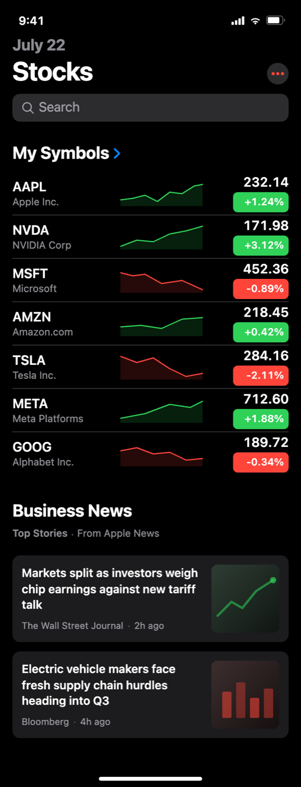

# iOS Design System UI: Dark Mode Stocks Watchlist App

A native iOS dark mode stocks watchlist screen built to the Apple design system (Human Interface Guidelines dark appearance) on a true black background. A gray date over a bold Stocks large title, a dark search field, then seven My Symbols rows: ticker and company name, an inline SVG sparkline (green rising for gainers, red falling for losers), and a right-aligned tabular price above a fixed-width filled change badge in system green or system red. A Business News section with Top Stories on elevated dark surfaces and a home indicator close the screen. SF Pro, hairline separators, exact iOS dark system colors. Ideal for stocks, crypto, forex and portfolio watchlist screens in finance apps.



## Prompt

```text
{
  "summary": "A native iOS dark-mode Stocks app watchlist screen built to the Apple design system (HIG dark appearance) on true black #000000. Top to bottom: a status bar (9:41 + signal/wifi/battery as inline SVG), a gray 20px/700 date line 'July 22' over a 34px/700 white Large Title 'Stocks' with a small #2C2C2E circular more-button (three red #FF453A dots), a 36px rounded-10 #2C2C2E search field with a magnifier glyph and 'Search' placeholder, then a 22px/700 'My Symbols' watchlist header with a blue #0A84FF chevron. Seven 56px watchlist rows follow, each with three columns: left, a 17px/600 white ticker symbol over a 13px gray company name; middle, an inline-SVG sparkline (viewBox 0 0 100 32, preserveAspectRatio none, 1.5px stroke, green #30D158 rising line with a 15%-opacity area fade for gainers, red #FF453A falling line for losers, last point at the right edge); right, a 17px/600 white tabular-nums price above a fixed 72x26px rounded-6 filled change badge (green or red fill, white 13px/600 right-aligned percent). Hairline #38383A separators run between rows. Below, a 'Business News' section: 22px/700 header, a gray 'Top Stories - From Apple News' attribution line, and two news cards on #1C1C1E rounded-10 surfaces, each a 15px/600 white headline + 12px gray source/time meta on the left and an 88px rounded-8 duotone thumbnail on the right (a dark green-tinted gradient with a rising line motif; a dark red-tinted gradient with bar-chart motif). A white 134x5px home-indicator pill closes the screen. Only chroma on screen: system green/red market data plus small blue interactive accents.",
  "style": {
    "description": "The Apple design system (Human Interface Guidelines) in the DARK appearance, not a stylized theme: true-black systemBackground #000000 as the page, elevated card surfaces #1C1C1E, tertiary fills (search, chips) #2C2C2E, label #FFFFFF, secondaryLabel rgba(235,235,245,0.6), hairline separators #38383A. Market-data semantics carry all the color: gains in dark-mode systemGreen #30D158, losses in systemRed #FF453A, filled as saturated badge rectangles with white text so the numbers are the brightest, most legible elements on screen; systemBlue #0A84FF appears only on small interactive accents (chevron, glyph dots). No purple, no page gradients, no glass; the only gradients are faint sparkline area fades and the duotone news thumbnails. Typography is the SF Pro system stack (-apple-system, 'SF Pro Text', 'SF Pro Display', system-ui) on the HIG ramp: Large Title 34/700, section headers 22/700, row labels 17/600, secondary 13/400, prices in tabular numerals (font-variant-numeric: tabular-nums). Flat, precise, generous 8pt spacing; the restraint and data density are the aesthetic.",
    "prompt": "Design a native iOS dark-mode mobile screen using the Apple design system (Human Interface Guidelines) dark appearance. Page background is true black #000000; elevated cards #1C1C1E; tertiary fills (search fields, chips) #2C2C2E. Text: label #FFFFFF, secondaryLabel rgba(235,235,245,0.6); hairline separators #38383A at 1px. Use the SF Pro system font stack (-apple-system, 'SF Pro Text', 'SF Pro Display', system-ui) with the HIG type ramp: Large Title 34px/700 left-aligned under a gray 20px/700 date line, section headers 22px/700, primary row labels 17px/600, secondary 13px/400, all numerals tabular (font-variant-numeric: tabular-nums). Reserve color for meaning: dark-mode systemGreen #30D158 for gains, systemRed #FF453A for losses, both as saturated filled badges with white text; systemBlue #0A84FF only for small interactive accents. No purple, no page gradients, no emoji, no icon fonts; draw every glyph as inline SVG. Keep it flat, precise, and generous on an 8pt grid; the screen is frameless (no phone mockup), max-w-[430px] centered on the black page, fully responsive from 360px up."
  },
  "layout_and_structure": {
    "description": "A single-column mobile app screen (430px max width, centered, frameless) with a sticky header group and two content sections. Header: status bar row, date + Large Title with a trailing circular more-button, then a full-width rounded search field, all sticky on black. Section 1, the watchlist: a bold section header row ('My Symbols' + chevron) followed by seven 56px data rows in a strict three-column grid: 38% identity column (symbol over company name), 32% sparkline column, 30% right-aligned numbers column (price stacked over a fixed-width change badge), separated by inset hairlines. Section 2, news: a bold header + gray attribution line, then stacked media-object cards (text left, 88px square thumbnail right) on elevated surfaces with 12px gaps. A home-indicator pill closes the screen. The fixed badge width and tabular numerals keep every row's numbers optically aligned into a scannable column; sparklines share one viewBox scale so slopes compare across rows.",
    "prompt": "Lay out a single-column mobile watchlist screen, max width 430px centered, frameless. Top: a sticky header group on the page background containing a status bar row, a gray date line over a 34px Large Title with a small circular more-button on the right, and a full-width 36px rounded-10 search field. Main section: a section header row with a bold 22px title and a trailing chevron, then 7 data rows of 56px height in a three-column grid per row: 38% width for a bold ticker symbol stacked over a gray secondary name, 32% for a full-width inline-SVG sparkline (explicit viewBox, preserveAspectRatio none, line spanning edge to edge), 30% right-aligned for a bold price stacked over a fixed 72x26px rounded-6 filled change badge; draw a 1px hairline separator between rows. Second section: a bold 22px header with a gray attribution line, then stacked media-object cards on elevated rounded-10 surfaces, each with headline + source/time meta on the left and an 88px rounded-8 square thumbnail on the right, 12px between cards. Close with a centered 134x5px home-indicator pill. Keep everything on an 8pt grid with 16px page margins."
  },
  "special_ui_components": [
    {
      "component": "Watchlist row with sparkline and change badge",
      "description": "The signature row: ticker + company name on the left, a mid-cell trend sparkline, and a right-aligned tabular price stacked over a fixed-width filled percent badge, green for gains and red for losses, so sign, color, and slope always agree.",
      "prompt": "Build a 56px watchlist row as a three-column flex grid: left 38% with a 17px/600 white ticker over a 13px gray company name (truncate long names); middle 32% with an inline-SVG sparkline; right 30% right-aligned with a 17px/600 white tabular-nums price over a fixed 72x26px rounded-6 badge filled #30D158 (gain) or #FF453A (loss) containing white 13px/600 right-aligned percent text like +1.24% or -0.89%. Separate rows with a 1px #38383A hairline. The badge color, percent sign, and sparkline direction must agree in every row."
    },
    {
      "component": "Inline-SVG trend sparkline",
      "description": "A dependency-free sparkline drawn as inline SVG with an explicit viewBox and a faint area fade under the line; green rising for gainers, red falling for losers.",
      "prompt": "Draw each sparkline as inline SVG with viewBox='0 0 100 32' and preserveAspectRatio='none', sized w-full h-8. Stroke a 1.5px polyline in #30D158 (gainers, trending down-to-up) or #FF453A (losers, up-to-down) with round joins and caps, ending exactly at x=100 so the line reaches the plot's right edge, and add a closed area path under the line filled with the same color at 15% opacity. No chart library, no JS."
    },
    {
      "component": "iOS dark large-title header with status bar and search",
      "description": "The native iOS sticky header: status bar glyphs, a gray date eyebrow over the bold Large Title, a small circular more-button, and a dark rounded search field.",
      "prompt": "Compose a sticky header on #000000: a status bar row with 15px/600 white '9:41' left and inline-SVG signal, wifi, and battery glyphs right; then a 20px/700 gray rgba(235,235,245,0.6) date line over a 34px/700 white Large Title, with a 28px circular #2C2C2E button on the right holding three 2px red #FF453A dots; then a full-width 36px #2C2C2E rounded-10 search field with a 16px gray magnifier SVG and a 17px gray 'Search' placeholder."
    },
    {
      "component": "News story media-object with duotone thumbnail",
      "description": "A Top Stories card on an elevated dark surface: headline and source meta on the left, an 88px duotone SVG thumbnail with a subtle chart motif on the right.",
      "prompt": "Build a news card as a rounded-10 #1C1C1E surface with 12px padding and a 12px gap: left column with a 15px/600 white headline (max 3 lines, no terminal period) and a 12px gray source + time row like 'The Wall Street Journal - 2h ago'; right, an 88x88px rounded-8 thumbnail drawn as inline SVG with a dark duotone linear gradient (green-tinted or red-tinted) and a faint chart motif (a rising 3px polyline with an end dot, or four rounded bars) at 35-70% opacity. No photos, no stock imagery."
    },
    {
      "component": "Home indicator pill",
      "description": "The iOS home indicator closing the screen.",
      "prompt": "Center a 134x5px white rounded-3px pill at the bottom of the screen with 8px padding below it."
    }
  ]
}
```

**▶ [Try it live →](https://superdesign.dev/library/ios-design-system-ui-dark-mode-stocks-watchlist-app?utm_source=github&utm_medium=prompt-repo&utm_campaign=prompt-library)**

**Use it in your coding agent:** install the [Superdesign skill](https://github.com/superdesigndev/superdesign-skill), then:

```bash
superdesign get-prompts --slugs "ios-design-system-dark-stocks-watchlist" --json
```

*0 copies · 0 tries · Mobile Apps · Finance & Crypto · mobile app, ios, apple design system, dark mode*
