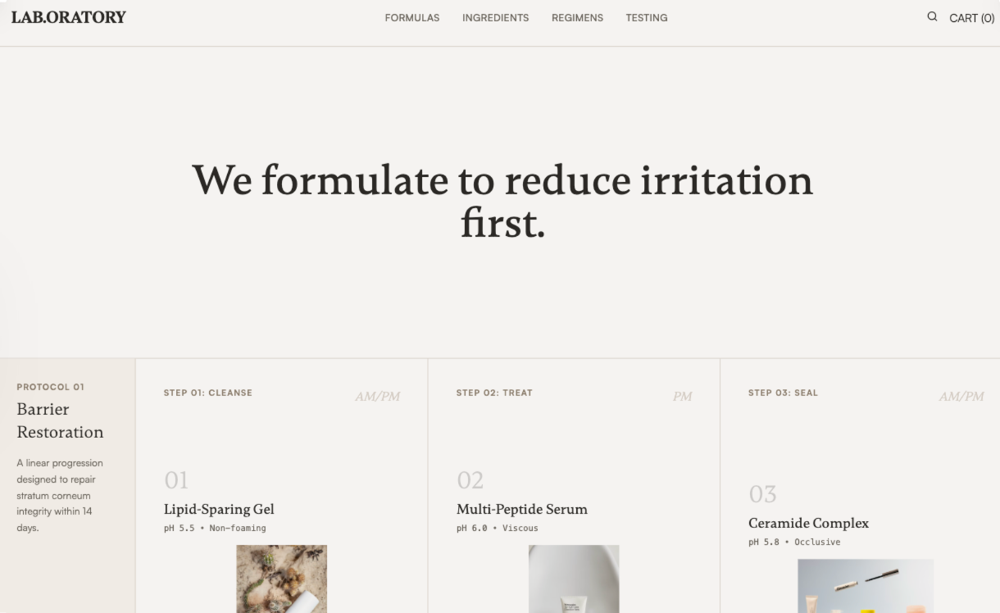

# Laboratory Skincare

Laboratory Skincare is a warm academic, methodical design system inspired by research journals and clinical lab notebooks. It features a grid-based, disciplined layout with generous white space and a restrained color palette of off-whites, warm grays, and soft blacks. Ideal for medical-grade skincare, high-tech beauty, pharmaceutical brands, or scientific SaaS, the design focuses on data-driven trust, factual evidence, and structural clarity over luxury tropes. Key features include tabular data presentation, formula sheets, and a 'Protocol' approach to content organization.



## Prompt

```text
{
  "summary": "A methodical 'Lab Notebook' aesthetic for e-commerce or informational sites, emphasizing clinical precision, scientific integrity, and grid-based structure. Uses high-contrast serif typography for headers and sans-serif for technical data, with a color palette rooted in off-white paper tones and technical annotations.",
  "style": {
    "description": "The style is defined by a 'warm clinical' theme. Typography pairs the elegant serif 'Gambetta' for emphasis and formulaic numbers with the functional sans-serif 'Satoshi' for body and labels. Colors utilize #F5F3F0 (Paper) and #2A2824 (Ink) with #8B7D6D (Warm Gray) for meta-data. Micro-interactions are minimal: simple line-drawing hover effects and 1px border transitions.",
    "prompt": "Create a design system with an 'Academic Research' aesthetic. \n- **Color Palette**: Background #F5F3F0, Primary Text #2A2824, Secondary Text #6B665E, Accents #8B7D6D (warm gray) and #6B7D6B (muted green for success/data), Borders #D4CCC4.\n- **Typography**: Headers use 'Gambetta' (Serif) with tight tracking; body and UI labels use 'Satoshi' (Sans-serif). Use mono-spaced numbering (tabular-nums) for all data points and formula IDs.\n- **Visual Style**: Everything is contained within a rigid 1px border grid (#D4CCC4). No shadows. No rounded corners. Use 'mix-blend-multiply' for product photography on off-white backgrounds to simulate print. Imagery should be grayscale or highly desaturated to maintain a clinical tone.\n- **Animations**: Subtle 0.25s ease-out transitions for hover states. Use 'hover-underline' animations where a 1px line expands from 0% to 100% width on text."
  },
  "layout_and_structure": {
    "description": "A structured, section-heavy layout that mimics a scientific report. It uses a vertical sidebar logic for section labels and a grid divide for content blocks.",
    "prompts": [
      {
        "part": "Clinical Header",
        "prompt": "Sticky header with 80px height. Left-aligned serif logo in bold uppercase. Centered nav links in 12px uppercase sans-serif with 2px letter spacing. Right-aligned 'Cart (0)' link. Bottom-border 1px #D4CCC4."
      },
      {
        "part": "Opening Statement (Hero)",
        "prompt": "Minimalist hero section. 100vh or 40vh height with a single centered H1 in Gambetta Serif (size: 64px, weight: 500). Wide margins. No imagery. The text should be the sole focus."
      },
      {
        "part": "Regimen Protocol Map",
        "prompt": "A horizontal grid section. Left sidebar (200px) with a light gray-beige background (#F0EBE5) containing the 'Protocol ID' and skin compatibility tags. Main area divided into 3 equal columns by 1px vertical borders. Each column features: Step number in large transparent serif font, product image with mix-blend-multiply, technical specs (pH, texture) in mono-font, and a 'View Formula' text link."
      },
      {
        "part": "Formula Detail Sheet",
        "prompt": "Two-column split. Left side: Formula name and ID (e.g., F-12) followed by a dashed-line list of ingredients and percentages. Use 12px uppercase labels for category headers. Right side: Large texture or product shot in a #F0EBE5 background container with a floating 'Batch ID' annotation box in the top right corner."
      },
      {
        "part": "Ingredient Deep Dive (Accordion)",
        "prompt": "A vertical stack of expandable rows. Each row header has a plus icon that rotates 45 degrees on open. Inside: A 3-column grid explaining 'Function', 'Trade-offs', and 'Source' in 14px sans-serif text. Header background #E8E4DE."
      },
      {
        "part": "Clinical Proof Section",
        "prompt": "A 4-column stat grid. Each block contains a large Serif data point (e.g., +42%, 0/50) in muted green or soft black, a bold 10px uppercase label, and a short technical description."
      },
      {
        "part": "Restrained Footer",
        "prompt": "Text-heavy 4-column layout. Column 1: Logo and address. Column 2 & 3: Link lists titled 'Index' and 'Support'. Column 4: Newsletter signup with a single underline input field. All text 13px Satoshi. Use #A89F91 for bottom-level copyright text."
      }
    ]
  },
  "special_ui_components": [
    {
      "component": "Formula Annotation Label",
      "description": "A floating data tag used on images or detail sections.",
      "prompt": "A small rectangle with 1px border (#D4CCC4), background white (opacity 90%), backdrop-blur 4px. Inside: Two lines of mono-spaced text in 10px size. Line 1: 'BATCH: [ID]'. Line 2: 'STATUS: [PASS/FAIL]' in #6B7D6B."
    },
    {
      "component": "Data-Driven Review Card",
      "description": "A factual, no-frills review layout.",
      "prompt": "A square grid item (p-8). Features a Serif quote in 18px. Below the quote, a divider-less metadata section: Bold user name in uppercase, followed by 'Verified Purchase • [Skin Type]' in 12px secondary gray. No star icons allowed."
    }
  ],
  "special_notes": "MUST: Maintain a strict 1px grid throughout. Use high-quality, desaturated photography. Focus on 'evidence' over 'lifestyle'. MUST NOT: Use vibrant colors, rounded buttons, drop shadows, or decorative illustrations. Keep whitespace intentional and 'cold' but readable."
}
```

**▶ Try it live → [https://superdesign.dev/library/laboratory-skincare](https://superdesign.dev/library/laboratory-skincare?utm_source=github&utm_medium=prompt-repo&utm_campaign=prompt-library)**

**Use it in your coding agent:** install the [Superdesign skill](https://github.com/superdesigndev/superdesign-skill), then:

```bash
superdesign get-prompts --slugs "laboratory-skincare" --json
```

*89 copies · 2,196 tries · E-commerce · Health & Wellness · landing page, shopify, ecommerce, layout*
