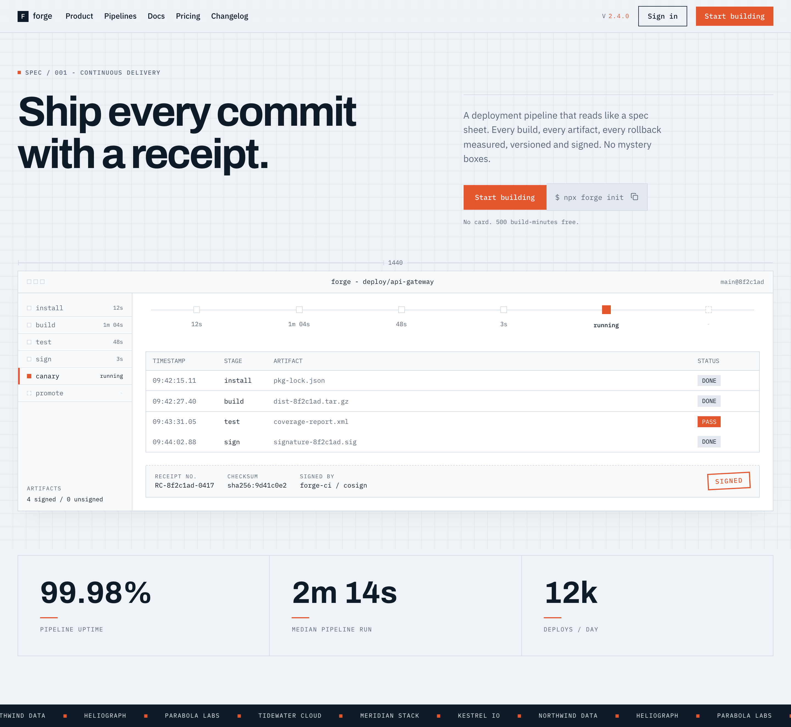

# Landing Page Hero: Blueprint Spec Sheet Developer Tool Site

A restrained BLUEPRINT-style landing page hero for a developer / infra SaaS product, built like an industrial spec sheet rather than a marketing splash. A cool slate #eef1f5 drafting-grid ground, near-black navy ink, hairline rules and sharp radius-0 corners, with ONE signal-orange #e4572e accent. An asymmetric split puts a giant Archivo headline against a right column with the subtitle and a primary button butt-joined to a `$ npx forge init` command pill. The signature move is a product mockup card with corner ticks and a measurement rule holding a pipeline run: a stage rail with durations, a stage timeline, a log table, and a signed-receipt block with a perforation and a rotated SIGNED stamp. Closes with a stat band and a mono ticker. Reusable for any CI/CD, build, observability, security or infra-tool landing hero.



## Prompt

```text
{
  "summary": "A restrained, industrial BLUEPRINT / SPEC-SHEET LANDING-PAGE HERO for a developer or infra SaaS product (a deployment-pipeline tool), on a single 1440-wide desktop viewport, deliberately built as a technical document rather than a marketing splash. Ground is a cool blueprint slate #eef1f5 tinted by a faint 24px drafting GRID (pure CSS repeating-linear-gradient at ~35% opacity - it must read as drafting paper, never a checkerboard); ink is near-black navy #101b28; every separation is a 1px hairline #d3dae2; muted text #5a6675; surfaces are white #ffffff with recessed panels #e4e9ef. EXACTLY ONE chroma: a signal-orange / vermilion #e4572e, allowed ONLY on the primary button, the eyebrow's leading tick, the version number, the single active/running state, the one PASS token, the stat underline ticks and the SIGNED stamp. THREE type roles, strict: Archivo 700 for the display H1 (76px / line-height 1.02 / letter-spacing -3px on desktop, stepping to ~-1.2px on mobile so it does not collide) and the 56px stat numbers; IBM Plex Sans 400/500 for the subtitle (17px/1.55) and nav links; IBM Plex Mono 400/500 for all UPPERCASE 11px eyebrows and labels (0.14em tracking), buttons (13px), the command pill, every mockup string, stat captions and the ticker. border-radius: 0 EVERYWHERE - sharp corners are the technical chrome. Flat: no gradients, no glass, no glow, no shadows except ONE very soft neutral shadow under the mockup card. Structure top to bottom: (1) a hairline-ruled top NAV - a sharp ink monogram tile + lowercase wordmark left, links center-left, and right a mono 'v2.4.0' version label whose NUMBER is the accent, a sharp outlined 'Sign in' link and a sharp vermilion 'Start building' button; (2) the HERO as a 2-column ASYMMETRIC split (~58/42), LEFT-aligned and never centered - left holds a mono eyebrow row (a small orange square tick + 'SPEC / 001 - CONTINUOUS DELIVERY') above a giant two-line Archivo headline; right holds the subtitle, then a button ROW where the vermilion primary button is BUTT-JOINED (no gap, shared hairline) to a #e4e9ef mono command pill reading '$ npx forge init' with a copy icon, then a mono risk-reversal line; (3) the SIGNATURE MOVE - a full-width white product MOCKUP card (radius 0, 1px border, 8px L-shaped hairline corner ticks at all four corners, and a hairline measurement rule labelled '1440' along its top edge) holding a pipeline run: a title bar (three tiny sharp squares + a mono 'forge - deploy/api-gateway' + a mono 'main@8f2c1ad'), a LEFT stage RAIL listing install / build / test / sign / canary / promote where each row carries a status glyph + the stage name + its duration (12s, 1m 04s, 48s, 3s, running, -), the RUNNING stage marked with a vermilion left bar and filled glyph, plus an 'ARTIFACTS - 4 signed / 0 unsigned' footer; a fluid STAGE TIMELINE built as plain HTML (a hairline rule behind six evenly-spaced boxes with mono duration captions, the fifth box filled vermilion, the sixth dashed and pending - NOT scaled SVG text, so it stays crisp at every width); a hairline LOG TABLE (timestamp / stage / artifact / status) whose columns are fluid so STATUS reaches the right edge, with four completed rows and exactly one vermilion PASS token; and the CONCEPT PAYOFF - a SIGNED-RECEIPT block joined under the table by a dashed PERFORATION, carrying mono 'RECEIPT NO.', 'CHECKSUM' (sha256:...) and 'SIGNED BY' data pairs plus a slightly ROTATED vermilion outlined 'SIGNED' rubber stamp; (4) a STAT BAND of three cells divided by vertical hairlines, each a giant Archivo number + a short vermilion underline tick + a mono UPPERCASE caption; (5) a full-width ink-background mono TICKER of plain-text customer names separated by small orange squares. The four mockup surfaces MUST reconcile into ONE story: the rail's durations match the timeline's captions, the log table's completed rows match the artifact count, and the running stage correctly has no log row yet.",
  "style": {
    "description": "Industrial blueprint / spec-sheet restraint - a technical document that happens to sell a product. A cool slate #eef1f5 drafting-grid ground with near-black navy #101b28 ink, hairline #d3dae2 rules doing ALL separation, and exactly ONE signal-orange #e4572e accent that only ever marks meaning (the primary action, the running state, the one PASS, the SIGNED stamp) and never decorates. Everything is flat and sharp-cornered: no gradients, no glass, no glow, no bevels, one soft neutral shadow at most. Hierarchy comes from SIZE, CASE and SPACING - a massive tightly-tracked Archivo display against tiny 11px mono UPPERCASE labels - not from color. The register is instrument panel, not splash page: measurement rules, corner ticks, spec eyebrows, checksums, version numbers. The anti-slop signal is that the concept is STRUCTURED rather than asserted - the product's promise (a signed receipt for every deploy) is physically built as a perforated receipt block with a rotated rubber stamp, so the aesthetic generates the artifacts instead of skinning a generic dark-mono dev-tool page. No purple, no indigo, no violet, no default AI gradient, no centered-everything, no emoji, no lorem, no placeholder logo walls.",
    "prompt": "Design a restrained INDUSTRIAL BLUEPRINT / SPEC-SHEET landing-page HERO for a developer or infra SaaS product on a single 1440-wide desktop viewport, and make it read like a technical document rather than a marketing splash. Ground it in cool blueprint slate #eef1f5 tinted by a faint 24px CSS drafting grid (repeating-linear-gradient, ~35% opacity, subtle - drafting paper, never a checkerboard), with near-black navy ink #101b28, muted #5a6675, white #ffffff surfaces, and 1px #d3dae2 hairlines doing ALL the separating. Use EXACTLY ONE chroma - signal-orange / vermilion #e4572e - and spend it ONLY where it means something: the primary button, the eyebrow tick, the version number, the single running state, the one PASS token, the stat underline ticks, the SIGNED stamp. Use THREE type roles strictly: Archivo 700 for a giant LEFT-aligned display headline (76px / line-height 1.02 / letter-spacing -3px, stepping up to about -1.2px below 768px so it never collides) and the big stat numbers; IBM Plex Sans for the 17px subtitle and nav links; IBM Plex Mono for every UPPERCASE 11px eyebrow and label at 0.14em tracking, the buttons, the command pill, all mockup strings, the stat captions and the ticker. Set border-radius to 0 EVERYWHERE. Keep it flat - no gradients, no glass, no glow, no shadows except one very soft neutral shadow under the mockup card. Build hierarchy from SIZE, CASE and SPACING, never from color. Carry the blueprint as a pure CSS/HTML technique (the grid, hairline rules, 8px L-shaped corner ticks, a labelled measurement rule) with NO JavaScript. Above all, STRUCTURE the concept instead of asserting it: pick the product's core promise and physically build it into the composition as a real artifact (here, a perforated signed-receipt block with checksum and a rotated rubber stamp) so the aesthetic generates the page's evidence. Fully responsive with zero horizontal overflow at BOTH 390px and 1440px, fluid widths only, no fixed 1440px container, no h-screen or overflow-hidden on the root. No purple/indigo/violet, no AI-default gradient, no centered-everything, no emoji, no lorem, and no ACME/STARK placeholder logo walls - invent plausible company names."
  },
  "layout_and_structure": {
    "description": "A single top-of-page hero on a blueprint-grid ground. A hairline-ruled nav on top; then an ASYMMETRIC 58/42 split hero, left-aligned, with the eyebrow + giant headline left and the subtitle + butt-joined CTA/command-pill + risk-reversal line right; then a full-width product mockup card with corner ticks and a measurement rule holding a stage rail, a stage timeline, a log table and a signed-receipt block; then a three-cell stat band divided by vertical hairlines; then a full-width ink mono ticker. On a narrow viewport the nav collapses to the monogram + primary button, the headline steps down in size and eases its tracking, the split stacks to one column, the mockup's rail becomes a horizontal scrollable row of stage chips, the log table drops its TIMESTAMP column (never the ARTIFACT column, which carries the concept's evidence), the receipt block stacks with the stamp staying stamp-sized and left-anchored, and the stat band becomes three stacked cells divided by horizontal hairlines.",
    "prompts": [
      {
        "part": "Top nav",
        "prompt": "Lay a full-width nav over the blueprint ground with a 1px #d3dae2 hairline UNDER it. Left: a small sharp (radius 0) ink #101b28 square monogram tile with a white letter, then a lowercase wordmark in IBM Plex Sans 15px/500. Center-left: nav links in IBM Plex Sans 14px/500 ink (Product, Pipelines, Docs, Pricing, Changelog). Far right: a mono 11px UPPERCASE muted 'v2.4.0' version label whose NUMBER is signal-orange #e4572e, then a sharp ink-outlined 'Sign in' link, then a sharp signal-orange 'Start building' button in IBM Plex Mono 13px/500 with white text. Airy and precise, no borders on the links, radius 0 throughout. Below 768px collapse to just the monogram + wordmark and the primary button."
      },
      {
        "part": "Hero split",
        "prompt": "Build the hero as a 2-column ASYMMETRIC split (left ~58%, right ~42%), LEFT-aligned, never centered. LEFT: an EYEBROW row = a small 6px signal-orange square tick + IBM Plex Mono 11px/500 UPPERCASE 0.14em-tracked muted text ('SPEC / 001 - CONTINUOUS DELIVERY'); below it a giant Archivo 700 H1 at 76px / line-height 1.02 / letter-spacing -3px in ink #101b28 on TWO tight lines (e.g. 'Ship every commit with a receipt.'). RIGHT: a hairline rule, then an IBM Plex Sans 17px/1.55 muted #5a6675 subtitle capped around 380px. Keep a generous but not baggy gap between the columns; the headline must dominate."
      },
      {
        "part": "CTA row with butt-joined command pill",
        "prompt": "Under the subtitle, place a BUTTON ROW where a sharp signal-orange #e4572e 'Start building' button (IBM Plex Mono 13px/500, white text, radius 0) is BUTT-JOINED to an inline mono COMMAND PILL with NO gap and a shared hairline: a #e4e9ef sharp box, radius 0, reading '$ npx forge init' in IBM Plex Mono 13px muted ink with a small copy-to-clipboard icon at its right edge. Below the row, a mono 11px muted risk-reversal line ('No card. 500 build-minutes free.'). On mobile the two stack full-width but keep the shared-edge look."
      },
      {
        "part": "Product mockup card",
        "prompt": "Below the hero, a FULL-WIDTH product MOCKUP card: white #ffffff, radius 0, 1px #d3dae2 border, ONE very soft neutral shadow, with 8px L-shaped hairline CORNER TICKS at its four corners and a hairline MEASUREMENT RULE with arrow-ends and a mono '1440' label running along its top edge - the spec-sheet tell. Inside, a title bar with a hairline bottom: three tiny sharp squares left, a centered mono 12px 'forge - deploy/api-gateway', and a mono 11px muted 'main@8f2c1ad' right."
      },
      {
        "part": "Stage rail",
        "prompt": "Inside the mockup, a LEFT rail (~208px, hairline right border, #f8fafc fill) listing six pipeline stages in IBM Plex Mono 12px - install, build, test, sign, canary, promote. Give EVERY row a status glyph + the stage name + its duration on the right (12s, 1m 04s, 48s, 3s, running, -): completed rows get a hairline-outlined white square glyph and muted text; the RUNNING stage (canary) gets a filled signal-orange glyph, ink text and a 3px signal-orange left bar; the pending stage gets a dashed glyph and #d3dae2 text. Do not leave the rail empty below the list - close it with a footer block: a mono 10px UPPERCASE muted 'ARTIFACTS' label over a mono 11px ink '4 signed / 0 unsigned'. Below 768px the rail becomes a horizontally scrollable row of stage chips above the main pane."
      },
      {
        "part": "Stage timeline",
        "prompt": "In the main pane, a horizontal STAGE TIMELINE built as plain fluid HTML, NOT scaled SVG text (scaled SVG text renders huge on desktop and unreadable on mobile). Absolutely position a 1px #d3dae2 rule behind a flex row of six equal columns; each column centers a small box over the rule with a mono 10-11px duration caption beneath it. Five hairline-outlined white 12px boxes, the fifth a filled 16px signal-orange box with an ink 'running' caption, the sixth a dashed pending box with a '-' caption in #d3dae2. It must stay crisp and fit without overflow at both 390px and 1440px."
      },
      {
        "part": "Log table",
        "prompt": "Under the timeline, a hairline-bordered LOG TABLE in IBM Plex Mono 12px with a #f8fafc header row of mono 11px UPPERCASE muted labels: TIMESTAMP / STAGE / ARTIFACT / STATUS. Make the columns FLUID (e.g. 130px 90px 1fr 100px) so ARTIFACT grows and STATUS lands on the RIGHT EDGE rather than bunching everything left. Four completed rows (install/pkg-lock.json, build/dist-8f2c1ad.tar.gz, test/coverage-report.xml, sign/signature-8f2c1ad.sig) with sharp #e4e9ef 'DONE' tokens and exactly ONE signal-orange 'PASS' token on the test row. The running stage must have NO row yet. Below 768px drop the TIMESTAMP column - never the ARTIFACT column, which carries the concept's evidence."
      },
      {
        "part": "Signed-receipt block",
        "prompt": "The concept payoff: joined directly under the log table, a SIGNED-RECEIPT block on #f8fafc with a 1px border and NO top border, separated instead by a dashed PERFORATION line so it reads as a torn-off receipt. Inside, a row of mono data pairs - each a 10px UPPERCASE 0.14em-tracked muted label over a 12px ink value: 'RECEIPT NO. / RC-8f2c1ad-0417', 'CHECKSUM / sha256:9d41c0e2', 'SIGNED BY / forge-ci / cosign' - and at the right a slightly ROTATED (-3deg) 2px signal-orange outlined box containing mono 12px UPPERCASE tracked 'SIGNED', reading as a rubber stamp. On mobile it stacks, but the stamp must keep a stamp-like width (w-max, left-anchored) and never stretch to a full-width bar."
      },
      {
        "part": "Stat band",
        "prompt": "Below the mockup, a STAT BAND of three cells divided by 1px vertical hairlines on the #eef1f5 ground: each cell = a giant Archivo 700 56px ink number ('99.98%', '2m 14s', '12k'), a short 32px signal-orange underline tick, then a mono 11px UPPERCASE 0.14em-tracked muted caption ('PIPELINE UPTIME', 'MEDIAN PIPELINE RUN', 'DEPLOYS / DAY'). Keep the numbers internally plausible against the run shown in the mockup. Stacks to three rows split by horizontal hairlines on mobile."
      },
      {
        "part": "Ticker strip",
        "prompt": "Close with a full-width TICKER strip on an ink #101b28 background: a marquee row of plain-text customer names in IBM Plex Mono 11px UPPERCASE 0.14em-tracked #eef1f5, separated by small 6px signal-orange squares, animated by a pure CSS keyframe translateX(-50%) with the list duplicated for a seamless loop. Invent plausible infra-company names (Kestrel IO, Northwind Data, Heliograph, Parabola Labs, Tidewater Cloud, Meridian Stack) - never ACME / STARK / WAYNE placeholder filler."
      }
    ]
  },
  "special_ui_components": [
    {
      "component": "Signed-receipt block with perforation and rotated rubber stamp",
      "description": "The page's concept payoff and its most stealable device: a torn-off receipt joined under the pipeline log table, carrying mono receipt-number / sha256-checksum / signer data pairs and a rotated vermilion SIGNED stamp. It turns the headline's promise ('a receipt for every commit') into a real artifact instead of a claim, which is what lifts the page out of the generic slate-and-mono dev-tool genre.",
      "prompt": "Build a SIGNED-RECEIPT block joined directly beneath a log table: a #f8fafc panel with a 1px #d3dae2 border and NO top border, separated from the table by a dashed perforation line (a 1px dashed #d3dae2 rule absolutely positioned across the top edge) so it reads as torn off. Lay a flex row inside: on the left, three mono data pairs, each a 10px UPPERCASE 0.14em-tracked muted #5a6675 label above a 12px ink #101b28 value - 'RECEIPT NO. / RC-8f2c1ad-0417', 'CHECKSUM / sha256:9d41c0e2', 'SIGNED BY / forge-ci / cosign' - wrapping gracefully with min-w-0 and truncation. On the right, a rubber STAMP: a w-max box with a 2px signal-orange #e4572e border, rotated -3deg, containing IBM Plex Mono 12px/500 UPPERCASE 0.14em-tracked #e4572e text reading 'SIGNED'. Radius 0 throughout, flat, no shadow. On narrow viewports stack the row but keep the stamp w-max and self-start so it never stretches into a full-width outlined bar."
    },
    {
      "component": "Blueprint measurement chrome (drafting grid, corner ticks, dimension rule)",
      "description": "The pure-CSS technique that makes the spec-sheet register real rather than asserted, and the reason the style survives a static screenshot and template reproduction: a drafting-paper grid, L-shaped corner ticks and a labelled dimension rule over the product mockup.",
      "prompt": "Create blueprint measurement chrome in pure CSS with no JS. (1) GRID: tint the page ground #eef1f5 with two repeating-linear-gradients (to right and to bottom) drawing a 1px rgba(211,218,226,0.35) line every 24px - it must read as faint drafting paper, never a visible checkerboard. (2) CORNER TICKS: at each of a card's four corners, absolutely position an 8px L-shaped mark made from two 1px #d3dae2 borders (e.g. border-top + border-left for the top-left), offset a few px outside the card edge. (3) DIMENSION RULE: above the card, a horizontal flex row - a 1px #d3dae2 line that flexes to fill, a mono 11px muted label reading the width ('1440') with horizontal padding, then another flexing 1px line - and cap each outer end with a small 9px vertical 1px tick so it reads as an architectural dimension line. Radius 0, flat, no shadows."
    },
    {
      "component": "Reconciling pipeline mockup (stage rail + fluid timeline + log table)",
      "description": "The copy-worthy asset: an HTML-native product mockup (not an image) whose four surfaces tell ONE consistent story, so a builder can drop their own stages in and ship it. Its fluid-HTML timeline deliberately avoids scaled-SVG text, which renders oversized on desktop and illegible on mobile.",
      "prompt": "Build an HTML-native pipeline-run mockup whose surfaces RECONCILE - this internal consistency is what makes it credible. Define six stages once (install 12s, build 1m 04s, test 48s, sign 3s, canary running, promote pending) and express them three ways. (1) RAIL: a ~208px left column, hairline right border, #f8fafc fill, one row per stage carrying a status glyph + mono 12px name + right-aligned mono 10px duration; the running stage gets a filled #e4572e glyph, ink text and a 3px orange left bar; the pending stage gets a dashed glyph and #d3dae2 text; close the column with an 'ARTIFACTS / 4 signed / 0 unsigned' mono footer so it is never a mostly-empty panel. (2) TIMELINE: a fluid flex row of six equal columns over an absolutely-positioned 1px hairline rule, each centering a box (12px hairline-outlined white; the running one a filled 16px orange; the pending one dashed) above a mono 10-11px duration caption - plain HTML, NOT scaled SVG text. (3) LOG TABLE: fluid grid columns (130px 90px 1fr 100px) so STATUS reaches the right edge, four completed rows naming real artifacts (pkg-lock.json, dist-<sha>.tar.gz, coverage-report.xml, signature-<sha>.sig), sharp #e4e9ef DONE tokens and exactly one orange PASS. The running stage must have NO log row, and the completed-row count must equal the rail's signed-artifact count."
    }
  ]
}
```
