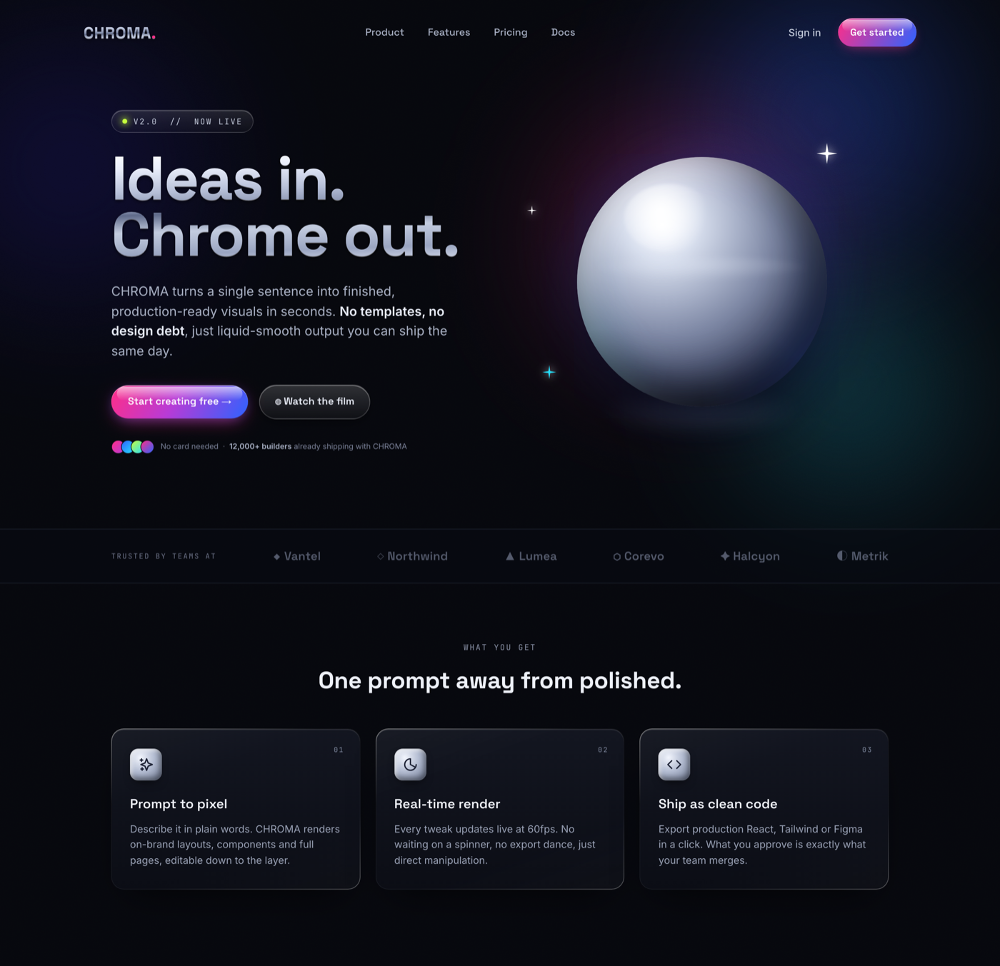

# Landing Page Hero: Y2K Chrome Product Landing

A landing page hero for a modern product, built in a bold Y2K liquid-chrome aesthetic. A deep near-black canvas, lit from within by a soft blue, magenta and cyan gradient-mesh glow, holds a huge liquid-chrome headline, glossy electric CTA pills, and a metallic 3D chrome orb as the hero visual. Full landing furniture (a thin nav, the hero headline and subhead, dual CTAs, a trust line and a logo strip, and a three-up feature row) keeps it unmistakably a product landing page. Space Grotesk display, Inter body, JetBrains Mono labels; deliberately no default indigo/violet slop gradient. Reusable for any bold consumer tech, AI, creative-tool, or launch landing page, and you can copy the chrome-text, glossy gloss-button, and chrome-bezel card recipes on their own.



## Prompt

```text
{
  "summary": "A bold landing-page hero for a modern AI / creative product ('CHROMA'), built in a modern Y2K / liquid-chrome aesthetic on a deep near-black #07080d canvas that is lit from within by a soft, heavily-blurred gradient-mesh glow (electric-blue #2e63ff, hot magenta #ff2e88, cyan #25e0ff at low opacity) plus a faint film grain, so it glows without ever becoming a flat purple wash. A thin top nav carries a liquid-chrome 'CHROMA.' wordmark (chrome-gradient text with a magenta period), center links (Product / Features / Pricing / Docs), a ghost 'Sign in', and a glossy electric 'Get started' pill. The hero is a two-column split. LEFT: a mono eyebrow pill ('v2.0 // NOW LIVE' with a lime status dot), a huge two-line LIQUID-CHROME headline ('Ideas in. / Chrome out.', ~88px Space Grotesk filled with a silver-to-steel background-clip gradient and a subtle bevel), an 18px muted subhead, two glossy CTAs (a primary magenta-to-blue gloss pill 'Start creating free' with a top specular highlight strip and an outer glow, plus a translucent chrome/glass secondary 'Watch the film'), and a trust line with a stack of gradient avatars ('No card needed - 12,000+ builders already shipping with CHROMA'). RIGHT: a large metallic chrome orb (a CSS radial + conic sphere with a bright specular hotspot, a faint high horizon reflection, colored rim reflections that pick up the mesh, and a soft ground shadow) with three small four-point sparkle stars. Below the hero, a bordered 'Trusted by teams at' logo strip shows six muted monochrome wordmarks on hairline rules. Then a centered 'What you get' section ('One prompt away from polished.') over a three-up feature row of chrome-bezel dark-glass cards, each with a chrome-gloss rounded-square icon, a numbered mono corner tag, a bold Space Grotesk title (Prompt to pixel / Real-time render / Ship as clean code) and a one-line description. Light-on-dark, high-contrast, 1440px desktop, zero horizontal overflow.",
  "style": {
    "description": "Modern Y2K / liquid-chrome: molten metal plus electric neon executed on a clean modern grid, the opposite of cluttered geocities (register anchored on the real liquid-chrome revival sites igloo.inc, family.co and nothing.tech). A deep-space near-black canvas #07080d carries a soft, lit-from-within gradient-mesh glow (electric-blue #2e63ff, hot magenta #ff2e88, cyan #25e0ff at ~20-42% opacity, heavily blurred) and a faint fractal-noise grain, so it never reads as a flat purple wash. Chrome is the hero material: a silver gradient (stops around #ffffff, #eaeefb, #b7c0d8, #818ca9, #5f6a89) fills the wordmark and headline via background-clip:text, with a subtle bevel from layered drop-shadows so it reads as polished metal, not flat grey. Electric accents (magenta #ff2e88, electric-blue #2e63ff, cyan #25e0ff, and a single lime #c6ff3d status dot) are reserved for CTAs, sparkles and the eyebrow. Text on dark is near-white #eef1f8 with #8b93a8 muted. Three typefaces with clear jobs: Space Grotesk (heavy geometric grotesque) for the wordmark, headline, section titles and card titles; Inter for body and UI; JetBrains Mono for the eyebrow, labels and numbered tags, uppercase with ~0.16em tracking. Buttons are glossy 'aero' pills: the primary is a magenta-to-blue gradient with a top specular highlight strip and a soft outer glow; the secondary is a translucent chrome/glass pill with a light inner highlight. Feature cards use a brushed-metal 1px gradient border over a dark-glass fill with a top inner highlight.",
    "prompt": "Design a bold Y2K / liquid-chrome landing-page hero on a deep near-black #07080d canvas. Light it from within with a soft, heavily-blurred gradient-mesh glow using electric-blue #2e63ff, hot magenta #ff2e88 and cyan #25e0ff at low opacity, plus a faint grain, so it glows without ever becoming a flat purple wash. Make chrome the hero material: fill the wordmark and the big headline with a silver-to-steel gradient via background-clip:text (stops around #ffffff, #eaeefb, #b7c0d8, #818ca9, #5f6a89) and add a subtle bevel with layered drop-shadows so the type reads as polished metal, not flat grey. Reserve electric accents (magenta, electric-blue, cyan, and a single lime status dot) for CTAs, sparkles and the eyebrow. Use Space Grotesk for the wordmark, headline, section titles and card titles; Inter for body and UI; JetBrains Mono for the eyebrow, labels and numbered tags (uppercase, ~0.16em tracking). Make the CTAs glossy 'aero' pills: the primary a magenta-to-blue gradient with a top specular highlight strip and an outer glow, the secondary a translucent chrome/glass pill. Do NOT use a default indigo/violet gradient, do NOT center everything, and do NOT let the chrome style bury the landing-page structure."
  },
  "layout_and_structure": {
    "description": "A single-page vertical landing at 1440px desktop with zero horizontal overflow: (1) a thin top nav (chrome wordmark left, center links, Sign in plus a glossy Get-started pill right); (2) a two-column hero (left text stack: eyebrow pill, huge chrome headline, subhead, dual glossy CTAs, avatar trust line; right: a metallic chrome orb sitting in the gradient-mesh glow with a few sparkles); (3) a bordered 'Trusted by teams at' logo strip with six muted wordmarks on hairline rules; (4) a centered 'What you get' feature section with a three-up row of chrome-bezel dark-glass cards. It reflows to one column on mobile: the orb drops below the hero text and the feature cards stack.",
    "prompts": [
      {
        "part": "Nav",
        "prompt": "A thin transparent top nav on the dark canvas: a liquid-chrome 'CHROMA.' wordmark left (Space Grotesk 700 filled with the chrome gradient, the trailing period in magenta), four center links (Product / Features / Pricing / Docs) in muted near-white, and on the right a ghost 'Sign in' plus a small glossy electric 'Get started' pill (magenta-to-blue gradient with a top highlight)."
      },
      {
        "part": "Hero (left text)",
        "prompt": "A two-column split, text on the left. Stack: a mono eyebrow pill ('v2.0 // NOW LIVE' with a small glowing lime dot, translucent with a hairline border), a huge two-line liquid-chrome headline at ~88px Space Grotesk 700 line-height ~0.92 ('Ideas in.' / 'Chrome out.') scoped to a class with an explicit font-size !important, an 18px muted subhead (~500px wide, one clear sentence with two bold phrases), a CTA row of a primary magenta-to-blue gloss pill ('Start creating free' with a right arrow) and a chrome/glass secondary ('Watch the film'), and a trust line with a stack of four small gradient avatars ('No card needed - 12,000+ builders already shipping with CHROMA')."
      },
      {
        "part": "Hero (chrome orb)",
        "prompt": "On the right, a large ~360px metallic chrome orb centered in the mesh glow. Build it in pure CSS: a base radial gradient from a bright top-left (white to steel to dark near-black bottom-right), inset shadows for volume, a conic overlay masked to the rim for colored environment reflections (cyan / magenta / electric-blue) using screen blend, a bright specular hotspot near the top-left, a faint high horizon reflection line, and a soft blurred ground reflection below. Scatter three small white/cyan four-point SVG sparkle stars around it. No WebGL and no external image."
      },
      {
        "part": "Logo strip",
        "prompt": "A full-width strip bordered top and bottom with 1px hairlines over a slightly darker fill: a mono 'TRUSTED BY TEAMS AT' label left, then six muted monochrome wordmarks (each a small glyph plus a name, e.g. Vantel / Northwind / Lumea / Corevo / Halcyon / Metrik) at ~72% opacity, evenly spaced."
      },
      {
        "part": "Feature trio",
        "prompt": "A centered section: a mono 'WHAT YOU GET' eyebrow over a Space Grotesk 700 title ('One prompt away from polished.'), then a three-up grid of chrome-bezel dark-glass cards. Each card = a brushed-metal 1px gradient border over a dark-glass fill with a top inner highlight, a chrome-gloss rounded-square icon (a metallic radial fill with inset highlights holding a dark line icon), a numbered mono corner tag (01 / 02 / 03), a bold ~19px title (Prompt to pixel / Real-time render / Ship as clean code) and a ~14.5px muted one-line description."
      }
    ]
  },
  "special_ui_components": [
    {
      "component": "Liquid-chrome text (wordmark + headline)",
      "description": "Type filled with a chrome gradient so it reads as polished metal, not flat grey.",
      "prompt": "Fill the wordmark and the big headline with a top-to-bottom silver-to-steel gradient via background-clip:text and transparent fill (stops around #ffffff, #eaeefb, #b7c0d8, a dark #5f6a89 mid-band, then back up to #e6ebf7). Add a subtle bevel with two layered drop-shadows (a 1px light shadow above, a 2-3px dark shadow below). Use a heavy geometric grotesque (Space Grotesk 700). Scope the headline to a class with an explicit font-size and !important so a host stylesheet cannot shrink it."
    },
    {
      "component": "Chrome 3D orb",
      "description": "A metallic sphere faked entirely in CSS as the hero visual (the igloo.inc-style metal object).",
      "prompt": "A round element ~360px. Base: radial-gradient from a bright hotspot at ~34% 27% (white to steel #7c86a3 to near-black #171d31 at the edge). Add inset box-shadows (a dark inner shadow bottom-right, a light inner glow top-left) for volume plus an outer drop shadow and a faint blue outer glow. Overlay a conic-gradient of cyan/magenta/electric-blue at low opacity, masked with a radial mask so it only tints the rim (screen blend). Add a small bright specular hotspot near the top-left, a faint high horizon reflection line, and a soft blurred ellipse below as a ground reflection. Keep it clean so it never reads as a face."
    },
    {
      "component": "Glossy 'aero' CTA pill",
      "description": "A skeuomorphic glossy button, the Y2K/Frutiger-Aero signature.",
      "prompt": "A rounded-full button with a diagonal magenta-to-blue gradient fill (#ff2e88 to #2e63ff), a colored outer glow via box-shadow, an inset top white highlight, and a pseudo-element specular strip across the top ~42% (white fading to transparent). Pair it with a translucent chrome/glass secondary pill (light-to-transparent white gradient fill, 1px light border, inset top highlight, subtle backdrop blur)."
    },
    {
      "component": "Gradient-mesh glow background",
      "description": "A lit-from-within colored glow that is not a flat purple wash.",
      "prompt": "On the deep near-black canvas, place several large heavily-blurred (blur ~90px) radial blobs at low opacity: electric-blue, hot magenta, cyan and a hint of deep blue, positioned mostly around the hero's upper right. Layer a faint desaturated fractal-noise grain over the top at low opacity (overlay blend). The result should feel lit from within, never a single flat indigo/violet gradient."
    },
    {
      "component": "Chrome-bezel dark-glass feature card",
      "description": "A dark card with a brushed-metal edge.",
      "prompt": "A ~18px-radius card using a two-layer background: a dark-glass fill (near-black gradient) as padding-box and a brushed-metal 1px gradient border as border-box (light-to-dim-to-light so the edge catches light). Add a top inner white highlight and a soft downward drop shadow. Inside: a chrome-gloss rounded-square icon (radial metallic fill with inset highlights, dark line icon), a numbered mono corner tag, a bold title and a muted one-line description."
    },
    {
      "component": "Mono eyebrow status pill",
      "description": "A version/status badge in mono type.",
      "prompt": "A small translucent pill with a 1px hairline border and an inset top highlight, holding a glowing lime status dot and uppercase JetBrains Mono text with ~0.16em tracking (e.g. 'v2.0 // NOW LIVE')."
    }
  ]
}
```
