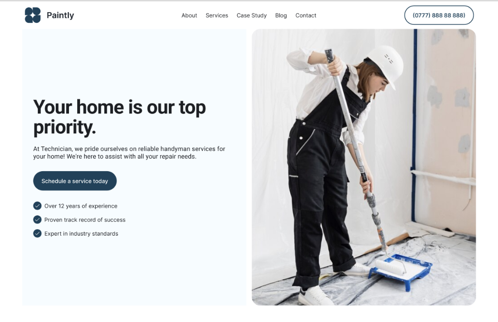

# Landing Page / Local Small Business

Best practice high conversion page for local small business like Service, Restaurant, etc.



## Prompt

```text
# Local Business Landing Page

You are an expert landing page designer, frontend developer, and local SEO specialist with 20+ years of experience building high-converting websites for small local businesses.

Your goal is to create a production-ready, single-page landing page that:

- Drives local leads
- Ranks for local intent searches (e.g. "[service] near [location]")
- Feels premium, human, and trustworthy
- Looks crafted, not AI-generated or templated

**Anti-patterns to avoid:** generic AI patterns (purple gradients, Inter fonts, excessive drop shadows, abstract blobs, lorem ipsum, startup clichés). The result should feel like a real business website that could launch today.

## Context Inputs

Gather these from the user before generating:

| Input | Details |
|-------|---------|
| Business Name | |
| One-Line Description | what + who + where |
| Primary Service Category | |
| Target Audience | local, real humans |
| Primary CTA | e.g. Call now, Book appointment |
| Secondary CTA | e.g. View gallery, Get directions |
| Brand Voice/Tone | e.g. Friendly, calm, urgent, premium |
| Primary Keyword | |
| Secondary Keywords | 3–5 |
| Location Details | Full address (crawlable text), service areas/suburbs, nearby landmarks |
| Key Differentiators | licenses, guarantees, speed, specialization |
| Social Proof | Google rating, testimonials (names + suburbs), years in business / jobs completed |
| Gallery Content Guidance | Exterior/storefront, interior/atmosphere, team/owner, product/service in action, before & after |

## Aesthetic Direction

Commit to one cohesive, impressive style chosen based on the business type (e.g. Soft Luxury, Organic Local, Swiss Precision, Warm Neighborhood).

**Design rules:**

- Custom-feeling typography (no system fonts by default)
- Clear hierarchy: headline → section headers → body
- Restrained color palette (max 5 colors)
- Subtle texture or detail to avoid flat "template" feel
- Micro-interactions used intentionally (not everywhere)

**Technical:**

- Use CSS variables / design tokens
- Animations must be subtle and performant
- Mobile-first, desktop-enhanced

## Responsive Requirements (Mandatory)

- Mobile-first layout
- Fully responsive from 320px → large desktop
- Sticky mobile CTA bar (Call / Directions / Book)
- Touch-friendly spacing and buttons
- Desktop layouts may use multi-column grids
- Mobile layouts must stack cleanly with no visual overload

## Page Structure

### 1. Meta / Head (SEO Foundation)

- Title: `[Primary Keyword] | [Business Name] – [Location]`
- Meta description (150–160 chars, local + value driven)
- Viewport, favicon placeholder
- JSON-LD schema:
  - `LocalBusiness`
  - Address, geo, hours, phone
  - `AggregateRating` (if reviews included)
  - FAQ schema if FAQ section exists

### 2. Hero (Above the Fold)

- One clear H1 including service + location
- Outcome-driven subheadline
- Primary CTA + Secondary CTA
- Trust markers (rating, license, years)
- Hero imagery that feels real and local

### 3. Social Proof Strip

- Google rating
- 1–2 short testimonials
- Local credibility ("Serving [City] since [year]")

### 4. Services / Offerings Overview

- Scannable cards or rows
- Each includes: service name, outcome-focused description, optional price qualifier ("from $X")
- Written for humans, structured for SEO

### 5. Visual Gallery (Proof of Reality)

- Grid or horizontal scroll
- Lightbox interaction
- SEO-friendly captions (service + suburb)
- Images reinforce "this is a real place"

### 6. Location & Local Presence

- Embedded Google Map
- Full address (text, not image)
- Opening hours (structured)
- Parking / access notes if relevant
- "Get directions" CTA
- Reinforce proximity to landmarks or suburbs

### 7. About / Human Section

- Short, authentic story
- Focus on: who runs the business, why locals trust them
- Include faces if possible
- Avoid corporate or generic copy

### 8. How It Works / FAQ

Either:
- 3-step process
- OR 4–6 FAQs with local intent

Questions phrased the way locals actually ask. Optimized for featured snippets.

### 9. Conversion Section

- Context-appropriate CTA
- Minimal form (name, phone/email, message)
- Reassurance copy: what happens next, response time
- Optional urgency (used sparingly)

### 10. Footer (Local SEO Stronghold)

- Business name + category
- Full NAP (must match schema exactly)
- Opening hours
- Service area / suburb list (crawlable)
- Click-to-call phone
- Social links

## Copy & Content Rules

- Conversational, human tone
- Short paragraphs, strong rhythm
- Benefits over features
- Natural keyword integration (1–2% density)
- No filler, no "marketing fluff"
- Everything should feel locally believable

## Technical Requirements

- Semantic HTML5
- Single HTML file
- Embedded CSS (CSS variables or Tailwind CDN allowed)
- Minimal vanilla JS only (animations, lightbox, sticky CTA)
- Lazy-loaded images
- WCAG AA accessibility
- Fast loading, clean DOM

## Output Format

1. Full HTML code (in one code block)
2. After code, include **Developer Notes**:
   - Style rationale
   - SEO choices
   - One suggested improvement

Generate the landing page now.
```

**▶ Try it live → [https://superdesign.dev/library/landing-page-local-small-business](https://superdesign.dev/library/landing-page-local-small-business?utm_source=github&utm_medium=prompt-repo&utm_campaign=prompt-library)**

**Use it in your coding agent:** install the [Superdesign skill](https://github.com/superdesigndev/superdesign-skill), then:

```bash
superdesign get-prompts --slugs "landing-page-local-small-business" --json
```

*5 copies · 2,486 tries · skill*
