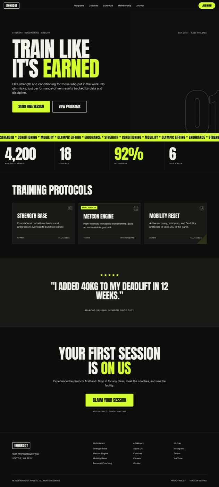

# Landing Page UI (Bold Athletic Performance Brand, Charcoal + Volt-Lime)

A bold, dark athletic brand landing page for a strength and conditioning gym, built on near-black charcoal with one punchy volt-lime accent. A giant condensed headline carries the whole voice, and a discipline ticker, a performance stat band, three training-protocol cards, a member PR quote and a free-session CTA make it read instantly as a performance brand. Two type families, flat and photo-free, so it stays fast and easy to remix. Copy it for any gym, fitness, sports or activewear landing.



## Prompt

```text
{
  "summary": "A bold, DARK, TYPE-DRIVEN ATHLETIC / performance-training BRAND LANDING PAGE (full scrolling desktop page, ~1440 wide) for a fictional strength & conditioning gym 'IRONROOT ATHLETIC', built so a single VOLT-LIME accent #d4ff2e is the only chroma on a near-black charcoal #0e0f0d ground. Two type families do all the work: a TALL CONDENSED chunky display GROTESQUE (Anton / Oswald-like) UPPERCASE for the giant hero headline, section titles, big stat numerals and the CTA label, and a plain NEUTRAL SANS (Inter) for nav links, tiny uppercase letter-spaced micro-labels, values and body. Scale contrast between a GIANT condensed headline and ~11px uppercase labels is the drama. SECTIONS top to bottom: (1) a sticky NAV ~72px on charcoal with a thin bottom hairline: a BOXED WORDMARK 'IRONROOT' set in the condensed display face inside a 2px bone-outlined rounded-rect at far left, plain-sans nav links (Programs, Coaches, Schedule, Membership, Journal), and a full VOLT-fill 'JOIN NOW' pill at right. (2) a tall HERO band with NO photo: a GIANT two-line UPPERCASE condensed headline in bone #f2f1ea with ONE word in volt (e.g. 'TRAIN LIKE / IT'S EARNED', EARNED in volt), tight ~0.92 line-height, negative tracking, dominating the band; a short plain-sans subhead in muted bone; a VOLT-fill primary CTA 'START FREE SESSION' plus an outlined secondary 'VIEW PROGRAMS'; a pure-CSS kinetic element (a 45\u00b0 hairline diagonal field on the right + an oversized ghosted OUTLINED display numeral '01' bleeding off the right edge, stroke in a lifted charcoal, NO volt); a tiny uppercase eyebrow 'STRENGTH / CONDITIONING / MOBILITY' top-left and a micro stat 'EST. 2019 - 4,200 ATHLETES' top-right. (3) a DISCIPLINE MARQUEE STRIP ~56px: a solid VOLT-LIME band, charcoal condensed-uppercase text repeating 'STRENGTH * CONDITIONING * MOBILITY * OLYMPIC LIFTING * ENDURANCE *' across the full width (static, clipped at the band edge). (4) a PERFORMANCE STAT BAND: four OVERSIZED condensed stat numerals in bone (ONE in volt) each stacked over a tiny uppercase muted label, hairline-separated cells: '4,200 / ATHLETES TRAINED', '18 / COACHES', '92% / HIT THEIR PR' (volt), '6 / DAYS A WEEK'. (5) TRAINING-PROTOCOL CARDS: a 3-up grid on lifted #181a16 panels with hairline #2b2d28 borders and NO photos, each card a corner OUTLINED index '01/02/03', a condensed uppercase program name (STRENGTH BASE / METCON ENGINE / MOBILITY RESET), a plain-sans one-line description, a small meta row (duration / level), and a pure-CSS graphic accent (a volt corner tick); the middle card carries a volt top-border + a small 'MOST POPULAR' tag. (6) a member PROOF QUOTE: a filled-volt 5-star rating, a big condensed pull-quote 'I ADDED 40KG TO MY DEADLIFT IN 12 WEEKS.', a short bone rule, and a fictional attribution 'MARCUS VAUGHN, MEMBER SINCE 2022'. (7) a MEMBERSHIP CTA BAND: a giant condensed headline 'YOUR FIRST SESSION IS ON US' (ON US in volt), a plain-sans line, a VOLT-fill CTA 'CLAIM YOUR SESSION', and microcopy 'no contract / cancel anytime'. (8) a FOOTER: boxed wordmark, a location/hours line, and three columns of plain-sans links. Flat, analog, no shadows; everything not volt is bone #f2f1ea or muted #a7a89f on charcoal; fully responsive (at 390px sections stack, CTAs go full-width, the giant headline steps down; at 1440px the 3-up grid holds).",
  "style": {
    "description": "Bold athletic-editorial confidence in a DARK register: a near-black charcoal #0e0f0d ground, bone #f2f1ea ink, and ONE rationed VOLT-LIME accent #d4ff2e. The mood is kinetic but disciplined - flat surfaces, no soft shadows, hairline #2b2d28 structure, and dramatic scale contrast between tiny uppercase utility labels and a GIANT condensed-grotesque headline. Two type families carry everything: a tall CONDENSED chunky display grotesque (Anton / Oswald-like) for headlines, section titles, big stat numerals and the CTA label - all UPPERCASE with tight ~0.92 leading and slightly negative tracking - against a plain NEUTRAL SANS (Inter) for nav links, micro-labels, values and body. The single accent is volt-lime and it appears ONLY as a punch: one hero keyword, the primary CTA fills, the discipline marquee band, and one load-bearing stat; every other element is bone #f2f1ea or muted #a7a89f on charcoal, with black text on any volt fill for max contrast. NO photographs - pure-CSS graphic energy only (a 45\u00b0 hairline diagonal field, a ghosted outlined display numeral). NO glassmorphism, NO neumorphism, NO aurora glow, NO purple/indigo gradient. High-contrast, characterful, unmistakably an athletic / performance brand rather than a generic dark SaaS or dev-tool site.",
    "prompt": "Design a bold DARK type-driven ATHLETIC / performance-brand landing page: a near-black charcoal #0e0f0d ground, bone #f2f1ea ink, and ONE rationed volt-lime accent #d4ff2e. Use exactly TWO type families and let scale contrast do the drama: a tall CONDENSED chunky display GROTESQUE (Anton / Oswald-like) UPPERCASE for the giant headline, section titles, big stat numerals and the CTA label - tight ~0.92 line-height, negative tracking - against a plain NEUTRAL SANS (Inter) for nav links, ~11px uppercase letter-spaced micro-labels, values and body. Keep every surface flat and analog: no shadows, no glassmorphism, no neumorphism, no aurora glow, no purple/indigo gradient, NO photographs (use pure-CSS graphics only - a 45\u00b0 hairline diagonal field and a ghosted outlined display numeral). Use hairline #2b2d28 dividers to structure the stat band and cards. Confine the accent to volt-lime #d4ff2e as a PUNCH only: one hero keyword, the primary CTA fills, the discipline marquee band, and one load-bearing stat - never a big flat wash; make black text sit on any volt fill. Make the hero headline, primary CTA and big stats the strongest, highest-value-contrast things on the page (squint test). High-contrast, kinetic, unmistakably an athletic performance brand."
  },
  "layout_and_structure": {
    "description": "A full scrolling desktop page (~1440 wide) of stacked full-width bands on a charcoal ground. NAV (~72px, thin bottom hairline): boxed wordmark at far left, plain-sans links center/left, a volt JOIN NOW pill at right. HERO (tall band, no photo): a giant two-line UPPERCASE condensed headline in bone with one word in volt, a plain-sans subhead, a volt primary CTA + an outlined secondary CTA, a 45\u00b0 hairline diagonal field + a ghosted outlined '01' numeral on the right, a tiny uppercase eyebrow top-left and an est. stat top-right. DISCIPLINE MARQUEE (~56px): a solid volt band of charcoal condensed-uppercase disciplines clipped at the edge. STAT BAND: four hairline-separated cells, each a giant condensed numeral (one in volt) over a tiny uppercase muted label. PROGRAM CARDS: a 3-up grid on lifted #181a16 panels with hairline borders, each a corner outlined index, a condensed program name, a one-line description, a duration/level meta row, and a volt corner tick; the middle card has a volt top-border + 'MOST POPULAR'. PROOF QUOTE: a filled-volt 5-star rating, a big condensed pull-quote, a bone rule, a fictional attribution. MEMBERSHIP CTA BAND: a giant condensed headline (one word volt), a plain-sans line, a volt CTA, microcopy. FOOTER: boxed wordmark, location/hours, three link columns. On a narrow viewport the nav collapses, the stat cells and program cards stack, CTAs go full-width, and the giant headline steps down in size.",
    "prompts": [
      {
        "part": "Sticky nav + boxed wordmark",
        "prompt": "Build a sticky NAV ~72px on charcoal #0e0f0d with a thin bottom hairline #2b2d28. At far left, a BOXED WORDMARK: 'IRONROOT' in the tall condensed display face, bone #f2f1ea, UPPERCASE, inside a 2px bone-outlined rounded-rect box (small radius, transparent fill) - a stamped athletic-masthead lockup. Center/left, plain Inter 16px bone links (Programs, Coaches, Schedule, Membership, Journal). At far right, a full VOLT-LIME #d4ff2e pill 'JOIN NOW' in the condensed display face, UPPERCASE, charcoal text. Flat, no shadow."
      },
      {
        "part": "Hero",
        "prompt": "A tall hero band on charcoal with NO photo. Top row: a tiny uppercase letter-spaced muted eyebrow 'STRENGTH / CONDITIONING / MOBILITY' at left and a micro stat 'EST. 2019 - 4,200 ATHLETES' at right. Center-left: a GIANT two-line UPPERCASE headline in the tall condensed display grotesque, bone #f2f1ea, ~140px, tight ~0.92 line-height, negative tracking, with ONE word in volt-lime - 'TRAIN LIKE' / 'IT'S EARNED' (EARNED volt). Below it a short plain-sans subhead in muted bone (1-2 lines). Then a VOLT-fill primary CTA 'START FREE SESSION' (charcoal text) next to an OUTLINED secondary CTA 'VIEW PROGRAMS' (bone border + text). On the right half, a pure-CSS kinetic element: a faint 45\u00b0 repeating-hairline diagonal field plus an oversized GHOSTED outlined display numeral '01' bleeding off the right edge (text-transparent with a lifted-charcoal ~3px stroke, NO volt). Keep it flat, high-contrast, asymmetric."
      },
      {
        "part": "Discipline marquee + performance stat band",
        "prompt": "Directly under the hero, a DISCIPLINE MARQUEE strip ~56px: a solid VOLT-LIME #d4ff2e band, charcoal #0e0f0d condensed-uppercase text repeating 'STRENGTH * CONDITIONING * MOBILITY * OLYMPIC LIFTING * ENDURANCE *' across the full width (static, clipped cleanly at the band edge - no empty gap). Below it, a PERFORMANCE STAT BAND of four hairline-separated cells (#2b2d28 dividers): each cell a GIANT condensed numeral in bone over a tiny uppercase muted label - '4,200 / ATHLETES TRAINED', '18 / COACHES', '92% / HIT THEIR PR' (this numeral in volt), '6 / DAYS A WEEK'. Scale contrast between the huge numerals and tiny labels is the point."
      },
      {
        "part": "Training-protocol cards",
        "prompt": "A 3-up grid of TRAINING-PROTOCOL cards on lifted #181a16 panels with hairline #2b2d28 borders and NO photos. Each card: a corner OUTLINED index numeral '01' / '02' / '03', a condensed UPPERCASE program name (STRENGTH BASE / METCON ENGINE / MOBILITY RESET), a plain-sans one-line description, a small meta row (e.g. '60 MIN' / 'ALL LEVELS'), and a pure-CSS graphic accent (a small volt corner tick). The MIDDLE card carries a volt top-border and a small volt 'MOST POPULAR' tag. Flat, hairline structure, one volt tick per card at most."
      },
      {
        "part": "Proof quote + membership CTA + footer",
        "prompt": "A member PROOF QUOTE band: a centered filled-volt 5-star rating (inline SVG, not an icon font), a big condensed UPPERCASE pull-quote 'I ADDED 40KG TO MY DEADLIFT IN 12 WEEKS.', a short bone rule, and a fictional attribution 'MARCUS VAUGHN, MEMBER SINCE 2022'. Then a MEMBERSHIP CTA band: a giant condensed headline 'YOUR FIRST SESSION IS ON US' (ON US in volt), a plain-sans line, a VOLT-fill CTA 'CLAIM YOUR SESSION' (charcoal text), and microcopy 'no contract / cancel anytime'. Finally a FOOTER on charcoal with a top hairline: the boxed wordmark, a location/hours line, and three columns of plain-sans links, plus a small legal row."
      }
    ]
  },
  "special_ui_components": [
    {
      "component": "Giant condensed-grotesque hero headline with a single volt keyword",
      "description": "An oversized two-line UPPERCASE headline in a tall condensed display grotesque, bone on charcoal, with exactly ONE word in volt-lime - the athletic brand's whole voice.",
      "prompt": "Set a GIANT two-line UPPERCASE headline in a tall CONDENSED chunky display grotesque (Anton / Oswald-like), bone #f2f1ea, ~140px, tight ~0.92 line-height, negative tracking (~-1.5px), hard-left. Make exactly ONE word volt-lime #d4ff2e (e.g. 'TRAIN LIKE' / 'IT'S EARNED', EARNED in volt). Let it dominate the hero and contrast sharply with the tiny neutral-sans utility labels elsewhere. This is the primary typographic gesture."
    },
    {
      "component": "Volt discipline marquee ticker",
      "description": "A solid volt-lime band of charcoal condensed-uppercase disciplines running full-width - the athletic 'ticker'.",
      "prompt": "Create a ~56px full-width band filled solid VOLT-LIME #d4ff2e with charcoal #0e0f0d condensed-uppercase text repeating 'STRENGTH * CONDITIONING * MOBILITY * OLYMPIC LIFTING * ENDURANCE *' across the whole width, clipped cleanly at the band edge (static - no mid-scroll empty gap). Bordered top and bottom by a hairline. Black-on-lime for maximum contrast."
    },
    {
      "component": "Performance stat band",
      "description": "Four hairline-separated cells, each a giant condensed numeral over a tiny uppercase label, with one numeral in volt - scale contrast as the point.",
      "prompt": "Build a full-width STAT BAND of four cells separated by vertical hairline dividers #2b2d28: each cell a GIANT condensed numeral in bone #f2f1ea stacked over a tiny (~11px) uppercase letter-spaced muted label - '4,200 / ATHLETES TRAINED', '18 / COACHES', '92% / HIT THEIR PR', '6 / DAYS A WEEK'. Make exactly ONE numeral volt-lime #d4ff2e (the 92%). Keep it flat: no shadows, hairlines do the separation."
    },
    {
      "component": "Training-protocol card",
      "description": "A photo-free program card on a lifted charcoal panel: a corner outlined index, a condensed program name, a meta row, and a single volt corner tick.",
      "prompt": "Create a TRAINING-PROTOCOL card on a lifted #181a16 panel with a hairline #2b2d28 border, NO photo: a corner OUTLINED index numeral ('01'), a condensed UPPERCASE program name ('STRENGTH BASE'), a plain-sans one-line description, a small meta row ('60 MIN' / 'ALL LEVELS'), and a small volt-lime corner tick as the only accent. For a 'most popular' variant, add a volt top-border and a small volt 'MOST POPULAR' tag. Flat, high-contrast, hairline structure."
    },
    {
      "component": "Boxed wordmark logo",
      "description": "The brand wordmark set inside a 2px outlined rounded-rect box - a stamped athletic-masthead lockup.",
      "prompt": "Set the brand wordmark in a tall CONDENSED display grotesque, bone #f2f1ea, UPPERCASE, inside a 2px solid bone outlined ROUNDED-RECT box (small radius, transparent fill). It should read as a stamped masthead lockup - flat, high-contrast, no shadow. Reuse it in the nav and the footer."
    }
  ]
}
```

**▶ [Try it live →](https://superdesign.dev/library/landing-page-ui-bold-athletic-performance-brand-charcoal-volt-lime?utm_source=github&utm_medium=prompt-repo&utm_campaign=prompt-library)**

**Use it in your coding agent:** install the [Superdesign skill](https://github.com/superdesigndev/superdesign-skill), then:

```bash
superdesign get-prompts --slugs "landing-page-ui-bold-athletic-performance-brand-charcoal-volt-lime" --json
```

*0 copies · 0 tries · Landing Pages · Health & Wellness · landing page, athletic, fitness, gym*
