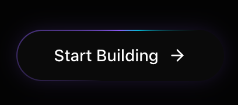

# Light Beam Button

A high-performance button with a rotating light beam border effect using CSS @property and conic gradients. Features a shiny hover state and gradient border animation.



## Prompt

```text
You are given a task to integrate an existing React component in the codebase

~~~/README.md
# LightBeamButton

A futuristic button component featuring a rotating light beam border effect, implemented with high-performance CSS `@property` animations.

## Features
- 🚀 **Hardware Accelerated**: Uses CSS variables and transforms for 60fps animations
- 🎨 **Customizable**: Supports custom classes and children
- 💡 **Visual Effects**: Includes rotating gradient border, internal glow, and hover shine
- 🌙 **Dark Mode Optimized**: Designed specifically for dark-themed interfaces

## Usage

```tsx
import { LightBeamButton } from '@/sd-components/218cf3c1-df31-4f2a-9aa0-6968d34dc15b';
import { ArrowRight } from 'lucide-react';

function MyComponent() {
  return (
    <LightBeamButton onClick={() => console.log('Action')}>
      Start Building <ArrowRight size={16} />
    </LightBeamButton>
  );
}
```

## Props

| Prop | Type | Default | Description |
|------|------|---------|-------------|
| `children` | `ReactNode` | Required | Content to display inside the button |
| `className` | `string` | `undefined` | Additional CSS classes |
| `onClick` | `() => void` | `undefined` | Click handler |
| `gradientColors` | `[string, string, string]` | `['#8b5cf6', '#06b6d4', '#8b5cf6']` | Array of 3 colors for the gradient beam |

## Dependencies

- `framer-motion`: For interaction states (hover/tap)
- `clsx`, `tailwind-merge`: For class handling
~~~

~~~/src/App.tsx
import React from 'react';
import { LightBeamButton } from './Component';
import { ArrowRight, Sparkles } from 'lucide-react';

export default function App() {
  return (
    <div className="flex min-h-screen w-full flex-col items-center justify-center gap-12 bg-[#030303] p-8 text-white">
      <div className="text-center space-y-4">
        <h2 className="text-2xl font-serif text-neutral-400">LightBeam Button</h2>
        <p className="text-neutral-600 max-w-md mx-auto">
          A high-performance button with CSS @property animation for a rotating light beam effect.
        </p>
      </div>

      <div className="flex flex-col gap-8 items-center">
        {/* Default Variant */}
        <LightBeamButton onClick={() => console.log('Clicked')}>
          Start Building <ArrowRight size={16} />
        </LightBeamButton>

        {/* Text Only */}
        <LightBeamButton className="px-10">
          Explore Protocol
        </LightBeamButton>

        {/* With Icon Left */}
        <LightBeamButton>
          <Sparkles size={16} className="text-violet-400" />
          <span>Mint NFT</span>
        </LightBeamButton>
      </div>
      
      <div className="mt-12 p-6 border border-white/5 rounded-2xl bg-white/5 backdrop-blur-sm max-w-lg">
        <h3 className="text-sm font-medium text-neutral-400 mb-4">Dark Background Recommended</h3>
        <p className="text-xs text-neutral-500">
          This component relies on "screen" or additive blending concepts visually, so it works best on dark backgrounds (#000000 to #1a1a1a).
        </p>
      </div>
    </div>
  );
}
~~~

~~~/package.json
{
  "name": "light-beam-button",
  "version": "1.0.0",
  "description": "A high-performance button with a rotating light beam border effect",
  "dependencies": {
    "react": "^18.2.0",
    "react-dom": "^18.2.0",
    "framer-motion": "^10.16.4",
    "clsx": "^2.1.0",
    "tailwind-merge": "^2.2.1",
    "lucide-react": "^0.344.0"
  }
}
~~~

~~~/src/Component.tsx
import React from 'react';
import { motion } from 'framer-motion';
import { clsx, type ClassValue } from 'clsx';
import { twMerge } from 'tailwind-merge';

function cn(...inputs: ClassValue[]) {
  return twMerge(clsx(inputs));
}

export interface LightBeamButtonProps extends React.ButtonHTMLAttributes<HTMLButtonElement> {
  children: React.ReactNode;
  className?: string;
  gradientColors?: [string, string, string]; // Optional custom gradient colors
}

/**
 * LightBeamButton
 * 
 * A high-performance button with a rotating light beam border effect.
 * Uses CSS @property for smooth gradient rotation animations on the border.
 */
export function LightBeamButton({ 
  children, 
  className, 
  onClick,
  gradientColors = ["#8b5cf6", "#06b6d4", "#8b5cf6"], // Violet -> Cyan -> Violet
  ...props 
}: LightBeamButtonProps) {
  // Construct the gradient string dynamically based on props
  const gradientString = `conic-gradient(from var(--gradient-angle), transparent 0%, ${gradientColors[0]} 40%, ${gradientColors[1]} 50%, transparent 60%, transparent 100%)`;

  return (
    <>
      <style>{`
        @property --gradient-angle {
          syntax: "<angle>";
          initial-value: 0deg;
          inherits: false;
        }
        @keyframes border-spin {
          from { --gradient-angle: 0deg; }
          to { --gradient-angle: 360deg; }
        }
        .animate-border-spin {
          animation: border-spin 2s linear infinite;
        }
      `}</style>
      
      <motion.button
        whileHover={{ scale: 1.02 }}
        whileTap={{ scale: 0.98 }}
        onClick={onClick}
        className={cn(
          "group relative isolate overflow-hidden rounded-full bg-neutral-950 px-8 py-3 text-sm font-medium text-white transition-all hover:bg-neutral-900",
          "shadow-[0_0_20px_-5px_rgba(139,92,246,0.3)] hover:shadow-[0_0_25px_-5px_rgba(139,92,246,0.5)]",
          className
        )}
        {...props}
      >
        <span className="relative z-10 flex items-center gap-2">{children}</span>
        
        {/* Gradient Border Simulation */}
        <div 
          className="absolute inset-0 -z-10 rounded-full p-[1px] animate-border-spin" 
          style={{ 
            '--gradient-angle': '0deg',
            background: gradientString
          } as React.CSSProperties} 
        />
        
        {/* Inner Background (keeps text readable) */}
        <div className="absolute inset-[1px] -z-10 rounded-full bg-neutral-950" />
        
        {/* Shine Effect Overlay */}
        <div className="absolute inset-0 -z-10 bg-[radial-gradient(circle_at_50%_0%,rgba(139,92,246,0.15)_0%,transparent_60%)] opacity-0 group-hover:opacity-100 transition-opacity duration-500" />
      </motion.button>
    </>
  );
}

export default LightBeamButton;
~~~

Implementation Guidelines

1. Analyze the component structure, styling, animation implementations
2. Review the component's arguments and state
3. Think through what is the best place to adopt this component/style into the design we are doing
4. Then adopt the component/design to our current system

Help me integrate this into my design
```

**▶ [Try it live →](https://superdesign.dev/library/light-beam-button?utm_source=github&utm_medium=prompt-repo&utm_campaign=prompt-library)**

**Use it in your coding agent:** install the [Superdesign skill](https://github.com/superdesigndev/superdesign-skill), then:

```bash
superdesign get-prompts --slugs "light-beam-button" --json
```

*500 copies · 2,119 tries · Components · General · button, ui component*
