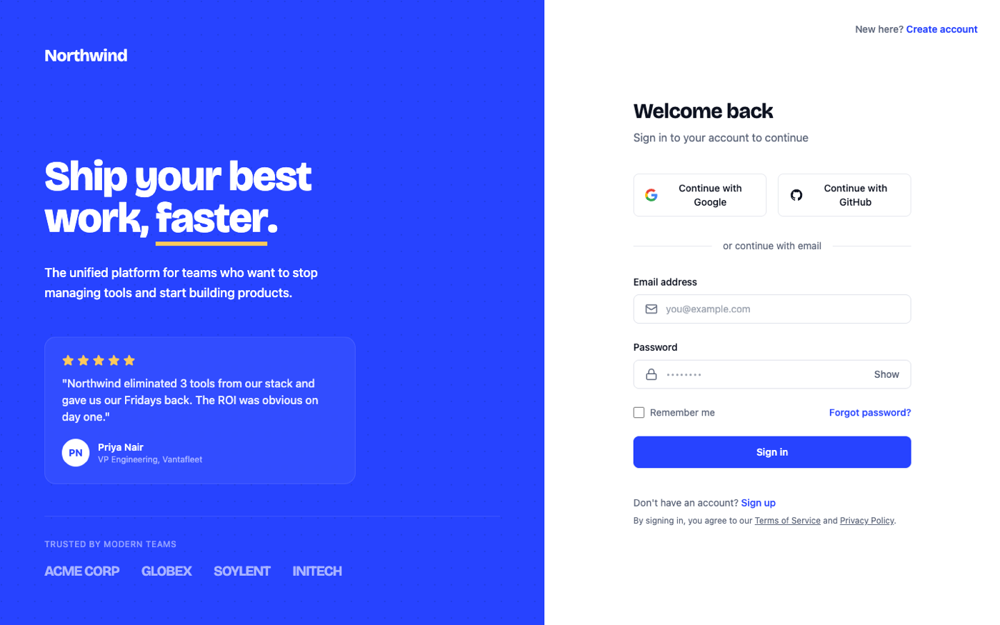

# Login Page UI (Split-Screen, Electric Cobalt Brand Panel)

A modern split-screen login page: a bold electric-cobalt brand panel on one side and a crisp sign-in form on the other, with Google and GitHub SSO, email and password, remember me, and forgot password. Flat, high-contrast, and fully responsive, so you can reskin it with your own brand and ship. A great starting prompt for any SaaS login or sign-in screen.



## Prompt

```text
{
  "summary": "A modern SaaS LOGIN / sign-in page built as a full 50/50 SPLIT SCREEN: a SOLID electric-cobalt #2743ff brand panel on the LEFT and a crisp WHITE auth form on the RIGHT. It must read instantly as a login page. Deliberately the anti-glass login - NO glassmorphism, NO aurora, NO blur blobs, NO gradient mesh, NO film grain: flat solid color fields only, with real value contrast (white type reads hard on the cobalt, ink form fields hard on white). Two typefaces: Bricolage Grotesque for the brand wordmark + the oversized value-prop headline (the anti-slop signal, never Inter-only), and Inter for all form UI. LEFT COBALT PANEL: a small Bricolage wordmark top-left ('Northwind'); an oversized 2 to 3 line value-prop headline in white ('Ship your best work, faster.') with EXACTLY ONE word underlined in warm apricot #ffc95c; a short translucent-white supporting line; a minimal inline testimonial (five apricot stars + one short quote + a circular initial avatar + a generic name and role); and a bottom 'TRUSTED BY MODERN TEAMS' row of three to four TEXT-ONLY client wordmarks in translucent white. Behind the content sits a very-low-contrast dot-grid (or one large soft geometric mark) in a darker cobalt #1b34c9 that never competes with the type. RIGHT WHITE FORM: a small 'New here? Create account' link top-right; a 'Welcome back' heading + 'Sign in to your account to continue' subhead; two side-by-side SSO buttons (Continue with Google, Continue with GitHub) with real brand glyphs and 1px #dfe2ea borders; an 'or continue with email' hairline divider; an Email field (mail icon leading, placeholder 'you@example.com') and a Password field (lock icon leading, a Show/Hide toggle on the right); a row with a 'Remember me' checkbox and a 'Forgot password?' link; a full-width solid-cobalt #2743ff 'Sign in' primary button (white label); and a small 'Don't have an account? Sign up' footnote plus a Terms of Service / Privacy Policy line. Focused fields get a #2743ff border + a soft cobalt focus ring. FULLY RESPONSIVE: at 390px the two columns STACK (the brand panel becomes a compact top band, the form below, SSO buttons full-width), nothing clips or overflows horizontally; at 1440px a clean 50/50 split. No default indigo/purple gradient and no dark-violet cliche - one flat saturated cobalt field, one white field.",
  "style": {
    "description": "Confident, clean, high-contrast product-marketing login. The whole design lives on exactly TWO flat surfaces: a saturated electric-cobalt #2743ff brand field and a white #ffffff form field, split 50/50. NO glassmorphism, aurora, blur, film grain, or gradient mesh - solid color only, so value contrast is unmistakable. Type carries the POV: Bricolage Grotesque at 700 to 800 for the wordmark and the oversized value-prop headline (tight tracking), Inter 400/500/600 for every label, input, button, and footnote. Color is rationed hard: white and translucent-white on the cobalt panel; ink #0d1220 + muted #5b6478 on the white form; a warm apricot #ffc95c is the ONLY warm accent and appears only on the testimonial's five stars and a thin underline under one word of the headline; a darker cobalt #1b34c9 draws a faint dot-grid behind the panel content. The single filled control is the cobalt #2743ff 'Sign in' button (it ties the two halves together); SSO buttons are white with 1px #dfe2ea borders; fields are white with a #dfe2ea border that turns #2743ff plus a soft cobalt focus ring on focus. Restrained and characterful, not busy - a real designer's login, not a template. Anti-slop: never a purple/indigo GRADIENT, never centered-everything, never Inter-only.",
    "prompt": "Design a modern SaaS login / sign-in page as a full 50/50 split screen on exactly two FLAT surfaces: a solid electric-cobalt #2743ff brand panel (left) and a white #ffffff auth form (right). Forbid glassmorphism, aurora, blur, film grain, and gradient mesh - solid color only, real value contrast. Use Bricolage Grotesque (700 to 800, tight tracking) for the wordmark and the oversized value-prop headline, and Inter (400/500/600) for all form UI. Ration color: white + translucent white on the cobalt; ink #0d1220 + muted #5b6478 on the white; a warm apricot #ffc95c ONLY on the testimonial stars and a thin underline under one headline word; a darker cobalt #1b34c9 for a faint dot-grid behind the panel content. Make the ONLY filled control a full-width solid-cobalt #2743ff 'Sign in' button; SSO buttons white with 1px #dfe2ea borders; fields white with a #dfe2ea border that becomes #2743ff + a soft focus ring on focus. Keep it restrained and characterful, and make the login use-case unmistakable at a glance. No purple/indigo gradient, no centered-everything, no Inter-only."
  },
  "layout_and_structure": {
    "description": "A 50/50 split-screen auth layout. LEFT is a solid electric-cobalt #2743ff brand panel with a faint #1b34c9 dot-grid behind it: a small Bricolage 'Northwind' wordmark top-left; a middle block with an oversized 2-line value-prop headline in white ('Ship your best work, faster.') where one word is underlined in apricot #ffc95c, plus a short translucent-white supporting line; a minimal testimonial (five apricot stars + a short quote + a circular initial avatar + a generic name/role); and a bottom 'TRUSTED BY MODERN TEAMS' eyebrow over a row of four text-only client wordmarks in translucent white. RIGHT is a white form column: a 'New here? Create account' link top-right; a 'Welcome back' heading + 'Sign in to your account to continue' subhead; two side-by-side SSO buttons (Google, GitHub); an 'or continue with email' hairline divider; an Email field and a Password field (Show/Hide toggle); a 'Remember me' + 'Forgot password?' row; a full-width cobalt 'Sign in' button; and a 'Don't have an account? Sign up' + Terms/Privacy footnote. On mobile 390px the columns STACK: the brand panel becomes a compact top band (wordmark + headline + testimonial + trust row), the form sits below it, and the two SSO buttons go full-width stacked; nothing clips or overflows horizontally.",
    "prompts": [
      {
        "part": "Left cobalt brand panel",
        "prompt": "Build the left half as a solid electric-cobalt #2743ff panel with a very-low-contrast dot-grid in #1b34c9 behind everything (a repeating radial-gradient dot pattern at low opacity). Lay it out as flex-col justify-between with generous padding: TOP a small Bricolage-Grotesque 'Northwind' wordmark in white; MIDDLE an oversized 2-line value-prop headline (Bricolage 700 to 800, tight leading, white) 'Ship your best work, faster.' with the word 'faster.' underlined by a thick apricot #ffc95c swipe, then a short 16 to 18px translucent-white (rgba(255,255,255,0.72)) supporting line 'The unified platform for teams who want to stop managing tools and start building products.'; then a minimal testimonial (a row of five apricot #ffc95c stars, a short white quote, and a circular white initial-avatar beside a name in white 600 and a role in translucent white). BOTTOM a 'TRUSTED BY MODERN TEAMS' eyebrow (12px, uppercase, tracked, translucent white) over a hairline-topped row of four TEXT-ONLY client wordmarks (ACME CORP, GLOBEX, SOYLENT, INITECH) in translucent white. Keep the dot-grid and all decoration well below the type in contrast so the headline always reads first."
      },
      {
        "part": "Right white auth form",
        "prompt": "Build the right half as a white column centering an auth card region (no heavy border; it sits on white). Top-right: a small 'New here? Create account' link (muted label + cobalt link). Center: an 'h2' 'Welcome back' in Bricolage 700 + a muted #5b6478 'Sign in to your account to continue' subhead. Then two side-by-side SSO buttons in a 2-col grid ('Continue with Google' with the multicolor G glyph, 'Continue with GitHub' with the GitHub mark), each white with a 1px #dfe2ea border, ink label, ~10px radius. Then an 'or continue with email' divider (a centered muted label over a #e6e8ee hairline). Then an Email field: a 12 to 13px/600 'Email address' label over a white input (1px #dfe2ea border, mail icon leading, placeholder 'you@example.com'). Then a Password field: a 'Password' label over a white input (lock icon leading, dotted value, a 'Show' text toggle at the right). Then a row: a 'Remember me' checkbox on the left, a 'Forgot password?' cobalt link on the right. Then a full-width solid-cobalt #2743ff 'Sign in' button (white 600 label, ~10px radius). Below: a centered 'Don't have an account? Sign up' footnote (muted + cobalt link) and a small 'By signing in, you agree to our Terms of Service and Privacy Policy' line with underlined legal links. Give focused inputs a #2743ff border + a soft cobalt focus ring."
      },
      {
        "part": "Responsive stack (mobile 390px)",
        "prompt": "Make the layout a single column below the lg breakpoint. The left cobalt panel becomes a compact TOP BAND (wordmark, the value-prop headline scaled down, the supporting line, the testimonial, and the trusted-by row), and the white form sits BELOW it. The two SSO buttons switch from side-by-side to full-width STACKED. Ensure no fixed pixel widths on containers, no horizontal overflow, and that the form controls stay full-width and comfortably padded. Do not lock the root to h-screen/overflow-hidden in a way that clips a full-page capture."
      }
    ]
  },
  "special_ui_components": [
    {
      "component": "Split brand panel with underlined value prop",
      "description": "The left cobalt identity panel: an oversized Bricolage value-prop headline with exactly one word underlined in apricot, a translucent supporting line, and a faint dot-grid behind it - the persuasive half of the split that a builder reskins with their own brand.",
      "prompt": "Render a solid #2743ff panel filling the left half with a faint #1b34c9 radial-gradient dot-grid behind the content. Stack (flex-col justify-between, generous padding): a small white Bricolage wordmark; an oversized white Bricolage headline (700 to 800, tight leading) whose final word carries a thick apricot #ffc95c underline (a pseudo-element or an inline span with a bottom border), plus a translucent-white (0.72) supporting paragraph; and a bottom trust block. Keep every decorative element far below the headline in contrast."
    },
    {
      "component": "Inline testimonial with apricot stars",
      "description": "A minimal social-proof unit inside the brand panel: five apricot stars, a short quote, and an initial avatar + generic name/role - social proof without heavy card chrome, using a clearly fictional attribution (never a real named person).",
      "prompt": "Inside the cobalt panel, add a light testimonial: a row of five apricot #ffc95c star glyphs, a short white quote (2 to 3 lines, straight quotes), then a small row of a circular white/translucent initial-avatar beside a white 600 generic name and a translucent-white role. Optionally seat it on a subtle rgba(255,255,255,0.06) rounded card with no hard border. Never attribute the quote to a real, identifiable person or company."
    },
    {
      "component": "SSO buttons + email/password auth stack",
      "description": "The core sign-in controls: two hairline SSO buttons over an 'or continue with email' divider, then icon-leading email/password fields with a Show/Hide toggle, a remember/forgot row, and the single filled cobalt Sign-in button - a complete, copy-ready auth surface.",
      "prompt": "Build a 2-col grid of two SSO buttons (Continue with Google with the multicolor G, Continue with GitHub with the GitHub mark), each white with a 1px #dfe2ea border and an ink label. Below, an 'or continue with email' divider (centered muted label over a #e6e8ee hairline). Then a labeled Email input (mail icon leading, placeholder 'you@example.com') and a labeled Password input (lock icon leading, a 'Show' text toggle at right). Then a row with a 'Remember me' checkbox (left) and a 'Forgot password?' cobalt link (right). Then a full-width solid-cobalt #2743ff 'Sign in' button (white 600 label). Focus states: input border becomes #2743ff with a soft rgba(39,76,255,0.14) ring. Keep all of it in Inter."
    }
  ]
}
```

**▶ [Try it live →](https://superdesign.dev/library/login-page-ui-split-screen-electric-cobalt-brand-panel?utm_source=github&utm_medium=prompt-repo&utm_campaign=prompt-library)**

**Use it in your coding agent:** install the [Superdesign skill](https://github.com/superdesigndev/superdesign-skill), then:

```bash
superdesign get-prompts --slugs "login-page-ui-split-screen-electric-cobalt-brand-panel" --json
```

*0 copies · 0 tries · Auth & Login · General · login, auth, sign-in, split-screen*
